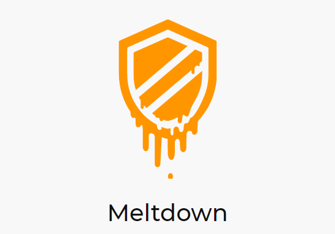
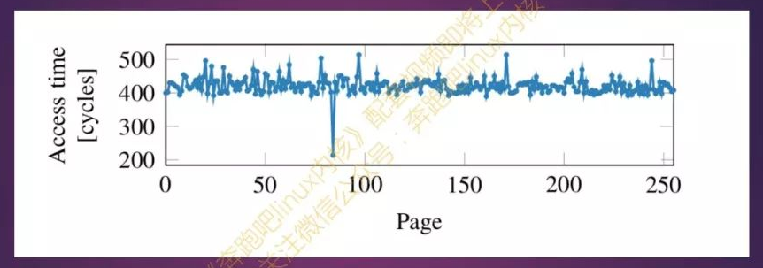
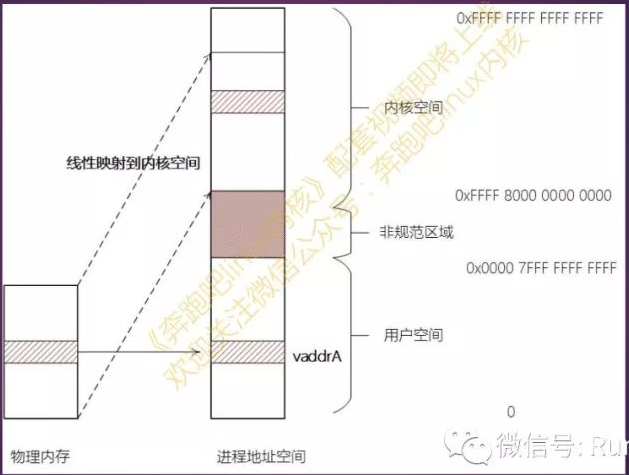

[TOC]

http://mp.weixin.qq.com/s?__biz=MzI3MTUxOTYyMA==&mid=2247484002&idx=1&sn=19393c4abd317aea0ab8d535559603b2&chksm=eac1d889ddb6519f2190f4f24d7679f34f443db342700332b4749e360c8011cb0d901d15023f&mpshare=1&scene=1&srcid=01274rIaA8vFPzDBWpMKvytq#rd

# 0 概述



**Meltdown breaks the most fundamental isolation between user applications and the operating system**. This attack allows a program to access the memory, and thus also the secrets, of other programs and the operating system.

官网: https://meltdownattack.com/


**Spectre breaks the isolation between different applications**. It allows an attacker to trick error-free programs, which follow best practices, into leaking their secrets. In fact, the safety checks of said best practices actually increase the attack surface and may make applications more susceptible to Spectre.

官网同上

一个形象的场景形容meltdown如下:

1. 三个人A, B和C去餐厅点餐, 排队, C排在B后面, B在A后面
2. A点了面条, 后厨听到开始做面条, 还没做完
3. B向点餐服务员喊说点饺子(指令顺序进入), 服务员说, **前面还有一位, 稍等下**. 但**后厨听到后开始做饺子**, 很快做好了, 这就是**指令预取**
4. A拿到面条走了, **轮到B点餐**了, 此时突然有事情, 没有吃饺子, 但是已经做好了, 然后被餐厅请出去了, 这就是**异常处理**
5. C排在B后面, 说: 饺子, 面条, 包子各来一份, 饿死了, 哪个快先给我哪个
6. C拿到了"饺子"
7. C知道了B点了饺子

5, 6, 7就是cache攻击

# 1 CPU体系结构

## 1.1 指令执行过程


如图所示，在 x86 微处理器经典架构中，**存储指令**从**L1指令cache（L1指令缓存！！！）中读取指令**，**L1指令cache(！！！也是CPU的一部分！！！**)会做**指令加载、指令预取、指令预解码，以及分支预测**。然后进入**Fetch&Decode**单元，会把指令**解码成macro\-ops微操作指令**，然后由 **Dispatch 部件**分发到 **Integer Unit** 或者 **FloatPoint Unit**。

**Integer Unit** 由 **Integer Scheduler** 和 **Execution Unit** 组成，**Execution Unit**包含**算术逻辑单元**（arithmetic\-logic unit，**ALU**）和**地址生成单元**（address generation unit，**AGU**），在**ALU计算完成**之后进入AGU，计算**有效地址**完毕后，给**ROB(reorder buffer**)组件, **排队commit**, 然后将**结果发送到LSQ部件**。

**LSQ部件**首先根据处理器系统要求的**内存一致性！！！**（memory consistency）模型确定**访问时序**，另外LSQ还需要处理存储器指令间的依赖关系，最后LSQ需要**准备L1 cache使用的地址**，包括**有效地址**的计算和**虚实地址转换**，将地址发送到L1 Data Cache（**L1数据缓存，不是指令缓存**）中。

**强烈关注这几个cache的位置！！！**, L3 cache位置不对, 应该在CPU里面, 可参照下面图

**顺序预取, 乱序执行, 顺序提交**

## 1.2 乱序执行(out\-of\-order execution)

Tomasulo算法, 1967年:

- 寄存器重命名
- 读后写相关(Write\-after\-Read, WAR)
- 写后写相关(Write\-after\-Write, WAW)
- 保留站(reservation station): 暂存数据
- ROB(reorder buffer): 排队commit

## 1.3 异常处理

- CPU指令在执行过程中可能会产生异常, 但是处理器支持乱序执行, 异常指令后面的指令都已经执行, 怎么办?
- ROB会起作用
    - 异常指令和其后面的指令会被丢弃掉, 不提交
    - 但是有可能预取的数据已经在cache里

## 1.4 cache存储结构


### 1.4.1 Cache访问速度对比

下面是Xeon 5500 Series的各级cache的访问延迟: (根据CPU主频不同, 一个时钟周期的时间也不同, 在1GHz主频的CPU下, 一个时钟周期大概1纳秒, 在2.1GHz主频的CPU下, 访问L1 cache也就2纳秒)


### 1.4.2 cache攻击

- cache side\-channel attacks
- 根据这个**读取物理内存的延迟(约60纳秒**)和以及**读取已经缓存到cache中的数据(约1\~2纳秒**)之间的**时间差**

### 1.4.3 cache攻击示例

```
clflush for user_probe_addr[]; // 将user_probe_addr对应的cache全部都flush掉
u8 index = *(u8 *)attacked_mem_adr; // attacked_mem_addr存放被攻击的地址
data = user_probe_addr[index * 4096]; // user_probe_addr存放攻击者可以访问的基地址
```

数据对比



根据256个页面的访问时间可以得到第84个页面的内容是已经被缓存到cache中, 所以反推出index的值就是84

## 1.5 进程地址空间



- 分页机制, 保障进程之间地址空间的隔离性
- 每个进程都有一套页表
- 进程切换需要切换页表
    - 切换页表
    - 刷新TLB: 写CR3寄存器隐含了TLB的flush

解决办法:

- ARM: ASID(Address Space ID)
- x86: PCID(Process Context identifier), 该技术是Intel 的IA\-32e paging模式特有功能, 为TLB和paging\-structure cache而产生, 详细看体系结构知识

## 1.6 TLB

- TLB: Translation Lookasid Buffer
- 加快虚拟地址到物理地址的转换的cache, cache entry存储的虚实地址转换的entry
- 进程切换需要flush TLB, 导致新进程运行时性能低下

优化:

- ARM: ASID
- x86: PCID

# 2 Meltdown分析

```
clflush for user_probe_addr[]; // 将user_probe_addr对应的cache全部都flush掉
u8 index = *(u8 *)attacked_mem_adr; // attacked_mem_addr存放被攻击的地址
data = user_probe_addr[index * 4096]; // user_probe_addr存放攻击者可以访问的基地址
```

第二行, 产生page fault(缺页异常), 进而被内核捕获. 这是一个异常指令

第三行: 由于CPU的乱序执行, 这条指令已经被预取到cache中, 但是ROB不会commit这条指令

# 3 Meltdown漏洞修复

Linux内核修复办法: 内核页表隔离KPTI(Kernel page table isolation)

- 每个进程一张页表变成两张: 运行在内核态和运行在用户态时分别使用各自分离的页表
- Kernel页表包含了进程用户空间地址的映射和kernel使用的内存映射
- 用户页表仅仅包含了用户空间的内存映射以及内核跳板的内存映射
- 当进程运行在用户空间时, 使用的是用户页表
- 当发生中断或异常时, 需要陷入内核, 进入内核空间后, 有一小段内核跳板将页表切换到内核页表


# 4 ARM64上的KPTI补丁

ARM64上只有Cortex\-A75中招Meltdown漏洞

- 官方白皮书: www.arm.com/security-update
- Variant3: using speculative reads of inaccessible data
- 变种: Sub\-variant 3a \- using speculative reads of inaccessible data

ARM64上KPTI的优化:

- A75上虽然有**两个页表寄存器**, 但是TLB上依然没法做到完全隔离, 用户进程在meltdown情况下仍然可能访问内核空间映射的TLB entry
- **每个进程**的**ASID设置两份**, 一个给当进程跑在内核态的使用, 另外一个给进程跑在用户态时使用. 这样**原本内核空间属于global TLB**, 就变成**Process\-Special类型的TLB**


# 相关论文

- Meltdown, https://meltdownattack.com/
- Spectre Attacks: Exploiting Speculative Execution, https://meltdownattack.com/
- Google Zero Projecthttps://googleprojectzero.blogspot.com/ 
- MeltdownPrime and SpectrePrime: Automatically-Synthesized Attacks Exploiting Invalidation-Based Coherence ProtocolsKPTI, Submitted on 11 Feb 2018
- Negative Result:Reading Kernel Memory From User Mode https://cyber.wtf/2017/07/28/negative-result-reading-kernel-memory-from-usermode/