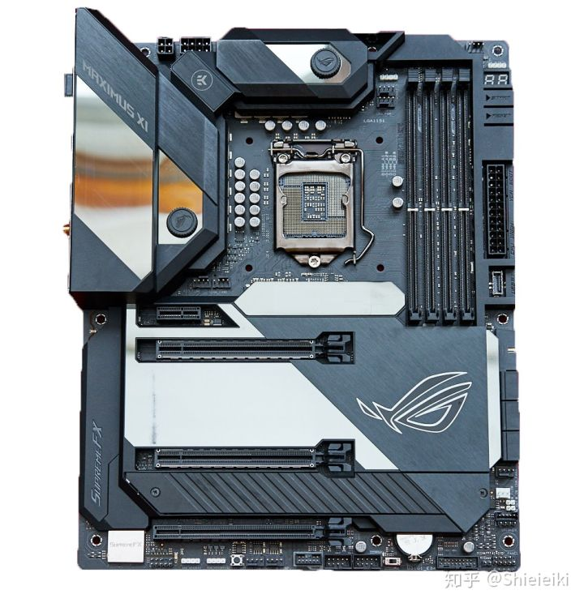
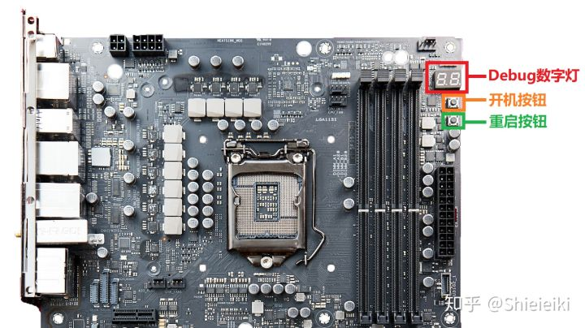

<!-- @import "[TOC]" {cmd="toc" depthFrom=1 depthTo=6 orderedList=false} -->

<!-- code_chunk_output -->

* [1 选个用来举例的主板](#1-选个用来举例的主板)
* [2 供电接口](#2-供电接口)
* [3 CPU核心供电区域](#3-cpu核心供电区域)
* [4 开启重启按钮与DEBUG数字灯](#4-开启重启按钮与debug数字灯)
* [5 内存插槽](#5-内存插槽)
* [6 风扇接口](#6-风扇接口)
* [7 IO接口](#7-io接口)
* [8 USB3.1机箱拓展接口](#8-usb31机箱拓展接口)
* [9 PCIE插槽](#9-pcie插槽)
* [10 主板芯片组合南桥](#10-主板芯片组合南桥)
* [11 声卡](#11-声卡)
* [12 网卡模块](#12-网卡模块)
* [13 CMOS电池](#13-cmos电池)
* [14 M.2接口M\-KEY](#14-m2接口m-key)
* [15 SATA硬盘接口](#15-sata硬盘接口)
* [16 前面板跳线](#16-前面板跳线)
* [参考](#参考)

<!-- /code_chunk_output -->

# 1 选个用来举例的主板

如果想要把目前所有的主板各种附属功能都讲一遍，那么我们最好直接找一个功能最多的主板，那么这里我找到一个图片素材比较多，而且也是非常有特色的主板，华硕Asus ROG Maximus XI Formula（M11F）

图片素材来自：[这可能是最漂亮的Z390--ASUS ROG Maximus XI Formula评测](https://link.zhihu.com/?target=http%3A//koolshare.cn/forum.php%3Fmod%3Dviewthread%26tid%3D149669%26page%3D1%26extra%3D)

首先看到这个主板的时候大家应该都发现了，这主板和普通主板还不一样，M11F整块主板的绝大多部分都被整齐的装甲覆盖着，一方面提高了主板的强度，另一方面也提高了主板的美观程度。而我们不是比谁美的，那么我们就扒开装甲看主板了，那么这里我们就可以看见主板的整体结构，就是下图了。

# 2 供电接口

在主板上你可以找到2个供电接口，一个位于主板的左上角，专门为CPU提供供电，绝大多数主板是8pin(4+4)这样的，M11F由于比较高端，额外提供了一个4pin供电。

另外一个位于主板右侧，为整个主板提供供电，除了服务器，家用主板几乎全是24pin(20+4)这种。

# 3 CPU核心供电区域

12V供电从左上角的供电接口接入后，会经过各种电容，MOS管，电感，最后再进入CPU，因此判断一个主板的CPU供电能力就看这一部分。供电区域由两部分构成，一部分是MOS管，另一部分是供电电感，很多人靠供电电感也就是小方块判断主板供电能力实际上是错误的。如果你看供电电感，那么这个供电就是10相了，但是实际上他是4+2相供电，其中CPU部分由2组4相供电提供，核显部分由2相供电提供。至于怎么判断主板供电能力我们下篇文章会详细介绍。

# 4 开启重启按钮与DEBUG数字灯

开机重启没什么好说的，之所以有这个按钮是因为很多超频爱好者需要反复开机关机调试电脑，这时候如果用机箱的按钮就不方便检修和排除故障原因，当然螺丝刀也可以用来短接跳线开机，不过毕竟没有直接来个按钮舒服是吧。

Debug灯可以在你的电脑不能正常启动的时候给你2个字符的代码，比如00就是CPU故障，55是内存故障，D2就是主板错误，那么有了这个Debug灯再结合错误代码表，你就可以很快的定位电脑哪里故障了，而不需要一个配件一个配件的更换去排除。一般这种数显DeBug灯只有高端主板才会有。

普通主板虽然没有数显debug，但是有简易的CPU内存还有显卡故障灯，如果某个部件故障对应的灯就会亮起，不过这个毕竟功能不如数显多。比起低端主板根本就没有故障灯也是要好太多了。当然你也可以买个主板诊断卡，主板诊断卡的功能和Debug灯一模一样。

# 5 内存插槽

DIMM内插插槽，这个没什么介绍的，但是要注意的是，很多主板是有内存插槽优先级的，这个在你的主板上能看到标识，一般来讲绝大多数主板从左往右数24槽是优先使用的。

如果你是两条内存，切记不能并排插，因为2条内存可以组建双通道，什么是双通道你们可以看这个文章：[Shieieiki：【双8G内存比16G内存速度快？详解双通道内存和磁盘阵列】](https://zhuanlan.zhihu.com/p/51371002)。而在主板上，12槽走的是一个通道，34槽是一个通道，所以如果你插在12是单通道，插23不稳定，插34也是单通道，所以双内存用户请务必插13或24，同时注意主板的内存槽优先级。

# 6 风扇接口

在主板的各个位置你都能找到这样竖起来的4针，同时你可以发现这4针有其中3针是有个竖起来的塑料片，而风扇的接口上有一个滑槽，那么这个滑槽对齐这个塑料片插下去就行了，4针的风扇和接口是支持PWM调速的，而3针的风扇对齐滑槽也可以插在4针的接口上，但是无法调速。

# 7 IO接口

这部分就是你机箱后面那些USB啊，视频接口之类的

# 8 USB3.1机箱拓展接口

目前很多新的机箱上有USB3.1接口，这些接口可不是凭空和你的电脑连接的，你需要把机箱USB3.1的线接到这里，你的机箱上的USB3.1就可以用了。

# 9 PCIE插槽

PCIE的主要作用就是接驳高带宽需求的配件，比如显卡，你可以打开你的机箱看看你的显卡是不是就插在这里。除了显卡之外，还可以插其他的设备，比如走pcie通道的固态硬盘比如Intel905P，可以插声卡，无线网卡，你可以从PCIE转接出M.2装固态硬盘。总之PCIE插槽可以安置的设备很多，对于大多数人来说主要用途就是装显卡和PCIE插槽的无线网卡。

PCIE插槽一般是以长度区分带宽的，最长的是X16往下是X8 X4 X2 X1，你可以把X16的设备插到X1槽里（尾部非闭合槽），也可以把X1的设备插到X16槽里，都能正常工作，只是可能会无法发挥设备的全部性能或者浪费PCIE通道了。

这里要注意的是，民用平台一般就给16条PCIE，你插一个显卡，就直接用掉了X16了，那么你再插新的显卡就是X8+X8了，如果你需要玩SLI这样的多卡，那么你最好考虑X299这样的至尊平台。绝大多数的普通主板PCIEX1是走南桥的，所以不会和显卡抢PCIE通道。

# 10 主板芯片组合南桥

芯片组就是主板的核心，我们常说的什么Z390，B360，H310，说的就是这个芯片组的型号，芯片组的型号直接决定了你这个主板所具有的特性。由于芯片组本身会发热，所以在芯片组上一般会覆盖大块散热金属，而很多主板就会同时把自家的LOGO用RGB灯的形式放在散热片上。

芯片组也叫主板南桥(PCH)，南桥芯片主要是负责I/O接口等一些外设接口的控制、IDE设备的控制及附加功能等等，他的作用是联系主板上的各个接口，比如USB，硬盘，相当于主板的数据中转站，用于协调CPU与主板接口的联系。

# 11 声卡

目前的所有的家用主板都会集成声卡的，所以以后不要再问我要不买声卡这样的话了，声卡的主要作用就是把数字信号变成模拟信号输出到音响上。

# 12 网卡模块

目前的家用主板都有有线网卡模块，所以如果你是走有线网那么直接接上就能用，高端主板都自带wifi模块，如果你的主板没有wifi模块，那么你自己买个无线网卡就能连无线网了。

# 13 CMOS电池

CMOS电池的作用就是在你的电脑断电关机后，储存BIOS信息用的，BIOS的芯片里的数据如果断电就会重置到出厂状态，那么有了这个电池就可以在断电后保留BIOS设置，包括时间等信息，同时这个电池还会给时钟计时器供电，你可以发现你就算断电了再开机后时间也还是正确的，并不会因为停电了电脑时间就暂停了，这就是CMOS电池的作用。拔掉电源，拆下CMOS电池主板BIOS就会重置，这是最基础的重置BIOS的方法。

# 14 M.2接口M\-KEY

M.2主要作用就是安装固态硬盘，他也可以装M.2接口的无线网卡。M.2接口的形状非常好认，如果你想确定你的主板能装几个M.2固态只需要看一下主板的图片就知道了，M.2固态接口分为B-KEY和M-KEY两种，目前的绝大多数主板都是M-KEY的，都是走PCIEX4（PCH）通道的。关于B-KEY和M-KEY的区别大家可以看这个文章：[Shieieiki：【如何挑选一块合适的固态硬盘】](https://zhuanlan.zhihu.com/p/36900029)

# 15 SATA硬盘接口

这个接口主要就是接SATA接口的机械硬盘或者SATA接口的固态硬盘，每个SATA都有自己的编号，注意有的SATA口会和M.2接口冲突，一旦M.2上存在设备某个SATA就会被屏蔽，所以这里如果你碰见机械盘读取不出来，看看是不是发生了冲突，这时候换个SATA接口就行。

# 16 前面板跳线

在你的机箱前面，都有开机按钮，或者重启按钮，还有各种USB，3.5mm耳机接口，这些接口就是通过线缆和主板链接的，就接在下面图示的地方，每个主板的位置可能会有细微变化，具体还是参考你的说明书为准。

# 参考

- 主板上各种接口和附属部件科普: https://zhuanlan.zhihu.com/p/53379889