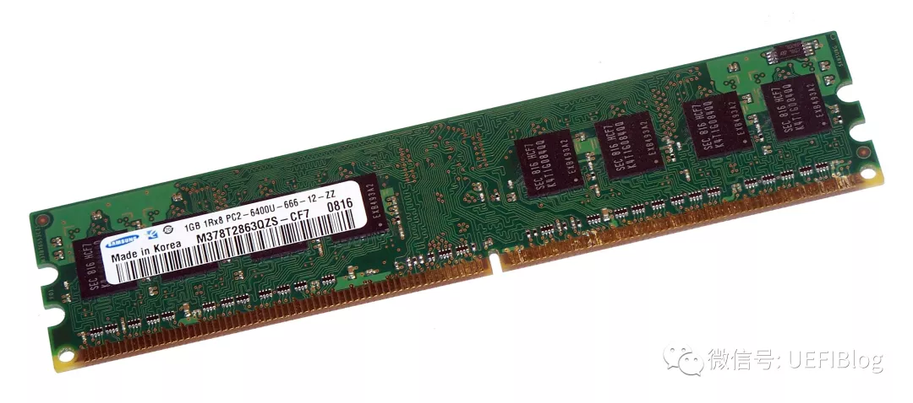
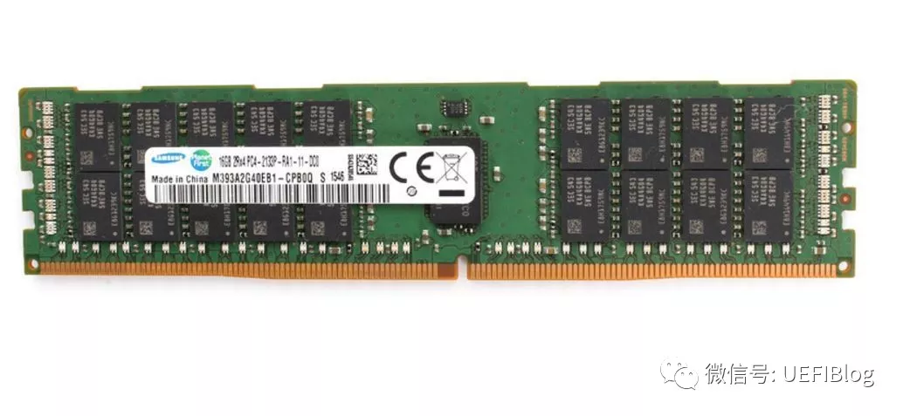

<!-- @import "[TOC]" {cmd="toc" depthFrom=1 depthTo=6 orderedList=false} -->

<!-- code_chunk_output -->

* [参考](#参考)

<!-- /code_chunk_output -->

我们平时看到内存条，有的上面单面有8个内存颗粒：

上图就是1R X 8 DIMM

有的则有16个内存颗粒：

上图就是2R X 4 DIMM；多出来几个颗粒是ECC校验用

甚至还有单面32个颗粒的超高怪物：

上图就是4R X 4 DIMM.

另一篇文章讨论了服务器能够支持的内存最大容量. 

得出了结论：**最大内存**是由能够**插多少条内存**决定的，因为**每根内存条**现在**最大128GB(傲腾内存已经超过512GB了**)，整体内存容量就被限制了下来，这不是钱多钱少的问题。有读者对每根内存条的极限容量感兴趣。是不是我们有钱，可以通过不停增加颗粒数目来堆出超高内存容量的内存条呢？答案当然是否定的了。今天我们就一起来探讨一下问什么。

# 参考

- 本文章参考: 微信公众账号UEFIBlog, [点此进入文章](https://mp.weixin.qq.com/s?__biz=MzI2NDYwMDAxOQ==&mid=2247484244&idx=1&sn=71930d3c6e90b0da0ecd8f77f9e339ee&chksm=eaab63e8dddceafe99acb4c78eeb9988a1898a208fbd92e12c0148cb9bfbb68ffa2558b2cbdc&mpshare=1&scene=1&srcid=#rd)