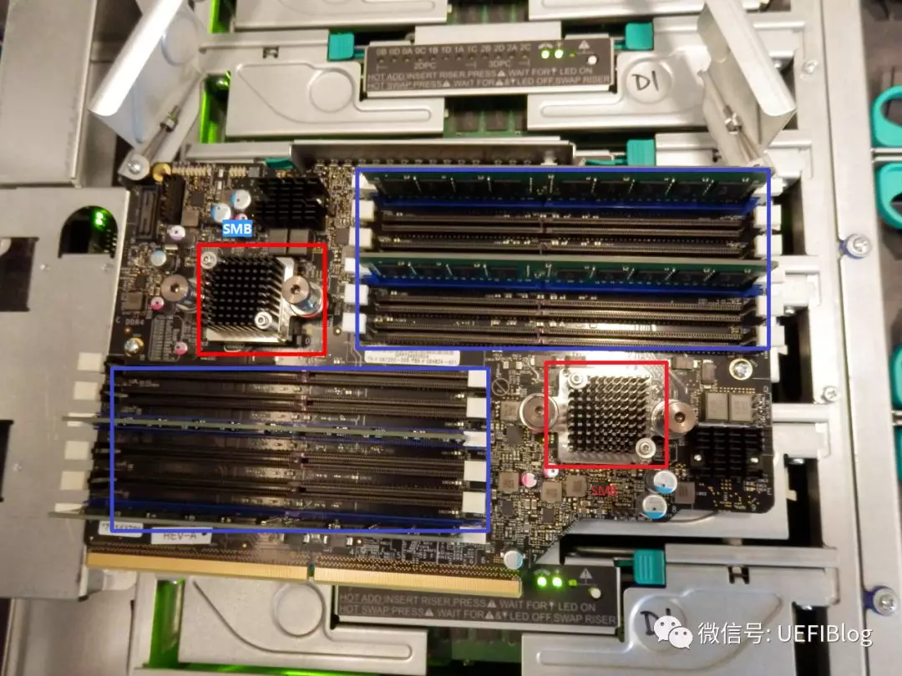

<!-- @import "[TOC]" {cmd="toc" depthFrom=1 depthTo=6 orderedList=false} -->

<!-- code_chunk_output -->

* [0 概述](#0-概述)
* [1 CPU内核和操作系统](#1-cpu内核和操作系统)
* [2 内存子系统](#2-内存子系统)
* [3 结论](#3-结论)
* [4 参考](#4-参考)

<!-- /code_chunk_output -->

# 0 概述

24TB这个数字，框定了利润的上限，这是更多的金钱所不能突破的。

这带来一个根本性的问题，单机服务器最大内存的极限是怎么确定的？它的制约因素有哪些？为了简化讨论范围，我们限定在占据服务器市场98%以上的**X86服务器**，并假设不受成本的约束。我们从CPU内核和操作系统、以及存储子系统两方面来寻找答案。

# 1 CPU内核和操作系统

操作系统和CPU内核都支持６４位地址空间，它能够访问的地址空间是

2＾64＝16384 PB

好大的空间，似乎永远也用不完。是不是这个是内存容量的极限呢？实际上即使在CPU内核中还有一个因子，限制了CPU和操作系统的寻址空间，那就是bitwidth。它决定了页表转换的地址长度，它现在最大是48位，根据64位最大地址转换, 能有52位最大物理地址.

2＾52＝4096 TB

是不是这就是内存容量的极限了呢？实际上并不是。

# 2 内存子系统

现代计算机系统的内存都由CPU内置的内存控制器来管理，为了寻找内存的极限，我们把目光投入到志强中的战斗机，**E7服务器**上。

E7面向对高可靠性和高可扩展性需求强烈的用户，当然价格也十分感人。高可靠性说的是RAS，高可扩展性是说可以扩展为**4路**，**8路**，甚至**16路服务器**。所谓n路，通俗的说就是有**n个物理CPU**。

16路服务器十分十分罕见，部分原因在于从8路扩展为16路后，保证cache一致性所发的snoop包会降低性能，在某些情况下得不偿失。我们这里就略过。8路服务器作为主流最高端服务器，它的内存最大能够达到多少呢？

我们先来看一下它的内存子系统：

**E7 CPU**后面并**不直接插内存条DIMM！！！**，这点**和E5不一样(！！！这个和处理器紧紧相关！！！**)。内存条插在一个叫做**SMB（Scalable Memory Buffer）的芯片**后面。**每个SMB**支持**两个Channel**，**每个Channel**后面最多可以插**3根DIMM**(图里是两个，实际可插三个)。**SMB和CPU直接！！！** 通过一种叫做**SMI Link（Scalable Memory Interconnect**）的**总线！！！连接**，**一个CPU**可以连接**四个SMB**。

框图不够生动，我们来看个实际的例子：

这个板子叫做**Memory Riser**，**红框**的部分就是**SMB**，有**两个**。蓝框的部分是内存插槽。大家数一下，可以看到一个SMB后面可以插**6根DIMM**，分别**属于两个Channel**。一个照的比较好的：

上图来源:Dell E7服务器宣传照

有的同学要问了，不是说好每个CPU后面接4个SMB吗？怎么才两个？别着急，因为每个CPU后面可以接两个Memory Riser：

上图: 4路E7服务器，可以插8个Memory Riser

上图: 插满8个Memory Riser

总结: **一个CPU**后面可以接**两个Memory Riser**, 而**每个Memory Riser**上面**两个SMB**, **每个SMB**后面可以接**两个channel**, **每个channel**后面最多可以插**3根DIMM(即插槽**), 即**每个SMB**有**6个插槽**. 即**每个CPU**有**2个MS**, 或者说**4个SMB**, 或者说**8个channel**, 或者说**最多24个DIMM(即24个插槽**). 

另外注意: CPU是和SMB直接连接的. 芯片组支持的插槽数不一定全部有连接, 可能有些管道, 而dmidecode原理见Linux的Commands, 

好了，我们可以计算一下了，**8路**可以插**16个Memory Riser**，**每个Memory Riser**可以插**12个DIMM**:

16 X 12 = 192根

共可以插192根DIMM。现在焦点落在单根DIMM的容量上了。LRDIMM往往可以支持更大的内存容量（原理见其他），目前据我所知，最大的LRDIMM容量是128GB。所以8路最大内存容量为：

192 X 128 = 24576 GB = 24 TB

现在你知道前面的24 TB哪里来的了吧！

# 3 结论

服务器最大支持的内存数量不在于是64位还是Bitwidth，而在于能够插多少内存条。如果是**16路E7**，**最大内存**可以达到**48TB**。E5系列内存相比E7就差一大截了。

**DIMM形式封装**的**傲腾内存**在不远的将来也许会打破这种限制，傲腾DIMM内存可以达到**2T以上每根**，到那时**也许bitwidth**必须要加宽了。

# 4 参考

- 本文章参考: 微信公众账号UEFIBlog, [点此进入文章](https://mp.weixin.qq.com/s?__biz=MzI2NDYwMDAxOQ==&mid=2247484239&idx=1&sn=7de79a00bcfcb0732b27d946e0c78258&chksm=eaab63f3dddceae5dacdd78547b5ee1a9ea43d217c7aec3a117d51ff5d59155422564251c1cb&mpshare=1&scene=1&srcid=#rd)
