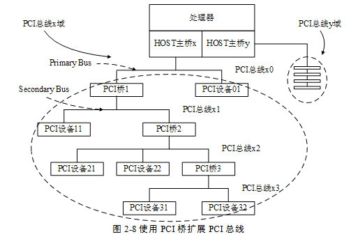

PCI设备都有独立的配置空间，HOST主桥通过配置读写总线事务访问这段空间。PCI总线规定了三种类型的PCI配置空间，分别是PCI Agent设备使用的配置空间，PCI桥使用的配置空间和Cardbus桥片使用的配置空间。

本节重点介绍PCI Agent和PCI桥使用的配置空间，而并不介绍Cardbus桥片使用的配置空间。值得注意的是，在PCI设备配置空间中出现的地址都是PCI总线地址，属于PCI总线域地址空间。

# 1 PCI桥

PCI桥的引入使PCI总线极具扩展性，也极大地增加了PCI总线的复杂度。PCI总线的电气特性决定了在一条PCI总线上挂接的负载有限，当PCI总线需要连接多个PCI设备时，需要使用PCI桥进行总线扩展，扩展出的PCI总线可以连接其他PCI设备，包括PCI桥。在一颗PCI总线树上，最多可以挂接256个PCI设备，包括PCI桥。PCI桥在PCI总线树中的位置如图2‑8所示。

PCI桥作为一个特殊的PCI设备，具有独立的配置空间。但是PCI桥配置空间的定义与PCI Agent设备有所不同。PCI桥的配置空间可以管理其下PCI总线子树的PCI设备，并可以优化这些PCI设备通过PCI桥的数据访问。PCI桥的配置空间在系统软件遍历PCI总线树时配置，系统软件不需要专门的驱动程序设置PCI桥的使用方法，这也是PCI桥被称为透明桥的主要原因。

在某些处理器系统中，还有一类PCI桥，叫做非透明桥。非透明桥不是PCI总线定义的标准桥片，但是在使用PCI总线挂接另外一个处理器系统时非常有用，非透明桥片的主要作用是连接两个不同的PCI总线域，进而连接两个处理器系统，本章将在第2.5节中详细介绍PCI非透明桥。

使用PCI桥可以扩展出新的PCI总线，在这条PCI总线上还可以继续挂接多个PCI设备。PCI桥跨接在两个PCI总线之间，其中距离HOST主桥较近的PCI总线被称为该桥片上游总线(Primary Bus)，距离HOST主桥较远的PCI总线被称为该桥片的下游总线(Secondary Bus)。如图2‑8所示，PCI桥1的上游总线为PCI总线x0，而PCI桥1的下游总线为PCI总线x1。这两条总线间的数据通信需要通过PCI桥1。

通过PCI桥连接的PCI总线属于同一个PCI总线域，在图2‑8中，PCI桥1、2和3连接的PCI总线都属于PCI总线x域。在这些PCI总线域上的设备可以通过PCI桥直接进行数据交换而不需要进行地址转换；而分属不同PCI总线域的设备间的通信需要进行地址转换，如与PCI非透明桥两端连接的设备之间的通信。

如图2‑8所示，每一个PCI总线的下方都可以挂接一个到多个PCI桥，每一个PCI桥都可以推出一条新的PCI总线。在同一条PCI总线上的设备之间的数据交换不会影响其他PCI总线。如PCI设备21与PCI设备22之间的数据通信仅占用PCI总线x2的带宽，而不会影响PCI总线x0、x1与x3，这也是引入PCI桥的另一个重要原因。

由图2‑8我们还可以发现PCI总线可以通过PCI桥组成一个胖树结构，其中每一个桥片都是父节点，而PCI Agent设备只能是子节点。当PCI桥出现故障时，其下的设备不能将数据传递给上游总线，但是并不影响PCI桥下游设备间的通信。当PCI桥1出现故障时，PCI设备11、PCI设备21和PCI设备22将不能与PCI设备01和存储器进行通信，但是PCI设备21和PCI设备22之间的通信可以正常进行。

使用PCI桥可以扩展一条新的PCI总线，但是不能扩展新的PCI总线域。如果当前系统使用32位的PCI总线地址，那么这个系统的PCI总线域的地址空间为4GB大小，在这个总线域上的所有设备将共享这个4GB大小的空间。如在PCI总线x域上的PCI桥1、PCI设备01、PCI设备11、PCI桥2、PCI设备21和PCI设备22等都将共享一个4GB大小的空间。再次强调这个4GB空间是PCI总线x域的“PCI总线地址空间”，和存储器域地址空间和PCI总线y域没有直接联系。

处理器系统可以通过HOST主桥扩展出新的PCI总线域，如MPC8548处理器的HOST主桥x和y可以扩展出两个PCI总线域x和y。这两个PCI总线域x和y之间的PCI空间在正常情况下不能直接进行数据交换，但是PowerPC处理器可以通过设置PIWARn寄存器的TGI字段使得不同PCI总线域的设备直接通信，详见第2.2.3节。

许多处理器系统使用的PCI设备较少，因而并不需要使用PCI桥。因此在这些处理器系统中，PCI设备都是直接挂接在HOST主桥上，而不需要使用PCI桥扩展新的PCI总线。即便如此读者也需要深入理解PCI桥的知识。

PCI桥对于理解PCI和PCIe总线都非常重要。在PCIe总线中，虽然在物理结构上并不含有PCI桥，但是与PCI桥相关的知识在PCIe总线中无处不在，比如在PCIe总线的Switch中，每一个端口都与一个虚拟PCI桥对应，Switch使用这个虚拟PCI桥管理其下PCI总线子树的地址空间。

# 2 PCI Agent设备的配置空间

在一个具体的处理器应用中，**PCI设备**通常将**PCI配置信息存放在E2PROM**中。**PCI设备**进行**上电初始化**时，将**E2PROM**中的**信息读到PCI设备的配置空间**中作为**初始值**。这个过程由**硬件逻辑完成**，绝大多数PCI设备使用这种方式初始化其配置空间。

读者可能会对这种机制产生一个疑问，如果**系统软件**在**PCI设备**将**E2PROM**中的信息**读到配置空间之前**，就开始**操作配置空间**，会不会带来问题？因为此时PCI设备的初始值并不“正确”，仅仅是PCI设备使用的复位值。

读者的这种担心是多余的，因为PCI设备在配置寄存器**没有初始化完毕之前**，即**E2PROM中的内容没有导入PCI设备的配置空间之前**，可以使用PCI总线规定的“Retry”周期使HOST主桥在合适的时机重新发起配置读写请求。

在x86处理器中，系统软件使用CONFIG_ADDR和CONFIG_DATA寄存器，读取PCI设备配置空间的这些初始化信息，然后根据处理器系统的实际情况使用DFS算法，初始化处理器系统中所有PCI设备的配置空间。

在PCI Agent设备的配置空间中包含了许多寄存器，这些寄存器决定了该设备在PCI总线中的使用方法，本节不会全部介绍这些寄存器，因为系统软件只对部分配置寄存器感兴趣。PCI Agent设备使用的配置空间如图2‑9所示。

