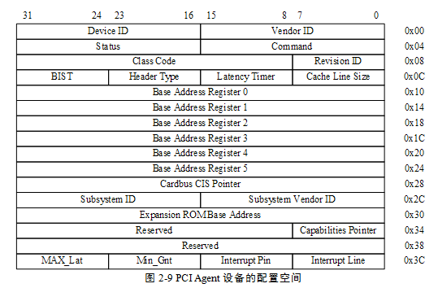

PCI设备都有独立的配置空间，HOST主桥通过配置读写总线事务访问这段空间。PCI总线规定了三种类型的PCI配置空间，分别是PCI Agent设备使用的配置空间，PCI桥使用的配置空间和Cardbus桥片使用的配置空间。

本节重点介绍PCI Agent和PCI桥使用的配置空间，而并不介绍Cardbus桥片使用的配置空间。值得注意的是，在PCI设备配置空间中出现的地址都是PCI总线地址，属于PCI总线域地址空间。

# 1 PCI桥

PCI桥的引入使PCI总线极具扩展性，也极大地增加了PCI总线的复杂度。PCI总线的电气特性决定了在一条PCI总线上挂接的负载有限，当PCI总线需要连接多个PCI设备时，需要使用PCI桥进行总线扩展，扩展出的PCI总线可以连接其他PCI设备，包括PCI桥。在一颗PCI总线树上，最多可以挂接256个PCI设备，包括PCI桥。PCI桥在PCI总线树中的位置如图2‑8所示。

PCI桥作为一个特殊的PCI设备，具有独立的配置空间。但是PCI桥配置空间的定义与PCI Agent设备有所不同。PCI桥的配置空间可以管理其下PCI总线子树的PCI设备，并可以优化这些PCI设备通过PCI桥的数据访问。PCI桥的配置空间在系统软件遍历PCI总线树时配置，系统软件不需要专门的驱动程序设置PCI桥的使用方法，这也是PCI桥被称为透明桥的主要原因。

在某些处理器系统中，还有一类PCI桥，叫做非透明桥。非透明桥不是PCI总线定义的标准桥片，但是在使用PCI总线挂接另外一个处理器系统时非常有用，非透明桥片的主要作用是连接两个不同的PCI总线域，进而连接两个处理器系统，本章将在第2.5节中详细介绍PCI非透明桥。

使用PCI桥可以扩展出新的PCI总线，在这条PCI总线上还可以继续挂接多个PCI设备。PCI桥跨接在两个PCI总线之间，其中距离HOST主桥较近的PCI总线被称为该桥片上游总线(Primary Bus)，距离HOST主桥较远的PCI总线被称为该桥片的下游总线(Secondary Bus)。如图2‑8所示，PCI桥1的上游总线为PCI总线x0，而PCI桥1的下游总线为PCI总线x1。这两条总线间的数据通信需要通过PCI桥1。

通过PCI桥连接的PCI总线属于同一个PCI总线域，在图2‑8中，PCI桥1、2和3连接的PCI总线都属于PCI总线x域。在这些PCI总线域上的设备可以通过PCI桥直接进行数据交换而不需要进行地址转换；而分属不同PCI总线域的设备间的通信需要进行地址转换，如与PCI非透明桥两端连接的设备之间的通信。

如图2‑8所示，每一个PCI总线的下方都可以挂接一个到多个PCI桥，每一个PCI桥都可以推出一条新的PCI总线。在同一条PCI总线上的设备之间的数据交换不会影响其他PCI总线。如PCI设备21与PCI设备22之间的数据通信仅占用PCI总线x2的带宽，而不会影响PCI总线x0、x1与x3，这也是引入PCI桥的另一个重要原因。

由图2‑8我们还可以发现PCI总线可以通过PCI桥组成一个胖树结构，其中每一个桥片都是父节点，而PCI Agent设备只能是子节点。当PCI桥出现故障时，其下的设备不能将数据传递给上游总线，但是并不影响PCI桥下游设备间的通信。当PCI桥1出现故障时，PCI设备11、PCI设备21和PCI设备22将不能与PCI设备01和存储器进行通信，但是PCI设备21和PCI设备22之间的通信可以正常进行。

使用PCI桥可以扩展一条新的PCI总线，但是不能扩展新的PCI总线域。如果当前系统使用32位的PCI总线地址，那么这个系统的PCI总线域的地址空间为4GB大小，在这个总线域上的所有设备将共享这个4GB大小的空间。如在PCI总线x域上的PCI桥1、PCI设备01、PCI设备11、PCI桥2、PCI设备21和PCI设备22等都将共享一个4GB大小的空间。再次强调这个4GB空间是PCI总线x域的“PCI总线地址空间”，和存储器域地址空间和PCI总线y域没有直接联系。

处理器系统可以通过HOST主桥扩展出新的PCI总线域，如MPC8548处理器的HOST主桥x和y可以扩展出两个PCI总线域x和y。这两个PCI总线域x和y之间的PCI空间在正常情况下不能直接进行数据交换，但是PowerPC处理器可以通过设置PIWARn寄存器的TGI字段使得不同PCI总线域的设备直接通信，详见第2.2.3节。

许多处理器系统使用的PCI设备较少，因而并不需要使用PCI桥。因此在这些处理器系统中，PCI设备都是直接挂接在HOST主桥上，而不需要使用PCI桥扩展新的PCI总线。即便如此读者也需要深入理解PCI桥的知识。

PCI桥对于理解PCI和PCIe总线都非常重要。在PCIe总线中，虽然在物理结构上并不含有PCI桥，但是与PCI桥相关的知识在PCIe总线中无处不在，比如在PCIe总线的Switch中，每一个端口都与一个虚拟PCI桥对应，Switch使用这个虚拟PCI桥管理其下PCI总线子树的地址空间。

# 2 PCI Agent设备的配置空间

在一个具体的处理器应用中，**PCI设备**通常将**PCI配置信息存放在E2PROM**中。**PCI设备**进行**上电初始化**时，将**E2PROM**中的**信息读到PCI设备的配置空间**中作为**初始值**。这个过程由**硬件逻辑完成**，绝大多数PCI设备使用这种方式初始化其配置空间。

读者可能会对这种机制产生一个疑问，如果**系统软件**在**PCI设备**将**E2PROM**中的信息**读到配置空间之前**，就开始**操作配置空间**，会不会带来问题？因为此时PCI设备的初始值并不“正确”，仅仅是PCI设备使用的复位值。

读者的这种担心是多余的，因为PCI设备在配置寄存器**没有初始化完毕之前**，即**E2PROM中的内容没有导入PCI设备的配置空间之前**，可以使用**PCI总线规定**的“**Retry**”周期使**HOST主桥**在**合适的时机**重新发起配置读写请求。

在x86处理器中，**系统软件**使用**CONFIG\_ADDR！！！**和**CONFIG\_DATA寄存器！！！**，读取**PCI设备配置空间**的这些**初始化信息**，然后根据处理器系统的实际情况**使用DFS算法**，**初始化**处理器系统中**所有PCI设备的配置空间！！！**。

在**PCI Agent设备**的配置空间中包含了许多寄存器，这些寄存器决定了该设备在PCI总线中的使用方法，本节不会全部介绍这些寄存器，因为系统软件只对部分配置寄存器感兴趣。PCI Agent设备使用的配置空间如图2‑9所示。

在PCI Agent设备配置空间中包含的寄存器如下所示。

(1) Device ID和Vendor ID寄存器

这两个寄存器的值由**PCISIG分配**，**只读**。其中**Vendor ID**代表PCI设备的**生产厂商**，而**Device ID**代表**这个厂商**所生产的**具体设备**。如Intel公司的基于**82571EB芯片的系列网卡**，其**Vendor ID**为0x8086[1]，而**Device ID**为0x105E[2]。

(2) Revision ID和Class Code寄存器

这两个寄存器只读。其中Revision ID寄存器记载PCI设备的版本号。该寄存器可以被认为是Device ID寄存器的扩展。

(3) Header Type寄存器

该寄存器只读，由8位组成。

第7位为1表示当前PCI设备是多功能设备，为0表示为单功能设备。
第6~0位表示当前配置空间的类型，为0表示该设备使用PCI Agent设备的配置空间，普通PCI设备都使用这种配置头；为1表示使用PCI桥的配置空间，PCI桥使用这种配置头；为2表示使用Cardbus桥片的配置空间，Card Bus桥片使用这种配置头，本篇对这类配置头不感兴趣。
系统软件需要使用该寄存器区分不同类型的PCI配置空间，该寄存器的初始化必须与PCI设备的实际情况对应，而且必须为一个合法值。

(4) Cache Line Size寄存器

该寄存器记录HOST处理器使用的Cache行长度。在PCI总线中和Cache相关的总线事务，如存储器写并无效和Cache多行读等总线事务需要使用这个寄存器。值得注意的是，该寄存器由系统软件设置，但是在PCI设备的运行过程中，只有其硬件逻辑才会使用该寄存器，比如PCI设备的硬件逻辑需要得知处理器系统Cache行的大小，才能进行存储器写并无效总线事务，单行读和多行读总线事务。

如果PCI设备不支持与Cache相关的总线事务，系统软件可以不设置该寄存器，此时该寄存器为初始值0x00。对于PCIe设备，该寄存器的值无意义，因为PCIe设备在进行数据传送时，在其报文中含有一次数据传送的大小，PCIe总线控制器可以使用这个“大小”，判断数据区域与Cache行的对应关系。

(5) Subsystem ID和Subsystem Vendor ID寄存器

这两个寄存器和Device ID和Vendor ID类似，也是记录PCI设备的生产厂商和设备名称。但是这两个寄存器和Device ID与Vendor ID寄存器略有不同。下文以一个实例说明Subsystem ID和Subsystem Vendor ID的用途。

Xilinx公司在FGPA中集成了一个PCIe总线接口的IP核，即LogiCORE。用户可以使用LogiCORE设计各种各样基于PCIe总线的设备，但是这些设备的Device ID都是0x10EE，而Vendor ID为0x0007[3]。

(6) Expansion ROM base address寄存器

有些PCI设备在处理器还没有运行操作系统之前，就需要完成基本的初始化设置，比如显卡、键盘和硬盘等设备。为了实现这个“预先执行”功能，PCI设备需要提供一段ROM程序，而处理器在初始化过程中将运行这段ROM程序，初始化这些PCI设备。Expansion ROM base address记载这段ROM程序的基地址。

(7) Capabilities Pointer寄存器

在PCI设备中，该寄存器是可选的，但是在PCI-X和PCIe设备中必须支持这个寄存器，Capabilities Pointer寄存器存放Capabilities寄存器组的基地址，PCI设备使用Capabilities寄存器组存放一些与PCI设备相关的扩展配置信息。该组寄存器的详细说明见第4.3节。

(8) Interrupt Line寄存器

这个寄存器是系统软件对PCI设备进行配置时写入的，该寄存器记录当前PCI设备使用的中断向量号，设备驱动程序可以通过这个寄存器，判断当前PCI设备使用处理器系统中的哪个中断向量号，并将驱动程序的中断服务例程注册到操作系统中[4]。

该寄存器由系统软件初始化，其保存的值与8259A中断控制器相关，该寄存器的值也是由PCI设备与8259A中断控制器的连接关系决定的。如果在一个处理器系统中，没有使用8259A中断控制器管理PCI设备的中断，则该寄存器中的数据并没有意义。

在多数PowerPC处理器系统中，并不使用8259A中断控制器管理PCI设备的中断请求，因此该寄存器没有意义。即使在x86处理器系统中，如果使用I/O APIC中断控制器，该寄存器保存的内容仍然无效。目前在绝大多数处理器系统中，并没有使用该寄存器存放PCI设备使用的中断向量号。

(9) Interrupt Pin寄存器

这个寄存器保存PCI设备使用的中断引脚，PCI总线提供了四个中断引脚INTA#、INTB#、INTC#和INTD#。Interrupt Pin寄存器为1时表示使用INTA#引脚向中断控制器提交中断请求，为2表示使用INTB#，为3表示使用INTC#，为4表示使用INTD#。

如果PCI设备只有一个子设备时，该设备只能使用INTA#；如果有多个子设备时，可以使用INTB~D#信号。如果PCI设备不使用这些中断引脚，向处理器提交中断请求时，该寄存器的值必须为0。值得注意的是，虽然在PCIe设备中并不含有INTA~D#信号，但是依然可以使用该寄存器，因为PCIe设备可以使用INTx中断消息，模拟PCI设备的INTA~D#信号，详见第6.3.4节。

(10) Base Address Register 0~5寄存器

该组寄存器简称为BAR寄存器，BAR寄存器保存PCI设备使用的地址空间的基地址，该基地址保存的是该设备在PCI总线域中的地址。其中每一个设备最多可以有6个基址空间，但多数设备不会使用这么多组地址空间。

在PCI设备复位之后，该寄存器将存放PCI设备需要使用的基址空间大小，这段空间是I/O空间还是存储器空间[5]，如果是存储器空间该空间是否可预取，有关PCI总线预读机制的详细说明见第3.4.5节。

系统软件对PCI总线进行配置时，首先获得BAR寄存器中的初始化信息，之后根据处理器系统的配置，将合理的基地址写入相应的BAR寄存器中。系统软件还可以使用该寄存器，获得PCI设备使用的BAR空间的长度，其方法是向BAR寄存器写入0xFFFF-FFFF，之后再读取该寄存器。

处理器访问PCI设备的BAR空间时，需要使用BAR寄存器提供的基地址。值得注意的是，处理器使用存储器域的地址，而BAR寄存器存放PCI总线域的地址。因此处理器系统并不能直接使用“BAR寄存器+偏移”的方式访问PCI设备的寄存器空间，而需要将PCI总线域的地址转换为存储器域的地址。

如果x86处理器系统使能了IOMMU后，这两个地址也并不一定相等，因此处理器系统直接使用这个PCI总线域的物理地址，并不能确保访问PCI设备的BAR空间的正确性。除此之外在Linux系统中，ioremap函数的输入参数为存储器域的物理地址，而不能使用PCI总线域的物理地址。

而在pci_devàresource[bar].start参数中保存的地址已经经过PCI总线域到存储器域的地址转换，因此在编写Linux系统的设备驱动程序时，需要使用pci_devàresource[bar].start参数中的物理地址，然后再经过ioremap函数将物理地址转换为“存储器域”的虚拟地址。

(11) Command寄存器

该寄存器为PCI设备的命令寄存器，该寄存器在初始化时，其值为0，此时这个PCI设备除了能够接收配置请求总线事务之外，不能接收任何存储器或者I/O请求。系统软件需要合理设置该寄存器之后，才能访问该设备的存储器或者I/O空间。在Linux系统中，设备驱动程序调用pci_enable_device函数，使能该寄存器的I/O和Memory Space位之后，才能访问该设备的存储器或者I/O地址空间。
(12) Status寄存器

该寄存器的绝大多数位都是只读位，保存PCI设备的状态。

(13) Latency Timer寄存器

在PCI总线中，多个设备共享同一条总线带宽。该寄存器用来控制PCI设备占用PCI总线的时间，当PCI设备获得总线使用权，并使能Frame#信号后，Latency Timer寄存器将递减，当该寄存器归零后，该设备将使用超时机制停止[6]对当前总线的使用。

如果当前总线事务为Memeory Write and Invalidate时，需要保证对一个完整Cache行的操作结束后才能停止当前总线事务。对于多数PCI设备而言，该寄存器的值为32或者64，以保证一次突发传送的基本单位为一个Cache行。

PCIe设备不需要使用该寄存器，该寄存器的值必须为0。因为PCIe总线的仲裁方法与PCI总线不同，使用的连接方法也与PCI总线不同。