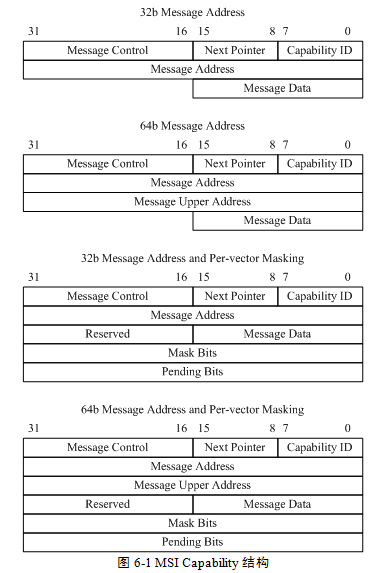

- 1 MSI Capability结构
- 2 MSI\-X Capability结构
    - 2.1 MSI\-X Capability结构
    - 2.2 MSI\-X Table
    - 2.3 Pending Table

**PCIe设备**可以使用**MSI或者MSI-X报文**向处理器提交中断请求，但是对于**某个具体的PCIe设备**，可能仅支持**一种报文**。

在PCIe设备中含有两个Capability结构，一个是MSI Capability结构，另一个是MSI\-X Capability结构。通常情况下**一个PCIe设备仅包含一种结构**，或者为MSI Capability结构，或者为MSI\-X Capability结构。

# 1 MSI Capability结构

**MSI Capability**结构共有**四种组成方式**，分别是32和64位的Message结构，32位和64位**带中断Masking**的结构。

**MSI报文**可以使用**32位地址**或者**64位地址**，而且可以使用**Masking机制**使能或者禁止**某个中断源**。

MSI Capability寄存器的结构如图6‑1所示。

- Capability ID字段记载MSI - Capability结构的ID号，其值为0x05。在PCIe设备中，每一个Capability结构都有唯一的ID号。
- Next Pointer字段存放下一个Capability结构的地址。
- Message Control字段。该字段存放当前PCIe设备使用MSI机制进行中断请求的状态与控制信息，如表6‑1所示。

注：[1]此时PCI设备配置空间Command寄存器的“Interrupt Disable”位为1

- Message Address字段。当MSI Enable位有效时，该字段存放MSI存储器写事务的目的地址的低32位。该字段的31:2字段有效，系统软件可以对该字段进行读写操作；该字段的第1~0位为0。
- Message Upper Address字段。如果64 bit Address Capable位有效，该字段存放MSI存储器写事务的目的地址的高32位。
- Message Data字段，该字段可读写。当MSI Enable位有效时，该字段存放MSI报文使用的数据。该字段保存的数值与处理器系统相关，在PCIe设备进行初始化时，处理器将初始化该字段，而且不同的处理器填写该字段的规则并不相同。如果Multiple Message Enable字段不为0b000时(即该设备支持多个中断请求时)，PCIe设备可以通过改变Message Data字段的低位数据发送不同的中断请求。
- Mask Bits字段。PCIe总线规定当一个设备使用MSI中断机制时，最多可以使用32个中断向量，从而一个设备最多可以发送32种中断请求。Mask Bits字段由32位组成，其中每一位对应一种中断请求。当相应位为1时表示对应的中断请求被屏蔽，为0时表示允许该中断请求。系统软件可读写该字段，系统初始化时该字段为全0，表示允许所有中断请求。该字段和Pending Bits字段对于MSI中断机制是可选字段，但是PCIe总线规范强烈建议所有PCIe设备支持这两个字段。
- Pending Bits字段。该字段对于系统软件是只读位，PCIe设备内部逻辑可以改变该字段的值。该字段由32位组成，并与PCIe设备使用的MSI中断一一对应。该字段需要与Mask Bits字段联合使用。

当Mask Bits字段的相应位为1时，如果PCIe设备需要发送对应的中断请求时，Pending Bits字段的对应位将被PCIe设备的内部逻辑置1，此时PCIe设备并不会使用MSI报文向中断控制器提交中断请求；当系统软件将Mask Bits字段的相应位从1改写为0时，PCIe设备将发送MSI报文向处理器提交中断请求，同时将Pending Bit字段的对应位清零。在设备驱动程序的开发中，有时需要联合使用Mask Bits和Pending Bits字段防止处理器丢弃中断请求(MSI机制提交中断请求的方式类似与边界触发方式，而使用边界触发方式时，处理器可能会丢失某些中断请求，因此在设备驱动程序的开发过程中，可能需要使用这两个字段)。

# 2 MSI-X Capability结构

MSI-X Capability中断机制与MSI Capability的中断机制类似。PCIe总线引出MSI-X机制的主要目的是为了扩展PCIe设备使用中断向量的个数，同时解决MSI中断机制要求使用中断向量号连续所带来的问题。

MSI中断机制最多只能使用32个中断向量，而MSI-X可以使用更多的中断向量。目前Intel的许多PCIe设备支持MSI-X中断机制。与MSI中断机制相比，MSI-X机制更为合理。首先MSI-X可以支持更多的中断请求，但是这并不是引入MSI-X中断机制最重要的原因。因为对于多数PCIe设备，32种中断请求已经足够了。而引入MSI-X中断机制的主要原因是，使用该机制不需要中断控制器分配给该设备的中断向量号连续。

如果一个PCIe设备需要使用8个中断请求时，如果使用MSI机制时，Message Data的[2:0]字段可以为0b000~0b111，因此可以发送8种中断请求，但是这8种中断请求的Message Data字段必须连续。在许多中断控制器中，Message Data字段连续也意味着中断控制器需要为这个PCIe设备分配8个连续的中断向量号。

有时在一个中断控制器中，虽然具有8个以上的中断向量号，但是很难保证这些中断向量号是连续的。因此中断控制器将无法为这些PCIe设备分配足够的中断请求，此时该设备的“Multiple Message Enable”字段将小于“Multiple Message Capable”。

而使用MSI-X机制可以合理解决该问题。在MSI-X Capability结构中，每一个中断请求都使用独立的Message Address字段和Message Data字段，从而中断控制器可以更加合理地为该设备分配中断资源。

与MSI Capability寄存器相比，MSI-X Capability寄存器使用一个数组存放Message Address字段和Message Data字段，而不是将这两个字段放入Capability寄存器中，本篇将这个数组称为MSI-X Table。从而当PCIe设备使用MSI-X机制时，每一个中断请求可以使用独立的Message Address字段和Message Data字段。

除此之外MSI-X中断机制还使用了独立的Pending Table表，该表用来存放与每一个中断向量对应的Pending位。这个Pending位的定义与MSI Capability寄存器的Pending位类似。MSI-X Table和Pending Table存放在PCIe设备的BAR空间中。MSI-X机制必须支持这个Pending Table，而MSI机制的Pending Bits字段是可选的。

## 2.1 MSI-X Capability结构

MSI-X Capability结构比MSI Capability结构略微复杂一些。在该结构中，使用MSI-X Table存放该设备使用的所有Message Address和Message Data字段，这个表格存放在该设备的BAR空间中，从而PCIe设备可以使用MSI-X机制时，中断向量号可以并不连续，也可以申请更多的中断向量号。MSI-X Capability结构的组成方式如图6‑2所示。

上图中各字段的含义如下所示。

- Capability ID字段记载MSI-X Capability结构的ID号，其值为0x11。在PCIe设备中，每一个Capability都有唯一的一个ID号。
- Next Pointer字段存放下一个Capability结构的地址。
- Message Control字段，该字段存放当前PCIe设备使用MSI-X机制进行中断请求的状态与控制信息，如表6‑2所示。

- Table BIR(BAR Indicator Register)。该字段存放MSI\-X Table所在的位置，PCIe总线规范规定MSI\-X Table存放在设备的BAR空间中。该字段表示设备使用BAR0\~5寄存器中的哪个空间存放MSI\-X table。该字段由三位组成，其中0b000\~0b101与BAR0\~5空间一一对应。
- Table Offset字段。该字段存放MSI\-X Table在相应BAR空间中的偏移。
- PBA(Pending Bit Array) BIR字段。该字段存放Pending Table在PCIe设备的哪个BAR空间中。在通常情况下，Pending Table和MSI\-X Table存放在PCIe设备的同一个BAR空间中。
- PBA Offset字段。该字段存放Pending Table在相应BAR空间中的偏移。

## 2.2 MSI\-X Table

MSI-X Table的组成结构如图6‑3所示。

由上图可见，MSI\-X Table由多个Entry组成，其中每个Entry与一个中断请求对应。其中每一个Entry中有四个参数，其含义如下所示。

- Msg Addr。当MSI\-X Enable位有效时，该字段存放MSI\-X存储器写事务的目的地址的低32位。该双字的31:2字段有效，系统软件可读写；1:0字段复位时为0，PCIe设备可以根据需要将这个字段设为只读，或者可读写。不同的处理器填入该寄存器的数据并不相同。
- Msg Upper Addr，该字段可读写，存放MSI\-X存储器写事务的目的地址的高32位。
- Msg Data，该字段可读写，存放MSI\-X报文使用的数据。其定义与处理器系统使用的中断控制器和PCIe设备相关。
- Vector Control，该字段可读写。该字段只有第0位(即Per Vector Mask位)有效，其他位保留。当该位为1时，PCIe设备不能使用该Entry提交中断请求；为0时可以提交中断请求。该位在复位时为0。Per Vector Mask位的使用方法与MSI机制的Mask位类似。

## 2.3 Pending Table

Pending Table的组成结构如图6‑4所示。

如上图所示，在Pending Table中，一个Entry由64位组成，其中每一位与MSI-X Table中的一个Entry对应，即Pending Table中的每一个Entry与MSI-X Table的64个Entry对应。与MSI机制类似，Pending位需要与Per Vector Mask位配置使用。

当Per Vector Mask位为1时，PCIe设备不能立即发送MSI-X中断请求，而是将对应的Pending位置1；当系统软件将Per Vector Mask位清零时，PCIe设备需要提交MSI-X中断请求，同时将Pending位清零。