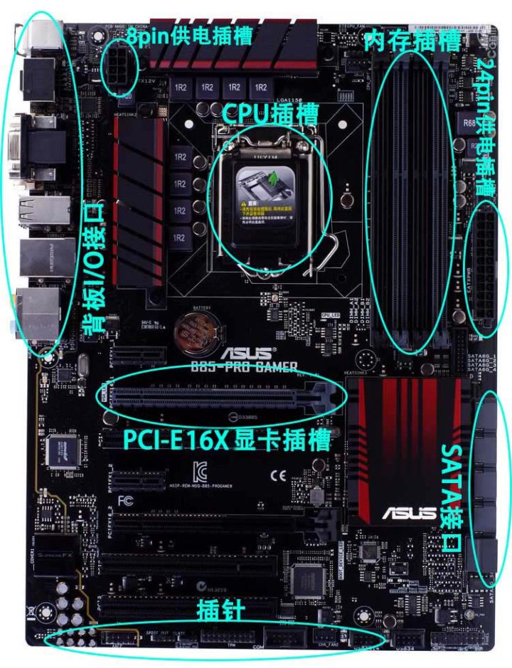
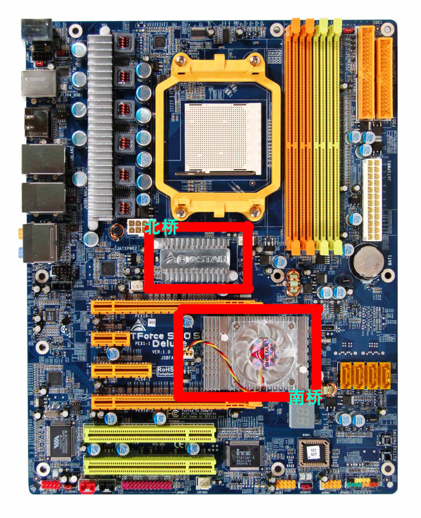

<!-- @import "[TOC]" {cmd="toc" depthFrom=1 depthTo=6 orderedList=false} -->

<!-- code_chunk_output -->

* [1 主板](#1-主板)
* [2 服务器主板与PC主板区别](#2-服务器主板与pc主板区别)
	* [2.1 CPU](#21-cpu)
	* [2.2 内存](#22-内存)
	* [2.3 硬盘](#23-硬盘)
	* [2.4 电源](#24-电源)
	* [2.5 风扇](#25-风扇)
	* [2.6 网卡](#26-网卡)
* [3 主板分类](#3-主板分类)

<!-- /code_chunk_output -->

# 1 主板

主板，又叫主机板(mainboard)、系统板(systemboard)或母板(motherboard)；它分为**商用主板**和**工业主板**两种。它安装在机箱内，是微机最基本的也是最重要的部件之一。主板一般为**矩形电路板**，上面安装了组成计算机的主要电路系统，一般有**BIOS芯片**、**I/O控制芯片**、**键和面板控制开关接口**、**指示灯插接件**、**扩充插槽**、**主板及插卡的直流电源供电接插件**等元件。

**主板**采用了**开放式结构**。主板上大都有**6-15个扩展插槽**，供PC机**外围设备的控制卡（适配器**）插接。通过**更换这些插卡**，可以对微机的相应子系统进行局部升级，使厂家和用户在配置机型方面有更大的灵活性。总之，主板在整个微机系统中扮演着举足轻重的角色。可以说，**主板的类型和档次**决定着整个微机系统的类型和档次。**主板的性能**影响着整个微机系统的性能。

主板（英语：Motherboard, Mainboard，简称Mobo）；又称主机板、系统板、逻辑板、母板、底板等，是构成复杂电子系统例如电子计算机的中心或者主电路板。

普通家用PC的主板，更多的要求是在性能和功能上，而服务器主板是专门为满足服务器应用(高稳定性、高性能、高兼容性的环境)而开发的主机板。由于服务器的高运作时间，高运作强度，以及巨大的数据转换量，电源功耗量，I/O吞吐量，因此对服务器主板的要求是相当严格的。

简单来说，主板是由集成电路和插槽构成的电路板，为其他电脑硬件提供安装位置、供电和其他功能。

一般用户用得到的是主板上的这些东西：

大部分插槽的名字反映了该插槽的功能，通俗易懂。其中

- 背板I/O（Input/Output）接口含USB、VGA视频接口、RJ45网口，音频接口等；

- SATA接口用于连接SATA接口的硬盘；

- 插针与机箱上的接口线连接，为机箱提供电源键、USB、音频等功能。

# 2 服务器主板与PC主板区别

第一**服务器主板**一般都是至少支持**两个处理器**——**芯片组不同**（往往是**双路以上的服务器**，**单路服务器**有时候就是使用**台式机主板**）。

第二服务器几乎任何部件都支持**ECC，内存、处理器、芯片组**（但高阶台式机也开始支持ECC）

第三服务器很多地方都存在**冗余**，高档服务器上面甚至连CPU、内存都有冗余，中档服务器上，硬盘、电源的冗余是非常常见的，但低档服务器往往就是台式机的改装品，不过也选用一线大厂电源。

第四由于服务器的网络负载比较大，因此服务器的网卡一般都是使用TCP/IP卸载引擎的网卡，效率高，速度快，CPU占用小，但目前高档台式机也开始使用高档网卡甚至双网卡。

第五硬盘方面，已经很多而且越来越多的服务器将用SAS /SCSI 代替SATA。

## 2.1 CPU

Server: Intel Xeon/AMD Opteron&reg;（仅限于双路及以上的服务器）

PC: P4/Celeron/P4M/Core /Core i3/Core i5/Core 7/AMD

SMP技术:

SMP的全称是“对称多处理”（Symmetrical Multi-Processing），是指在一个计算机上汇集了一组处理器，各CPU之间共享内存子系统以及总线结构。在这种架构中，一台电脑不再由单个CPU组成，而同时由多个处理器运行操作系统，而且共同使用内存和其他资源。虽然同时使用多个CPU，但是对用户来说，它们的表现就像一台单机一样。系统将任务分配给多个CPU，从而提高了整个系统的数据处理能力。在对称多处理系统中，系统资源被系统中所有的CPU共享，工作负载能够均匀地分配到所有可用处理器之上。

## 2.2 内存

Server: ECC/Register

PC: Non ECC

ECC是“Error Checking and Correcting”的简写，中文名称是“错误检查和纠正”。ECC是一种能够实现“错误检查和纠正”的技术，ECC内存就是应用了这种技术的内存，一般多应用在服务器及图形工作站上，这将使整个电脑系统在工作时更趋于安全稳定。

## 2.3 硬盘

Server: SAS/SCSI/SATA/RAID/SFF SAS

PC: IDE/SATA

## 2.4 电源

Server: 冗余电源/专用电源PFC(Power Function Correcting功率因数校正器 )

PC: 普通，但高档微机也使用服务器电源。

## 2.5 风扇

Server: 冗余风扇

PC: 普通

## 2.6 网卡

Server: Gb/冗余

PC: 也为Gb，但一般只有一个网卡。

# 3 主板分类

主板 **多是以芯片组分类！！！** 的。芯片是有处理能力的集成电路，芯片组就是由多块芯片构成的芯片集。

过去，芯片组有两名成员：在主板上方靠近CPU的北桥（也称主桥，North Bridge，NB）芯片和右下方与PCI槽相邻的南桥（South Bridge，SB）芯片：

