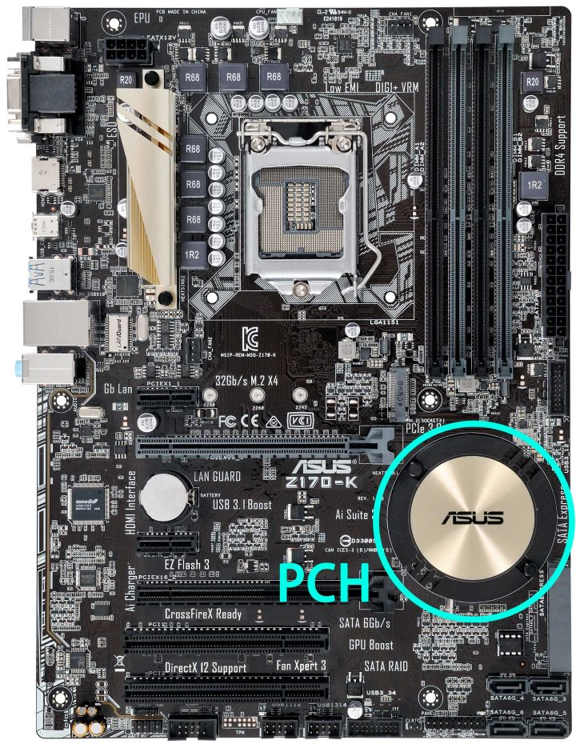
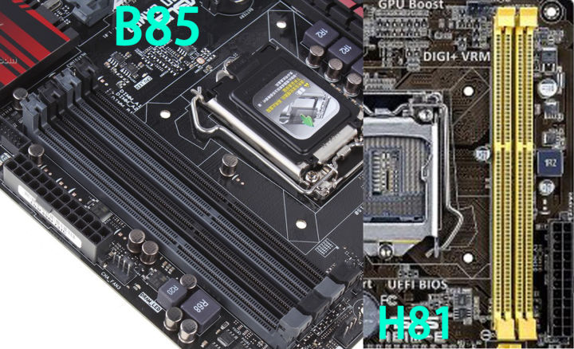
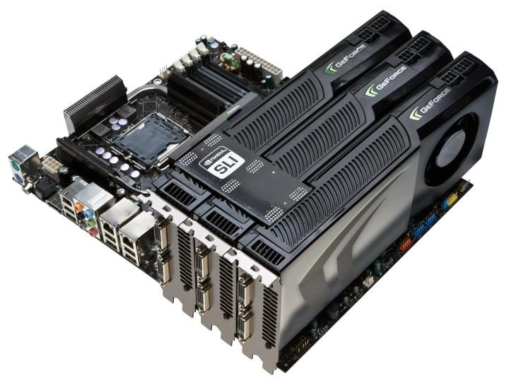
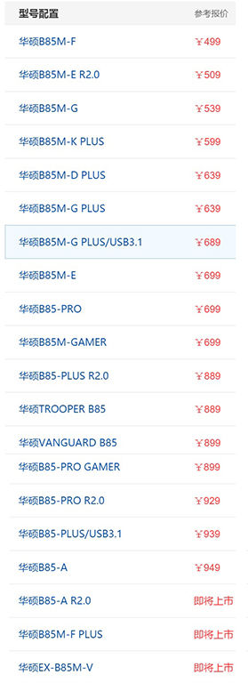
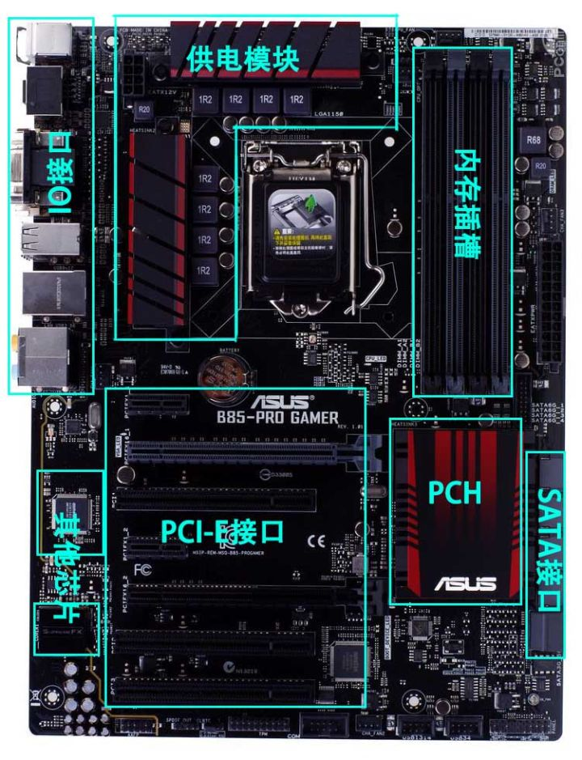
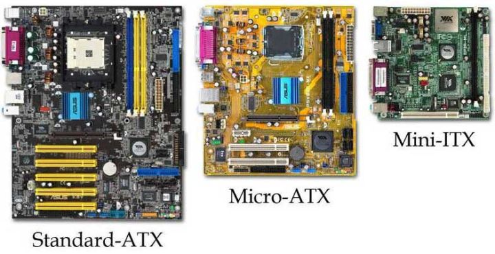

<!-- @import "[TOC]" {cmd="toc" depthFrom=1 depthTo=6 orderedList=false} -->

<!-- code_chunk_output -->

* [1 主板](#1-主板)
* [2 服务器主板与PC主板区别](#2-服务器主板与pc主板区别)
	* [2.1 CPU](#21-cpu)
	* [2.2 内存](#22-内存)
	* [2.3 硬盘](#23-硬盘)
	* [2.4 电源](#24-电源)
	* [2.5 风扇](#25-风扇)
	* [2.6 网卡](#26-网卡)
* [3 世界上有哪些主板，怎么分类？](#3-世界上有哪些主板怎么分类)
* [4 不同芯片组有啥区别？](#4-不同芯片组有啥区别)
* [5 芯片组对性能有什么影响？](#5-芯片组对性能有什么影响)
* [6 主板都有哪些牌子？不同牌子之间又有啥区别？产品又是怎么样的呢？](#6-主板都有哪些牌子不同牌子之间又有啥区别产品又是怎么样的呢)
* [7 这些主板到底有什么卵区别？怎么判断哪个比较好？](#7-这些主板到底有什么卵区别怎么判断哪个比较好)
* [参考](#参考)

<!-- /code_chunk_output -->

# 1 主板

主板，又叫主机板(mainboard)、系统板(systemboard)或母板(motherboard)；它分为**商用主板**和**工业主板**两种。它安装在机箱内，是微机最基本的也是最重要的部件之一。主板一般为**矩形电路板**，上面安装了组成计算机的主要电路系统，一般有**BIOS芯片**、**I/O控制芯片**、**键和面板控制开关接口**、**指示灯插接件**、**扩充插槽**、**主板及插卡的直流电源供电接插件**等元件。

**主板**采用了**开放式结构**。主板上大都有**6-15个扩展插槽**，供PC机**外围设备的控制卡（适配器**）插接。通过**更换这些插卡**，可以对微机的相应子系统进行局部升级，使厂家和用户在配置机型方面有更大的灵活性。总之，主板在整个微机系统中扮演着举足轻重的角色。可以说，**主板的类型和档次**决定着整个微机系统的类型和档次。**主板的性能**影响着整个微机系统的性能。

主板（英语：Motherboard, Mainboard，简称Mobo）；又称主机板、系统板、逻辑板、母板、底板等，是构成复杂电子系统例如电子计算机的中心或者主电路板。

普通家用PC的主板，更多的要求是在性能和功能上，而服务器主板是专门为满足服务器应用(高稳定性、高性能、高兼容性的环境)而开发的主机板。由于服务器的高运作时间，高运作强度，以及巨大的数据转换量，电源功耗量，I/O吞吐量，因此对服务器主板的要求是相当严格的。

简单来说，主板是由集成电路和插槽构成的电路板，为其他电脑硬件提供安装位置、供电和其他功能。

一般用户用得到的是主板上的这些东西：

大部分插槽的名字反映了该插槽的功能，通俗易懂。其中

- 背板I/O（Input/Output）接口含USB、VGA视频接口、RJ45网口，音频接口等；

- SATA接口用于连接SATA接口的硬盘；

- 插针与机箱上的接口线连接，为机箱提供电源键、USB、音频等功能。

# 2 服务器主板与PC主板区别

第一**服务器主板**一般都是至少支持**两个处理器**——**芯片组不同**（往往是**双路以上的服务器**，**单路服务器**有时候就是使用**台式机主板**）。

第二服务器几乎任何部件都支持**ECC，内存、处理器、芯片组**（但高阶台式机也开始支持ECC）

第三服务器很多地方都存在**冗余**，高档服务器上面甚至连CPU、内存都有冗余，中档服务器上，硬盘、电源的冗余是非常常见的，但低档服务器往往就是台式机的改装品，不过也选用一线大厂电源。

第四由于服务器的网络负载比较大，因此服务器的网卡一般都是使用TCP/IP卸载引擎的网卡，效率高，速度快，CPU占用小，但目前高档台式机也开始使用高档网卡甚至双网卡。

第五硬盘方面，已经很多而且越来越多的服务器将用SAS /SCSI 代替SATA。

## 2.1 CPU

Server: Intel Xeon/AMD Opteron&reg;（仅限于双路及以上的服务器）

PC: P4/Celeron/P4M/Core /Core i3/Core i5/Core 7/AMD

SMP技术:

SMP的全称是“对称多处理”（Symmetrical Multi-Processing），是指在一个计算机上汇集了一组处理器，各CPU之间共享内存子系统以及总线结构。在这种架构中，一台电脑不再由单个CPU组成，而同时由多个处理器运行操作系统，而且共同使用内存和其他资源。虽然同时使用多个CPU，但是对用户来说，它们的表现就像一台单机一样。系统将任务分配给多个CPU，从而提高了整个系统的数据处理能力。在对称多处理系统中，系统资源被系统中所有的CPU共享，工作负载能够均匀地分配到所有可用处理器之上。

## 2.2 内存

Server: ECC/Register

PC: Non ECC

ECC是“Error Checking and Correcting”的简写，中文名称是“错误检查和纠正”。ECC是一种能够实现“错误检查和纠正”的技术，ECC内存就是应用了这种技术的内存，一般多应用在服务器及图形工作站上，这将使整个电脑系统在工作时更趋于安全稳定。

## 2.3 硬盘

Server: SAS/SCSI/SATA/RAID/SFF SAS

PC: IDE/SATA

## 2.4 电源

Server: 冗余电源/专用电源PFC(Power Function Correcting功率因数校正器 )

PC: 普通，但高档微机也使用服务器电源。

## 2.5 风扇

Server: 冗余风扇

PC: 普通

## 2.6 网卡

Server: Gb/冗余

PC: 也为Gb，但一般只有一个网卡。

# 3 世界上有哪些主板，怎么分类？

主板 **多是以芯片组分类！！！** 的。芯片是有处理能力的集成电路，芯片组就是由多块芯片构成的芯片集。

**过去**，芯片组有两名成员：在主板上方靠近CPU的北桥（也称主桥，North Bridge，NB）芯片和右下方与PCI槽相邻的南桥（South Bridge，SB）芯片：

NB主要控制CPU与内存之间的数据传输，SB主要控制I/O（Input/Output）接口。随着成本和稳定性的需要，NB的部分功能如内存控制器和核心显卡被集成到CPU中，剩余功能与SB集成在一起，形成看起来只有SB的现在的主板的样貌，称为单桥（PCH）。

过去，NB肩负着CPU运算的重任，故芯片组均以NB的类型命名，如H81、B85、Z87等。相应地，也把搭载不同芯片组的主板简称为H81主板、B85主板等，便形成了主板的分类。

# 4 不同芯片组有啥区别？

1. 芯片组不同，可承载的**硬件规格就不同**。一般来说，更高端的芯片组，可承载的其他硬件规格就更高。

如100系主板（如Z170、B150等）可支持DDR4内存。

不同芯片组支持的最大内存频率、M.2接口的支持与否等区别不胜枚举，大家都可以问度娘，在此不一一列举。

2. 芯片组不同，可承载的硬件数量就不同。一般来说，更高端的芯片组，可承载的硬件数量就更多。

如H81主板只有2个内存插槽，也就只能插两条内存；而B85主板则拥有最多4个内存插槽。

此外还有USB接口数、PCI-E总线数、SATA接口数等各种接口数量上的差异大家都可以问度娘，在此也不一一列举。

3. 芯片组不同，拓展功能也不同。一般来说，更高端的芯片组，拓展性就更强，可玩性也更强。

比如B85等非旗舰芯片组难以进行多显卡SLI，不仅是因为PCI-E总线数不足，而且本身芯片组就对SLI进行了限制。（部分主板也可以通过破解解除封印）

仅有Z系主板原生支持超频。其他差异大家都可以问度娘，在此还是不一一列举。（BTW，部分主板也可以通过破解，解除超频锁定）

4. 芯片组不同，价格自然就不同。一般来说，更高端的芯片组，肯定就更贵啊怎么可能更便宜呢。

# 5 芯片组对性能有什么影响？

单纯地讨论芯片组对CPU和显卡的发挥有无影响，可以说基本是无影响的，或影响基本可以忽略。

但是，以上所述芯片组之间的差异，决定了芯片组对平台性能的影响力。

更高端的芯片组支持更高规格、更多的硬件，并且有超频、SLI等功能的加持，对整机性能的影响力是很强的......当然，更高端的芯片组对钱包隆起程度的影响力也更强！

# 6 主板都有哪些牌子？不同牌子之间又有啥区别？产品又是怎么样的呢？

与CPU市场不同，主板市场并非由少数厂家支撑，而是百家争鸣。不同的品牌，做工、品牌理念、面向用户和定位自然有别，这些品牌的故事、理念和产品在知乎专栏(见参考)。

一般来说，各主板厂商都会生产各种芯片组的主板，有时也会只挑主流芯片组主板进行生产以保证利润。同一品牌，同一芯片组的主板又按照用料、做工、南桥芯片设计、附加功能、外观、板型等分为不同型号，确保不同价位都有产品覆盖。

于是乎出现了同一品牌，同一芯片组，却出现了大量看起来没什么卵区别但价格却不一样的主板的情况，例如单单华硕的B85主板就有：

# 7 这些主板到底有什么卵区别？怎么判断哪个比较好？

选合适的主板芯片组很简单，到底买哪块才是重中之重的难点。下面围绕这张图，我们就同一个芯片组的主板到底能有什么区别进行讨论：

1. 板型

板型是最直观的区别，常见的板型由大到小分别为XL-ATX，ATX，M-ATX，ITX。这里的命名是比较混乱的，尤其在电商购买时往往分类不标准：

XL-ATX一般也记为E-ATX；

ATX也称Standard-ATX，是标准板型；

M-ATX即Micro-ATX，其实包括正宗的M-ATX和μ-ATX：M-ATX为正方形；μ-ATX为宽度比M-ATX小的长方形，尺寸比M-ATX更小；

ITX又称Mini-ITX；

购买时注意识别。

# 参考 

- 知乎专栏(电脑的组装(gan huo)与修养(shui huo)), 文章: https://zhuanlan.zhihu.com/p/20468849?utm_source=wechat_session&utm_medium=social&utm_oi=50718148919296