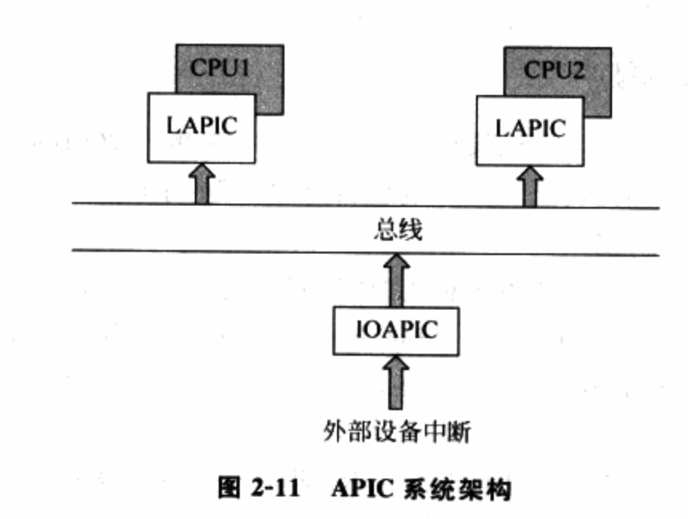
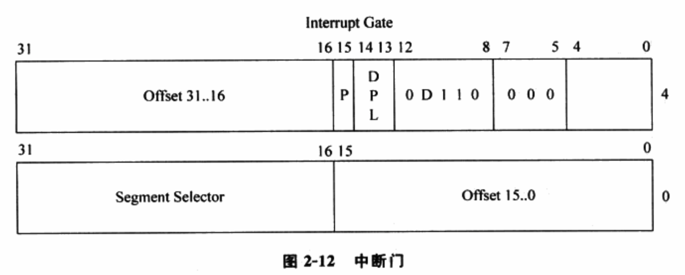

<!-- @import "[TOC]" {cmd="toc" depthFrom=1 depthTo=6 orderedList=false} -->

<!-- code_chunk_output -->

* [1 中断架构](#1-中断架构)
	* [1.1 可编程中断控制器](#11-可编程中断控制器)
	* [1.2 PIC](#12-pic)
	* [1.3 APIC](#13-apic)
	* [1.4 处理器间中断](#14-处理器间中断)
	* [1.5 中断的重要概念](#15-中断的重要概念)
		* [1.5.1 中断的分类](#151-中断的分类)
		* [1.5.2 中断的优先级](#152-中断的优先级)
		* [1.5.3 中断的屏蔽](#153-中断的屏蔽)
		* [1.5.4 IDT表](#154-idt表)
		* [1.5.5 中断门](#155-中断门)
* [2 异常架构](#2-异常架构)
* [3 操作系统对中断/异常的处理流程](#3-操作系统对中断异常的处理流程)

<!-- /code_chunk_output -->

中断和异常会打算顺序执行的程序流, 转而进入一条完全不同的执行路径.

# 1 中断架构

从某种意义上, **现代计算机架构**是由**大量的中断事件驱动(！！！**)的. **中断**提供给**外部硬件设备**一种"**打断CPU当前执行任务, 并响应自身服务！！！**"的手段.

## 1.1 可编程中断控制器

中断从设备发送到CPU需要由被称为"中断控制器"的部件转发(MSI除外). 中断控制器发展至今, 经历了PIC(Programmable Interrupt Controller, 可编程中断控制器)和APIC(Advanced Programmable Interrupt Controller, 高级可编程中断控制器)两个阶段.

## 1.2 PIC

8259A芯片就是常说的PIC, 它具有IR0\~IR7共8个中断管脚连接外部设备. 中断管脚具有优先级, 其中IR0优先级最高, IR7最低. PIC有三个重要的寄存器.

⓵ **IRR**(Interrupt Request Register, 中断请求控制器): 共8位, 对应**IR0\~IR7这8个中断管脚**. 某位**置1**代表**收到对应管脚的中断**但还**未提交到CPU**.

⓶ **ISR**(Interrupt Service Register, 中断服务寄存器): 共8位. 某位置1代表**对应管脚的中断**已经**提交到了CPU处理**, 但**CPU还未处理完**.

⓷ **IMR**(Interrupt Mask Register, 中断屏蔽寄存器): 共8位. 某位置1对应的中断**管脚被屏蔽**.

除此之外, PIC还有一个**EOI位**, 当**CPU处理完一个中断**时, 通过**写该位**告知PIC**中断处理完成**. PIC向CPU递交中断的流程如下.

⓵ **一个**或**多个IR**管脚上产生**电平信号**, 若**对应的中断没有被屏蔽**, **IRR**中相应的位被**置1(！！！所有收到的IR管脚的电平信号！！！**).

⓶ **PIC拉高INT**管脚**通知CPU**中断发生.

⓷ **CPU**通过**INTA管脚**应答**PIC**, 表示**中断请求收到**.

⓸ **PIC**收到**INTA应答**后, 将**IRR**中具有**最高优先级(！！！因为有多个！！！**)的位清0, 并设置**ISR中对应的位**.

⓹ CPU通过**INTA管脚**第二次发出**脉冲**, **PIC收到后**计算**最高优先级中断的vector**, 并将它提交到**数据线**上.

⓺ 等待CPU写EOI. 收到EOI后, ISR中最高优先级的位被清0. 若PIC处于AEOI模式, 当第二个INTA脉冲收到后, ISR中最高优先级的位自动清0.

## 1.3 APIC

PIC可以在UP(单处理器)平台上工作, 但无法用于MP(多处理器)平台. 因此, APIC应运而生.

APIC由位于CPU中的本地高级可编程中断控制器(Local Advanced Programmable Interrupt Controller, LAPIC)和位于主板南桥中I/O高级可编程中断控制器(I/O Advanced Programmable Interrupt Controller. IOAPIC)两部分构成. 关系如图.



IOAPIC通常有**24个不具有优先级的管脚**, 用于**连接外部设备**. 当**IRQ线(连接的外设线！！！**)上有中断请求发生时，**I/O APIC**在**redirection table(通常是操作系统设定的**)里找到管脚对应的**RTE（redirection table entry或者说redirection table寄存器**），读取**RTE**内的**中断消息内容**, 通过其各个字段, 格式化出一条包含该中断所有信息的中断消息, 再经由**system bus(！！！老式的通过专门的APIC总线**)发送给LAPIC.

System Bus是广播总线, 特定CPU上的Local APIC先判断是否属于中断消息的目标对象. 在**LAPIC**内部, 也有**IRR**、**ISR**和**EOI寄存器**, 其中IRR、ISR为256位, EOI为32位, 注意:
 **没有了IMR寄存器**, 通过**mask位实现**.

APIC系统中, 中断的发起大致流程如下.

⓵ IOAPIC收到某个管脚产生的中断信号

⓶ 查找PRT表获得该管脚对应的RTE. 根据RTE各字段格式化出一条中断消息, 并确定发送给哪个(或多个)CPU的LAPIC.

⓷ 通过系统总线或APIC总线发送中断消息

⓸ LAPIC收到中断消息, 判断是否由自己接收

⓹ 如确定接收, 将IRR中对应的位置1. 同时确定此时是否将该中断交给CPU处理.

⓺ 如确定提交中断给CPU处理, 从IRR获取最高优先级的中断, 将ISR中对应的位置1, 并提交中断. 对于edge触发, IRR中对应位此时清0.

⓻ CPU处理完中断, 软件写EOI寄存器告知中断处理完成, 对于level触发的中断, IRR中对应位清0. LAPIC可提交下一个中断.

## 1.4 处理器间中断

在MP(多处理器)平台上, 多个CPU要协同工作, 处理器间中断(Inter\-processor Interrupt, IPI)提供CPU之间相互通信的手段. CPU可以通过LAPIC的ICR(Interrupt Command Register, 中断命令寄存器)向指定的一个/多个CPU发送中断.

操作系统通常使用IPI来完成诸如进程转移、中断平衡和TLB刷新等工作.

## 1.5 中断的重要概念

### 1.5.1 中断的分类

中断可以从很多方面分类, 从中断源角度看, 可以分为如下几类.

⓵ 外部中断: 指连接在IOAPIC上设备产生的中断、LAPIC上连接的设备或LAPIC内部中断源产生的中断以及处理器间中断。

⓶ 可屏蔽中断: 指可以通过某种方式(例如CLI指令、TPR)进行屏蔽的中断. 与之对应的是不可屏蔽中断.

⓷ 软件产生中断: 只通过INT n指令产生的中断.

这样分类不是绝对, 例如外部中断通常是可屏蔽中断, 但也可能属于不可屏蔽中断. 通常, 根据外部中断的触发方式, 又把它们分为如下几类.

⓵ edge触发中断: 指中断边沿方式触发(例如上升沿). ISA设备、时钟设备多使用这种触发方式。

⓶ level触发中断: 指中断以电平方式触发, 在中断程序应答设备前, 该电平一直有效. PCI设备使用这种触发方式.

### 1.5.2 中断的优先级

在使用PIC的系统中, PIC的管脚决定了中断的优先级, 连接IR0的设备具有最高优先级, 连接IR7的设备优先级最低. 在APIC系统中, IOAPIC的管脚不再具备优先级, 设备的优先级由它所连接管脚对应RTE中的vector字段决定. vector是x86架构用于索引IDT表的下标, 范围从0\~255,值越大优先级越高. 其中, 32\~255可供外部中断使用.

在**现代操作系统**中, 有几个概念和vector常联系在一起使用, 简单介绍下.

⓵ IRQ: PIC时代的产物, 由于ISA设备通常是连接到固定PIC管脚, 所以说一个设备的IRQ实际是指它连接的PIC管脚号. IRQ暗示着中断优先级. 进入到APIC时代后, 仍习惯用IRQ来表示一个设备的中断号, 但对于16以下的IRQ, 它们可能不再与IOAPIC的管脚对应.

⓶ GSI(Global System Interrupt): **ACPI引入的概念**, 它为系统中**每个中断源**指定了一个**唯一的中断号**. IRQ和GSI在APIC系统中常被混用, 实际上对于**15以上的IRQ**, 它和GSI相等.

这里, GSI和IRQ可以看作等同的概念, 表示某个设备的中断号. 它们与**vector的关系**由操作系统决定, 通常是在**设备驱动注册中断处理程序**时由**操作系统分配**.

### 1.5.3 中断的屏蔽

无论是在PIC收到中断信号后, 还是LAPIC收到中断消息后, 并不一定都是马上交给CPU处理的, 这还要取决于CPU当前是否屏蔽中断(不可屏蔽中断除外). 当**CPU屏蔽中断**时, **中断会被依附(pending)在PIC/LAPIC的IRR寄存器(！！！**)中, **一旦CPU开启中断**, 会在第一时间响应PIC/LAPIC所依附(pending)的中断. CPU可通过下面几种方式屏蔽/开启中断.

⓵ CLI/STI指令: 这是操作系统最常用的屏蔽/开启中断的方法. CLI指令将本CPU的EFLAGS寄存器的IF位清0, 阻止接收中断; STI指令将IF位置1, 允许接收中断. 这两条指令支队当前CPU起作用.

⓶ TPR寄存器: 根据该寄存器值代表的优先级, 部分屏蔽外部中断.

⓷ PIC/IOAPIC的中断屏蔽位: PIC可以通过IMR寄存器屏蔽对应管脚. IOAPIC可通过RTE中的mask位屏蔽对应管脚. 该方法不会讲中断依附(pengding)到IRR, 而是直接忽略, 对于edge触发中断可能导致中断丢失.

### 1.5.4 IDT表

IDT实际上就是个大数组, 用于存放各种"门"(中断门、陷阱门、任务门). 这些门是中断和异常通往各自处理函数的入口. 当一个中断或异常发生, CPU用它们对应的vector号索引IDT表以获得对应的"门". 

### 1.5.5 中断门

"门"是入口, 中断门就是中断的入口. 中断门实际上是一种段描述符, 称为系统描述符, 由段描述符的S位控制. 格式如图.



其中, 段选择符、偏移量字段可以看作是一个逻辑地址, 通过索引GDT将该逻辑地址转换为中断处理函数入口的线性地址. 这里特别要注意的是DPL字段, 很多操作系统会将门的DPL设为0. 那么有一个问题: 程序在用户态时(CPL=3)发生中断, 岂不是不能过一个DPL=0的中断门? 实际上, 中断门和陷阱门的DPL只在使用INT n指令引起中断/异常时才检查, 硬件产生的中断/异常不检查. P字段代表中断门是否有效, 清0无效.

通常操作系统的中断都用了中断门, 没有使用陷阱门. 中断门和陷阱门唯一区别在于程序通过中断门跳转后, EFLAGS寄存器的IF位自动清0, 中断关闭. 而陷阱门没有.

# 2 异常架构

和中断相比, 异常最大的不同在于它是在程序的执行过程中同步发生的. 例如下面

```c
void main()
{
    int a = 10;
    a = a/0;
}
```

程序运行到a=a/0一句必然引起一个除0异常, 但不能预料该程序在执行时是否会发生中断. 异常根据产生的原因和严重程度可分为如下三类.

⓵ 错误(Fault): 由某种错误情况引起, 一般可以被错误处理程序纠正. 错误发生时, 处理器将控制权转移给对应的处理程序, 修正后重新回到产生异常的指令继续执行. 例如, 常见的缺页错误就属于此类.

⓶ 陷阱(Trap): 指在执行了一条特殊指令后引起的异常, 处理器允许忽略异常继续往下执行. 在异常处理程序里不必修正错误, 回到发生异常指令的下一条指令继续执行. 例如, Linux 32用于实现系统调用的INT 80指令就属于此类.

⓷ 终止(Abort): 指严重的不可恢复的错误, 将导致程序终止的异常. 例如MCA(Machine Check Architecture).

和中断门一样, 陷阱门存放在IDT表中. 异常发生后, CPU用该异常的vector号索引对应的陷阱门. x86架构将vector 0\~19预留给各个异常. 陷阱门格式如图.


# 3 操作系统对中断/异常的处理流程

各个操作系统对于中断/异常处理实现不同, 但基本流程如下.

一个中断/异常发生, 打断正在执行的任务.

(1) CPU通过vector索引IDT表得到对应的"门", 并获得其处理函数的入口地址.

(2) 程序跳到处理函数执行, 由于处理函数存放在CPL=0的代码段, 程序可能会发生权限提升. 处理函数通常执行以下步骤.

⓵ 保存被中断任务的上下文, 并开始执行处理函数.

⓶ 如果是中断, 处理完成后需要写EOI寄存器(伪中断不需要)应答, 异常不需要.

⓷ 恢复被打断的任务的上下文, 准备返回

(3) 从中断/异常的处理函数返回, 恢复被打断的任务, 使其继续执行.

目前, 新的中断方式: MSI(Message Signalled Interrupt)已经被广泛应用, 这里先不介绍.


