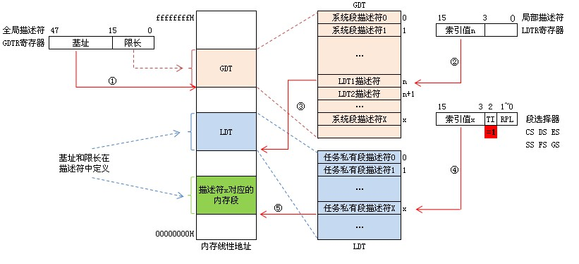

```
参考
http://blog.csdn.net/u013982161/article/details/52138155
```

## 一. 引入

保护模式下的段寄存器由 16位的选择器与64位的段描述符寄存器构成。

段描述符寄存器： 存储段描述符

选择器：存储段描述符的索引


PS：原先实模式下的各个段寄存器作为保护模式下的段选择器，80486中有6个(即CS,SS,DS,ES,FS,GS)80位的段寄存器。由选择器CS对应表示的段仍为代码段，选择器SS对应表示的段仍为堆栈段。

## 二. 详解

### 1、全局描述符表GDT（Global Descriptor Table）

全局描述符表GDT（段）存在内存中，寄存器GDTR存放GDT的入口。

全局描述符表GDT只有一张(**一个处理器对应一个GDT**)，GDT可以被放在内存的任何位置，但CPU必须知道GDT的入口，也就是基地址放在哪里，Intel提供了一个**寄存器GDTR用来存放GDT的入口地址**，程序员将GDT设定在内存中某个位置之后，可以通过LGDT指令将GDT的入口地址装入此寄存器，从此以后，CPU就根据此寄存器中的内容作为GDT的入口来访问GDT了。GDTR中存放的是GDT在内存中的基地址和其表长界限。

基地址指定GDT表中字节0在**线性地址空间**中的地址，表长度指明GDT表的字节长度值。

GDTR全局描述符寄存器：48位，高32位存放GDT基址，低16为存放GDT限长。

指令LGDT和SGDT分别用于加载和保存GDTR寄存器的内容。在机器刚加电或处理器复位后，基地址被默认地设置为0，而长度值被设置成0xFFFF。在保护模式初始化过程中必须给GDTR加载一个新值。

### 2、段选择符（Selector）

段寄存器存放段选择符。

由GDTR访问全局描述符表是通过“段选择符”（实模式下的段寄存器）来完成的。段选择符是一个16位的寄存器（同实模式下的段寄存器相同）


段选择子包括三部分：描述符索引（index）、TI、请求特权级（RPL）。

- index（描述符索引）部分表示所需要的**段的描述符在描述符表的位置**，由这个位置再根据在GDTR中存储的描述符表基址就可以找到相应的描述符。然后用描述符表中的段基址加上逻辑地址（SEL:OFFSET）的OFFSET就可以转换成线性地址。

- 段选择子中的TI值只有一位0或1，0代表选择子是在GDT选择，1代表选择子是在LDT选择。

- 请求特权级（RPL）则代表选择子的特权级，共有4个特权级（0级、1级、2级、3级）。

关于特权级的说明：任务中的每一个段都有一个特定的级别。每当一个程序试图访问某一个段时，就将该程序所拥有的特权级与要访问的特权级进行比较，以决定能否访问该段。系统约定，CPU只能访问同一特权级或级别较低特权级的段。

例如给出逻辑地址：21h:12345678h转换为线性地址

a. 选择符SEL=21h=0000000000100 0 01b 他代表的意思是：选择子的index=4即100b选择GDT中的第4个描述符；TI=0代表选择子是在GDT选择；左后的01b代表特权级RPL=1

b. OFFSET=12345678h若此时GDT第四个描述符中描述的段基址（Base）为11111111h，则线性地址=11111111h+12345678h=23456789h

### 3、段描述符（Segment Descriptor）

8个字节64位，每一个段都有一个对应的描述符。

根据描述符描述符所描述的对象不同，描述符可分为三类：储存段描述符，系统段描述符，门描述符(控制描述符)。在描述符中定义了段的基址，限长和访问内型等属性。其中基址给出该段的基础地址，用于形成线性地址；限长说明该段的长度，用于存储空间保护；段属性 说明该段的访问权限、该段当前在内存中的存在性，以及该段所在的特权级。

### 4、局部描述符表LDT（Local Descriptor Table）

局部描述符表LDT（段）存在内存中，描述这个的**描述符**存储在GDT中（也在内存中），对应这个描述符的选择符存储在寄存器LDTR中。

局部描述符表可以有若干张，每个任务可以有一张。我们可以这样理解GDT和LDT：GDT为一级描述符表，LDT为二级描述符表。如图


LDT和GDT从本质上说是相同的，只是LDT嵌套在GDT之中。由于LDT本身同样是一段内存，也是一个段，所以它也有个描述符描述它，这个描述符就存储在GDT中，对应这个描述符也会有一个选择子，LDTR装载的就是这样一个选择子。LDTR记录局部描述符表的起始位置，与GDTR不同，LDTR的内容是一个段选择子。

LDTR局部描述符寄存器：16位，高13为存放LDT在GDT中的索引值。

LDTR可以在程序中随时改变，通过使用lldt指令。如上图，如果装载的是Selector 2则LDTR指向的是表LDT2。

举个例子：如果我们想在表LDT2中选择第三个描述符所描述的段的地址12345678h。

1. 首先需要装载LDTR使它指向LDT2 使用指令lldt将Select2装载到LDTR

2. 通过逻辑地址（SEL:OFFSET）访问时SEL的index=3代表选择第三个描述符；TI=1代表选择子是在LDT选择，此时LDTR指向的是LDT2,所以是在LDT2中选择，此时的SEL值为1Ch(二进制为11 1 00b)。OFFSET=12345678h。逻辑地址为1C:12345678h

3. 由SEL选择出描述符，由描述符中的基址（Base）加上OFFSET可得到线性地址，例如基址是11111111h，则线性地址=11111111h+12345678h=23456789h

4. 此时若再想访问LDT1中的第三个描述符，只要使用lldt指令将选择子Selector1装入再执行2、3两步就可以了（因为此时LDTR又指向了LDT1）
 
由于每个进程都有自己的一套程序段、数据段、堆栈段，有了局部描述符表则可以将每个进程的程序段、数据段、堆栈段封装在一起，只要改变LDTR就可以实现对不同进程的段进行访问。

当进行任务切换时，处理器会把新任务LDT的**段选择符**和段描述符自动地加载进LDTR中。在机器加电或处理器复位后，段选择符和基地址被默认地设置为0，而段长度被设置成0xFFFF。

## 三、实例

### 1. 访问GDT


当TI=0时表示段描述符在GDT中，如上图所示：

①先从GDTR寄存器中获得GDT基址。

②然后再GDT中以段选择器高13位位置索引值得到段描述符。

③段描述符符包含段的基址、限长、优先级等各种属性，这就得到了段的起始地址（基址），再以基址加上偏移地址yyyyyyyy才得到最后的线性地址。

### 2. 访问LDT



当TI=1时表示段描述符在LDT中，如上图所示：

①还是先从GDTR寄存器中获得GDT基址。

②从LDTR寄存器中获取LDT所在段的位置索引(LDTR高13位)。

③以这个位置索引在GDT中得到LDT段描述符从而得到LDT段基址。

④用段选择器高13位位置索引值从LDT段中得到段描述符。

⑤段描述符符包含段的基址、限长、优先级等各种属性，这就得到了段的起始地址（基址），再以基址加上偏移地址yyyyyyyy才得到最后的线性地址。

## 四、扩展

除了GDTR、LDTR外还有IDTR和TR

### 1、中断描述符表寄存器IDTR

与GDTR的作用类似，IDTR寄存器用于存放中断描述符表IDT的32位线性基地址和16位表长度值。指令LIDT和SIDT分别用于加载和保存IDTR寄存器的内容。在机器刚加电或处理器复位后，基地址被默认地设置为0，而长度值被设置成0xFFFF。

### 2、任务寄存器TR

TR用于寻址一个特殊的任务状态段（TaskState Segment，TSS）。TSS中包含着当前执行任务的重要信息。

TR寄存器用于存放当前任务TSS段的16位段选择符、32位基地址、16位段长度和描述符属性值。它引用GDT表中的一个TSS类型的描述符。指令LTR和STR分别用于加载和保存TR寄存器的段选择符部分。当使用LTR指令把选择符加载进任务寄存器时，TSS描述符中的段基地址、段限长度以及描述符属性会被自动加载到任务寄存器中。当执行任务切换时，处理器会把新任务的TSS的段选择符和段描述符自动加载进任务寄存器TR中。