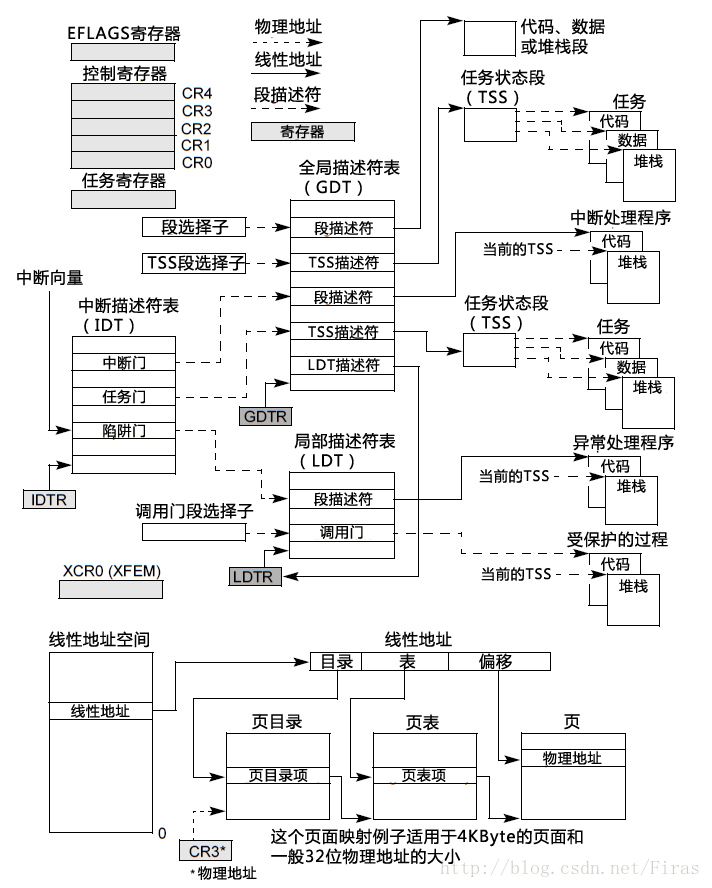
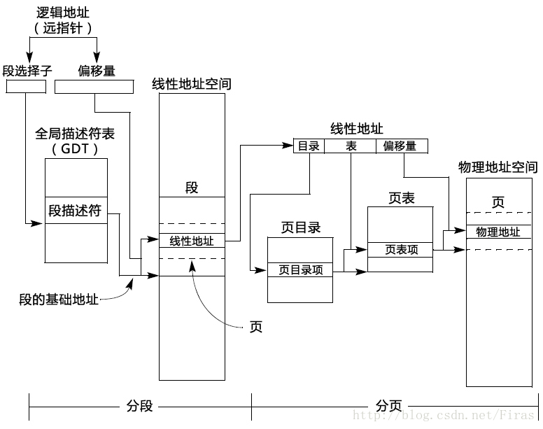
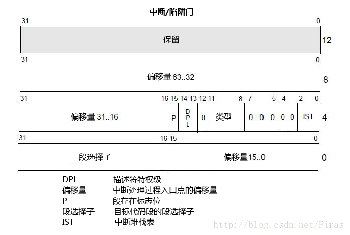
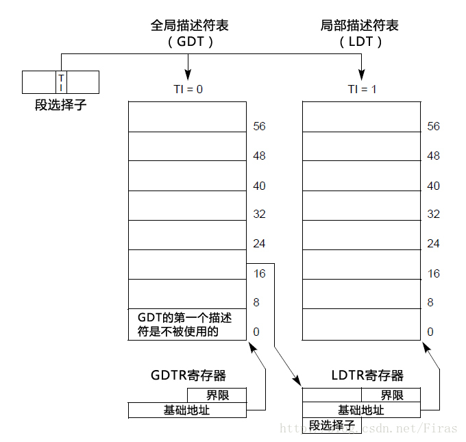

[TOC]

- 1 基本概念
    - 1.1 Segment Selector(段选择子)
    - 1.2 Segment Selector Register（段寄存器）
    - 1.3 Descriptor Table（描述符表）
    - 1.4 Segment Descriptor（段描述符）
- 2 分段数据结构
    - 2.1 IA\-32系统级寄存器和数据结构
    - 2.2 内存管理寄存器
    - 2.3 分段和分页
    - 2.4 逻辑地址到线性地址的翻译
    - 2.5 段选择子
    - 2.6 32位段描述符
    - 2.7 32位调用门描述符
    - 2.8 64位调用门描述符
    - 2.9 32位IDT门描述符
    - 2.10 64位中断/陷阱门
    - 2.11 32位TSS
    - 2.12 64位TSS/LDT描述符
    - 2.13 全局描述符和局部描述符
    - 2.14 描述符表描述符格式

https://blog.csdn.net/firas/article/details/17207353

翻译自《Intel® 64 and IA-32 Architectures Software Developer Manuals》

# 1 基本概念

## 1.1 Segment Selector(段选择子/段选择符)

段选择符是逻辑地址的一个组成部分, 用于索引段描述符表以获得该段对应的段描述符.

Segment Selector结构是16位(恒16位！！！)，它是一个段的标识符，结构如下。

- RPL（Requested Privilege Level）：请求**访问者**所使用的权限级别，**从0到3级**。
- TI（Table Indicator）：描述符表索引位。当**TI=0**时，从**GDT**查找；当**TI=1**时，从**LDT**查找。
- Index（Descriptor Index）：这是Descriptor在GDT/LDT中的序号，根据TI的值在相应的描述表中查找descriptor。

注意，**段选择子不是段寄存器，不能混为一谈， 段选择子是一个数值，只有16位，段寄存器是寄存器，128位或96位, 其可见部分等于段选择子(！！！**)

由图上可以看到通过段选择子只能选择LDT或GDT, **不会包括IDT**.

段选择子是**逻辑地址的一部分**, **对程序是可见**的. 但通常**段描述符的修改**和**分配**由**连接器**和**加载器完成**, 而**不是应用程序本身(！！！**).

## 1.2 Segment Selector Register（段寄存器）

为了使CPU能快速获得段选择符, x86架构提供了6个段寄存器(segment register)用于存放**当前程序**的**各个段的段选择符**. 分别是:

- DS(data\-segment, 数据段): 存放数据段的段选择子.
- CS(code\-segment, 代码段): 存放代码段的段选择子.
- SS(Stack\-segment, 栈段): 存放栈的段选择子.
- ES、FS、GS: 供程序自由使用, 可以存放额外的3个数据段的段选择符.

通常程序只使用CS、DS、SS这三个段寄存器.

段寄存器有时被表述为**段选择子寄存器**, **恒16位**, 包括两大部分：**visible（可视部分**）与**invisible（不可视部分**）。

如图所示，灰色部分是不可视部分，**只有Selector域是可视部分**。不可视部分隐藏在寄存器内部只有处理器可用，有时也被称为Cache部分。

**段寄存器的base域**在**64位**模式下被扩展为**64位**，对于**CS、ES、SS和DS(！！！**)寄存器来说这个64位的基值没什么意义。在**64位模式**下，这些**段的基值都被强制为0值(！！！一旦往这几个段寄存器加载selector， 发现是这几个寄存器, 不读取GDT或LDT, 直接加载base位0！！！**)。

**64位的段基值**对于**FS和GS寄存器**来说才有意义，**FS和GS寄存器(！！！**)可以由**软件设置非0的64位值**。

**使用代码段或数据段描述符(！！！这两种描述符在64位下还是8字节大小， base还是32位！！！**)的加载方法，只能加载一个**32位的base值**，在x64体系中，新增了**两个MSR寄存器**：**IA32\_FS\_BASE**和**IA32\_GS\_BASE**。它们分别映射到**FS.base**和**GS.base**。

## 1.3 Descriptor Table（描述符表）

**Segment Selector**用于在**Descriptor Table（描述符表**）里查找**descriptor（描述符**），在x86中有**三类描述符表**：**GDT（Global Descriptor Table**），**LDT（Local Descriptor Table**）和**IDT（Interrupt Descriptor Table**）。

这些descriptor table由**descriptor table register（描述符表寄存器**）进行定位，因此，**三种描述符表**就对应着**三种描述符表寄存器**：**GDTR**，**LDTR**和**IDTR**。

由2.1的图可知, 所有的**描述符表寄存器**存放的**描述符表的地址**都是**线性地址(！！！**), 应该是由于历史原因为了兼容.

## 1.4 Segment Descriptor（段描述符）

段描述符只是众多描述符中的一类，描述符有**两大类**：**Segment Descriptor（段描述符**）和**Gate Descriptor（门描述符**）。按**系统性质**来分，可以分为：**System Descriptor（系统描述符**）和**Code/Data Descriptor（非system描述符**）。

下面是笔者对Descriptor按系统性质的分类。

- **System descriptor（系统描述符**）。
    - **System Segment descriptor（系统段描述符**）：包括**LDT descriptor**和**TSS descriptor**。
    - **Gate descriptor（门描述符**）：包括**Call\-gate**，**Interrupt\-gate**，**Trap\-gate**，以及**Task\-gate descriptor**。
- **Non\-system segment descriptor（非系统描述符**）。
    - **Code segment descriptor（代码段描述符**）。
    - **Data segment descriptor（数据段描述符**）。

Descriptor的**S域**指示了**描述符的类型**，当**S=0**时，属于**系统级的描述符**，**S=1**时，属于**Code/Data类描述符**。

在**legacy模式**下，**每个描述符**是**8字节64位宽(！！！**)，在**long mode**（包括**compatibility模式**）下，**所有的gate描述符**是**16字节128位宽**，而**Code/Data段描述符**依然是**8字节宽(！！！**)。

- **LDT/TSS描述符**在**64位模式**下是**16字节128位宽(！！！**)，而在**compatibility模式**下依然是**8字节64位宽(！！！**)。

**LDT和TSS**在系统中可能有**很多个**, 所以需要在**GDT**中添加**每个LDT**和**每个TSS的描述符**, 用来查找. 而**IDT是没有描述符**的, 因为**IDT在系统中就只有一个**, **IDTR指向**就可以, 永远不变,  **不需要在GDT中存在一个IDT的描述符**.

当要使用这些**LDT**时，可以用它们的**选择子(32位下TSS中有一个LDT段选择符！！！**)来访问GDT，将**LDT描述符**加载到LDTR寄存器。

- **所有gate描述符**在64位模式下都是**16字节128位宽**的. 包括**Call\-gate descriptor**，**Interrupt\-gate descriptor**和**Trap\-gate descriptor**. **在Interrupt/Trap\-gate描述符里增加了一个IST域**，可以为interrupt handler提供**额外的stack指针**，当**IST值为非0**时，IST值用来在**当前TSS块**里查找**相应的stack指针值**。值得注意的是，在**long\-mode**下并**不存在Task\-gate描述符**，基于**TSS的任务切换机制将不再支持**。

**中断门和陷阱门描述符都只允许存放在IDT内（！！！**），**任务门可以位于GDT、LDT和IDT中（！！！**）

通过**中断门进入中断服务程序**时cpu会**自动将中断关闭**，也就是将**cpu中eflags寄存器中IF标志复位**，防止嵌套中断的发生, 返回后恢复；而通过**陷阱门进入服务程序**时则维持**IF标志不变**。 这是**中断门与陷阱门的唯一区别(！！！**)

- **Code segment descriptor（代码段描述符**）和**Data segment descriptor（数据段描述符**）在64位模式下仍然是**8字节64位宽(！！！**), 不过**大部分域或属性无效**.

各种描述符选择的触发方式很复杂, 详见相关文章.

# 2 分段数据结构

## 2.1 IA\-32和IA\-32e系统级寄存器和数据结构

IA\-32e:

## 2.2 内存管理寄存器

## 2.3 分段和分页

## 2.4 逻辑地址到线性地址的翻译

## 2.5 段选择子

## 2.6 32位段描述符

## 2.7 32位调用门描述符

**使用描述符中的offset域, 不使用指令中给出的偏移量(！！！**)

## 2.8 64位调用门描述符

**使用描述符中的offset域, 不使用指令中给出的偏移量(！！！**)

## 2.9 32位IDT门描述符

## 2.10 64位中断/陷阱门

## 2.11 32位TSS

## 2.12 64位TSS/LDT描述符

## 2.13 全局描述符和局部描述符

## 2.14 描述符表描述符格式

