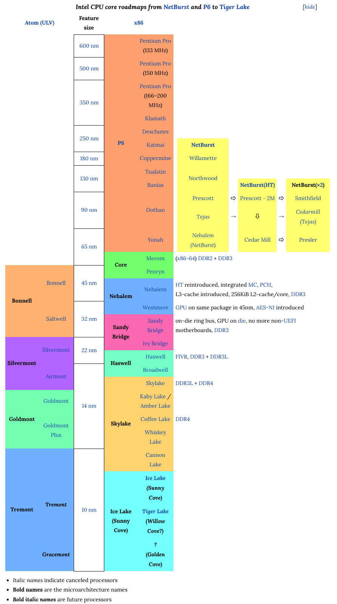

<!-- @import "[TOC]" {cmd="toc" depthFrom=1 depthTo=6 orderedList=false} -->

<!-- code_chunk_output -->

* [1 微处理器发展模式](#1-微处理器发展模式)
	* [1.1 Tick\-Tock模式](#11-tick-tock模式)
	* [1.2 Process\-Architecture\-Optimization模式](#12-process-architecture-optimization模式)
* [2 产品发布路线图](#2-产品发布路线图)
* [3 P6](#3-p6)
* [4 Core](#4-core)
* [5 Nehalem](#5-nehalem)
* [参考](#参考)

<!-- /code_chunk_output -->

# 1 微处理器发展模式

## 1.1 Tick\-Tock模式

Tick-Tock是Intel公司发展微处理器芯片设计制造业务的一种发展战略模式，在2007年正式提出。

Intel指出，每一次处理器**微架构(microarchitecture**)的更新和每一次**芯片制程**的更新，它们的时机应该错开，使他们的微处理器芯片设计制造业务更有效率地发展。“Tick-Tock”的名称源于时钟秒针行走时所发出的声响。

Intel指出，

- 每一次“**Tick**”代表着一代微架构的**处理器芯片制程**的更新，意在处理器性能几近相同的情况下，缩小芯片面积、减小能耗和发热量, 有时候也会引入新的指令, 比如2014年末的Broadwell；
- 而每一次“**Tock**”代表着在上一次“Tick”的芯片制程的基础上，更新**微处理器架构**，提升性能, 原来是每次tock定义一个新的微体系架构。但在进入 14nm 时明显碰壁, 2014年时候, 在Intel以微架构的较小更新的形式创建了tock(当时是Haswell)的新概念"tock refresh(当时是Haswell Refresh"), 其以改进Haswell为主, 不将其认为是新一代架构. 

一般一次“Tick-Tock”的周期为两年，“Tick”占一年，“Tock”占一年。

此策略常被许多计算机玩家戏称“挤牙膏策略”，因为每一代新处理器性能和前一代处理器性能的差距很短，就好像Haswell的4790K和Skylake的6700K那样

## 1.2 Process\-Architecture\-Optimization模式

2016年3月22日，Intel在 [Form 10-K](https://www.wikiwand.com/en/Form_10-K) 报告中宣布, 弃用"Tick\-Tock"模式, 采用三步"Process\-Architecture\-Optimization"模式, 即"制程、架构、优化". 具体来讲, 将Tick Tock放缓至三年一循环，即增加优化环节，进一步减缓实际更新的速度。

在此模式下, 三代处理器都将是同一个制程流程下生产, 三代中第三代专注于优化(Optimization).

举例, Process是Broadwell(代表14nm第一代), Architecture是Skylake(代表这个微架构的第一代, 但是制程还是14nm), 第一代优化(Optimization)是Kaby Lake. 第二代优化是Coffee Lake, 在14nm上共生产了4代. 这些名称称为code name.

当前的环节为：Process, Architecture, Optimization，即制程、架构、优化

- 制程：在架构不变的情况下，缩小晶体管体积，以减少功耗及成本
- 架构：在制程不变的情况下，更新处理器架构，以提高性能
- 优化：在制程及架构不变的情况下，进行修复及优化，将BUG减到最低，并提升处理器时脉

# 2 产品发布路线图

Intel的微处理器架构路线图, 从NetBurst以及P6到Tiger Lake

# 3 P6

[P6](https://www.wikiwand.com/en/P6_(microarchitecture)) 是 Intel 在1995年推出的**第六代微架构**，它的后继者是2000年的 NetBurst微架构，但是最后在Pentium M之间又出现P6的踪影。而Pentium M的P6的后继者则是Intel Core微架构。

最早用于 **1995** 年的 Pentium Pro 处理器，后面 2000 的 NetBurst 感觉应该也算是包含在 P6 这个大系列里面，一直到 2006 年的 Core 为止。

这个横跨了将近 10 年的架构系列最早是 600nm 的工艺，一直到最后达到了 65nm，算是不断摸索完善出来的，也是 Intel 走上比较规则的架构发展之路的一个起点。

P6 相对于之前的架构加入了很多新的技术：

- 预测执行（Speculation）和乱序执行！！！
- 14级流水线，第一代奔腾的流水线只有 5 级，P6 的 14 级在当时是最深的
- 片内的 L2 cache！！！
- 物理地址扩展，达到最大36位，理论上这个位宽最大可以支持到 64G 的内存（虽然制程的地址空间还是只能用到 4G）
- 寄存器重命名！！！
- MMX 和 SSE 指令集扩展，开始 SIMD 的思路了

以上这些都是现代处理器中非常重要的设计。

更重要的是从这里开始，奠定了 Intel 沿着摩尔定律发展的 Tick-Tock 架构演进道路：

- Tick 改进制程工艺，微架构基本不做大改，重点在把晶体管的工艺水平往上提升
- Tock 改进微架构设计，保持工艺水平不变，重点在用更复杂、更高级的架构设计

然后就是一代 Tick 再一代 Tock，交替演进。

P6 的末尾阶段，首次出现了双核，当时的双核还是基本上像是把两个单核用胶水粘在一起的感觉。

具体可以参见相关维基

P6中文维基: https://zh.wikipedia.org/wiki/P6%E5%BE%AE%E6%9E%B6%E6%A7%8B

# 4 Core

最早的名字里面带 Core 这个牌子的处理器是 Core Duo，它的架构代号是 Yonah，其实还是算是个 NetBurst 的改版，只是跟后期的 NetBurst 走向了不同的发展道路，虽然名字上有 Core 但不是 Core 架构。主要的设计目标是面向移动平台，因此很多设计都是偏向低功耗，高能效的。

再后来的 Core 2 Duo 才是采用 Core 架构的新一代处理器，全线 65nm，然后微架构在 Yonah 之上做了比较大的改动。

Core 架构把 NetBurst 做深了的流水线级数又砍下来了，**主频**虽然降下来了（而且即使后来工艺提升到 45nm 之后也没有超过 NetBurst 的水平），但是却**提高了整个流水线中的资源利用率**，所以性能还是提升了；把奔腾4上曾经用过的超线程也砍掉了；对各个部分进行了强化，双核共享 L2 cache 等等。

从 **Core** 架构开始是**真的走向多核**了，就不再是以前“胶水粘的”伪双核了，这时候已经有最高 4 核的处理器设计了。

# 5 Nehalem

# 参考

- Intel官方Tick\-Tock模式主页: https://www.intel.com/content/www/us/en/silicon-innovations/intel-tick-tock-model-general.html
- Intel 处理器架构演进: http://jcf94.com/2018/02/13/2018-02-13-intel/
- Tick-Tock维基百科: https://www.wikiwand.com/en/Tick%E2%80%93tock_model
- 中文Tick-Tock维基: https://zh.wikipedia.org/wiki/Intel_Tick-Tock
- Intel微处理器列表: https://zh.wikipedia.org/wiki/%E8%8B%B1%E7%89%B9%E5%B0%94%E5%BE%AE%E5%A4%84%E7%90%86%E5%99%A8%E5%88%97%E8%A1%A8

