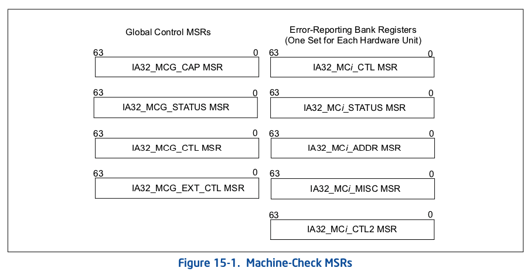
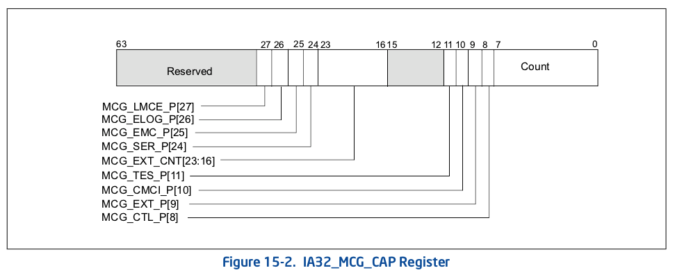

<!-- @import "[TOC]" {cmd="toc" depthFrom=1 depthTo=6 orderedList=false} -->

<!-- code_chunk_output -->

* [1 概述](#1-概述)
* [2 Machine Check MSR](#2-machine-check-msr)
	* [2.1 IA32\_MCG\_CAP MSR](#21-ia32_mcg_cap-msr)
	* [2.2 IA32\_MCG\_STATUS MSR](#22-ia32_mcg_status-msr)
* [参考](#参考)

<!-- /code_chunk_output -->

# 1 概述

Intel从奔腾4开始的CPU中增加了一种机制，称为MCA——Machine Check Architecture，它用来**检测硬件**（这里的Machine表示的就是硬件）错误，比如系统总线错误、ECC错误、奇偶校验错误、缓存错误、TLB错误等等。不仅硬件故障会引起MCE，不恰当的BIOS配置、firmware bug、软件bug也有可能引起MCE。

这套系统通过**一定数量的MSR**（Model Specific Register）来实现，这些MSR分为两个部分，一部分用来**进行设置**，另一部分用来**描述发生的硬件错误**。

当CPU检测到**不可纠正的MCE（Machine Check Error**）时，就会触发\#MC（**Machine Check Exception**, 中断号是十进制18），通常**软件**会**注册相关的函数**来处理\#MC，在这个函数中会通过读取MSR来收集MCE的错误信息，然后重启系统。当然由于发生的**MCE**可能是**非常致命**的，**CPU直接重启**了，没有办法完成MCE处理函数；甚至有可能在MCE处理函数中又触发了不可纠正的MCE，也会导致系统直接重启。

发现硬件错误时触发的异常(exception)，中断号是18，异常的类型是abort：

当然CPU还会检测到**可纠正的MCE**，当可纠正的MCE数量**超过一定的阈值**时，会触发**CMCI（Corrected Machine Check Error Interrupt**），此时软件可以捕捉到该中断并进行相应的处理。CMCI是在MCA之后才加入的，算是对MCA的一个增强，在此之前软件只能通过轮询可纠正MCE相关的MSR才能实现相关的操作。

# 2 Machine Check MSR

上图基本包含了MCA相关的所有MSR。

它分为左右两个部分，左边的是全局的寄存器，右边表示的是多组寄存器。

i表示的是各个组的Index。这里的组有一个称呼是Error Reporting Register Bank。

MCA通过若干Bank的MSR寄存器来表示各种类型的MCE。

下面简单介绍一下这些寄存器。

## 2.1 IA32\_MCG\_CAP MSR

这个MSR描述了当前CPU处理MCA的能力，具体每个位的作用如下所示：

BIT0-7：表示的是CPU支持的**Bank的个数**；

BIT8：1表示IA32_MCG_CTL有效，如果是0的话表示无效，读取该IA32_MCG_CTL这个MSR可能发生Exception（至少在UEFI下是这样）；

BIT9：1表示IA32_MCG_EXT_CTL有效，反之无效，这个与BIT8的作用类似；

BIT10：1表示支持CMCI，但是CMCI是否能用还需要通过IA32_MCi_CTL2这个MSR的BIT30来使能；

BIT11：1表示IA32_MCi_STATUS这个MSR的BIT56-55是保留的，BIT54-53是用来上报Threshold-based Error状态的；

BIT16-23：表示存在的Extended Machine Check State寄存器的个数；

BIT24：1表示CPU支持Software Error Recovery；

BIT25：1表示CPU支持增强版的MCA；

BIT26：1表示支持更多的错误记录（需要UEFI、ACPI的支持）；

BIT27：1表示支持Local Machine Check Exception；

## 2.2 IA32\_MCG\_STATUS MSR

该MSR记录了**MCE发生时CPU的状态**，主要的BIT位介绍如下：

- Bit 0: Restart IP Valid. 表示程序的执行是否可以在被异常中断的指令处重新开始。
- Bit 1: Error IP Valid. 表示被中断的指令是否与MCE错误直接相关。
- Bit 2: Machine Check In Progress. 表示 machine check 正在进行中。
- bit 3: 设置后说明生成本地machine\-check exception. 这表示当前的机器检查事件仅传递给此逻辑处理器。

# 参考

- https://blog.csdn.net/jiangwei0512/article/details/62456226
- Intel手册卷3第15章(CHAPTER 15 MACHINE-CHECK ARCHITECTURE)、16章(CHAPTER 16 INTERPRETING MACHINE-CHECK ERROR CODES)
- 怎么诊断MACE: http://linuxperf.com/?p=105