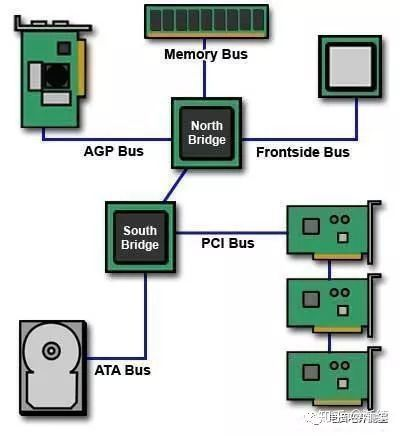

<!-- @import "[TOC]" {cmd="toc" depthFrom=1 depthTo=6 orderedList=false} -->

<!-- code_chunk_output -->

* [1 FSB(Front Side Bus)](#1-fsbfront-side-bus)
* [2 HT LINK](#2-ht-link)
* [3 QPI LINK(Quick Path Interconnect)](#3-qpi-linkquick-path-interconnect)
* [4 Infinity Fabric](#4-infinity-fabric)
* [5 UPI(Ultra Path Interconnect)](#5-upiultra-path-interconnect)
* [参考](#参考)

<!-- /code_chunk_output -->

CPU到现在发展已经经过了40个年头，而牙膏厂也在今年推出了8086K牙膏厂40周年cpu纪念版，用来纪念第一颗8086CPU。而CPU总线也经历了好多代的更迭，以牙膏厂为例，CPU的总线从FSB进化到QPI，而AMD则是FSB进化为HT LINK，一直到现在的GMI总线。那么今天就让我们来看看这些总线吧。

# 1 FSB(Front Side Bus)

熟悉电脑的老朋友都知道，**老的主板**是分**南北桥**的。

而**CPU**想要和**内存通信**的话，就要通过**北桥**来进行，即**CPU\-北桥\-内存**。而**CPU和北桥**的这个**通信总线就是FSB**。

在早期的时候，**CPU的外频**和**FSB的频率保持同步**。即**外频频率=FSB频率**，举例赛扬300A的**外频为66MHz**，那么它的**FSB频率也是66MHz**。

而到了**奔腾4时代**，**FSB总线速度**已经**无法满足CPU的带宽需求**，于是牙膏厂引入了**Quad Pumped Bus**技术，让**FSB**在**一个周期**内可以传输**四倍的数据**。这就是我们最熟悉的计算方式了：**FSB频率**=**外频频率x4**，比如**333MHz的外频的CPU**，其**FSB频率为1333MHz**。大大扩展了**CPU与北桥的传输速度**。

而**FSB早期**不仅仅用于**CPU和北桥通信**，牙膏厂早期的胶水**双核**也是通过**FSB总线来进行数据交换**的。因为牙膏厂只是简单的把**两个die**封装到了**一个chip**上，所以**CPU之间**想要**通信**必须经过**北桥！！！来进行**。早期的AMD也是使用FSB总线。

# 2 HT LINK

这是AMD在K8处理器上首次提出的总线结构，也叫HyperTransport。AMD提出的最早时间是1999年，后来这个阵营里有NV,ATI,IBM等大佬支持。HT总线技术对外开放，而改进则由联盟内的大佬进行。而HT总线具有恐怖的传输速率。最早的1.0版本推出时间是2001年，它的双向传输速率最大就达到了12.8GB/s，虽然AMD用的单路16位远远没有达到这个速度。而同时期的牙膏厂还在使用FSB总线，533MHz下只有4.3GB/s的传输带宽。而HT总线有多个版本，最后的HT3.1总线发布于2008年，最大带宽为51.2GB/s。这个数据即便放到今天也是很可怕的。而HT总线同样不仅仅用于和内存通信，AMD的多路CPU之间也在使用，而思科更是把HT总线丢到了路由器和交换机上，大大提升了交换机的多路传输性能，而AMD也是最早把内存控制器集成在CPU内的厂家。

# 3 QPI LINK(Quick Path Interconnect)

QPI的全称是**快速通道互联**，其实QPI总线在早期已经用于**安腾(Itanium**)以及**至强(Xeon**)平台上，用于取代老旧的**FSB**。而下放到**桌面级**则是从**第一代Nehalem处理器**上。一直到今天我们用的8700K，全部是基于QPI总线来进行通信。

和**HT LINK**一样，QPI总线一样是**点对点通信**，用于**CPU**，**北桥**，**南桥**之间的**点对点连接**。而它的速度也已经远远超越了FSB总线，以末代的1600MHz的FSB为例，它的传输速度为**12.8GB/s**，而**初版的QPI总线**就达到了**25.6GB/s**，相比上一代直接翻了一倍，而到了**SNB**上，内置CPU**内存控制器的总线**依旧是由**QPI总线衍生**而来，只不过由于是环形总线，不仅大大提升了速度，也保持了缓存的一致性。而和**南桥之间的通信**一直用的都是**DMI总线**。

在英特尔Nehalem微架构上，QPI是其中‘uncore’的组成部分。

# 4 Infinity Fabric

其实第一次听说这个新总线的时候，新闻上把它叫做GMI总线，而正式定名则是在AMD的ZEN处理器发布的PPT上，命名为Infinity Fabric，而我们更多的时候叫它CCX总线。其实Infinity Fabric并不是什么深奥的东西，它由HT总线衍生而来，但是相比HT总线技术对外开放，Infinity Fabric总线则是AMD的专利技术，你想用，先交授权费。Infinity Fabric可以说是AMD这个时代的基石，它的传速速率从30GB/s到512GB/s，并且不和HT总线兼容。Infinity Fabric分为SCF和SDF。SDF负责数据传输，而SCF则负责控制传输命令。SDF部分就是HT总线衍生的产物了。而Infinity Fabric和HT总线一样，也不仅仅限制于CPU上进行使用，包括CPU，GPU，APU这些都可以使用，只不过它们的SDF层是不一样的。不过在最新的APU上，CPU和GPU之间仍旧使用的PCI-E总线互联，并没有见到CCX总线，也许这一代APU仅仅只是AMD赶工的产物，希望下一代可以看到完全体的APU。

# 5 UPI(Ultra Path Interconnect)

# 参考

- 本文来自知乎专栏, 链接: https://zhuanlan.zhihu.com/p/38984035?utm_source=wechat_session&utm_medium=social&utm_oi=50718148919296
- QPI: https://zh.wikipedia.org/wiki/%E5%BF%AB%E9%80%9F%E9%80%9A%E9%81%93%E4%BA%92%E8%81%94
- CPU的快速互联通道(QPI)详解: https://blog.csdn.net/Hipercomer/article/details/27580323
- 注意看维基百科下面的资料源
- Intel 快速通道互联简介: https://www.intel.cn/content/www/cn/zh/io/quickpath-technology/quick-path-interconnect-introduction-paper.html