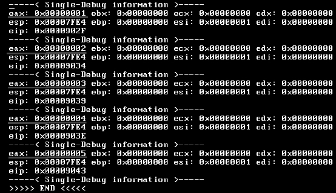

显然**eflags.RF标志**与**eflags.TF标志**是配合**一起使用**的，当**TF标志被置位**时，就代表**开启了single\-debug（单步调试**）功能，处理器将**进入single\-debug状态**。

>什么时候开始进入single\-debug？

答案是：当**TF标志被置位**，**执行完下一条指令(！！！**)后，处理器**进入\#DB处理**。这是因为**single\-debug**属于**trap类型的\#DB异常**。看看下面的指令序列。

```assembly
; 开启 single debug功能
      pushfd
      bts dword [esp]，8            ;eflags.TF=1
      popfd                         ;更新 eflags 寄存器
      mov eax，1                    ;test 1
      mov eax，2                    ;test 2
      mov eax，3                    ;test 3
      mov eax，4                    ;test 4
      mov eax，5                    ;test 5
```

**popfd**指令执行完后，将**更新TF标志为1**，那么应该是**在test 1之前还是之后呢**？答案是**test 1之后（test 2之前**），是在**TF被置位后**的**下一条指令执行完后(！！！**)产生\#DB异常。

处理器在**进入\#DB异常处理程序之前**，会将**TF标志清0**以防止在**中断处理程序内发生single\-deubg**，这是显而易见的事情，**RF标志也会被清0**。在进入中断处理程序前，**NT和VM标志都会得到清0**。

那么，在压入单步调试\#DB处理程序**stack内**的**eflags寄存器**中**TF是原来的值（即为1**），**RF标志被清0**。


看看上图：当**popf指令执行完毕后**，**TF被置1**，**第1条mov指令执行完毕**，**产生\#DB异常**，CPU**进入\#DB处理程序后清TF和RF标志**，而**在\#DB处理程序里**，在**iret指令返回前**，应该**将stack中的RF标志置为1(stack中的！！！**)，以确保**返回到被中断的指令时能顺利执行**。**iret指令**将pop回stack中**原来的eflags值**。

当**第2条mov指令执行完毕后**，CPU将**清RF标志为0**，处理器重新**转入到\#DB处理程序**中执行。除非TF标志被清0，否则重复上一流程。

由于**引发\#DB异常**的**不止single\-debug（单步调试**）这一途径。\#DB异常可以是**Fault类型**或是**Trap类型**，因此，**在\#DB异常处理程序**中有责任去**确保返回被中断的执行能够得到正常执行**。通过**设置stack中的eflags**映像中的**RF为1**，让**iret返回前更新eflags寄存器**。

处理器会在**每一条指令执行完毕后**将**RF标志清0**，RF标志的值基本上恒为0。

>实验5-3：实现一个single\-debug例子

正如前面所列代码，我们是这样开启和测试TF、RF以及\#DB处理程序的。

代码清单5-4（topic05\ex5-3\protected.asm）：

```assembly
; 开启 single debug 功能
        pushfd
        bts dword [esp]，8        ;eflags.TF=1
        popfd                     ;更新 eflags 寄存器
        mov eax，1                ;test 1
        mov eax，2                ;test 2
        mov eax，3                ;test 3
        mov eax，4                ;test 4
        mov eax，5                ;test 5
```

我们测试了这5条mov指令产生single\-debug的情况，为了方便观察演示，这5条mov指令只是给eax赋一个序号。我们需要**实现自己的\#DB处理程序**，完整的源代码在topic05\ex5-3\protected.asm里。

```assembly
DB_HANDLER_VECTOR               equ     1

;; 设置 #DB handler
        mov esi, DB_HANDLER_VECTOR
        mov edi, DB_handler
        call set_interrupt_handler
```

Intel规定\#DB固定使用向量号1, 属于Trap或Fault, 任何代码或数据引用或INT 1指令触发.

在这里, **触发过程是处理器自动触发的**, 自动到IDT里面**查找向量号是1的中断描述符**, 从而得到中断处理程序, 但是**中断处理程序得自己实现**, 上面就是调用set\_interrupt\_handler去设置中断描述符的, esi和edi都是参数, 分别是中断向量号和中断处理程序入口.



上面是实验5-3的运行结果，**每进入\#DB处理程序**一次就**打印相关的信息**。请留意画线**标注的eax寄存器的值**，这正是我们给eax寄存器进行mov操作后的值。说明在每执行一条mov指令后产生了\#DB异常，这就是单步调试的结果。而eip是这些mov指令执行状态的当前值。其他的寄存器值都是不变的。

实际上，在这个例子里，**RF标志置不置位对结果没影响**，那是因为**由single\-debug引起**的\#DB属于**trap类型的异常**！它会返回到被中断指令的下一条指令。

然而不要以这个例子为准而认为不需要将RF置位，由其他中断源产生的\#DB异常可能是fault类型的，fault类型的异常会返回中断指令再尝试重新执行。