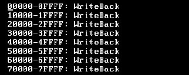
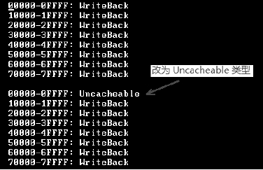
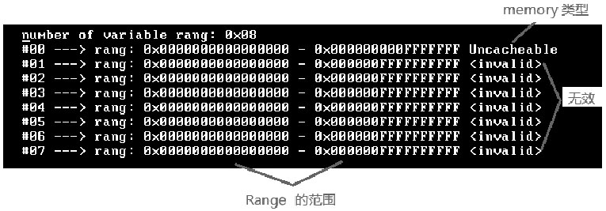

<!-- @import "[TOC]" {cmd="toc" depthFrom=1 depthTo=6 orderedList=false} -->

<!-- code_chunk_output -->

* [0 概述](#0-概述)
* [1 Fixed\-range区域的映射](#1-fixed-range区域的映射)
* [2 MTRR的功能寄存器](#2-mtrr的功能寄存器)
	* [2.1 Variable区域的定义](#21-variable区域的定义)

<!-- /code_chunk_output -->

# 0 概述

先关注**MTRR（Memory Type Range Register**），MTRR的作用是**将memory物理地址划分某些区域**，并且可以**为这些区域定义不同的memory类型**，如下表所示。


这些值的作用是在MTRR里为**range**定义相关的**memory类型**。

>memory中可以划分哪些区域？

可以划分为**3种区域**：**fixed（固定的**），**variable（可变的**）以及**default（默认的**），当memory中**不划分fixed和variable区域**时，这时候**memory就是default的区域**：


如上所示，在整个物理memory中可以划分3种区域形式，**MAXPHYADDR**的值提供了**最高的物理memory数量**，它由CPUID.EAX=80000008H.EAX[7：0]中获得，这个值最高是52位，一般要么是36要么是40位。

上面是Intel处理器上的结构，在AMD的机器上这个最大的区域空间是52位。

在笔者的测试结果中显示，在AMD的机器上是0000FFFF_FFFFFFFFH（即使用CPUID.EAX=80000008H返回的最大物理地址结果值不是52位）而在Intel的机器上是MAXPHYADDR值（注：这是在笔者的有限条件测试下的结论。如果您有不同的测试结果，确认无误后就以您的结论为准），在AMD中最高实现8个variable-rang区域。

# 1 Fixed\-range区域的映射

Fixed区域只能定义在memory中的最低1M空间（从00000H到FFFFFH）里，由11个Fixed映射的MTRR来映射，如下表所示。


每个寄存器固定映射8个区域，那么共有88个Fixed-range可以映射。以IA32_MTRR_FIX64_00000寄存器为例看看是如何映射的，如下图所示。


64位的寄存器划分为8个域，每个域固定对应1个Fixed-range区域。每个域8位宽，可以为这些Fixed-range内存区域定义相关的memory类型（这个memory类型值就是前面表格中的编码值）。例如定义06H是WriteBack（WB）类型。

>实验7-1：测试Fix64K区域的memory类型

这个实验只是简单地输出Fix64K区域里的8个range的类型，完整的源码在topic07\ex-1\目录下，请读者自行阅读，下面是测试的结果。



00000～7FFFF的512K区域里memory的类型都是WriteBack（WB），这些memory类型在BIOS里已经设置好了。当然，我们可以改写这些memory的类型，我们再改一改实验的源代码，将第1个64K区域改为Uncacheable类型，显示的结果如下。



现在我们已经将第1个64K的区域成功改为Uncacheable类型。

代码清单7-1（topic07\ex7-1\protected.asm）：

```assembly
mov ecx，250H
rdmsr
mov edi，edx
mov esi，eax
mov ebx，eax
call dump_fixed64K_range
mov bl，00h                                        ； 将 byte 0 改为 Uncacheable 类型
mov eax，ebx
wrmsr                                               ； 写回 IA32_MTRR_FIX64K_00000 寄存器
call println
rdmsr                                               ； 再重新读出来
mov esi，eax
mov ebx，eax
call dump_fixed64K_range                       ； 打印信息
```

代码里，分两次打印Fixed-range区域的内存类型，第2次将第1个64K区域的内存类型改为00h值（也就是Uncacheable类型）。

# 2 MTRR的功能寄存器

在使用MTRR前应开启MTRR功能相应的Enable位。下面的这个IA32_MTRRCAP寄存器将指示处理器支持哪些MTRR功能，如下所示。


IA32\_MTRRCAP寄存器（地址是FEH）是只读寄存器，VCNT域（bit 7到bit 0）指示可以设置和使用的Variable-range寄存器数量。当前的Intel实现了最高10个variablerange区域。

每个处理器家族实现会不一样，在笔者的机器上属于06_25H家族（Westmere架构）已实现了10对PHYSBASE/PHYSMASK寄存器，表示可以完整支持10个variable-range。

bit 8，bit 10和bit 11分别是Fixed-range，WC内存类型以及SMRR功能的支持位，当这些位是1的时候这些功能才获得支持。


bit 10是Fixed-range的Enable位，置位时将开启Fixed区域的定义（这需要IA32_MTRRCAP寄存器的FIX位为1时才可使用）。

bit 11是MTRR的Enable位。需要CPUID.01：EDX[12]返回1时才支持，否则整个MTRR系列寄存器全都不可用。

Type域（bit 7到bit 0）定义Default区域的memory类型。Intel推荐这个Type设置为00H（Uncacheable）类型。

## 2.1 Variable区域的定义

目前有多少个Variable-range？

这个数量从前面介绍的IA32_MTRRCAP寄存器的VCNT域获得，当VCNT的值设置为10（1010B）时，目前可使用在variable-range定义的寄存器有10对。

>每个Variable\-range区域对应着一对PHYSBASE/PHYSMASK寄存器。

这10对寄存器是：

① IA32\_MTRR\_PHYSBASE0到IA32\_MTRR\_PHYSBASE9。

② IA32\_MTRR\_PHYSMASK0到IA32\_MTRR\_PHYSMASK9。

每对PHYSBASE/PHYSMASK寄存器配合描述一个variable\-range区域。


如上图所示：IA32\_MTRR\_PHYSBASE寄存器的Bit7～Bit0是Type域，用来设置Variable\-range的memory类型（00H，01H，04H，05H以及06H）。

PhysBase域提供Variable\-range的物理基地址，这个PhysBase是4K边界对齐的，低12位为0，因此Variable\-range区域最低的地址是0（即：PhysBase=0），最高的地址要依据MAXPHYADDR的值，当MAXPHYADDR的值为40位时，那么就是物理基地址的39：12由PhysBase提供。


IA32\_MTRR\_PHYSMASK寄存器的PhysMask域（MAXPHYADDR-1：12）给IA32\_MTRR\_PHYSBASE寄存器的PhysBase域提供一个范围的mask值，这个值用来确定Variable\-range区域的范围。

这个PhysMask值必须满足的条件是：

```c
PhysBase & PhysMask=Variable-range & PhysMask
```

用这种方式来确定variable\-range的范围比较特别，是什么意思呢？例如区域是200000H到3FFFFFH（2M空间），那么这段区域内的所有值都必须满足：

```assembly
200000H & PhysMask=3FFFFFH & PhysMask   ;式子1：最大值 AND PhysMask
200000H & PhysMask=300000H & PhysMask   ;式子2：其中值 AND PhysMask
```

PhysMask的值要满足式子1和式子2的等式，根据这个式子求出PhysMask值。

PhysMask值的计算方式是：

```assembly
① 3FFFFFH – 200000H=1FFFFFH         ;range的最大值减最小值
② FFFFFFFFFH – 1FFFFFH=FFFE00000H   ;MAXPHYADDR-它们的差
```

算出的结果值FFFE00000H就是在MAXPHYADDR为36位情况下的PhysMask值，这个值可以满足：

```assembly
① 200000H & FFFE00000H=3FFFFFH & FFFE00000H
② 200000H & FFFE00000H=300000H & FFFE00000H
```

这两个式子都是成立的，说明这个PhysMask是正确的。那么，PHYSBASE和PHYSMASK寄存器可以设置为：

```assembly
IA32_MTRR_PHYSBASE：000200006H             ； Type=06H（WB）
IA32_MTRR_PHYSMASK：FFFE00800H             ； Valid=1，是有效的
```

IA32\_MTRR\_PHYSMASK寄存器的bit 11位是Valid位，这个位需要置1，否则说明这个Variable-range是无效的。

如果MAXPHYADDR是40位，则值增加4位就可以了，PhysMask值变成FFFFE00000H（40位），用上面的计算方法再来求一个范围：8FF000H–CFFFFFH（大于4M的空间）。

```assembly
① CFFFFF – 8FF000H= 400FFFH
② FFFFFFFFFH – 400FFFH=FFFBFF000H
```

验证一下：8FF000H&FFFBFF000H=8FF000H以及CFFF00H&FFFBFF000H=8FF000H。这个求出来的值是正确的。

>实验7-2：枚举出所有的Variable-range区域及类型

下面是在笔者的机器测试的结果。



这个结果只使用了1对HYSBASE/PHYSMASK寄存器，只有IA32\_MTRR\_PHYSBA SE0和IA32\_MTRR\_PHYSMASK0里的设置是有效的，也就是说只设置了1个variablerange区域，从0到0FFFFFFFH的范围（256M空间）。注意：这个实验是在VMware中运行的结果，VMware里只设置了256MB的内存，因此只映射了256MB的空间。

当将VMware的内存调到512MB的时候，下面的运行结果起了变化。


第1个映射的区域变成了0H到1FFFFFFFH（512MB的空间）。那么我们推断在BIOS中只是简单地将所有实际的内存一次性映射，memory是Uncacheable类型。

接下来，我们改一改实验的代码，改动原来的映射方式，下面是运行结果。


结果显示，我们已经改动了3个区域（作为演示并没有全部改完），我们改动的3个映射区域是：0H～1FFFFFFH，2000000H～2FFFFFFH，以及3000000H～3FFFFFFH，内存类型全都是UC类型。

代码清单7-2（topic07\ex7-2\protected.asm）：

```assembly
；； 打印 variable-rang 信息
      call enumerate_variable_rang
      mov esi，msg9
      call puts
；； 设置 variable-rang
      mov esi，0
      mov edi，0
      mov eax，1FFFFFFH
      mov edx，0
      push DWORD 0                                   ； 设 range 0
      push DWORD 0
      call set_variable_rang
      add esp，8
      mov  esi，2000000H
      mov edi，0
      mov eax，2FFFFFFH
      mov edx，0
      push DWORD 1                                 ； 设 range 1
      push DWORD 0
      call set_variable_rang
      add esp，8
      mov  esi，3000000H
      mov edi，0
      mov eax，3FFFFFFH
      mov edx，0
      push DWORD 2                                   ； 设 range 2
      push DWORD 0
      call set_variable_rang
      add esp，8
；； 打印 variable-rang 信息
      call enumerate_variable_rang
```

上面是主程序的代码，核心的代码是set\_variable\_rang（）和enumerate\_variable\_rang（）这两个函数，代码比较长，这里不再列出，请读者自行阅读，完整的源代码在topic07\ex7\-2\protected.asm里。里面使用到的subtract64（）和addition64（）等子函数在lib\lib32.asm库文件里实现。

当不对内存区域进行任何的划分映射时，就是default的区域，memory type在IA32\_MTRR\_DEF\_TYPE寄存器里设置（见前面的图）。

>注意：在AMD机器上的测试结果或许有不同，那是因为：正如前面所说，区域的最高地址是52位，并不是MAXPHYADDR值，而导致在计算范围的时候出现了偏差。如果您的结果有不同，请确认是否属于这种情况。

假如同一个区域被多个PHYSBASE/PHYSMASK寄存器映射，Intel有明确的说明，内存类型的优先次序是：UC，WT，然后是Default。也就是说当它们的类型不一样的时候会按照从UC到WT的顺序，如果没有这两个类型，则按照Default类型。