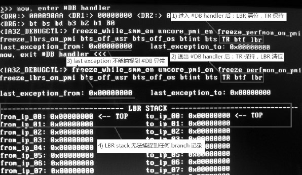

当发生\#**DB异常**时，**LBR stack**无法捕捉到\#DB异常，处理器在**将要(！！！**)进入\#DB handler时会**对LBR位进行清位处理**，因此，**在\#DB handler内(！！！**)无法使用LBR stack来捕捉branch记录。

在**退出\#DB handler后**，如果我们需要继续使用LBR stack捕捉branch，则必须要**重新对LBR进行置位**。

可是，**在\#DB异常**发生后，处理器并**不清TR位**，这意味着在\#DB hanlder内继续可以**使用BTS(！！！**)来**记录branch(！！！**)或者**发送BTM到system bus(！！！**)上。

实验14-5：观察\#DB异常下的LBR机制

我们有一连串的疑问。

① **LBR与TR是否被清位**，**退出\#DB handler**是否会**自动恢复**？

② **LBR stack是否会被更新**？

③ **LBR stack**是否真的**无法捕捉\#DB异常的branch**？

我们需要实实在在地进行测试来解决上面的疑问，我们将在实验14\-5里解开这些迷惑。

代码清单14-8（topic14\ex14-5\protected.asm）：

```assembly
； ① 开启 L0 执行断点位
      mov eax，1
      mov dr7，eax
； ② 设置执行断点
      mov eax，breakpoint
      mov dr0，eax
； ③ 开启 LBR
      mov ecx，IA32_DEBUGCTL
      rdmsr
      bts eax，LBR_BIT                             ； 置 LBR 位
      bts eax，TR_BIT                              ； 置 TR 位
      wrmsr
breakpoint：
； ④ 在退出 #DB handler 后观察 IA32_DEBUGCTL 寄存器
      call dump_debugctl                          ；
      call println
； ⑤ 清 TR
      mov ecx，IA32_DEBUGCTL
      rdmsr
      btr eax，TR_BIT                             ； 清 TR 位
      wrmsr
； ⑥ 关闭执行断点
      mov eax，dr7
      btr eax，0
      mov dr7，eax
； ⑦ 查看 last exception 是否能记录 #DB hanlder
      call dump_last_exception
； ⑧ 输出 LBR stack 信息
      call dump_lbr_stack
```

在这个主体代码里，有8个步骤。

① 打开DR7.L0，并且R/W0=0，LEN0=0允许使用执行断点。

② 设置执行断点。

③ 同时打开LBR和TR位，用来测试TR位。

④ 由于\#DB异常是属于**Fault类型(在这里是, Fault和Trap都有可能**)，在断点指令执行前发生，第4步是在\#DB hanlder退出后打印IA32\_DEBUGCTL寄存器信息来观察。

⑤ 清TR位。

⑥ 关闭L0位。

⑦ 尝试使用MSR\_LER\_FROM\_LIP和MSR\_LER\_TO\_LIP寄存器来观察最后一次发生异常的branch情况。

⑧ 输出LBR stack的信息。

在我们的#DB handler里也做出了相应的修改，如下。

代码清单14-9（topic14\ex14-5\protected.asm）：

```assembly
db_handler：
      jmp do_db_handler
db_msg1        db '>>> now，enter #DB handler'，10，0
db_msg2        db 'now，exit #DB handler <<<'，10，0
db_msg3        db 'last exception from：0x'，0，
db_msg4        db 'last exception to：0x'，0
do_db_handler：
      mov esi，db_msg1
      call puts
      call dump_drs                                ； 打印 DR0～DR3
      call dump_dr6                                ； 打印 DR6
      call dump_debugctl                          ； 观察 IA32_DEBUGCTL 寄存器
      call dump_last_exception                  ； 观察 last exception
      mov esi，db_msg2
      call puts
      call println
      bts DWORD [esp+8]，16                      ； RF=1
      iret
```

在\#DB handler里分别打印了4个断点寄存器，DR6，IA32_DEBUGCTL寄存器，以及last exception分支信息。

下面是在Westmere微架构下的Core i5处理器上的测试结果。



图上标注了4个注意点。

① 在进入\#DB handler后，LBR确实被清位，TR会保持不变。

② 在退出\#DB handler后，LBR位不会被恢复，因此，要继续使用LBR stack的话，需要重新对LBR进行置位。

③ 我们看到，在进入\#DB handler和退出\#DB handler后使用last exception寄存器也不能捕捉到\#DB异常。

④ 最后是最关键的，在LBR stack里捕捉不到任何的branch记录，因为在将要进入\#DB handler时，LBR位已经被清位。

因此，我们使用LBR确实无法捕捉到\#DB异常的branch记录，也无法使用last exception寄存器来捕捉。

可是，在Intel64手册里有这样一段话：

If the LBR flag is cleared and TR flag in the IA32_DEBUGCTL MSR remains set，theprocessor will continue to update LBR stack MSRs. This is because BTM information must be generated from entries in the LBR stack. A #DB does not automatically clear the TR flag.

我们注意到这段话所说的：**当LBR被清位**，**TR位保持置位**时，处理器将**继续更新LBR stack MSR寄存器**，因为**BTM信息**需要**从LBR stack里产生(！！！**)。

但是，从我们实验里，在LBR=0，TR=1时，**LBR stack并没有捕捉到任何branch记录(！！！**)。（在\#DB handler里产生了许多的branch没有被记录）

笔者无法理解这个continue to update LBR stack MSRs是指什么。