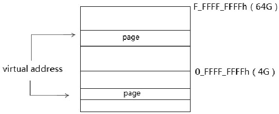

<!-- @import "[TOC]" {cmd="toc" depthFrom=1 depthTo=6 orderedList=false} -->

<!-- code_chunk_output -->

* [1 处理器的最高物理地址（MAXPHYADDR）](#1-处理器的最高物理地址maxphyaddr)
	* [1.1 最高物理地址空间的实现](#11-最高物理地址空间的实现)
* [2 物理页面的大小](#2-物理页面的大小)
* [3 页转换模式（Paging Mode）](#3-页转换模式paging-mode)
	* [3.1 32位页转换模式](#31-32位页转换模式)
	* [3.2 PSE\-36模式](#32-pse-36模式)
	* [3.3 PSE\-36机制下32位paging模式里的最高物理地址](#33-pse-36机制下32位paging模式里的最高物理地址)
	* [3.4 PAE页转换模式](#34-pae页转换模式)
	* [3.5 IA\-32e页转换模式](#35-ia-32e页转换模式)

<!-- /code_chunk_output -->

**virtual address**能映射到低端的物理页面或者更高端的物理页面上。



处理器通过**paging机制**可以在**32位**和**48位**的**虚拟地址**上使用**36位**、**40位**甚至**52位宽**的**物理地址**，由paging机制提供的各级**page\-translation table（页转换表**）实现。

# 1 处理器的最高物理地址（MAXPHYADDR）

**最高物理地址**的专用语**MAXPHYADDR**在整个x86/x64体系中许多地方都需要用到，我们可以通过第4章里所说的**CPUID.80000008H leaf获得MAXPHYADDR值**。

代码清单11-1（lib\lib32.asm）：
```x86asm
；----------------------------------------------
； get_MAXPHYADDR（）：得到 MAXPHYADDR 值
； output：
；       eax：MAXPHYADDR
；----------------------------------------------
__get_MAXPHYADDR：
      push ecx
      mov ecx，32
      mov eax，80000000H
      cpuid
      cmp eax，80000008H
      jb test_pse36                        ； 不支持 80000008H leaf
      mov eax，80000008H
      cpuid
      movzx ecx，al                        ； MAXPHYADDR 值
      jmp do_get_MAXPHYADDR_done
test_pse36：
      mov eax，01H
      cpuid
      bt edx，17                            ； PSE-36 support ？
      jnc do_get_MAXPHYADDR_done
      mov ecx，36
do_get_MAXPHYADDR_done：
      mov eax，ecx
      pop ecx
      ret
```

这个\_\_get\_MAXPHYADDR()函数用于得到MAXPHYADDR值（**最大物理地址位数**），通过查询CPUID.80000008H：EAX[7：0]叶功能，如果**不支持80000008H leaf**，则通过查询**CPUID.01H：EDX[17**]看是否支持**PSE\-36**功能，如果不支持，就**返回32位**。

代码清单11-2（topic11\ex11-1\protected.asm）：
```x86asm
mov esi，msg1
call puts
call get_MAXPHYADDR
mov esi，eax
call print_dword_decimal
mov esi，msg2
call puts
```

这个测试作为实验11-1的例子，在用户代码里调用get\_MAXPHYADDR()函数，然后使用print\_dword\_decimal()函数打印出来，

>实验11-1：得到MAXPHYADDR值

下面是在VMware上得到的结果。


下面是在一台Intel Core i5处理器真实机器上的测试结果。


在笔者工作的这台Arrandale核心（Westmere架构）Core i5移动处理器机器上，只支持最高36位的物理地址，属于上一代的Core i5处理器。而在一台AMD64的phenom机器上得到的结果是40位的MAXPHYADDR值。

## 1.1 最高物理地址空间的实现

在x86/x64中依据处理器架构不同，在可见的描述里有**3种尺寸的最高物理地址值**。

① **36位**：在Intel平台的桌面处理器上普遍实现了36位的最高物理地址值，可寻址**64G空间**。

② **40位**：在Intel的服务器产品和AMD平台上普遍实现40位的最高物理地值，可寻址空间为**1TB**。

③ **52位**：这是x64体系描述中的最高实现值，然而目前尚未有哪个处理器架构实现了52位的物理地址宽度。

# 2 物理页面的大小

在整个x86/x64体系里共有**4种页面尽寸**，如下所示。


**4K页**和**4M页面**使用在**32位paging模式**（non\-PAE模式），**4K页和2M页**使用在**PAE模式**里。而4K、2M，以及1G被使用在IA\-32e模式（即long\-mode）。


这些页面的页内的offset值如上图所示，在**IA\-32e模式**下**线性地址高16位**作为**符号扩展位**，因此只实现了48位线性地址。

# 3 页转换模式（Paging Mode）

按**Intel的分类**，**页转换模式（paging mode**）可分三类。

① 32\-bit paging（**32位页转换模式**）：即**non-PAE模式**。

② PAE paging（**Physical Address Extensions页转换模式**）。

③ IA\-32e paging（**IA\-32e页转换模式**）：对应于**AMD64的long\-mode**。

这个分类似乎是按照virtual address宽度和映射的物理地址大小来做的。不过笔者认为：在**32位页转换模式**下似乎还可以分出**第四类**：

④ **PSE\-36模式**。

32位页转换模式也就是normal模式或者non\-PAE模式，而**第四类PSE\-36模式在较早以前的机器**才有意义，在新近的处理器上都支持PSE\-36机制，对于新机器来说分出PSE\-36模式没多大意义。它使处理器在non\-PAE模式下能够使用超过32位的物理地址。

## 3.1 32位页转换模式

在**32位页转换模式**里，**CR4.PAE=0关闭PAE**，**32位的线性地址**可以映射到超过**32位的物理地址**上（**由MAXPHYADDR所决定**），处理器可以使用**2种页转换表**。

① **4K页面**的page\-translation table（页转换表）。

② **4M页面**的page\-translation table（页转换表）。

这些页转换表结构都是32位宽的，意味着只能提供**最高32位的物理地址**，除非支持**PSE\-36模式**。

## 3.2 PSE\-36模式

PSE\-36模式应当归属于32位页转换模式里，在32位页转换模式里，当处理器支持PSE\-36机制时，处理器最高可以使用40位的物理地址。PSE\-36模式**仅使用在4M页面的页转换表**上。


上面这个图揭示了32位页转换模式和PSE\-36模式的关系，当CR4.PSE=**1**，并且**PDE.PS=1**时，处理器使用**4M页面的页转换表结构**。

当处理器支持PSE\-36功能时，可以使用**高于4G地址**，最高可以为**40位的物理地址**（36位或40位物理地址取决于**MAXPHYADDR**值）。当处理器不支持PSE\-36功能时，只能使用4G内的物理地址（32位物理地址）。

软件可以使用CPUID.01H：EDX[17]叶功能来查询是否支持PSE-36机制，正如在代码清单11-1里get_MAXPHYADDR（）函数所使用的那样，在CPUID 01H leaf里返回EDX寄存器的Bit 17位是PSE-36支持位。

## 3.3 PSE\-36机制下32位paging模式里的最高物理地址

上图中，在PSE-36功能支持32位页转换模式里最高物理地址可以是36位或40位。

这个36位和40位最高物理地址如何确定？由下面的方法决定。

① 得到MAXPHYADDR值。

② MAXPHYADDR值和40比较，使用两者中最小的值。

因此，如果MAXPHYADDR值是36位，那么最高就是36位。如果MAXPHYADDR为40位，那么最高就是40位。

这也说明32位页转换模式下最高可能使用40位的物理地址。

## 3.4 PAE页转换模式

当开启CR4.PAE=1时，处理器使用PAE页转换模式。在PAE模式下可以使用最高52位的物理地址，当前x86/x64体系中所描述的最高的物理地址就是52位。

在PAE页转换模式下，使用2种页面转换表结构。

① 4K页面的转换表结构。

② 2M页面的转换表结构。

在PAE页转换模式里，处理器会忽略CR4.PSE控制位的作用，无须使用PSE-36机制。

## 3.5 IA\-32e页转换模式

使用IA\-32e paging模式需要处理器支持IA\-32e模式（即long\-mode），进入了IA\-32e工作模式也就使用了IA\-32e paging模式。

IA\-32e paging必须**开启CR0.PAE功能**。因此，IA\-32e paging模式是在PAE的基础上扩展而来，增加了一级页转换表结构。IA\-32e paging使用4级页转换结构，包括下面的页面结构。

① 4K页面的转换表结构。

② 2M页面的转换表结构。

③ 1G页面的转换表结构。

在64位模式下，处理器将48位的virtual address转换为物理地址。在**compatibility模式**下，处理器将转换32位的virtual address。