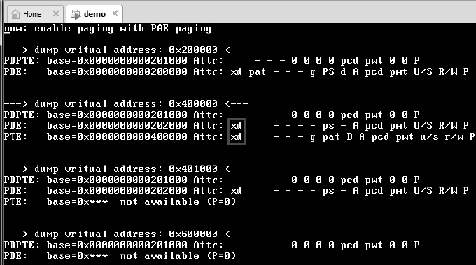
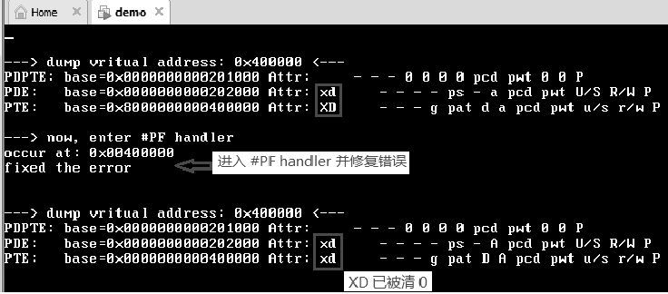

- 1 基本原理
    - 1.1 开启PAE标志
    - 1.2 支持最高52位的物理地址
    - 1.3 Table Entry（表项）的大小
    - 1.4 页表的大小
- 2 在Intel64下的CR3与PDPTE寄存器
    - 2.1 CR3
    - 2.2 PDPTE寄存器
        - 2.2.1 PDPTE寄存器的加载
        - 2.2.2 PDPTE寄存器的重新加载
        - 2.2.3 Intel64下的新PAE paging模式
- 3 在AMD64下的CR3
- 4 PAE paging模式里的PDPTE结构
- 5 PAE paging模式里的PDE结构
    - 5.1 2M页面下的PDE结构
        - 5.1.1 XD（Execution Disable）标志位
        - 5.1.2 Code页与Data页
    - 5.2 4K页面下的PDE结构
- 6 PAE paging模式里的PTE结构
- 7 使用和测试PAE paging模式
    - 7.1 设置PAE paging的页表结构
    - 7.2 一个非常难查找的bug
    - 7.3 开启PAE paging模式
    - 7.4 开启paging机制
- 8 使用和测试Execution Disable功能
    - 8.1 测试一：尝试在XD页里执行代码
    - 8.2 测试二：在PTE.XD=0的页里执行代码
    - 8.3 测试三：在\#PF handler里修复错误

# 1 基本原理

在处理器支持PAE页转换机制的情况下，置**CR4.PAE=1开启PAE paging模式**，在**PAE paging模式**下virtual address（linear address）**依然使用32位宽(！！！**)，如下图所示。


线性地址分为: 2 \+ 9 \+ 9 \+ 12

与32位paging模式下不同，在PAE paging模式下使用了**3种页表结构**。

① **Page Directory Pointer Table（页目录指针表, PDPT**）及PDPT**内的PDPE结构**。**线性地址的[31：30]域共2位**是PDPT的**索引值**，用来在PDPT内查找PDPE结构。**PDPE索引值是2位**，只能索引**4个PDPE表项**。

② **Page Directory Table（页目录表**）及PDT**内的PDE结构**。线性地址的[29：21]域共9位是**PDT的索引值**。注意，这个PDT索引值在PAE paging模式下变成了9位，因此可以索引**512个PDE表项**。

③ **Page Table（页表**）及PT**内的PTE结构**。线性地址的[20：12]域9位是**PT的索引值**。注意，在PAE paging模式下，这个PT的索引值也变成了9位，因此可以索引**512个PDE表项**。

**2MB页面线性地址构成: 2(PDPT索引, 4个项) \+ 9(PDT索引, 512个项) \+ 21(Page offset, 2MB页**)

图中的**灰色线路**是**2M页面**的映射方式，设置**PDE.PS=1**，那么PDE将指向2M page frame的物理地址，线性地址的[20：0]域**21位**将是2M page frame内的**offset**值。

**4KB页面线性地址构成: 2(PDPT索引, 4个项) \+ 9(PDT索引, 512个项) \+ 9(PT索引, 512个项) \+ 12(Page offset, 4KB页**)

**黑色线路**是**4K页面**映射方式，**PDE.PS清0**，PDE指向PT，再由线性地址的[20：12]域共9位来获得PTE表项，得出最终的4K page frame物理地址。线性地址的[11：0]域12位将是4K page frame内的offset值。

## 1.1 开启PAE标志

在CPUID.01H：EDX[6].PAE位里查询PAE paging模式支持后置CR4.PAE为1值，这个PAE paing模式将**忽略PSE机制**（忽略CPUID.01H：EDX[3].PSE位和CR4.PSE控制位的作用），也不需要PSE\-36机制的支持。

## 1.2 支持最高52位的物理地址

在PAE paging模式里支持**最高52位的物理地址**，依赖于**MAXPHYADDR值**。当MAXPHYADDR为36时只能映射到36位的物理地址，以此类推。

## 1.3 Table Entry（表项）的大小

为了能够支持**52位的物理地址甚至更多**，每个**Table Entry结构**被扩展为**8个字节64位宽(！！！**)，可是**CR3依然只能使用低32位**。

## 1.4 页表的大小

**PDPT的索引值为2位**，索引**4个PDPE表项**，因此**PDPT的大小可以为4×8=32字节**。PDT和PT仍然是4K大小，512×8=4K字节。

# 2 在Intel64下的CR3与PDPTE寄存器

不知从何时起，Intel实现了一种在PAE paging模式下的**全新CR3结构**，引入了**PDPTE寄存器**，或者从Sandy Bridge微架构，或者从上一代的Nehalem微架构起。

## 2.1 CR3

在这种**新实现**下，CR3的Bit 3和Bit 4位被忽略（不再是PWT和PCD标志位），如下所示。


这个**新实现的CR3低5位被忽略**，提供27位的PDPT基地址，32位的PDPT物理地址形成如下。

① base of PDPT[31：5]=CR3[31：5]，**高27位由CR3**提供。

② base of PDPT[4：0]=0值，**低5位补0**。

因此，PDPT的基地址是**32字节边界对齐(2\^5！！！**)的。这是由于PDPT的size为32字节。

## 2.2 PDPTE寄存器

**Intel64**实现了一组共**4个PDPTE寄存器**，如下图所示。


**PAE paging模式**下的**PDPT只有4个表项**：PDPTE0到PDPTE3。在**Intel64处理器内部**实现了**一组PDPTE寄存器**来优化PAE paging模式，它们分别是PDPTE0、PDPTE1、PDPTE2，以及PDPTE3寄存器。这些寄存器是**处理器内部使用的**，**外部不可见**。PDPT里的表项（PDPTE）会被加载到相应的PDPTE寄存器，**每个PDPTE寄存器**控制**1G的物理地址区域**。

### 2.2.1 PDPTE寄存器的加载

在下列情况下，会引发**加载PDPTE表项**到****PDPTE寄存器组****。

① 使用mov cr3，reg指令**更新CR3**时。

② 在PAE paging模式下，CR0和CR3中与paging机制相关的控制位被修改时，它们包括：CR0.PG、CR0.CD和CR0.NW控制位；CR4.PAE、CR4.PGE、CR4.PSE和CR4.SMEP控制位。

③ 在执行**任务切换加载CR3**时。

在**加载PDPTE寄存器**时，处理器会**一次性**从PDPT里**加载4个PDPTE**到**对应的PDPTE寄存器**里。如上图所示，PDPTE0加载到PDPTE0寄存器，PDPTE1加载到PDPTE1寄存器，PDPTE2加载到PDPTE2寄存器，PDPTE3加载到PDPTE3寄存器。留意下面2点。

① 在加载时，PDPTE的P标志为0时不会产生异常。而在使用相应的PDPTE寄存器访问地址时会产生\#PF异常。

② 在加载时，当P=1，处理器检查到PDPTE的保留位不为0时，会产生\#GP异常（注意不是\#PF异常）。

不像其他的table entry：当被加载到TLB或Paging-Structure Cache中，处理器会检查table entry的P标志，P标志为0时将产生#PF异常。

然而PDPTE表项被加载到PDPTE寄存器时：P标志为0并不会产生#PF异常（在访问时检查）。在上面的②里描述了另一个情形：当加载PDPTE寄存器时P标志为1会引起对PDPTE寄存器的检查（保留位必须为0值）。

在Intel64手册里有下面一段关于PDPTE寄存器加载时的话。

If any of the PDPTEs sets both the P flag（bit 0） and any reserved bit，the MOV to CR instruction causes a general-protection exception（#GP（0））and the PDPTEs are not loaded.

它表达的意思是，当PDPTE的P标志为1，并且保留位被置位时，使用MOV指令对CR进行赋值会产生#GP异常，PDPTE寄存器不会被成功加载。

因此，在加载PDPTE寄存器时：① 当P=0时可以通过；② 当P=1时，保留位必须为0，否则将产生#GP异常。

在当前的AMD64实现中，AMD64处理器实现这4个PDPTE一次性加载到Cache中，与Intel64实现额外的PDPTE寄存器有些区别，但目的和意义是一致的。

### 2.2.2 PDPTE寄存器的重新加载

当**OS的内存管理模块对PDPTE进行修改时**，需要**对PDPTE寄存器进行重新加载**，否则PDPTE寄存器只能维持原有的内容。

同样，可以使用上面所说的加载PDPTE寄存器的**方法**。

### 2.2.3 Intel64下的新PAE paging模式

引入PDPTE寄存器后，Page Directory Table的**物理基地址**由PDPTE寄存器提供，如下图所示。


与11.4节开头的图所不同的是，PDT物理基地址不再由CR3提供，如上图的星标所示。

# 3 在AMD64下的CR3

在AMD64和Intel64之前的处理器上，在PAE paging模式下的结构如下。


除了Bit 4和Bit 3位分别为PCD和PWT标志位外，其余与11.4.1.1节所描述的是一致的。

# 4 PAE paging模式里的PDPTE结构

在PAE paging模式下**PDPTE结构**是**64位宽(8字节**)的，下面是PDPT表项（PDPTE）的结构图。


它对新的Intel64处理器来说，也就是PDPTE寄存器的结构。在**PDT（page directory table）物理基地址**上，它的地址为**52位（最高支持**）、**40位或是36位**，它的形成如下。

① 当MAXPHYADDR为**52位**时，base of PDT\[51：12\]=PDPTE\[51：12\]，由PDPTE结构的\[51：12\]提供PDT的**高40位**。

② 当MAXPHYADDR为**40位**时，base of PDT\[39：12\]=PDPTE\[39：12\]，由PDPTE结构的\[39：12\]提供**PDT的高28位**。此时PDPTE[51：40]是保留位，必须为0值。

③ 当MAXPHYADDR为**36位**时，base of PDT[35：12]=PDPTE[35：12]，由PDPTE结构的[35：12]提供PDT的**高24位**。此时PDPTE[51：36]是保留位，必须为0值。

**PDT的低12位(！！！)将补0值**，因此**PDT物理基地址**将在**4K边界上对齐(！！！**)。和4KB页面物理地址形成方式一致, 也最大程度兼容.

# 5 PAE paging模式里的PDE结构

与**32位paging模式**中的PDE结构情形一样，PAE paging模式里的**PDE会分为两种格式**。

① **4K页面**下的PDE结构。

② **2M页面**下的PDE结构。


根据PDE.PS标志位来解析两种格式，在PAE paging模式下PS=1时使用2M页面的PDE结构，否则使用4K页面的PDE结构。

## 5.1 2M页面下的PDE结构

下图是PAE paging模式下64位宽的2M页面PDE结构。


这个PDE的PS值为1，指示PDE结构将指向2M页面的物理基地址，这个**2M page frame的地址形成(！！！**)如下。

① MAXPHYADDR为**52位**时，2M page frame地址的\[51：21\](**高31位**)由PDE[51：21]提供。

② MAXPHYADDR为**40位**时，2M page frame地址的\[39：21\](**高19位**)由PDE[39：21]提供，此时PDE[51：22]为保留位，必须为0。

③ MAXPHYADDR为**36位**时，2M page frame地址的\[35：21\](**高15位**)由PDE[35：21]提供，此时PDE[51：36]为保留位，必须为0

**2M page frame地址的\[20：0\](低21位！！！)补0**，因此**2M页面**的地址**在2M边界上对齐**。

### 5.1.1 XD（Execution Disable）标志位

在PAE paging模式下，引入了XD标志位（在AMD64中被称为NX位，即No Execution）。Execution Disable功能需要处理器支持，使用CPUID.80000001H：EDX[20].XD查询是否支持该功能。最后需要在IA32_EFER.NXE置位，开启XD功能。

在PDE和PTE结构的Bit 63位是XD标志位，当IA32\_EFER.NXE=0时，XD标志位是保留位，必须为0值。当**PDE.XD=1**或**PTE.XD=1**时，page的属性是**Data页（数据页，不可执行**）。

### 5.1.2 Code页与Data页

在处理器未实现Execution Disable（或No Execution）功能时，所有的page都是可执行的。OS无法在paging管理阶段去阻止对page执行访问。典型地，在stack中数据可以被作为代码执行。

在引入Execution Disable功能后，使得paging阶段向segmentation阶段看齐（在segmentation中有Code段和Data段）。开启XD标志的页面不可执行，属于Data页。未开启XD标志的页面是可执行的，属于Code页。

## 5.2 4K页面下的PDE结构

当PDE.PS=0时，PDE使用4K页面的PDE格式，如下。


PDE[51：12]提供PT的物理基地址，PT地址的形成同11.4.3节所描述的PDPTE结构中的PDT基地址一致，PT地址为4K边界对齐。

在4K页面的PDE结构中不存在D标志、G标志及PAT标志。因为这3个属性仅用于对page的描述上。

# 6 PAE paging模式里的PTE结构

PTE结构使用在4K页面上，由上面所描述的PDE指出，下面是PTE结构。


PTE\[51：12\]提供4K页面的物理地址(40位)，4K page frame的物理地址形成同第4节所描述的**PDPTE地址形成一致(！！！**)。PTE的Bit 7位由PS标志位变为PAT标志位。

# 7 使用和测试PAE paging模式

在这个小节里，我们将作为实验11-3来使用PAE paging模式，进行一些测试。

>实验11-3：使用与测试PAE paging

在topic11\ex11-3\protected.asm代码里，我们将使用PAE paging模式，同样在lib\page32.asm里准备了PAE paging模式的dump_pae_paging（）函数用来输出table entry信息。

## 7.1 设置PAE paging的页表结构

这个功能由init\_pae\_paging()函数来执行，如下。

代码清单11-8（topic11\ex11-03\protected.asm）：

```x86asm
；-------------------------------------------------------------
； init_page32_paging（）：初始化 32 位环境的 PAE paging模式
；-------------------------------------------------------------
init_pae32_paging：
； ① 0x000000-0x3fffff 映射到 0x0 page frame，使用 2个 2M 页面
； ② 0x400000-0x400fff 映射到 0x400000 page frame，使用 4K 页面
；； 清内存页面（解决一个很难查的 bug）
      mov esi，PDPT_BASE
      call clear_4k_page
      mov esi，201000h
      call clear_4k_page
      mov esi，202000h
      call clear_4k_page
；*** PDPT_BASE 定义在 page.inc ***
；； ① 设置 PDPTE[0]
      mov DWORD [PDPT_BASE + 0 * 8]，201000h | P        ； base=0x201000，P=1
      mov DWORD [PDPT_BASE + 0 * 8 + 4]，0
；； ② 设置 PDE[0]，PDE[1] 以及 PDE[2]
      ；* PDE[0] 对应 virtual address：0 到 1FFFFFh （2M页）
      ；* 使用 PS=1，R/W=1，U/S=1，P=1 属性
      ；** PDE[1] 对应 virtual address：200000h 到 3FFFFFh （2M页）
      ；** 使用 PS=1，R/W=1，U/S=1，P=1 属性
      ；*** PDE[2] 对应 virtual address：400000h 到 400FFFh （4K页）
      ；*** 使用 R/W=1，U/S=1，P=1
      mov DWORD [201000h + 0 * 8]，0000h | PS | RW | US | P
      mov DWORD [201000h + 0 * 8 + 4]，0
      mov DWORD [201000h + 1 * 8]，200000h | PS | RW | US | P
      mov DWORD [201000h + 1 * 8 + 4]，0
      mov DWORD [201000h + 2 * 8]，202000h | RW | US | P
      mov DWORD [201000h + 2 * 8 + 4]，0
；； ③ 设置 PTE[0]
      ；** PTE[0] 对应 virtual address：0x400000 到 0x400fff （4K页）
      ；** base=400000h，R/W=U/S=0，P=1
      mov DWORD [202000h + 0 * 8]，400000h | P
      mov eax，[xd_bit]
      mov DWORD [202000h + 0 * 8 + 4]，eax                      ； 设置 XD 位
      ret
```

作为实验，这里也仅映射两块区域。

① virtual address的0x000000到0x3FFFFF的区域：这块共4M的区域需使用2个2M页面来映射，一个映射0x000000到0x1FFFFF，另一个映射0x200000到0x3FFFFF。它们都是一对一映射（virtual address和physical address相同）。

② virtual address的0x400000到0x400FFF的区域：使用1个4K页面来映射，也是一对一映射。

由于PAE paging模式下使用3种table entry结构，需要分别设置PDPTE、PDE和PTE。每个table entry是8个字节宽，因此需要分别写低4字节和高4字节。

## 7.2 一个非常难查找的bug

在init\_pae32\_page（）里存在一个对于极少接触底层系统设计的开发人员来说非常难觉察到的bug：在设置各级页表结构之前，必须先对这些页表结构的物理地址进行清0操作，防止里面的“脏”数据影响到table及table entry数据。

这些“脏”数据是BIOS运行期间遗留下来的。对比一下实验11-2的代码，在这里增加了使用clear\_4k\_page（）函数来进行清0操作。clear\_4k\_page（）函数实现在lib\page32.asm模块里。

如果不是使用真实的机器进行测试，几乎很难觉察问题的所在，在Bochs和VMware上即使不进行清0工作也不影响代码的执行。

## 7.3 开启PAE paging模式

同样在protected.asm模块里，设置了一个pae_enable（）函数用来打开CR4.PAE控制位。

代码清单11-9（topic11\ex11-03\protected.asm）：

```x86asm
pae_enable：
      mov eax，1
      cpuid
      bt edx，6                        ； PAE support？
      jnc pae_enable_done
      mov eax，cr4
      bts eax，PAE_BIT                ； CR4.PAE=1
      mov cr4，eax
pae_enable_done：
      ret
```

其原理和实验11-2中的pse\_enable（）函数是一样的，通过检测是否支持PAE功能，然后对CR4.PAE置位来开启PAE paging模式。

## 7.4 开启paging机制

下面的代码流程和实验11-2是一致的。

代码清单11-10（topic11\ex11-03\protected.asm）：

```x86asm
； 初始化 paging 环境
      call init_pae32_paging
；设置 PDPT 地址
      mov eax，PDPT_BASE
      mov cr3，eax
；设置 CR4.PAE
      call pae_enable
； 打开 paging
      mov eax，cr0
      bts eax，31
      mov cr0，eax
```

在这里CR3装入的是PDPT的物理基地址。这个PDPT\_BASE同样被设为0x200000值。

最后在用户代码里进行测试。

代码清单11-11（topic11\ex11-03\protected.asm）：

```x86asm
mov esi，msg1
call puts
mov esi，0x200000                ； dump virtual address 0x200000
call dump_pae_page
mov esi，msg3
call puts
mov esi，0x400000                ； dump virtual address 0x400000
call dump_pae_page
mov esi，msg4
call puts
mov esi，0x401000                ； dump virtual address 0x401000
call dump_pae_page
mov esi，msg5
call puts
mov esi，0x600000                ； dump virtual address 0x600000
call dump_pae_page
```

在这段代码里输出了4个virtual address的table entry信息：0x200000，0x400000，0x401000及0x600000。下面是输出的结果。

 

这里table entry信息的输出是由dump\_pae\_page（）函数完成的（在lib\page32.asm模块里），仔细观察上面输出的几个地方。

① virtual address 0x200000和0x400000都是正常被映射的，对比一下在init\_pae32\_paging（）函数里设置的代码。

② virutal address 0x401000在init\_pae\_paging（）函数里是不被映射的，因此PDPTE和PDE里都正常，在PTE里出现问题。

③ virtual address 0x600000也是不被映射的地址，它从PDE开始就出现问题了。


用上面这个示意图来解释输出的结果信息，它们的PDPTE是相同的，0x600000地址问题出在PDE里，而0x401000地址问题出现在PTE里。0x400000地址是被映射的，所以它的各级table entry都通过了。

如果我们dump地址0x40000000的信息，下面是结果。


它将在PDPTE这一级也不能获得通过，因为它的PDPT[1]是不被映射的。

地址0x400000在PDE一级里还是User/Writable（用户可访问及可写属性），在PTE里则控制为Supervisor/Read-only（supervisor可访问及只读属性），对比一下init\_pae32\_paing（）代码里关于属性的设置。

# 8 使用和测试Execution Disable功能

下面将lib\page32.asm文件的dump\_pae\_page（）函数修改一下，使它能显示XD标志位，并且在lib\page32.asm文件里增加一个execution\_disalbe\_enable（）函数来开启XD功能。

代码清单11-12（topic11\ex11-03\protected.asm）：

```x86asm
execution_disable_enable：
      mov eax，0x80000001
      cpuid
      bt edx，20                                  ； XD support ？
      mov eax，0        ； 如果不支持就置 0
      jnc execution_disalbe_enable_done
      mov ecx，IA32_EFER
      rdmsr
      bts eax，11                                 ； EFER.NXE=1
      wrmsr
      mov eax，8000000h
execution_disalbe_enable_done：
      mov DWORD [xd_bit]，eax                  ； 写XD标志位
      ret
```
注意这里在开启NXE后，写入一个值到xd\_bit变量作为XD标志位，下面是摘自代码清单11-8里的init\_pae32\_paging（）函数关于XD标志设置的代码片段。

代码清单11-13（topic11\ex11-03\protected.asm）：

```x86asm
；； 3） 设置 PTE[0]
      ；** PTE[0] 对应 virtual address：0x400000 到 0x400fff （4K页）
      ； 400000h 使用 Execution disable 位
      mov DWORD [202000h + 0 * 8]，400000h | P
      mov eax，[xd_bit]
      mov DWORD [202000h + 0 * 8 + 4]，eax                          ； 设置 XD 位
      ret
```
上面的代码重点是后面的PTE设置：我们将0x400000到0x400fff区域设为Data区域（即Execution Disable，不可执行区域），这个XD值来自int\_pae32\_paging（）函数里设置的xd\_bit标志值（80000000h值），这个xd\_bit值就是由execution\_disable\_enable（）函数开启PAE时设置的。

下面是新的运行结果。


如上所示，dump\_pae\_page（）新增加了显示XD标志位，在0x400000地址所对应的PDE的XD为0值，而PTE的XD为1值，表明已经设置了XD标志。

注意：当IA32\_EFER.NXE标志位为0时，如果对PDE.XD或PTE.XD标志进行置位，当处理器对该page进行fetch时，会产生#PF异常。

没错！这个异常发生在处理器fetch指令阶段。实质上，在页被load进Instruction TLB时处理器会检查是否可执行。如果一直不对该页访问（即从不发生装载到Instruction TLB），那么在上面的情景下设置XD标志位不会产生#PF异常。

## 8.1 测试一：尝试在XD页里执行代码

下面，我们将测试在一个XD页里执行代码，这种行为将会产生#PF异常。

代码清单11-14（topic11\ex11-03\protected.asm）：

```x86asm
； 测试一：在XD页里执行代码
      mov esi，user_start
      mov edi，0x400000                                ； 将 user代码复制到 0x400000 位置上
      mov ecx，user_end - user_start
      rep movsb
      jmp DWORD 0x400000                                ； 跳转到 0x400000 上
```

上面代码里，我们将user\_start开始的代码复制到0x400000地址上，然后使用jmp指令跳转到0x400000上去执行。

下面我们看看结果。


执行的结果是发生了异常，灰色圈着发生位置在0x400000位置上，这就是我们设置的XD页面。

在\#PF handler里，我们使用CR2来获得发生异常的位置。

代码清单11-15（topic11\ex11-03\protected.asm）：

```x86asm
Page_fault_handler：
      jmp do_page_fault_handler
pfmsg  db '---> now，enter #PF handler'，10
      db 'occur at：0x'，0
do_page_fault_handler：
      mov esi，pfmsg
      call puts
      mov esi，cr2                                ； 发生#PF异常的virtual address
      call print_dword_value
      jmp $
      iret
```
在\#PF handler里只是简单地通过CR2来输出发生异常的位置，并没有去修复这个错误，#PF异常是fault类型的异常，需要我们去修复。

## 8.2 测试二：在PTE.XD=0的页里执行代码

我们把PTE.XD重新置为0值，再测试上面的代码，由于复制到0x400000位置上，出现地址重定位的问题，为了顺利完成测试，我们修改一下user\_start里的代码，如下。

代码清单11-16（topic11\ex11-03\protected.asm）：

```x86asm
user_start：
；； 使用 puts（）和 dump_pae_page（） 的绝对地址形式
      mov edx，puts
      mov ebx，dump_pae_page
      mov esi，msg1
      call edx
      mov esi，0x200000                ； dump virtual address 0x200000
      call ebx
      mov esi，msg3
      call edx
      mov esi，0x400000                ； dump virtual address 0x400000
      call ebx
      mov esi，msg4
      call edx
      mov esi，0x401000                ； dump virtual address 0x401000
      call ebx
      mov esi，msg5
      call edx
      mov esi，0x600000                ； dump virtual address 0x600000
      call ebx
```

我们使用puts（）和dump\_pae\_page（）的绝对地址形式，避免产生相对跳转指令（避开地址重定位问题），结果如下。

 
 
如图所示，0x400000页面的PTE.XD标志已经修改为0值，我们的代码可以顺利在0x400000里执行。

## 8.3 测试三：在\#PF handler里修复错误

现在，我们回到测试一里发生的#PF异常错误，我们需要在#PF handler里修复这个错误。能够引发#PF异常的有四大类错误。

① 尝试访问的page属于P=0。

② 没有足够的权限访问page，包括：

只有3级权限的代码访问属于Supervisor权限的page。

只有3级权限的代码对Read-only的page进行写操作。

在CR0.WP=1时，Supervisor权限的代码尝试对Read-Only的page进行写操作。

③ 在处理器进行fetch指令时产生的错误，包括：

对一个Data（即XD=1时，为不可执行）的page进行执行。

当CR4.SMEP=1时，Supervisor权限的代码尝试去执行属于User权限（即3级权限）的page，这表明在0、1和2级权限下不能执行U/S标志为1（属于User权限）的page。

④ 在各级table entry中的保留位被置为1的情况下访问page或table entry。

基于上面的四大类原因，#PF handler需要判断属于哪种情况产生的异常，对于OS来说，下面的情况应该是坚决不能执行的。

① 由权限不足引起的#PF异常是坚决不能执行的（没有哪个OS允许这个情况发生）。

② 由不可执行page产生的#PF异常，这种情况下OS也是坚决不允许的。

排除上面两种情况下：

① 当P=0时，我们可以修正这个错误，分配可用的物理地址区域，然后映射到发生异常的地址上。

② 当保留位被置1时，OS可以考虑接受，将table entry里面的保留位强制清0。

>实验11-4：在#PF handler里修复由XD引起的错误

需要注意，在这里作为一个实验，对上面执行Execution Disable页面产生的异常，在#PF handler里强行将其修正为可执行的（仅作为实验，真实OS里不允许）。

代码清单11-17（topic11\ex11-04\protected.asm）：

```x86asm
Page_fault_handler：
      jmp do_page_fault_handler
pfmsg  db '---> now，enter #PF handler'，10
      db 'occur at：0x'，0
pfmsg2 db 10，'fixed the error'，10，0
do_page_fault_handler：
      add esp，4                                ； 忽略 Error code
      push ecx
      push edx
      mov esi，pfmsg
      call puts
      mov ecx，cr2                              ； 发生#PF异常的virtual address
      mov esi，ecx
      call print_dword_value
      mov esi，pfmsg2
      call puts
；； 下面修正错误
      mov eax，ecx
      shr eax，30
      and eax，0x3                          ； PDPTE index
      mov eax，[PDPT_BASE + eax * 8]
      and eax，0xfffff000
      mov esi，ecx
      shr esi，21
      and esi，0x1ff                             ； PDE index
      mov eax，[eax + esi * 8]
      btr DWORD [eax + esi * 8 + 4]，31               ； 清 PDE.XD
      bt eax，7                                     ； PDE.PS=1 ？
      jc do_page_fault_handler_done
      mov esi，ecx
      shr esi，12
      and esi，0x1ff                             ； PTE index
      and eax，0xfffff000
      btr DWORD [eax + esi * 8 + 4]，31               ； 清 PTE.XD
do_page_fault_handler_done：
      pop edx
      pop ecx
      iret
```
这个\#PF handler里重点是在后面的错误修正里，写得比较随意，作为实验不过突出了原理：通过对发生异常的virtual address查找它的PDPTE、PDE和PTE，直接对XD标志位进行清0工作，在异常返回后，回到0x400000位置继续执行，下面是结果。



上面的结果显示，在跳转到0x400000位置执行之前，PTE.XD=1，是不可执行的页，因此跳到0x400000处执行将产生#PF异常。然而，在上面代码清单11-17中的#PF handler里强行将XD标志清0达到了修复错误的效果，使得0x400000地址上的代码重新获得运行。

关于例子中的映射方式，作为例子在这里的page映射采用一对一的映射（virtual address和physical address相同），因此在获取PDPTE、PDE和PTE里直接使用了table entry里的base值。

实际上，OS不可能采用这种方式映射，由于在table entry里保存的是physical address，因此只能通过virtual address来设置table entry。在virtual address和physical address间的获取需要经过设计上的仔细考虑，需要费点周折才能通过virtual address来写physical address上的PDPTE、PDE和PTE数据。