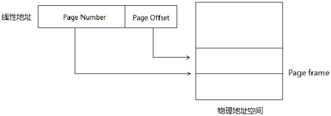
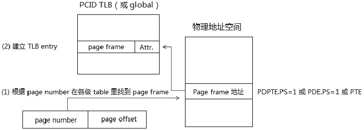
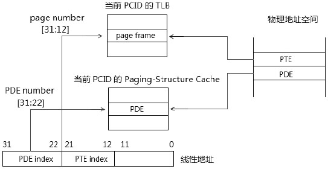

<!-- @import "[TOC]" {cmd="toc" depthFrom=1 depthTo=6 orderedList=false} -->

<!-- code_chunk_output -->

* [0 基本原理](#0-基本原理)
	* [0.1 TLB是什么？](#01-tlb是什么)
	* [0.2 段的Cache](#02-段的cache)
	* [0.3 页的Cache](#03-页的cache)
* [1 TLB](#1-tlb)
	* [1.1 线性地址的Page Number](#11-线性地址的page-number)
		* [1.1.1 32位paging模式下的Page Number](#111-32位paging模式下的page-number)
		* [1.1.2 PAE paging模式下的Page Number](#112-pae-paging模式下的page-number)
		* [1.1.3 IA\-32e paging模式下的Page Number](#113-ia-32e-paging模式下的page-number)
	* [1.2 TLB中的转换](#12-tlb中的转换)
		* [1.2.1 page frame的访问权限](#121-page-frame的访问权限)
		* [1.2.2 page frame的读/写权限](#122-page-frame的读写权限)
		* [1.2.3 page frame的执行权限](#123-page-frame的执行权限)
		* [1.2.4 page frame的有效条件](#124-page-frame的有效条件)
		* [1.2.5 page frame的Dirty状态](#125-page-frame的dirty状态)
		* [1.2.6 page frame的内存类型](#126-page-frame的内存类型)
	* [1.3 Global page](#13-global-page)
	* [1.4 TLB entry的建立](#14-tlb-entry的建立)
		* [1.4.1 建立TLB entry的条件](#141-建立tlb-entry的条件)
	* [1.5 TLB entry的维护](#15-tlb-entry的维护)
		* [1.5.1 主动刷新TLB](#151-主动刷新tlb)
			* [1.5.1.1 刷新多个TLB entry](#1511-刷新多个tlb-entry)
			* [1.5.1.2 刷新所有的TLB entry](#1512-刷新所有的tlb-entry)
			* [1.5.1.3 刷新global TLB entry](#1513-刷新global-tlb-entry)
			* [1.5.1.4 根据PCID来刷新TLB](#1514-根据pcid来刷新tlb)
		* [1.5.2 选择性地主动刷新TLB](#152-选择性地主动刷新tlb)
		* [1.5.3 延迟刷新TLB](#153-延迟刷新tlb)
		* [1.5.4 需要刷新TLB的其他情形](#154-需要刷新tlb的其他情形)
	* [1.6 多种形式的TLB](#16-多种形式的tlb)
		* [1.6.1 Instruction TLB](#161-instruction-tlb)
			* [1.6.1.1 指令TLB entry的建立](#1611-指令tlb-entry的建立)
			* [1.6.1.2 fetch指令](#1612-fetch指令)
		* [1.6.2 Data TLB](#162-data-tlb)
		* [1.6.3 不同页面的TLB](#163-不同页面的tlb)
	* [1.7 使用小页代替大页](#17-使用小页代替大页)
* [2 Paging\-Structure Cache](#2-paging-structure-cache)
	* [2.1 IA\-32e paging模式下的Paging\-Structure Cache](#21-ia-32e-paging模式下的paging-structure-cache)
		* [2.1.1 PML4E cache](#211-pml4e-cache)
		* [2.1.2 PDPTE cache](#212-pdpte-cache)
		* [2.1.3 PDE cache](#213-pde-cache)
	* [2.2 PAE paging模式下的Paging-Structure Cache](#22-pae-paging模式下的paging-structure-cache)
		* [2.2.1 PAE paging模式的PDE cache](#221-pae-paging模式的pde-cache)
	* [2.3 32位paging模式下的Paging-Structure Cache](#23-32位paging模式下的paging-structure-cache)
	* [2.4 Paging-Structure Cache的使用](#24-paging-structure-cache的使用)
		* [2.4.1 使用TLB entry](#241-使用tlb-entry)
		* [2.4.2 使用PDE\-cache entry](#242-使用pde-cache-entry)
		* [2.4.3 当查找不到对应的PDE\-cache entry时](#243-当查找不到对应的pde-cache-entry时)
		* [2.4.4 使用PDPTE\-cache entry](#244-使用pdpte-cache-entry)
		* [2.4.5 使用PML4E\-cache entry](#245-使用pml4e-cache-entry)

<!-- /code_chunk_output -->

# 0 基本原理

由于**页转换表在内存**中，处理器如果要对一个地址进行访问，那么它需要在内存里根据table和table entry一级一级地walk下去直到找到最终的page frame。显而易见，如果这样做，这个访问将非常耗时。因此所有的处理器都会引入TLB。

## 0.1 TLB是什么？

**TLB（Translation Lookaside Buffers**）就是**Cache的一类**。通过TLB处理器可以绕过内存里的table和table entry，**直接在Cache里查找页的转换后的结果（即page frame信息**），这个结果包括了最终的**物理页面基址**和**页的属性**。

## 0.2 段的Cache

TLB的作用令我们很容易联想到segment的Cache，回想一下，当一个段需要被访问时，它必须要加载到Segment Register（段存器）里。那么在段存器的内部就是这个段的Cache信息。

因此，在已经**load进段寄存器的Cache**里后，当处理器访问这个段时，它**不必再去GDT/LDT里**加载相关的**segment descriptor**，这样，处理器能绕过内存的段描述符直接访问段。

## 0.3 页的Cache

**页的Cache就是TLB(！！！**)，可是在**Intel64**实现里**不止TLB一个页Cache**，在Intel64实现了**两类关于页的Cache**。

- 一个就是**TLB（Translation Lookaside Buffers**），它实际是保存页的page frame信息（从**虚拟地址**到物理页面**转换结果！！！**）。

- 另一个是**Paging\-Structure Cache（页表结构Cache**），它保存页表的**各级table entry结构**（也就是：寻找page frame 的过程，它是TLB相对和互补的）。

笔者不晓得这个**Paging\-Structure Cache是独立的**，还是在**处理器内部的Cache**里（**level\-1，level\-2 或level\-3 Cache**），按照推测它应该属于处理器常规的Cache。

可是在处理器内部，**TLB是独立于常规的Cache**，可以使用**CPUID.02H leaf**和**CPUID.04H leaf**获得**TLB相关的信息**。详见第4章“处理器身份”第4.8节描述。

# 1 TLB

TLB作用是**cache线性地址转换为物理地址**的关系，与其说是cache转换关系，不如说是**cache线性地址**（或说**virtual address**）的**Page Number**。存放的**不是某个页内存中的数据(！！！**), 而只是**某个页的线性地址**对应的**物理页帧信息(包括页基地址, 属性等！！！**)

在探讨TLB之前，我们先了解下面几个术语。

**Page Offset**

线性地址的Page Offset也就是在前面讲述的3种分页模式中线性地址在物理page frame内的Offset值。

**Page Number**

与Page Offset相对应，线性地址的Page Number用来查找最终的物理page frame地址。在其中忽略了各种table entry的Index值。

**Page frame**

Page frame是在**物理地址空间**里，一个页的**起始地址（基地址**），分为4种：4K page frame，4M page frame，2M page frame，以及1G page frame。

它们三者的关系如下。



实际上，**Page Number就是Page在物理地址的编号**。


## 1.1 线性地址的Page Number

由于存在**几种paging模式和几种页面的size**，因此**Page Number会不同**。

**线性地址除了offset以外的其余部分都是该线性地址的page number！！！**.

### 1.1.1 32位paging模式下的Page Number

32位paging模式下有两种页面size：4K页和4M页。


在上面的4K页面中，32位的线性地址中高20位为Page Number，低12位为Page offset。


上面是**4M页面**中的Page Number与Page Offset。

### 1.1.2 PAE paging模式下的Page Number

在PAE paging模式下4K页的Page Number与Page Offset和在32位paging模式下是一致的。在2M页面的Page Number和Page Offset如下。


与32位paging模式下的4M页面仅仅是Page Number和Page Offset宽度不同。

### 1.1.3 IA\-32e paging模式下的Page Number

在IA-32e paging 模式下有效的linear address被扩展为48位，Page Number将变得很宽。


我们看到，上图中4K页面的Page Number有36位宽。


在2M页面下，Page Number有27位宽。


在1G页面下，Page Number为18位宽，Page Offset为30位宽。

## 1.2 TLB中的转换

**TLB的结构似乎挺神秘**，笔者只能从Intel64手册里的描述**推断出TLB内部的结构**。


必须要说明的是，这个查找过程是笔者的理解，**Intel64手册里对此并没有描述(！！！**)。

处理器**只维护**着**当前PCID对应的TLB cache(！！！**)，关于PCID功能，详情请参考11.5.1.3节的描述。在**TLB里的每一个entry**，包含下面的信息。

① **线性地址Page Number**对应的**物理Page frame**。

② Page frame的**属性**。

这个page frame的属性，包括：

- U/S标志（访问权限）。
- R/W标志（读/写权限）。
- XD标志（执行权限）。
- Dirty标志（已写状态）。
- PCD，PWT与PAT标志（page的内存类型）。

### 1.2.1 page frame的访问权限

**各级table entry**的**U/S标志**决定最终page frame的访问权限。这个最终的访问权限是采用“**从严”策略**，也就是说：

① 在**32位paging模式**下，**PDE和PTE只要有其中一个table entry属于Supervisor权限(！！！**)，那么最终的page frame就是**Supervisor访问权限**。

② 在**PAE paging模式**下，**PDPTE、PDE及PTE**只要**其中一个是Supervisor权限(！！！**)的，最终的page frame就属于Supervisor访问权限。

③ 在**IA\-32e paging模式**下，**PML4E、PDPTE、PDE及PTE**只要**其中一个是Supervisor权限**的，最终的page frame就是Supervisor访问权限。

**仅当所有table entry的U/S=1**时，最终page frame的U/S才为1。用计算式子来表达，可以是（以IA-32e paging 4K页为例）：

```x86asm
Page_frame.U/S=PML4E.U/S & PDPTE.U/S & PDE.U/S & PTE.U/S    ；进行 AND 操作
```

page frame的U/S值等于各级table entry的U/S标志进行AND操作。

### 1.2.2 page frame的读/写权限

各级table entry的R/W标志决定最终page frame的读/写权限，与上面所述的U/S标志情景一样，**仅当所有table entry的R/W=1**时，最终的page frame的R/W=1，同样用式子表达为（以IA-32e paging 4K页为例）：

```x86asm
Page_frame.R/W=PML4E.R/W & PDPTE.R/W & PDE.R/W & PTE.R/W   ； 进行 AND 操作
```

page frame的R/W值等于各级table entry的R/W标志进行AND操作。

### 1.2.3 page frame的执行权限

当**table entry的XD为1**时，指示为**不可执行的页**，因此，从表达上与上面两个权限是不同的，同样基于“从严”的策略，仅当所有table entry的XD=0时，page frame的XD才为0。用式子表达为（IA-32e paging 4K页为例）：

```x86asm
Page_frame.XD=PML4E.XD | PDPTE.XD | PDE.XD | PTE.XD          ； 进行 OR 操作
```

page frame的XD值等于各级table entry的XD进行OR操作。这个XD需要在开启Execution Disable功能的前提下。

### 1.2.4 page frame的有效条件

能在TLB entry中保存的page frame，必须是**有效的page frame**。它必须是最终的P=1并且保留位为0，同样可以用式子表达为（以IA-32e paging 4K页为例）：

```x86asm
Page_frame.P=PML4E.P & PDPTE.P & PDE.P & PTE.P           ； 进行 AND 操作
```

**仅当各级table entry的P标志都为1(！！！**)时，page frame的P才为1值，否则是**无效**的。并且仅当各级table entry的保留位为0时，page frame才为有效的。

一个无效的page frame处理器将不会在TLB中建立相应的entry。

### 1.2.5 page frame的Dirty状态

当对一个线性地址进行写操作时，线性地址对应的page frame的Dirty属性为1（D=1），指示page frame内的某个地址已经被写过。

当D=0时发生写操作，处理器会对内存中的PDPTE（PS=1）、PDE（PS=1）或PTE的D标志置位。处理器从不会对D标志进行清位操作。

### 1.2.6 page frame的内存类型

**page frame**的**PCD**、**PWT**，以及**PAT标志**组合起来构成**线性地址**映射的**page的内存cache类型**。三个标志组合为一个**0～7的数值**，这个数值将对应PAT里定义的**内存cache类型**。

关于PAT，将在后面的11.7节里描述。

## 1.3 Global page

在处理器内部实现一个**全局的TLB cache结构(！！！**)。**CR4.PGE=1(！！！**), 并当**page frame**是被定义为**Global页时（也就是G标志为1**），在Global TLB里（基于独立的TLB，或者curreut PCID的TLB）实现这个Global TLB entry。


上图是笔者对global page在TLB实现的推测，使用类似global PCID值而与当前PCID值不同，当**使用mov CR3,reg指令对TLB进行刷新**时，**global PCID**的**TLB中的global TLB entry不被刷新(！！！**)，继续保持有效。

## 1.4 TLB entry的建立

当处理器对**首次成功访问的page frame**（必须注意是**成功访问**，**失败的访问不会建立TLB entry！！！**），会在**当前PCID的TLB(！！！**)里建立相应的**TLB entry来保存page frame**或者**建立global TLB entry来保存global page frame（当page的G=1时！！！**）。

这个**page frame必须是已经被访问过**的（page的**A标志为1**），因此，TLB entry中的page frame属性里**不必保留A标志**。

处理器只会为有效的page frame进行cache。这个有效的page frame条件是11.6.1.2节里所描述的。对于无效的page frame（例如：P=0），处理器会产生\#PF异常。



如上图所示，对线性地址的访问中，根据线性地址的page number在物理地址中的各级页转换表里找到最终的page frame，当它是有效的，处理器会在page number对应的TLB entry里建立相应的entry（或者说加载，或者说Cache fill操作）。当page是global的，处理器会在global TLB entry里建立对应的entry。

### 1.4.1 建立TLB entry的条件

处理器对首次成功的访问才会在TLB里建立**Page Number对应**的**TLB entry**或**global TLB entry（是global page时**），page frame能访问的条件是1.2节里所描述的。

① **page frame是有效的（P=1，A=1**）。

② 访问page frame的**各项权限是满足**的，读/写操作时访问权限和读/写权限都需通过，执行时执行权限需通过（实现SMEP功能时，还要依赖于SMEP机制）。

当**线性地址的page number**对应的**TLB entry建立**后，下次对该page内地址进行访问时，处理器会在**线性地址page number(！！！**)对应的**TLB entry**里找到**page frame**，而不用在内存里walk查找page frame。

## 1.5 TLB entry的维护

处理器会维持TLB中的TLB entry不变，不会因为内存中各级的table entry被更改而修改TLB entry。可是，如果遇到在内存中的table entry被更改时，需要根据情况做手动的维护工作。有两种情形会需要分别对待。

### 1.5.1 主动刷新TLB

有时候必须主动发起刷新TLB，可以使用**INVLPG指令(！！！**)对**当前PCID下**的**某个TLB entry进行刷新（某个！！！**)，代码如下。

```x86asm
invlpg [0x200000]       ;线性地址0x200000 地址所在的page frame
```

在上面这个示例中，指令刷新的TLB entry需根据情况而定。

① 如果线性地址0x200000使用**4K页**，它将**刷新0x200（Page Number**）对应的TLB entry。

② 如果线性地址0x200000使用**2M页**，它将刷新**0x01（Page Number**）对应的TLB entry。

以此类推到4M页和1G页上。

还可以使用**mov CR3, reg或mov CR4, reg指令**通过**更新控制寄存器方式**来刷新**所有的TLB entry(所有！！！**)。

INVLPG指令虽然**只能一次刷新一个TLB entry**，可是，使用**INVLPG指令**也可以对**当前PCID**下**线性地址page number对应**的所有**Page\-Structure Cache entry进行刷新(！！！**)。也可以对线性地址所对应的**global TLB entry进行刷新(！！！**)。

在一些情况下，我们必须要主动刷新TLB来避免严重的错误，下面进行一个实验来阐述这种严重性。

>实验11-7：一个未刷新TLB产生的后果

在这个实验里，我们来看看一种需要刷新TLB的情形，当页的映射模式更改时，必须要刷新。实验的源代码在topic11\ex11-07\目录下。

代码清单11-26（topic11\ex11-7\long.asm）：

```x86asm
； ① 下面打印 virtual address 0xfffffff810001000 各级 table entry 信息
      mov esi，msg0
      LIB32_PUTS_CALL
      mov rsi，0xfffffff810001000
      call dump_long_page
      LIB32_PRINTLN_CALL
； ② 写 virtual address 0xfffffff810001000，将它load into TLB
      mov rax，0xfffffff810001000
      mov DWORD [rax]，0x55aa55aa
      mov esi，msg1
      LIB32_PUTS_CALL
； ③ 将 virtual address 0xfffffff810001000 改为 2M 页面
      mov rsi，0xfffffff810001000
      call get_pdt
      or DWORD [rax + 80h * 8]，PS              ； PS=1
； ④ 下面再次打印 virtual address 0xfffffff810001000 各级 table entry 信息
      mov esi，msg0
      LIB32_PUTS_CALL
      mov rsi，0xfffffff810001000
      call dump_long_page
      LIB32_PRINTLN_CALL
； ⑤ 第一次读 virtual address 0xfffffff810001000
      ； 注意：这个读取在刷新 TLB 之前进行读取，观察是否成功
      mov esi，msg2
      LIB32_PUTS_CALL
      mov rax，0xfffffff810001000
      mov esi，[rax]
      LIB32_PRINT_DWORD_VALUE_CALL
      LIB32_PRINTLN_CALL
      LIB32_PRINTLN_CALL
      mov esi，msg3
      LIB32_PUTS_CALL
； ⑥ 刷新 TLB
      ； 现在，主动发起刷新 virutal address 对应的 TLB
      mov rax，0xfffffff810001000
      invlpg [rax]
； ⑦ 第二次读 virtual address 0xfffffff810001000
      ； 注意，这个读取是在刷新 TLB 之后进行
      mov esi，msg4
      LIB32_PUTS_CALL
      mov rax，0xfffffff810001000
      mov esi，[rax]
      LIB32_PRINT_DWORD_VALUE_CALL
      LIB32_PRINTLN_CALL
```

上面是整个实验的步骤，在初始状态下0FFFFFFF810001000到0FFFFFFF810001FFF的区域是使用4K页映射的，在第2步里：

```x86asm
； ② 写 virtual address 0xfffffff810001000，将它load into TLB
      mov rax，0xfffffff810001000
      mov DWORD [rax]，0x55aa55aa
```

这一步是测试的关键，它的用途是写入一个值作为以后的读取值，并且重要的是，它会让处理器在TLB里建立相应的TLB entry（在page frame加载到TLB中）。

接下来，笔者将0xFFFFFFF810001000到0xFFFFFFF810001FFF区域修改为2M页映射，如下面代码所示。

```x86asm
； ③ 将 virtual address 0xfffffff810001000 改为 2M 页面
      mov rsi，0xfffffff810001000
      call get_pdt
      or DWORD [rax + 80h * 8]，PS              ； PS=1
```

在上面的代码里，将0xFFFFFFF810001000地址所对应的PDE表项的PS标志位直接修改为1，PDE的其他值保持不变。经过修改后0xFFFFFFF810001000地址将是无效的（由于保留位不为0），接下来通过对这个地址读取来测试这个地址所对应的page frame是否在TLB中cache。

```x86asm
； ⑥ 刷新 TLB
      mov rax，0xfffffff810001000
      invlpg [rax]
```
在这里笔者通过使用指令INVLPG来刷新0xFFFFFFF810001000地址page number所对应的TLB entry。最后在后面第二次读取该地址。

下面是在笔者的Westmere架构Core i5处理器的笔记本上测试的结果。


上面的结果中，dump\_long\_page()函数打印出的信息指示0xFFFFFFF810001000地址已经是无效的页面（由于直接修改PS=1，使用2M页面导致保留位不为0），然而由于TLB entry还存在这个页面对应的page frame的cache里，导致从0xFFFFFFF810001000地址里还能正常读取到值0x55AA55AA，这个值是在上面的代码清单11-25的②里写入的值。

这是一个严重的错误。因此，如果是OS的内存管理模块里更改了这种映射模式必须要进行刷新TLB操作。

在代码清单11-26的⑥里通过对TLB entry的刷新，在最后一次读取0xFFFFFFF810001000地址时产生了\#PF异常，TLB和Page\-Structure Cache entry已经被刷新。

现在，我们回过头来看看**什么情况下需要主动刷新TLB**，在Intel64的手册里列举了一系列推荐的必须刷新的情形，非常复杂和烦琐，看得让人抓狂。实际上这些情形需要进行细致的测试和实验才能准确地深入理解。下面是笔者总结的两大类情况。

① 当**指向page frame**的**table entry修改**时，最终的page frame无论是由PTE指向修改为由PDE或PDPTE指向，还是由PDE或PDPTE指向修改为由PTE指向。也就是说，4K页面、2M页或者是1G页映射的修改，都需要**刷新TLB**。

② 当**任何一级的table entry**中的**物理地址修改**时，需要**刷新TLB**（例如：**PDPTE**中提供的**PDE物理基地址修改**时，需要**刷新TLB**）。

#### 1.5.1.1 刷新多个TLB entry

在前面我们看到了如何对单个TLB entry进行刷新，很多情况下需要**刷新多个TLB entry**，例如：当将**一个区域的页面映射去掉**时，假如这个区域使用**4K页面映射**，**线性地址**为**0x200000**到**0x3FFFFF**。那么这个区域将包含**512个4K页面**，将需要为这些page number进行逐个刷新。

```x86asm
      mov eax， 0x200000
； 下面进行逐个刷新
do_invalidate：
      invlpg [eax]                ； 刷新 page number 对应的 TLB entry
      add eax，0x1000            ； 下一个 4K 页
      cmp eax，0x3FFFFF
      jb do_invalidate
```

上面的代码是对逐个4K页的page number对应的TLB entry进行刷新的例子。实际情况可以更复杂，更多些，在这种情况下可以使用**mov CR3, reg指令**直接刷新**当前PCID下所有的TLB entry**。

#### 1.5.1.2 刷新所有的TLB entry

当**CR4.PCIDE=0(不开启PCIDE机制！！！**)时，**mov CR3, reg**指令刷新**PCID=000H**下的**所有TLB entry（除global TLB entry外**），以及**PCID=000H**下**所有的Paging\-Structure Cache entry**。

当CR4.PCIDE=1（**开启PCIDE机制**）时：

```x86asm
mov cr3，0x200001          ； 刷新PCID值为001H的所有TLB entry
```

上面这条指令将刷新**PCID值为001H**下的**所有TLB entry（除global TLB entry外！！！**），并且也会**刷新PCID=001H**下**所有的Paging\-Structure Cache entry**。

```x86asm
mov rax，0x8000000000200001         ； bit63=1
mov cr3，rax                            ； 不会刷新TLB entry
```

可是当**源操作数的bit 63**位**为1**时，对**CR3的更新不会刷新TLB**。

#### 1.5.1.3 刷新global TLB entry

对**CR3的更新不会刷新Global page(！！！**)，可以使用**更新CR4的方式刷新global page(！！！**)。

```x86asm
mov eax，cr4
btc eax，7                      ； 修改 CR4.PGE 位
mov cr4，rax                    ； 刷新所有的TLB entry，包括global page
```

当对**CR4.PGE位进行修改（由0改为1或由1改为0**）时，对**CR4的更改**会**刷新所有的global TLB entry**，也包括**所有的PCID下的所有TLB entry**和**所有PCID下的所有Paging\-Structure Cache entry**。将CR4.PCIDE标志从1改为0，也同样能达到这样的效果。

#### 1.5.1.4 根据PCID来刷新TLB

Intel64提供了一个**新指令INVPCID**来根据提供的**invalidation type**和**descriptor**这两个操作数做相应的刷新操作。

**INVPCID指令**是**PCID功能配套指令**，需要处理器支持，从**CPUID.07H：EBX[10].INVPCID**位里查询是否获得支持。

**INVPCID指令**可以做到上面所说的**刷新TLB entry**和**paging\-structure cache entry的功能**，它可以提供**4个invalidation type**：

- **0号type**可以刷新**单个entry**；
- **1号type**可以刷新**PCID下的所有entry（除了global TLB entry**）；
- **2号type**可以刷新**所有PCID**的**所有entry**（**包括global TLB entry**）；
- **3号type**可以刷新**所有PCID的所有entry**（**除了global TLB entry**）。

```x86asm
mov rax，2                           ;invalidation type为2
invpcid rax，[INVPCID_DESCRIPTOR]    ;提供 invpcid descriptor
```

上面将刷新**所有PCID**的**所有TLB entry**和**Paging\-Structure Cache entry**，**包括global TLB entry**。


上面这个图是**INVPCID descriptor的格式(16字节, 128位！！！**)，**低12位**提供相应的**PCID值**，高64位提供线性地址，它们的作用依据相应的invalidation type而不同。

### 1.5.2 选择性地主动刷新TLB

在Intel手册里列举了一些**不必立即进行主动刷新TLB**的情形，主要是**基于table entry的属性修改**，我们可以认为这些修改操作**属于OS内存管理模块**的管理。

① table entry的P标志和A标志从0修改为1时，不需要刷新TLB entry。因为处理器只有当P和A为1时，才可能装载到TLB entry中。它们这样的修改不会对后续产生不良的影响。

② 当page frame的读/写权限R/W由0修改为1时，意味着由原来的不可写变为可写的。那么OS可以选择不立即进行刷新，采取延迟刷新策略。

③ 当page frame的访问权限U/S由0修改为1时，意味着由原来的Supervisor权限改变User权限。那么OS也可以选择采取延迟刷新策略。

④ 当page frame的执行权限XD由1修改为0时，意味着由原来的不可执行改为可执行。那么OS也可以选择采取延迟刷新策略。

### 1.5.3 延迟刷新TLB

当遭遇上面的②、③和④情形时，page frame的R/W和U/S标志由0修改为1，XD标志由1修改为0时，如果尝试对不可写的page进行写，不可执行的page进行执行，以及使用User权限进行访问将产生#PF异常。

于是，在\#PF handler处理中，可以对情况做出判断，然后在\#PF handler里再做出刷新TLB entry和Page\-Structure Cache entry的操作。在后续的执行中，TLB entry已经被刷新为正确的。

### 1.5.4 需要刷新TLB的其他情形

当page frame的P标志由1改为0时，我们需要进行刷新，采用前面所描述的刷新多个TLB entry的方法实现，Intel64手册里似乎没描述到。

① 当page frame的R/W由1修改为0时，意味着由原来的可写变为不可写。

② 当page frame的U/S由1修改为0时，意味着由原来的User权限改为Supervisor权限。

③ 当page frame的XD由0修改为1时，意味着由可执行改为不可执行。

实际上，上面这三种情况都应该需要刷新TLB和Paging-Structure Cache。

现在，我们回过头来仔细看看前面的实验11-4“在#PF handler里修复XD引起的错误”。

在实验11-4里，当尝试去执行一个不可执行的page frame时，引发#PF异常，在#PF异常里将XD标志由1改为0值。

因此，实验11-4是属于可选择的刷新TLB的情形。

因此在可选择的刷新TLB情形中，由于执行的失败产生#PF异常，在TLB或Paging-Structure Cache中并没有建立相应的entry，因此可以在#PF handler里将XD标志从1修改为0值。即使无效刷新也可以执行。

可是，在上面的三种情形中，如果XD标志由0改为1，OS必须要主动刷新TLB和Paging-Structure Cache，否则起不了相应的控制作用。

>实验11-8：XD由0修改为1时的情形

在实验11-8里，我们还是以XD标志做测试，我们在代码里测试XD由0修改为1时的情形。

代码清单11-27（topic11\ex11-8\protected.asm）：

```x86asm
； ① 将测试函数复制到 0x400000位置上
      mov esi，func
      mov edi，0x400000                          ； 将 func（）代码复制到 0x400000 位置上
      mov ecx，func_end – func
      rep movsb
      ； 设置0x400000地址最初为可执行
      mov DWORD [PT1_BASE + 0 * 8 + 4]，0
； ② 第 1 次执行 0x400000处的代码（此时是可执行的，XD=0），目的是：在 TLB 中建立相应的 TLB
entry
      call DWORD 0x400000
； ③ 将 0x400000 改为不可执行的，但是此时没刷新 TLB
      mov DWORD [PT1_BASE + 0 * 8 + 4]，0x80000000
； ④ 第 2 次执行 0x400000 处的代码，刷新TLB之前仍然是正常的（此时，XD=1）
      call DWORD 0x400000
； ⑤ 主动刷新 TLB，使 0x400000 地址的 TLB 失效
      invlpg [0x400000]
； ⑥ 第3次执行 0x400000 处的代码，将产生 #PF 异常
      call DWORD 0x400000
```

在代码清单11-26的3）里将0x400000改为不可执行的（XD=1），在5）里才做出主动的刷新工作。

实验分3次来执行0x400000地址上的测试函数func（），第1次和第2次可以执行，第3次由于已经刷了TLB，那么0x400000的page number对应的TLB entry是无效的。因此由于不可执行而产生了\#PF异常。下面是运行的结果。


我们对比一下实验11-4及可选择性刷新TLB的情形的差异。我们将结论推广至R/W和U/S标志。当它们由1改为0时，同样是需要主动刷新TLB的。

## 1.6 多种形式的TLB

与Cache一样，**TLB**实现了**Instruction（指令**）和**Data（数据**）两大类，并且实现了**4K页、4M页和2M页面的TLB结构**。

### 1.6.1 Instruction TLB

处理器对首次**执行的代码page**会在Instruction TLB里建立相应的TLB entry（或者说加载TLB，相对应于Segment的加载）。Intel明确说明了在Instruction TLB entry里无须包含R/W和D标志位。

思考一下，对于一个**可执行的page frame**，当**执行page frame**和**读/写page frame**时，处理器会分别在**Instruction TLB**和**Data TLB**里进行**Cache**。即，会建立**两份TLB entry**，一份为**fetch指令**，一份为**访问数据**。

按照Intel的说法，我们可以推断出上面的结论，在Instruction TLB里只为fetch指令。当**fetch指令**时处理器从**Instruction TLB entry**里找**page frame**，否则作为**读/写访问内存**时，则从**Data TLB entry**里找到**page frame**。

#### 1.6.1.1 指令TLB entry的建立

处理器对首次成功进行fetch指令的page frame建立相应的TLB entry。对首次fetch指令失败的page frame不会建立TLB entry。显然对于首次fetch指令时XD=1的page frame是不会建立TLB entry的，从实验11-4里我们可以看到（在\#PF handler里可以不用刷新TLB entry而修改了XD标志）。

#### 1.6.1.2 fetch指令

当**目标地址page number**对应的**Instruction TLB entry未建立**时，属于首次fetch指令，否则处理器将在Instruction TLB entry里查找page frame，Instruction TLB entry中的page frame属性里必定会包括XD标志位，它用来判断page frame是否可执行。

当fetch指令时，处理器从当前ip/eip/rip寄存器里得到指令的线性地址，首次fetch指令时将在内存里walk找到最终的page frame。否则根据线性地址的page number在Instruction TLB找到相对应的TLB entry，再查看page frame的属性。在IA32\_EFER.NXE=1的前提下，当XD=1时，fetch指令将失败。

当IA32\_EFER.NXE=0或者XD=0时，在Intel64处理器上还会根据SMEP（详见11.5.6节描述）机制来决定fetch指令。

① 当CR4.SMEP=1时，在Supervisor权限（0、1和2级）下，对属于User权限（U/S=1）的page frame进行fetch指令时，fetch指令将失败。

② 当CR4.SMEP=0时，在Supervisor权限下可以对属于User权限的page frame进行fetch指令。

③ 在User权限（3级）下，只能对User权限的page frame进行fetch指令。

### 1.6.2 Data TLB

对于**读/写访问内存**，处理器根据**线性地址page number(！！！**)从Data TLB里找到相应的TLB entry，再根据page frame的属性判断访问是否合法。

基于11.6.1.2节里所描述的各种权限检查，通过后使用page frame物理地址值加上线性地址的page offset得到最终目标物理地址。

### 1.6.3 不同页面的TLB

在Intel上可以通过CPUID.02H leaf来查询处理器上的TLB信息，而在AMD上通过CPUID.80000005H和CPUID.80000006H leaf来查询。我们从Intel关于cache和TLB信息的表格里可以看到有为4K、2M和4M页面使用的TLB。

## 1.7 使用小页代替大页

在处理器TLB cache的实现中，可能会**以小页代替大页进行Cache**，例如：对一个2M页面的映射方案，处理器可以在TLB entry里以数个4K页面的TLB entry来代替。

假设，0x200000到0x3FFFFF的2M区域以2M页面来映射，它的Page Number是0x01，如果代码中对0x201000到0x203FFF区域进行访问，那么处理器可以采用：

① 在2M页面的TLB里Page Number为1对应的TLB entry里Cache整个2M页面。

② 在4K页面的TLB里使用Page Number为0x201、0x202，以及0x203对应的TLB entry里Cache 3个4K页面。

使用小页代替大页实现Cache，对软件层来说是没什么影响的。软件层并不知道处理器内部是怎么Cache这些TLB entry的。

使用大页的好处是简单，可是需要额外增加TLB。使用小页好处是重复有效地利用TLB，可是需要更多的entry来Cache一个大页。一个典型的情况是，在Intel64和AMD64的实现上并没有看到有1G页面的TLB存在。因此，我们可以推断1G页面必定是采用小页代替的（2M页面或4M页面，甚至4K页面）。

# 2 Paging\-Structure Cache

在**Intel64**中可以实现**另一种Cache技术**，处理器**可以选择支持或不支持**这种Cache。

paging\-structure cache是与TLB互补的：**TLB是cache线性地址对应的page frame**，而**paging\-structure cache**则是**cache页转换表中除page frame外的其他table entry(！！！**)。



上面这个图揭示了处理器在32位paging模式下进行TLB entry和Paging\-Structure Cache entry建立的示意，在32位paging模式下，**当前PCID值为000H**（**PCID功能只能用于IA\-32e模式！！！下**）。

在Page\-Structure Cache里可以建立**3种table entry的cache entry**。

① **PML4E cache entry**：只使用于**IA\-32e paging(！！！**)模式下。

② **PDPTE cache entry**：只使用于**IA\-32e paging模式**下，**PAE paging模式**的**PDPTE**是在**PDPTE寄存器里cache(！！！**)，详见11.4.1.2节所描述的PDPTE寄存器。

③ **PDE cache entry**：可以使用在**32位paging**、**PAE paging**和**IA-32e paging**模式下。

Paging\-Structure Cache**只对paing\-structure进行cache(！！！**)，因此如上图所示，在**32位paging**模式下如果**PDE是指向最终的4M page frame(！！！**)，那么**不存在对PDE的cache(！！！**)，而是在TLB entry里对PDE进行cache。

## 2.1 IA\-32e paging模式下的Paging\-Structure Cache

在**IA\-32e paging**模式下，处理器会对PML4E、PDPTE及PDE进行cache，**依赖于page size**。

① 当使用**4K页**映射时，将对**PML4E，PDPTE及PDE进行cache**。

② 当使用**2M页映射**时，将对**PML4E**和**PDPTE**进行cache（此时**PDE指向page frame**）。

③ 当使用**1G页映射**时，将对**PML4E进行cache**（此时PDPTE指向page frame）。下面这个图对PML4E、PDPTE和PDE cache进行了概括。


按照图中的理解，似乎在Paging-Structure Cache中分别存在PML4E-cache、PDPTEcache和PDE-cache结构，Intel64手册中并没有明确表明。

### 2.1.1 PML4E cache

如下图所示，处理器对**线性地址**的[47：39]即高9位**作为 **pml4e number**（注：Intel上没有pml4e number术语**）在当前PCID下的Paging\-Structure Cache对应的entry里建立PML4E cache entry。


**PML4E cache entry**包括**下一级PDPT的物理基地址和相关的属性(！！！**)，这个属性包括：

① R/W标志。

② U/S标志。

③ XD标志。

④ PCD和PWT标志。

这些标志位直接来自于内存中的PML4E结构里，同TLB的情形一致，**首次成功访问的PML4E**能在Paging-Structure Cache里建立PML4E-cache entry，PML4E的P标志和A标志必定为1。访问失败（访问权限、读/写权限和执行权限不能通过，保留位检查失败，以及P=0）是不会建立PML4E\-cache entry的。

### 2.1.2 PDPTE cache

处理器使用**线性地址的[47：30]共18位**作为**pdpte number**（注：Intel中无此术语），在对应的当前PCID下的Paging-Structure Cache entry里建立PDPTE-cache entry，如下图所示。


**PDPTE\-cache entry里提供PDT的物理基地址**，它的**属性**包括：

① R/W标志，它的最终取值是PDPTE的R/W与PML4E的R/W进行与操作。

② U/S标志，它的最终取值是PDPTE的U/S与PML4E的U/S进行与操作。

③ XD标志，它的最终取值是PDPTE的XD与PML4E的XD进行或操作。

④ PCD和PWT标志，来自于内存中的PDPTE结构。

我们可以看出，这同样出于“从严”的策略，详情请看11.6.1.2节所描述的权限设置。同样，处理器对首次成功访问的PDPTE建立PDPTE-cache entry。

当使用1G页面时，PDPTE指向page frame，此时PDPTE不会被cache。

### 2.1.3 PDE cache

处理器使用**线性地址的[47：21]共27位**作为pde number（注：Intel中无此术语），在对应的当前PCID下的Paging-Structure Cache entry里建立PDE-cache entry，如下图所示。


PDE\-cache entry提供PT的物理基地址，它的属性包括：

① R/W标志，它的最终取值是PDE的R/W与PML4E及PDPTE的R/W进行与操作。

② U/S标志，它的最终取值是PDE的U/S与PML4E及PDPTE的U/S进行与操作。

③ XD标志，它的最终取值是PDE的XD与PML4E及PDPTE的XD进行或操作。

④ PCD和PWT标志，来自于内存中的PDE结构。

处理器对首次成功访问PDE建立PDE-cache entry，当使用2M页时，PDE指向page frame，它将不会被cache。

思考一下，每一个PML4E-cache entry将维护512G的地址空间，每一个PDPTE-cache entry将维护1G的地址空间，每一个PDE将维护2M的地址空间。

PML4E-cache entry更新的频率很低，PDPTE-cache entry也不会经常更新。

## 2.2 PAE paging模式下的Paging-Structure Cache

PAE paging模式里的4个PDPTE被加载到PDPTE寄存器里，详见11.4.1.2节所描述的PDPTE寄存器。导致PAE paging模式里只有PDE\-cache。

### 2.2.1 PAE paging模式的PDE cache

处理器使用32位线性地址中的[31：21]作为 pde number，在PCID=000H的Paging-Structure Cache里建立相应的PDE-cache entry，如下图所示。


当PDE指向最终的page frame时，PDE-cache entry也不会被建立，实际上就没有Paging-Structure Cache了。因此，在PAE paging模式只有在使用4K页面下处理器才会建立PDE-cache entry。

PDE-cache entry提供了PT的物理基地址，PDE-cache entry的属性来自内存中的PDE结构，包括：

① R/W标志。

② U/S标志。

③ XD标志。

④ PCD和PWT标志。

由于PAE paging模式的PDPTE不存在R/W、U/S及XD标志，详见11.4.3节图所示。因此这些属性来自PDE结构。

## 2.3 32位paging模式下的Paging-Structure Cache

32位paging模式下只有PDE-cache entry要被建立，如果PDE指向page frame，PDE-cache entry也不会被建立。因此，在32位paging模式下只有使用4K页面才会建立PDE-cache entry。


处理器使用32位线性地址的[31：22]作为pde number在对应的PCID=000H下的Paging-Structure Cache里建立PDE-cache entry。

PDE-cache entry提供PT的物理地址，PDE-cache entry的属性来自内存中的PDE结构，包括：

① R/W标志。

② U/S标志。

③ PCD和PWT标志。

在32位paging模式下不支持Execution Disable功能，因此不存在XD标志。

## 2.4 Paging-Structure Cache的使用

处理器依据不同的page size建立不同的TLB entry和Paging-Structure Cache entry，在线性地址转换为物理地址的过程中，处理器会进行以下的转换。

处理器在访问内存时寻找目标page frame有严格的先后查找次序：首先，在TLB里查找page frame信息，找到就直接访问内存；其次，**当在TLB miss时（TLB找不到**），在**Paging\-Structure Cache里**逐级从**PDE\-entry、PDPTE\-entry及PML4E\-entry(顺序！！！**)里查找；最后在Paging-Structure Cache里也找不到时，就只好老老实实在内存里walk下去。

**Paging\-Structure Cache的作用和目的**是：尽量**减少在内存中的查找步骤**，**能省多少就省多少**。

### 2.4.1 使用TLB entry

处理器使用不同宽度的线性地址page number（详见11.6.1.1节）在当前PCID（不支持时，PCID=000H）或global PCID下查找对应的TLB entry。

当找到对应的TLB entry时，处理器使用TLB entry中的page frame地址加上线性地址的page offset得到最终的物理地址。

当处理器查找不到对应的TLB entry时，使用Paging-Structure Cache entry进行转换，情形如下。

### 2.4.2 使用PDE\-cache entry

当处理器没有查找到TLB entry时，使用线性地址的PDE Number在当前PCID（不支持时为000H）来查找对应的PDE-cache entry。

如前所述，PDE number在IA-32e paging模式下是线性地址的[47：21]位，在PAE paging模式下是线性地址的[31：21]位，在32位paging模式下是线性地址的[31：22]位。

当找到对应的PDE-cache entry时，处理器使用PDE-cache entry里的物理地址在物理地址空间定位PT，再使用线性地址的PTE index在PT里获得PTE表项，得到最终的page frame。

PTE index在32位paging模式下是线性地址的[21：12]位，在IA-32e paging和PAE paging模式下是线性地址的[20：12]位。

注意：需要使用到PDE-cache entry时，必定是使用4K页面来映射。

当找到PDE-cache entry时，此时是使用4K页面映射，而使用2M、4M和1G页面的映射方式并不存在PDE-cache entry。

### 2.4.3 当查找不到对应的PDE\-cache entry时

在32位paging模式和PAE模式下，在查找不到对应的TLB entry和PDE-cache entry的情况时，处理器使用原始的方式，在内存中的各级table里进行walk，直到查找到最终的page frame。

① 在PAE paging模式下，线性地址的[31：30]对应一个PDPTE寄存器，在PDPTE寄存器里得到PDT，线性地址的[29：21]对应一个PDE项，PDE.PS=1时指向2M page frame，否则得到PT。线性地址的[20：12]对应一个PTE，得到最终的4K page frame。

② 在32位paging模式下，线性地址的[31：22]对应一个PDE，PDE.PS=1时指向4M page frame，否则得到PT，线性地址的[21：12]对应一个PTE，得到最终的4K page frame。

在正确到得page frame后，处理器会进行TLB entry和PDE-cache entry的建立。

### 2.4.4 使用PDPTE\-cache entry

在IA-32e paging模式下，在查找不到对应的TLB entry和PDE-cache entry时，处理器继续使用线性地址的[47：30]作为pdpte number在当前PCID下查找PDPTE-cache entry。

当找到对应的PDPTE-cache entry时，处理器使用PDPTE-cache entry里的物理地址在物理地址空间里定位PDT，再walk下去直到得到最终的page frame。

### 2.4.5 使用PML4E\-cache entry

在IA-32e paging模式下，在查找不到对应的TLB entry、PDE-cache entry，以及PDPTE-cache entry时，处理器继续使用线性地址的[47：39]作为pml4e number在当前PCID下查找PML4E-cache entry。

当找到对应的PML4E-cache entry时，处理器使用PML4E-cache entry里的物理地址在物理地址空间里定位PDPT，再walk下去直到得到最终page frame。

思考一下，Paging-Structure Cache的引进，是为了尽量减少在内存中walk的步骤，从而提高页转换的效率。

在**AMD64**中似乎**没有提供类似Paging\-Structure Cache的技术**。在Intel64上Paging-Structure Cache依赖于处理器的实现，在软件层上无须关注处理器是否实现。