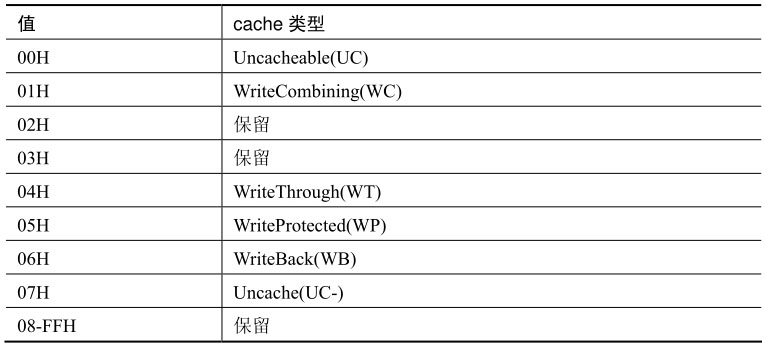
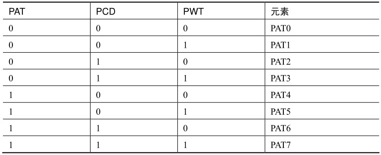
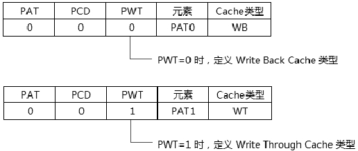

<!-- @import "[TOC]" {cmd="toc" depthFrom=1 depthTo=6 orderedList=false} -->

<!-- code_chunk_output -->

* [0 基本原理](#0-基本原理)
	* [0.1 检测是否支持PAT功能](#01-检测是否支持pat功能)
* [1 PAT（Page Attribute Table）](#1-patpage-attribute-table)
	* [1.1 默认的PAT](#11-默认的pat)
	* [1.2 PCD（Page Cache Disable）标志位](#12-pcdpage-cache-disable标志位)
	* [1.3 PWT（Page Write Through）标志位](#13-pwtpage-write-through标志位)
* [2 PAT MSR](#2-pat-msr)
* [3 各级table entry的PCD及PWT标志](#3-各级table-entry的pcd及pwt标志)

<!-- /code_chunk_output -->

# 0 基本原理

在**x86/x64**里可以为**一个物理地址区域**定义一个**内存的cache类型**，**每个cache类型**对应**一个值**。在Intel处理器上这个cache类型可以为以下类型。

定义一个**物理地址区域的cache类型**，可以使用以下两种方法。

① 使用**MTRR**来定义。

② 使用**page的PAT、PCD与PWT标志**来定义。

使用MTRR可以对Fixed\-range和Variable\-range进行定义，详见7.2节描述。

## 0.1 检测是否支持PAT功能

使用CPUID.01H：EDX[16].PAT位来检测**处理器是否支持PAT功能**，在**不支持PAT功能**的处理器上将**使用默认的cache类型**。

在支持PAT功能后，可以在**指向最终page frame的table entry**（即**PTE或PDE.PS=1时的PDE，或者PDPTE.PS=1时的PDPTE**）的**PAT位置位**，**开启Page Attribute Table定义**。

# 1 PAT（Page Attribute Table）

PAT由**8个元素**构成，分别为PAT0到PAT7，如下表所示。

上表中的**PAT、PCD和PWT**对应于**page的PAT、PCD和PWT标志位**，由这三个标志位组合为0到7的数值，**对应一个PAT元素**。

## 1.1 默认的PAT

处理器在上电或reset后，PAT内的元素使用**默认的内存cache类型**。

在**不支持PAT功能**时，使用**PCD和PWT标志组合**成**2位的值0～3**，**对应于PAT的PAT0到PAT3元素(！！！**)。当**支持PAT功能**时，可以使用**WRMSR指令**修改默认PAT中的cache类型。

## 1.2 PCD（Page Cache Disable）标志位

PCD标志位**指示page是否可被cache**，如下图所示。

在默认的PAT里，PCD=0时，定义可被cache的类型。PCD=1时，定义uncache（不可cache）类型，此时根据PWT标志确定属于UC-（弱）还是UC（强）。

## 1.3 PWT（Page Write Through）标志位

PWT标志位**指示page是WriteThrough还是WriteBack的cache类型**，如下图所示。

# 2 PAT MSR

在**MSR**中提供了一个**64位**的**IA32\_PAT寄存器用来定义PAT**，如下图所示。

IA32\_PAT寄存器的**每个字节**对应一个**PAT元素(！！！**)，所定义的Cache类型必须是**有效的cache类型（保留的必须为0值**）。如前面所述，在处理器power\-up或reset时，这个IA32\_PAT里的元素使用默认的cache类型。

**IA32\_PAT寄存器的地址是277H**，软件可以在**0级权限**下使用**WRMSR指令**对IA32\_PAT寄存器进行重新设置。

# 3 各级table entry的PCD及PWT标志

**PAT标志只使用于page frame**上，而PCD和PWT标志可以使用在所有的table entry结构和CR3里。因此有下面的关系。

① CR3里的PCD和PWT标志控制PML4T的cache类型（IA\-32e paging模式下），以及PDT的cache类型（32位paging模式下）。

② 在PAE paging模式下，PDPTE在PDPTE寄存器里保存，因此无须对PDPT进行cache。

③ 在IA\-32e paging模式下，PML4E的PCD和PWT控制PDPT的cache类型。

④ 在IA\-32e paging模式下，PDPTE的PCD和PWT控制PDT的cache类型。如果是1G页面映射的，PDPTE的PAT、PCD和PWT将控制1G page frame的cache类型。

⑤ 在PAE paging模式下，4个PDPTE寄存器分别控制PDT的cache类型。

⑥ PDT的PCD和PWT标志控制PT的cache类型。如果是2M或4M页面映射的，PAT、PCD和PWT将控制page frame的cache类型。

⑦ 最后，PTE的PAT、PCD和PWT标志将控制4K page frame的cache类型。

值得注意的是它们三者的排列组合必须严格按照上面的PAT所示、PAT，PCD，再到PWT标志。