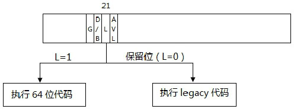

<!-- @import "[TOC]" {cmd="toc" depthFrom=1 depthTo=6 orderedList=false} -->

<!-- code_chunk_output -->

* [1 兼容性](#1-兼容性)
* [2 在64位系统上执行legacy代码](#2-在64位系统上执行legacy代码)
* [3 编译器的职责](#3-编译器的职责)

<!-- /code_chunk_output -->

由于是在x86上扩展为64位技术，在x64的设计上的两个原则是：照顾**兼容性**和在**long\-mode**里能够平滑无缝地兼容**执行legacy模式的代码**。它们是x64体系最为成功的地方。

# 1 兼容性

在支持**x64架构**的处理器上，**软件**可以选择使用**legacy模式**（即原来的x86模式），也可以**开启long\-mode进入64位**的环境。

# 2 在64位系统上执行legacy代码

引进了**64位模式**和**compatibility模式**，使得在一个全新设计的**64位OS系统**里可以平滑地执行**原有的32位代码**或**16位代码**。

如上所示，在**legacy模式**下**code segment descriptor(代码段描述符！！！**)的**bit 21位是保留位**，当**开启long mode（这个位不是开启位！！！**)后，处理器对bit 21的解释为**L标志位**。

在**x64体系**里利用这个**bit 21位**来切换**64位模式**和**compatibility模式**，当**L=1**时进入**64位模式**，当**L=0**时进入**compatibility模式**。

在一个**64位的OS系统**设计里，系统的**核心执行模块**是运行于**64位模式**的，64位的用户软件执行在64位模式，而legacy用户软件执行在**compatibility模式**。

对于**64位的代码**来说，它的**code描述符**的**bit 21为1**；对于**legacy模式的代码**来说，它的**code描述符**的**bit 21为保留位**（**L=0**）。因此，在OS系统加载目标软件执行时处理器自动进行切换，将进入64位模式执行64位代码还是进入compatibility模式执行legacy代码。

# 3 编译器的职责

在64位的系统上，通常**编译器**还可以为源代码**选择编译为32位还是64位**，从而分别为它们**链接到32位或64位的库**。