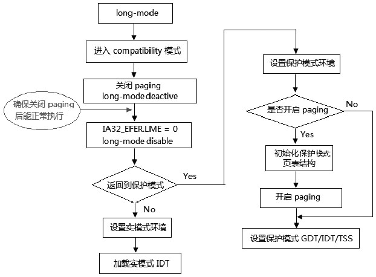

- 0 基本原理
- 1 退出long\-mode的制约条件

# 0 基本原理

退出long-mode的情景比进入long\-mode要复杂。因为，我们需要确保退出long\-mode能保持正常的运作。



上面是退出long\-mode的简要流程，我们看到可以分为两大类：退出long\-mode返回到保护模式或者返回到实模式。

值得注意的是，当关闭paging机制时，我们需要保持后续的执行流能够得到正常的执行，也就是说，失去页的映射后，后续的指令地址还是正确的。要达到这个要求，我们必须在关闭paging前，额外提供一对一的页映射模式（虚拟地址和物理地址一一对应，它们是相等的）。

# 1 退出long-mode的制约条件

同样，由于long\-mode的enable与active状态。我们在退出long\-mode时，也要遵循它的制约条件。

① 在关闭long\-mode（IA32\_EFER.LME=0）前，必须先使long\-mode处于deactive（非活动）状态，即先关闭paging机制。

② 在关闭paging机制前，必须先退出64位模式（CS.L=1），也就是说，必须先使CS.L=0（即先切换到compatibility模式）。

③ 在关闭PAE分页模式前，必须先关闭paging机制。也就是说，不能在long-mode active的状态下对CR4.PAE进行修改。

因此，如上所示，最关键的退出的操作次序如下。

① 切换到compatibility模式。

② CR0.PG=0关闭paging机制，使用long\-mode处于非激活状态。

③ IA32\_EFER.LME=0，关闭long\-mode。

>实验12-2：从long\-mode返回到实模式中。

这个实验是与实验12\-1对应的逆操作，实验的源码在topic12\ex12\-2\setup.asm文件里。

代码清单12\-3（topic12\ex12-2\setup.asm）：

```assembly
； 切换到 compatibility 模式
      jmp DWORD far [compatibility_pointer]
compatibility_pointer：
      dd compatibility_entry    ； 适用 Intel64和AMD64
      dw 08h        ； 16 位的compatibility 模式
； 以下是 16 位 compatibility 模式代码
      bits 16
compatibility_entry：
； 关闭 paging
      mov eax，cr0
      btr eax，31       ； CR0.PG=0
      mov cr0，eax
； 关闭 PAE
      mov eax，cr4
      btr eax，5       ； CR4.PAE=0
      mov cr4，eax
； 关闭 long-mode
      mov ecx，IA32_EFER
      rdmsr
      btr eax，8       ； IA32_EFER.LME=0
      wrmsr
； 保护模式环境
      mov ax，0x10      ； 加载为 16 位的描述符
      mov es，ax
      mov ds，ax
      mov ss，ax
      mov esp，0x7ff0
； 关闭 protecte-mode
      mov eax，cr0
      btr eax，0        CR0.PE=0
      mov cr0，eax
      jmp 0：real_entry     ； 刷新 CS
real_entry：
； 设置实模式环境
      mov ax，0
      mov es，ax
      mov ds，ax
      mov ss，ax
      mov sp，0x7ff0
； 加载实模式的 IVT
      lidt [IVT_POINTER]     ； 加载实模式的 IVT 表
      mov si，msg4
      call puts       ； 打印实模式下的测试信息
      jmp $
```

这里直接切换到16位的compatibility模式（L=0并且D=0）。在返回到实模式前，必须要对各个段寄存器进行加载，加载的段描述符需要符合：DPL为0值，以及limit为64K的段限。

显然，这些属性是为实模式而准备的，当然如果还是使用4G的段限，那么这个实模式属于big\-real mode或者说unreal-mode形式（即实模式下访问4G的空间）。

下面是在Bochs中运行的结果。

