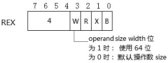
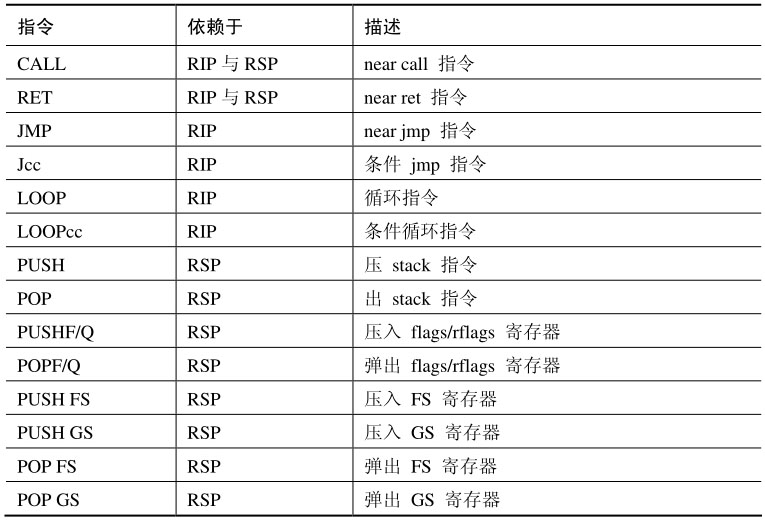
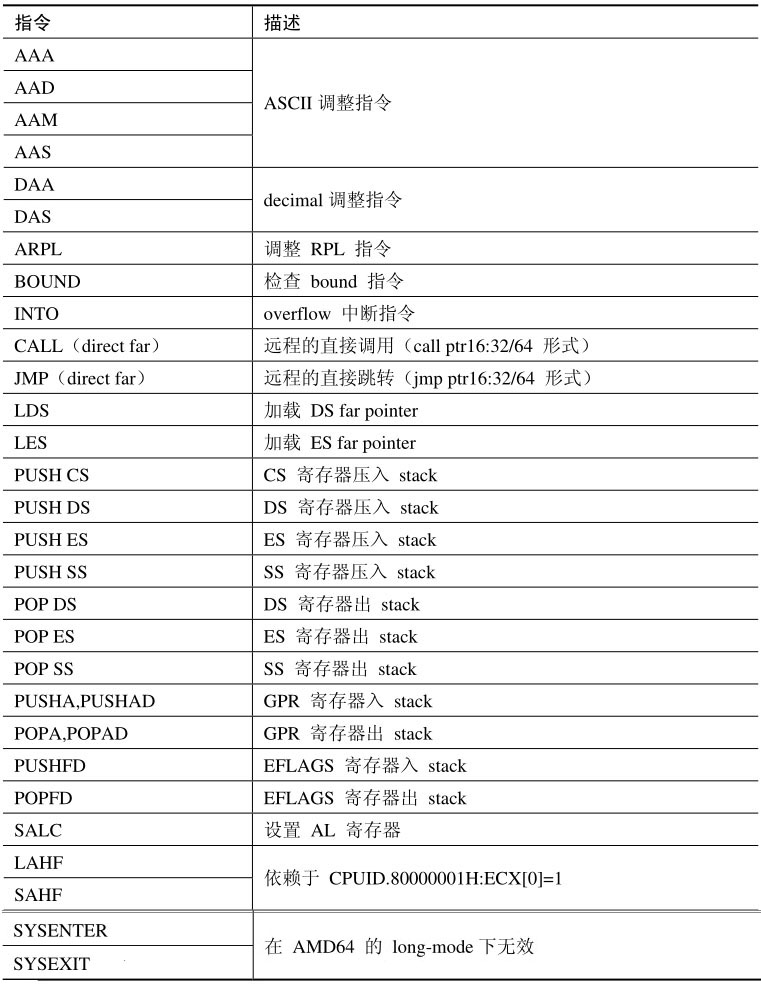

- 0 概述
- 1 64位模式的操作数
    - 1.1 默认操作数大小
    - 1.2 默认操作数为64位的指令
- 2 64位模式下的无效指令
- 3 64位模式下的寻址模式
    - 3.1 默认地址大小
    - 3.2 stack address size（栈地址大小）
    - 3.3 stack address（栈地址）与operand address（操作数地址）
    - 3.4 指令指针size与operand size

# 0 概述

在x86/x64体系的指令执行环境中，有几个知识是很重要的：**operand\-size（操作数大小**），**address\-size（地址大小**），**stack\-address size（栈地址大小**），以及**instruction pointer size（指令指针大小**）。

# 1 64位模式的操作数

在long\-mode下，当CS.L=1并且CS.D=0时，处理器将运行在64位模式。可是并不代表指令的操作数是64位的。

## 1.1 默认操作数大小

在64位模式下，仅有**少数指令的默认操作数是64位**，**大多数指令**的默认操作数仍是**32位**的。在默认操作数为32位的情况下，访问**64位的操作数**必须使用**REX prefix**。

在**64位模式**下指令可以使用16位的操作数，但是在下面的情形里是不能使用32位的操作数的：

- 当指令的default operand size（默认操作数）是64位的情况下，指令不能通过operand override perfix来使用32位的操作数。

下表总结了64位模式下指令操作数的使用情况。


在上面这个表格里，我们看到了64位模式下的两种default operand size（默认操作数大小）：64位和32位。

当指令的默认操作数是64位时，使用64位的操作数无须加上REX prefix（前缀），使用66H prefix可以改写为16位的操作数，如下所示。

```assembly
bits 64    ； 为 64位模式编译
push ax    ； 加上 66H prefix
push eax   ； 无效的操作数！不能使用 32位的操作数
push rax   ； 无须加prefix
```

这条push指令的默认操作数是64位的，那么push eax这条指令是错误的（无效的32位操作数）。

当指令的默认操作数是32位时，使用64位的操作数需要加上REX prefix（REX.W=1），这个REX前缀的W标志必须为1值。



关于x64体系指令的详细讲解请参考笔者站点www.mouseos.com/x64/default.html上的相关内容。

```assembly
bits 64     ； 为 64位模式编译
mov ax，bx    ； 加上 66H prefix
mov eax，ebx   ； 无须加 prefix
mov rax，rbx   ； 加上 48H prefix
```

这条mov指令在64位模式下的默认操作数为32位，因此使用64位的操作数，编译器会生成一个REX prefix（48H）。

## 1.2 默认操作数为64位的指令

少数指令的默认操作数是64位的，这些指令分为两大类：依赖于RIP指针的near branch（近程分支）指令，以及依赖于RSP指针的stack操作指令。



这些64位操作数的指令不使用far pointer（远程指针），而使用far pointer类的分支指令（如：retf指令与iret指令）默认操作数是32位的。

```assembly
db 48h       ； 在64位模式下手工加上 REX.W=1
retf       ； far ret 指令
```

编译器不支持RETFQ（类似这种64位的助记符）形式，需要使用64位的操作数时，必须手工加上REX prefix。不像IRETQ指令（支持64位的助记符），编译器会帮我们加上REX prefix。

# 2 64位模式下的无效指令

部分指令在64位模式下将是无效的，如下表所示。



SALC这条指令比较奇怪，在AMD的opcode表上出现但并没对指令进行说明。在Intel上是不存在的。LAHF和SAHF指令在64位模式下依赖于CPUID.80000001H：ECX[0]的值是否为1。

而在AMD64平台上，SYSENTER和SYSEXIT指令只支持在legacy模式上使用，在long\-mode是无效的。在Intel64平台上，SYSCALL和SYSRET指令仅支持在64位模式下。

# 3 64位模式下的寻址模式

64位的寻址模式在32位寻址模式的基础上扩展而来，最大的区别是：所有base和index寄存器都扩展为64位寄存器，并新增了一个RIP-relative（RIP相对）寻址。

## 3.1 默认地址大小

在64位模式下，指令的default address size（默认地址大小）是64位的，这与default operand size（默认操作数大小）有很大的区别。


指令的默认地址大小同样由CS.L和CS.D标志决定。

① 当CS.L=1并且CS.D=0时，默认的地址是64位。

② 当CS.L=0并且CS.D=1时，在compatibility模式下，使用32位的默认地址。

③ 当CS.L=0并且CS.D=0时，在compatibility模式下，使用16位的默认地址。

在64位模式下，16位的地址是无效的。使用32位的地址，必须加上67H前缀（address override prefix）。

```assembly
bits 64
mov rax，[esi]    ； 64位模式下使用 32 位的地址
```

在上面这条指令里，使用了32位的地址值，编译器在生成机器指令时会加入67H前缀。

## 3.2 stack address size（栈地址大小）

在64位模式下，stack地址大小（即RSP 寄存器代表的stack pointer值）固定为64位，并不因为使用67H前缀而改变。

```assembly
bits 64
push rax      ； 隐式使用64位 rsp 指针
db 67h       ； 企图改变栈地址，实际上是改变操作数地址
push rax      ； 固定使用 64 位的 stack address 值
```

在上面示例的最后一种情形里，企图加上67H前缀更改stack address大小，这将是失败的。push rax指令使用固定的64位RSP值。这是因为stack address（栈地址）和operand size（操作数地址）有本质区别，后面我们将看到。

## 3.3 stack address（栈地址）与operand address（操作数地址）

stack地址大小与指令操作数地址大小是不同的概念：operand address size是指操作数的寻址，stack address size是指stack的地址宽度，如下面代码所示。

```assembly
mov rax，[esp]    ； operand address size 是32 位
mov rax，[rsp]    ； operand address size 是 64 位
push qword [eax]   ； stack address 是 64位，operand address 是32 位
```

我们看到最后一条指令push qword [eax]将出现两个address size：operand address size，以及stack的address size。

Stack address大小是由SS寄存器的B标志位决定，在legacy模式和compatibility模式下，B=1时属于32位的ESP指针，B=0时是16位的SP指针。

然而在64位模式下，SS寄存器的B标志位是无效的，RSP固定为64位。因此stack address大小固定为64位，不会被改变。

## 3.4 指令指针size与operand size

在这里同样遭遇了“栈地址与操作数地址”的问题，Instruction pointer（指令指针）RIP值如同stack pointer（栈指针）RSP值，在64位模式下固定为64位。

然而指令指针大小与操作数大小也是本质不同的事物。与push指令一样，jmp/call指令也会同时面对指令指针与操作数这两个事物。

```assembly
jmp eax    ； 不被支持
jmp ax    ； 操作数为16位，RIP指针固定为64位
jmp rax    ； 64 位的 RIP 值，操作数为64位
jmp offset32  ； 32 位offset 值符号扩展到64位加上RIP
```

当jmp/call指令提供寄存器和内存操作数时，在64位模式下32位的操作数不被支持。在jmp ax这条指令里，它的操作数是16位，ax寄存器的值最终会被零扩展到64位然后加载到RIP里。