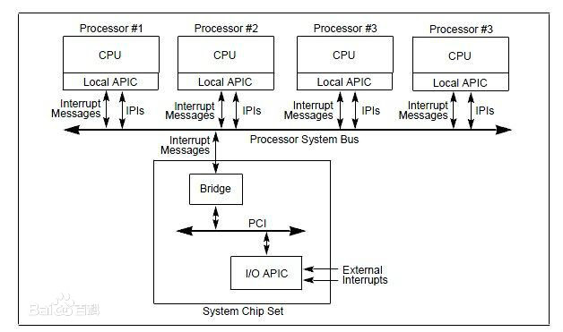

- 1 概述
    - 1.1 Local APIC
    - 1.2 I/O APIC
- 2 local APIC接收到的中断源
    - 2.1 本地中断源
        - 2.1.1 连接到LINT0和LINT1口的中断源
        - 2.1.2 CMCI
        - 2.1.3 APIC timer中断
        - 2.1.4 Thermal sensor中断
        - 2.1.5 Performance monitoring counter中断
        - 2.1.6 APIC内部错误产生中断
    - 2.2 外部中断
    - 2.3 处理器间的消息
- 3 APIC体系的版本
    - 3.1 APIC与xAPIC
    - 3.2 x2APIC

# 1 概述

**引入APIC机制**是为了**适应multiple processor（MP，多处理器**）环境。

**整个APIC体系**可以分为两大部分：**Local APIC**和**I/O APIC**，**Local APIC是整个APIC体系的核心**，它在**处理器的内部**；而**I/O APIC是芯片组的一部分**，它在**PCI\-to\-ISA bridge**（或称**PCI\-to\-LPC bridge**）的**LPC控制器内**。

处理器内部的**Local APIC**通过**system bus**接受来自**处理器间的中断消息（IPI**）和**外部的中断消息（包括I/O APIC及外部设备**）。

## 1.1 Local APIC

**每个logical processor（逻辑处理器**）都有自己的**local APIC**，每个local APIC包括了**一组local APIC寄存器**，用来**控制local和external中断的产生、发送和接收**等，也**产生和发送IPI（处理器间的中断消息**）。**local APIC寄存器**组以**内存映射形式(不是I/O映射方式**)映射到**物理地址空间**上，因此软件可以使用**MOV指令**进行访问。

然而在**x2APIC模式**上local APIC**寄存器映射到MSR寄存器组**来**代替映射内存**，软件使用**RDMSR和WRMSR指令**来**访问local APIC寄存器**。

如下所示，这是在支持**Intel Hyper-Threading Technology的MP系统**上，**两个logical processor（线程**）共享**一个processor core**执行单元。

**每个local APIC**有自己的**local APIC ID**，这个ID决定了**logical processor**在**system bus上的地址**，可以用于**处理器间的消息接收和发送**，也可用于**外部中断消息的接收**。

## 1.2 I/O APIC

典型地，**8259兼容类**的**legacy中断控制器**是在**uni\-processor（单处理器**）系统上使用，已**不能适应于多处理器环境**，而**I/O APIC**能适用于**multi\-porcessor（多处理器**）环境上。**I/O APIC**可以发送中断消息到**指向的logical processor**上。

**I/O APIC属于芯片组的一部分**，现称为**PCH（Platform controller Hub**），位于**PCI\-to-ISA bridge（南桥芯片**）的**LPC控制器上**。I/O APIC也有自己的**寄存器**，同样也以**内存映射形式**映射到**物理地址空间**上。

# 2 local APIC接收到的中断源

local APIC可以接收的中断源有：**local interrupt（本地中断**），**extern interrupt（外部中断**），以及**inter-processor interrupt message（IPI，处理器间的中断消息**）。

## 2.1 本地中断源

local APIC有**一组LVT（local vector table）寄存器**用来**产生和接收(！！！)local interrupt source**。

### 2.1.1 连接到LINT0和LINT1口的中断源

由**LVT的LINT0和LINT1寄存器**对应着**处理器的LINT0和LINT1 pin(Local APIC在CPU内部**)，它们可以**直接接收外部I/O设备**或**连接8259兼容类的外部中断控制器**。

典型地，LINT0作为处理器的INTR pin接着外部8259类的中断控制器的INTR输出端，LINT1作为处理器的NMI pin接着**外部设备的NMI请求**。

### 2.1.2 CMCI

**CMCI（corrected machine\-check error interrupt**）是**machine\-check机制**上的一个增强功能。从**处理器模型为06\_1A**的处理器开始支持。允许在处理器的corrected machinecheck error（**修正的机器检查错误**）的**count计数**达到一个**临界值**时，产生一个CMCI中断来报告信息。

### 2.1.3 APIC timer中断

local APIC的**LVT timer寄存器**可以被编程来产生**APIC timer中断**。

### 2.1.4 Thermal sensor中断

LVT **thermal monitor寄存器**可以被编程来产生由**温度传感器触发的中断**。

### 2.1.5 Performance monitoring counter中断

**PMI（performance monitoring interrupt**）由LVT的**performance monitor寄存器**编程支持，在使用**性能监控**时由**counter溢出而产生中断**。

### 2.1.6 APIC内部错误产生中断

LVT **error寄存器**记录着**APIC内部发生的错误**，当检测到LVT error错误时**产生中断**。

## 2.2 外部中断

芯片组上的**I/O APIC**接收来自**连接到它的IRQ线**上的**I/O设备中断请求**后，产生**中断消息**经过**host bridge**通过**system bus**发送到**目标processor core的local APIC处理**。

## 2.3 处理器间的消息

**system bus**上的**logical processor**可以使用**local APIC**的**ICR（interrupt command register**）发送一个**中断**给**自已**或**其他logical processor**，也可以发送中断到**一组logical processor**。

# 3 APIC体系的版本

APIC经历了**4个版本**，如下表所示。

最初的APIC属于**外部设备**，以外部的82489DX芯片形式存在。在P6家族和Pentium处理器后，以**APIC on Chip形式**存在，引入了**处理器内部的local APIC架构**，和82489DX 外部APIC相比较功能得到了扩展和增强。

Pentium 4和Intel Xeon处理器在APIC的基础上进一步扩展，形成了xAPIC体系，以及最后在xAPIC基础上再一次扩展的x2APIC体系。

## 3.1 APIC与xAPIC

在P6和Pentium处理器使用的APIC版本里，**处理器之间**以及**local APIC与I/O APIC间**的通信通过**APIC bus**。而Peutium 4后续处理器基于扩展的**xAPIC**版本使用**system bus代替APIC bus**，APIC上的功能在xAPIC上得到扩展和修改。现在常用的是xAPIC版本。

## 3.2 x2APIC

x2APIC是进一步扩展的版本，并向下**兼容xAPIC**，新增了**一组MSR寄存器来代替内存映射的寄存器**。在x2APIC中处理器的**ID地址被扩展为32位**，后面我们将讨论到x2APIC ID。