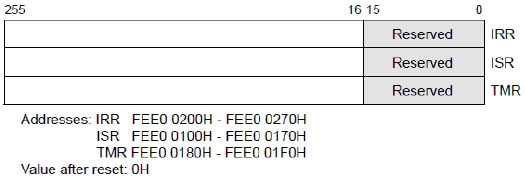
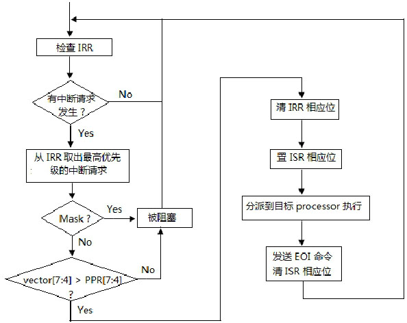

<!-- @import "[TOC]" {cmd="toc" depthFrom=1 depthTo=6 orderedList=false} -->

<!-- code_chunk_output -->

* [1 两类中断源](#1-两类中断源)
	* [1.1 local interrupt（本地中断源）的处理](#11-local-interrupt本地中断源的处理)
	* [1.2 system bus上中断消息的处理](#12-system-bus上中断消息的处理)
* [2 检查目标](#2-检查目标)
* [3 IRR和ISR仲裁](#3-irr和isr仲裁)
	* [3.1 IRR寄存器的状态](#31-irr寄存器的状态)
	* [3.2 从IRR中取出最高优先级的中断请求](#32-从irr中取出最高优先级的中断请求)
	* [3.3 ISR寄存器的状态](#33-isr寄存器的状态)
	* [3.4 是否被屏蔽](#34-是否被屏蔽)
	* [3.5 判断优先级](#35-判断优先级)
	* [3.6 清IRR相应位](#36-清irr相应位)
	* [3.7 置ISR相应位](#37-置isr相应位)
* [4 发送EOI命令](#4-发送eoi命令)

<!-- /code_chunk_output -->

# 1 两类中断源

在system bus上的所有处理器都能接收来自local APIC的本地中断源，来自system bus上的中断消息以及外部设备的I/O中断源。

## 1.1 local interrupt（本地中断源）的处理

local APIC的**LVT寄存器能产生中断**，LVT **LINT0能接收外部8259中断控制器的中断请求**，LVT **LINT1能接收外部设备的NMI中断请求**。

LVT寄存器产生的**本地中断源处理**上与**system bus上接收的中断消息有些不同**，下图描述了对**本地中断处理(！！！**)的简要流程。


注: 图有些问题, 根据Intel手册, 所有具有NMI，SMI，INIT，ExtINT，start\-up或INIT\-deassert传送模式的中断都会绕过IRR和ISR寄存器，并直接发送到处理器内核进行处理, 像下面system bus图一样。

IRR相应位代表Local APIC接收了中断但还未提交到CPU进行处理. 当Local APIC接收到一个中断, 设置其对应的IRR相应位. 当CPU准备处理下一个中断, Local APIC清除IRR上的最高位, 设置ISR的相应位, 然后将中断提交到处理器进行处理. 当CPU处理最高级别中断, Local APIC通过设置IRR相应位来接收其它fixed中断. 当中断处理程序发出写EOI寄存器, Local APIC就会清除ISR最高位. 然后, Local APIC又清除IRR中最高位, 设置ISR相应位, 处理器进入下一次的中断处理.

对于除NMI，SMI，INIT，ExtINT，start\-up或INIT-Deassert传送模式之外的所有中断，**中断处理程序**必须包括对**中断结束（EOI）寄存器**的写入。此写操作必须在**处理程序例程的末尾**，在**IRET指令之前**的某个时间发生。此操作表示当前中断的服务已完成，本地APIC可以从ISR发出下一个中断。

收到EOI后，Local APIC**清除ISR中的最高优先级位**，并将下一个最高优先级中断发送给处理器。如果终止的中断是**电平触发的中断！！！**，则L**ocal APIC**还向**所有I/O APIC**发送**中断结束消息(end-of-interrupt message！！！**)。

注意: EOI寄存器和EOI消息是两回事！！！.

另: 

**本地中断源受LVT寄存器的mask（屏蔽）位影响**，当LVT寄存器的mask位置位时，本地中断源将被屏蔽不能被响应。

同时，本地中断受到**IRR**（Interrupt Request Register）、**ISR**（In-Service Register）的仲裁影响，这部分的处理与**system bus**上使用**Fixed交付模式**的中断消息处理是一致的。

## 1.2 system bus上中断消息的处理

**system bus属于广播总线**, 也就是说**所有的system bus**上的消息**每个CPU都可以看得到**, 也都**可以处理**.

当local APIC接收到**system bus上中断消息**，包括**IPI消息**及**I/O APIC发送过来的中断消息**，local APIC将首先判断自己**是否属于中断消息请求的目标对象(！！！因为system bus是广播的！！！**)，正如我们前面的实验18-9里使用**logical目标模式**发送IPI消息时，local APIC将**比较destination field里的值**，判断自己**是否属于IPI消息的目标**。如果是，按下图的典型中断处理流程执行。


对于使用**SMI、NMI、INIT、ExtINT，以及Start\-Up的delivery mode**的中断请求，**无须经过IRR和ISR寄存器的仲裁规则**，直接发送processor core进行处理。

# 2 检查目标

local APIC接收到**system bus**上来自I/O APIC的中断消息或者IPI（处理器间消息）后，需要检查**是否在消息发送的目标**内。而local APIC**本地产生的中断源**（即**由LVT寄存器产生的中断**）则不存在这个问题。

如前面的IPI机制所述，**IPI消息目标的确定**依赖于**shorthand或no shorthand类型**，还包括physical目标模式和logical目标模式。

# 3 IRR和ISR仲裁

对于使用Fixed交付模式的system bus上的中断消息以及本地中断，local APIC将使用**IRR（Interrupt Request Register，中断请求寄存器**）和**ISR（In-Service Register，服务状态寄存器**）进行**仲裁**。实际上还要**受TPR（Task Priority Register）和PPR（Processor Priority Register**）的影响，关于这两个寄存器请参考18.9节描述。



IRR和ISR仅仅用于Fixed中断, 所有具有NMI，SMI，INIT，ExtINT，start\-up或INIT\-deassert传送模式的中断都会绕过IRR和ISR寄存器，并直接发送到处理器内核进行处理.

触发模式寄存器（TMR）指示中断的触发模式. 在Local APIC接收到IRR的中断, 对于edge触发的中断相应位清零, 对于level触发的中断相应位置一. 如果在生成相应中断向量的EOI周期时TMR位被置1，则会向所有I/O APIC发送EOI消息。

**IRR、IRR及TMR（Trigger Mode Register，触发模式寄存器**）的**每1位对应一个中断vector**，共256位，对应256个vector。当**中断请求发生**，local APIC接受了中断请求并**在IRR相应的位置位**，则在IRR中**有多少个位置位**表示local APIC已经**接受了多少个中断请求**。



## 3.1 IRR寄存器的状态

IRR相应位代表接收了中断但还未提交到CPU进行处理. 当Local APIC接收到一个中断, 设置其对应的IRR相应位. 当CPU准备处理下一个中断, Local APIC清除IRR上的最高位, 设置ISR的相应位, 然后将中断提交到处理器进行处理. 当CPU处理最高级别中断, Local APIC通过设置IRR相应位来接收其它fixed中断. 当中断处理程序发出写EOI寄存器, Local APIC就会清除ISR最高位. 然后, Local APIC又清除IRR中最高位, 设置ISR相应位, 处理器进入下一次的中断处理.

**local APIC会不断地检查IRR(！！！**)，看是否有中断需要处理，IRR会出现下列情况。

① IRR为0，表示没有中断请求发生。

② IRR有1个或数个位被置位，表示有1个或数个中断请求需要处理。

当处理器在运行着中断服务例程时，可能会不断有新的中断请求发生，IRR只能接受一个vector号对应的中断请求。当一个中断请求发生而IRR相应位已经被置位，这个中断请求可能会被忽略。

当**IRR寄存器取的中断**发分派到**处理器执行**，IRR的**相应位会被自动清位**，local APIC**可以通过设置IRR相应位重新接受这个vector的中断请求**。

## 3.2 从IRR中取出最高优先级的中断请求

当IRR记录着有**数个中断请求**时，local APIC抽取出**最高优先级的中断请求**，依据vector的大小来决定。

```x86asm
bsr eax，IRR   ； 从 IRR得到被置位的最高位
```

local APIC从IRR中找到**为1的最高位**，这个位就是**最高优先级中断的vector值**。

## 3.3 ISR寄存器的状态

local APIC会记录在已经分派给处理器正在处理的中断请求，ISR同样会有下列状态。

① ISR为0，表示没有中断服务例程在执行。

② ISR有1个或数个位被置位，表示有1个或数个中断服务例程正在执行。

出现有**数个中断服务例程在执行**是由于前一个中断服务例程在运行期间，有**更高优先级别的中断请求发生**并且**处理器没有关闭中断**，local APIC分派这个更高优先级的中断请求给处理器执行。然后会中断当前正在执行的中断处理程序, 处理更高优先级的中断. 当完成更高优先级处理后, 恢复被中断的中断服务.

前一个中断服务例程**尚未执行完毕（未发送EOI命令给local APIC**），ISR的相应位还未被清位。当高优先级的中断服务例程执行完毕后返回到被前一个被中断的中断服务例程继续执行，才有机会发**EOI命令进行清位**。

## 3.4 是否被屏蔽

对于**可屏蔽的中断请求（LVT寄存器的local interrupt源，以及Fixed交付模式的IPI消息！！！**），下面的情形下可以被屏蔽。

① **eflags.IF被清位**，则所有可屏蔽的中断都被屏蔽。

② **LVT寄存器的mask位被置位**，将屏蔽对应的中断请求。

system bus上的**IPI消息（使用Fixed delivery模式**）也受到IF标志位的影响。值得注意的是，当**中断服务例程使用Interrupt-\gate**时，进入中断服务例程**处理器会自动清IF标志，屏蔽新的中断请求**。

当中断请求被屏蔽，处理器将阻塞中断请求的执行，直至条件允许。

## 3.5 判断优先级

local APIC将**从IRR抽取出来的最高优先级中断请求**和“**处理器当前优先级**”进行比较，如前面所述，处理器**当前优先级**记录在**PPR（Processor Priority Register**）里。

当IRR寄存器记录的中断请求优先级高于PPR寄存器里的中断门坎值时，**中断请求将得到响应**。否则将处理pending状态悬挂着。

## 3.6 清IRR相应位

当IRR记录的**中断请求被允许响应**时，local APIC将**清IRR的相应位**，表示该中断请求得到响应。

## 3.7 置ISR相应位

local APIC将在**ISR相应位置位**指示**该中断请求正在执行**，并提交到处理器core去执行中断处理程序。

# 4 发送EOI命令

在使用**Fixed delivery模式**时，每次**执行完中断处理程序**必须**发送EOI命令到local APIC**，通过将**local APIC的EOI寄存器置0(程序员操作！！！**)实现, 

```x86asm
mov DWORD [APIC_BASE + EOI]，0  ； 发送 EOI 命令
```
发送EOI命令，使得**local APIC将清ISR寄存器的相应位(当EOI寄存器为0时, Local APIC会自动操作！！！不是设置寄存器的delivery status位！！！**)，指示中断服务例程已经完成。

对于除NMI，SMI，INIT，ExtINT，start\-up或INIT-Deassert传送模式之外的所有中断，**中断处理程序**必须包括对**中断结束（EOI）寄存器**的写入。此写操作必须在**处理程序例程的末尾**，在**IRET指令之前**的某个时间发生。此操作表示当前中断的服务已完成，本地APIC可以从ISR发出下一个中断。

收到EOI后，Local APIC**清除ISR中的最高优先级位**，并将下一个最高优先级中断发送给处理器。如果终止的中断是**电平触发的中断！！！**，则L**ocal APIC**还向**所有I/O APIC**发送**中断结束消息(end-of-interrupt message！！！**)。

系统软件可能更倾向于将EOI引导到特定的I/O APIC，而不是让本地APIC向所有I / O APIC发送中断结束消息。

软件可以通过设置Spurious Interrupt Vector Register的第12位来禁止广播EOI消息。如果该位置1，即使相关的TMR位指示当前中断是电平触发，也不会在EOI周期产生广播EOI。该位的默认值为0，表示执行了EOI广播。