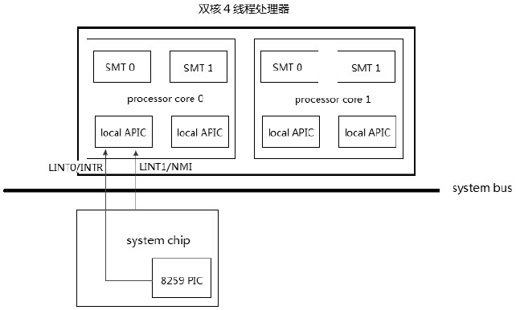
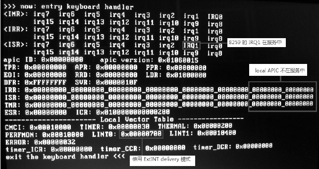

<!-- @import "[TOC]" {cmd="toc" depthFrom=1 depthTo=6 orderedList=false} -->

<!-- code_chunk_output -->

* [1 LINT0与LINT1寄存器](#1-lint0与lint1寄存器)
	* [1.1 使用Fixed模式时](#11-使用fixed模式时)
	* [1.2 LINT0与LINT1的BIOS设置](#12-lint0与lint1的bios设置)
* [2 从LINT0屏蔽外部中断请求](#2-从lint0屏蔽外部中断请求)
* [3 从LINT1屏蔽NMI](#3-从lint1屏蔽nmi)
	* [3.1 通过NMI\_EN寄存器来屏蔽NMI](#31-通过nmi_en寄存器来屏蔽nmi)
	* [3.2 通过LINT1来屏蔽NMI](#32-通过lint1来屏蔽nmi)

<!-- /code_chunk_output -->

Local APIC接收的**外部中断源**其中一部分来自于**LINT0（Local Interrupt 0**）和**LINT1（Local Interrupt 1**）连接的**外部硬件**，如下所示。



在上图里，Intel的双核4线程处理器上**BSP（APIC ID为00H**）的LVT **LINT0连接到外部system chip（系统芯片**）里的**8259类的中断控制器INTR接口**。LVT **LINT1接连到system chip的NMI口**。

而实际中上面4个logical processor里剩余的**3个logical processor（application processor）的LINT0与LINT1被忽略**，它们**接收不到来自外部8259中断控制器和NMI接口的中断请求**，只能**接收来自I/O APIC的中断消息**。因此，8259中断控制器并**不适合在MP环境下使用，推荐使用I/O APIC在MP环境工作(！！！**)。

当**local APIC被disable**时，**LINT0**被直接作为处理器的**INTR pin使用**，**LINT1**被直接作为处理器的**NMI pin使用**。

# 1 LINT0与LINT1寄存器

LVT中的**LINT0与LINT1寄存器**是**最为复杂的寄存器**，比起其他的LVT寄存器，额外多了几个域：Interrupt Input Pin Polarity位，Remote IRR位，以及Tigger Mode位，如下所示。


**Trigger Mode（触发模式**）的设置只能使用在Fixed delivery模式下：置0时使用edge触发，置1时使用level触发。在NMI、SMI和INIT的delivery模式下，LINT0和LINT1固定使用edge触发模式；在ExtINT delivery模式下固定使用level触发模式，如下表所示。


Remote IRR位用来指示在Fixed delivery的level触发模式下中断服务例程是否正在执行（置位）中，当处理器收到EOI命令时Remote IRR位被清0。

## 1.1 使用Fixed模式时

典型地，LINT0与LINT1分别使用ExtINT和NMI delivery模式。当使用Fixed模式时，我们需要提供中断服务例程的vector，如下面代码所示。

```x86asm
mov eax，0x8000 | KEYBOARD_VECTOR  ； Fixed模式，level触发，vector=0x21
mov [APIC_BASE + LVT_LINT0]，eax  ； 设置 LINT0 寄存器
```

在代码里，我们使用了Fxied交付模式及level触发，并将整个LINT0的vector设置为IRQ1（keyboard中断）的中断请求vector值。因此在这种情况下，所有的8259中断控制器传过的中断请求使用同一个中断处理程序进行处理（例如：IRQ0的timer中断和IRQ1的keyboard中断）。

下面，我们看看在真实机器上的执行结果。


这个结果里面按下一个键由BSP处理器响应中断请求，进入了Keyboard中断处理程序，出现了下面几个现象。

① 当LINT0使用Fixed delivery模式时，local APIC将响应的是由LINT0引发的中断请求，而不是由8259中断控制器提交的中断请求。这时候8259中断控制器的IRR IRQ1在请求中，ISR IRQ1并没有得到响应（IRQ1不在服务中）。



我们对比一下上面使用ExtINT delivery模式下的运行结果，这个结果反映了当使用ExtINT交付模式时，处理器使用8259中断控制器提交的中断vector，结果表明8259的IRQ1正处于服务中（ISR的IRQ1被置位），而local APIC并没有在服务中。

② local APIC的ISR在服务中（vector为0x21）。

③ LINT0的值为0000C021H，表示使用Fixed交付模式及level触发，并且Remote IRR此时被置位，说明8259的中断通过LINT0正在服务中。

通过上面的实验，我们清楚了Fixed delivery与ExtINT delivery的区别及意义。

## 1.2 LINT0与LINT1的BIOS设置

在处理器INIT或Reset后，local APIC所有的LVT寄存器都被masked（屏蔽），而在BIOS运行期间会对LINT0和LINT1进行设置，因此在OS启动之前，LINT0和LINT1已经可以正常工作了。典型地，BIOS对LINT0和LINT1的设置如下表所示。


如前面所述：LINT0被用做连接到外部的8259类中断控制器，因此使用了ExtINT delivery模式，而LINT1被用做接收外部硬件的NMI信号，因此使用了NMI delivery模式。它们的vector都必须使用00H。

经过BIOS的设置后，LVT LINT0的值为00000700H（ExtINT交付模式），而LINT1的值为00000400H（NMI交付模式）。

由于mask位被清0，表示此时已经可以接收外部硬件的中断请求。

# 2 从LINT0屏蔽外部中断请求

由于LINT0连接到外部的8259中断控制器，于是当local APIC是处于enable状态时，可以通过LINT0来达到屏蔽来自8259中断控制器的外部中断请求。

因此，屏蔽来自8259中断控制器的硬件中断请求的方法可以归纳为下面几条。

① 对eflage.IF标志位进行清位，使用CLI指令或POPF指令置eflags.IF为0。

② 使用8259中断控制器的IMR（Interrupt Mask Register，中断屏蔽寄存器）进行相应的中断屏蔽。

③ 使用local APIC的LVT LINT0寄存器进行屏蔽。

上面几种屏蔽外部硬件中断是有很大区别的：对IF标志位进行清位操作将屏蔽所有的可屏蔽中断，包括local APIC和来自外部中断控制器的中断请求。

而使用8259中断控制器的IMR的屏蔽方式，将在8259中断控制器端来屏蔽某个或全部仅来自于8259中断控制器的中断请求。

使用local APIC的LINT0寄存器的屏蔽方式，将在local APIC端实现屏蔽功能。而8259中断控制器已经将中断请求发送到local APIC的LINT0里。

>实验18-13：通过LINT0屏蔽来自8259中断控制器的中断请求

在这里作为一个测试实验，我们通过对LINT0寄存器的bit 16置位从而屏蔽连接的外部8259中断控制器的中断请求。下面是测试的主体代码，完整代码在topic18\ex18-13\protected.asm文件中。

代码清单18-33（topic18\ex18-13\protected.asm）：

```x86asm
； 开启 8259 的 IRQ1 键盘中断请求许可
call enable_keyboard
mov esi，msg0
call puts
； 屏蔽 LINT 0
mov eax，[APIC_BASE + LVT_LINT0]  ； 读 LINT0 寄存器
bts eax，16        ； mask位置位
mov [APIC_BASE + LVT_LINT0]，eax  ； 写 LINT0 寄存器
call dump_lvt       ； 打印 LVT
sti          ； 打开中断许可
```

这个实验使用IRQ1的键盘中断来测试屏蔽LINT0寄存器后的效果，下面是在Core i5处理器的笔记本式计算机上的运行结果。


在这个实验里，8259中断控制器和IF中断标志都是允许中断产生的。而仅在LINT0被屏蔽的情况下，按下任意键来自8259中断控制器的IRQ1键盘中断请求将得不到处理器的响应。

# 3 从LINT1屏蔽NMI

由于LINT1直接连接到外部的NMI（不可屏蔽）请求，作为处理器的NMI pin使用。同样，可以通过屏蔽LINT1的方式对NMI进行屏蔽。

因此，要屏蔽NMI可以使用下面的方法。

① 可以通过芯片组（Intel的PCH芯片，或者说南桥芯片）LPC桥中的NMI_EN寄存器（I/O端口地址为70H）的设置来关闭NMI。

② 通过local APIC的LINT1寄存器来屏蔽NMI。

## 3.1 通过NMI\_EN寄存器来屏蔽NMI

在Intel的PCH（Platform Controller Hub）芯片组文档里显示，NMI_EN寄存器的

I/O端口地址为70H，这个I/O地址同时也是RTC（Real Time Clock）index寄存器。

下面的代码清单实现在inc\CPU.inc文件里，是关闭NMI的宏。

代码清单18-34（inc\CPU.inc）：

```86asm
；------------------------------------------------
； macro：NMI_DISABLE 关闭NMI请求
； description：
；   设置 NMI_EN 寄存器的 bit 7 为 1
；------------------------------------------------
%macro NMI_DISABLE 0
       in al，NMI_EN_PORT     ； port 0x70
       or al，0x80       ； disable all NMI source
       out NMI_EN_PORT，al
%endmacro
```

在NMI\_DISABLE宏里通过对I/O端口70H的bit 7进行置位而关闭所有的NMI请求源。

## 3.2 通过LINT1来屏蔽NMI

通过local APIC的LINT1寄存器bit 16位来屏蔽LINT1，从而达到屏蔽NMI，代码如下所示。

```x86asm
mov eax，[APIC_BASE + LVT_LINT1]    ； 读 LINT1 寄存器
bts eax，16          ； masked
mov [APIC_BASE + LVT_LINT1]，eax    ； 写 LINT1 寄存器
```

对LINT1屏蔽后，所有来自外部的NMI请求将得不到处理器的响应。

>实验18-14：通过LINT1屏蔽来自外部的NMI请求

同样，这里作为一个测试实验，实验的源代码在topic18\ex18-14\protected.asm文件里，下面是protcted.asm的部分代码。

代码清单18-35（topic18\ex18-14\protected.asm）：

```x86asm
NMI_ENABLE       ； 允许产生外部 NMI
mov esi，msg0
call puts       ； 打印信息
DO_NMI        ； 产生 NMI，第1次调用 NMI handler
mov esi，msg1
call puts
； 屏蔽 LINT1
mov eax，[APIC_BASE + LVT_LINT1]
bts eax，16       ； masked
mov [APIC_BASE + LVT_LINT1]，eax
call dump_lvt
call println
DO_NMI        ； 再次产生 #NMI 请求，将被屏蔽
jmp $
```
在这个代码里先开启NMI许可（目的是测试LINT1屏蔽后的效果），关键的地方是使用DO\_NMI宏来引发NMI的产生（这个宏实现在inc\CPU.inc文件里），从而调用NMI handler。

接下来屏蔽LINT1后，再使用DO_NMI来试图再次产生NMI，但这次的NMI将被屏蔽掉。

代码清单18-36（topic18\ex18-14\protected.asm）：

```x86asm
；-----------------------------------------
； #NMI handler
；----------------------------------------
nmi_handler：
       jmp do_nmi_handler
nmi_msg0 db '>>> now：enter the #NMI handler'，10，0
nmi_msg1 db 'exit the #NMI handler <<<'，10，0
do_nmi_handler：
       mov esi，nmi_msg0
       call puts
       call dump_apic     ； 打印 local APIC寄存器信息
       CLEAR_NMI      ； 清 NMI 状态
       mov esi，nmi_msg1
       call puts
       iret
```
在这个NMI handler里只是简单地打印所有local APIC寄存器的信息并清NMI状态，下面是在笔者的Core i5处理器笔记本式计算机上的运行结果。


在这个结果里，NMI handler只被调用了一次，就在屏蔽LINT1之前。当屏蔽LINT1后，再次使用DO\_NMI宏来引发NMI，这个NMI被屏蔽，NMI handler没有被调用。

在这个实验里，我们看到已经成功通过LINT1来屏蔽外部的NMI请求。