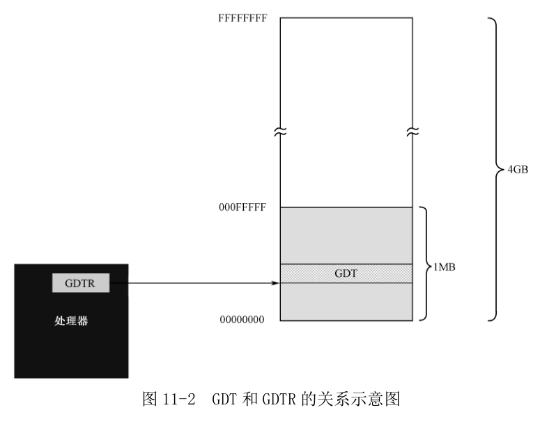

处理器将内存划分成逻辑上的段，并在指令中使用段内偏移地址。在保护模式下，对内存的访问仍然使用段地址和偏移地址，但是，在每个段能够访问之前，必须先进行登记。登记的信息包括段的起始地址、段的界限等各种访问属性。当你访问的偏移地址超出段的界限时，处理器就会阻止并产生内部异常的中断。

和一个段有关的信息需要 8 个字节来描述，所以称为段描述符（Segment Descriptor），每个段都需要一个描述符。在内存中开辟出一段空间，在这段空间里，所有的描述符都是挨在一起，集中存放的，这就构成一个描述符表。

在进入保护模式前，必须要定义全局描述符表。

为了跟踪全局描述符表，**处理器内部有一个48位的寄存器，称为全局描述符表寄存器（GDTR）。该寄存器分为两部分，分别是32位的线性地址和16位的边界**。32位线性基地址部分保存的是全局描述符表在内存中的起始线性地址，16位边界部分保存的是全局描述符表的边界（界限），其在数值上等于表的大小（总字节数）减一。

第1字节的偏移量是0，最后1字节的偏移量是表大小减一。如果界限值为0，表示表的大小是1字节。

GDT界限是16位，该表最大是2\^16 字节，也就是65536 字节（64KB）。因为一个描述符占 8 字节，故最多可以定义8192（2\^13，刚好是16位选择符中13位表示identifier）个描述符。

理论上，全局描述符表可以位于内存中的任何地方。但是，如图11-2所示，由于在**进入保护模式之后**，处理器**立即要按新的内存访问模式工作**，所以，**必须在进入保护模式之前定义GDT**。但是，**由于在实模式下只能访问1MB的内存，故GDT通常都定义在1MB以下的内存范围中**。当然，允许在进入保护模式之后换个位置重新定义 GDT。

