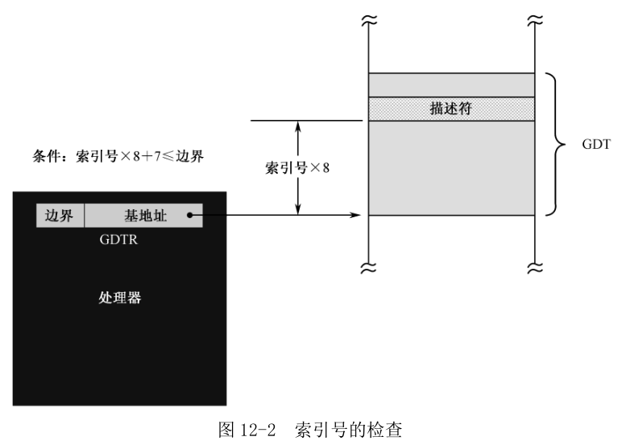

处理器在变更段寄存器以及隐藏的描述符高速缓存器的内容时，要检查其代入值的合法性。

在当前程序中，选择子的TI位都是 0，故所有的描述符都在 GDT 中。如图 12-2 所示，**GDT的基地址和界限，都在寄存器GDTR中**。**描述符在内存中的地址**，是用**索引号乘以8**，再和**描述符表的线性基地址**相加得到的，而这个地址必须在描述符表的地址范围内。换句话说，索引号乘以8得到的数值，必须位于描述符表的边界范围之内。换句话说，处理器从GDT中取某个描述符时，就要求描述符的8个字节都在GDT边界之内，也就是索引号×８＋7 小于等于边界。

如果检查到指定的段描述符，其位置超过表的边界时，处理器中止处理，**产生异常中断13**，同时段寄存器中的原值不变。

以上仅仅是检查的第一步。

通过了上述检查，并从表中取得描述符后，紧接着还要对描述符的类别进行确认。举个例子来说，若描述符的类别是只执行的代码段（表 11-1），则不允许加载到除CS之外的其他段寄存器中。

具体地说，首先，描述符的类别字段必须是有效的值，0000 是无效值的一个例子。

然后，检查描述符的类别是否和段寄存器的用途匹配。其规则如表 12-1 所示。

最后，除了按表12-1进行段的类别检查外，还要**检查描述符中的P位**。如果 P＝0，表明虽然描述符已被定义，但该段实际上并不存在于物理内存中。此时，处理器中止处理，**引发异常中断11**。一般来说，应当定义一个中断处理程序，把该描述符所对应的段从硬盘等外部存储器调入内存，然后置P位。中断返回时，处理器将再次尝试刚才的操作。

如果 P＝1，则处理器将描述符加载到段寄存器的描述符高速缓存器，同时置 A 位（仅限于当前讨论的存储器的段描述符）。
