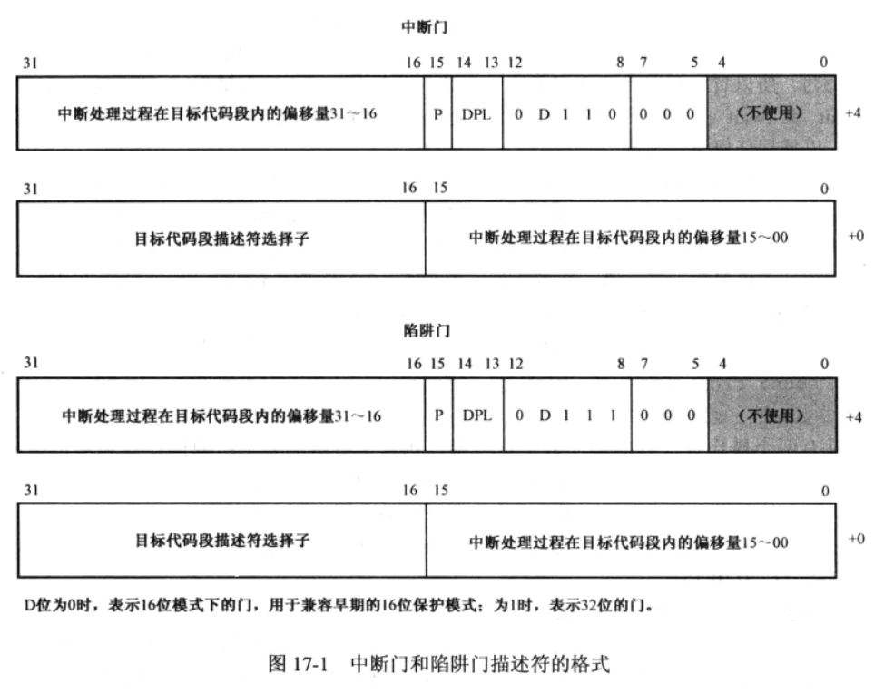
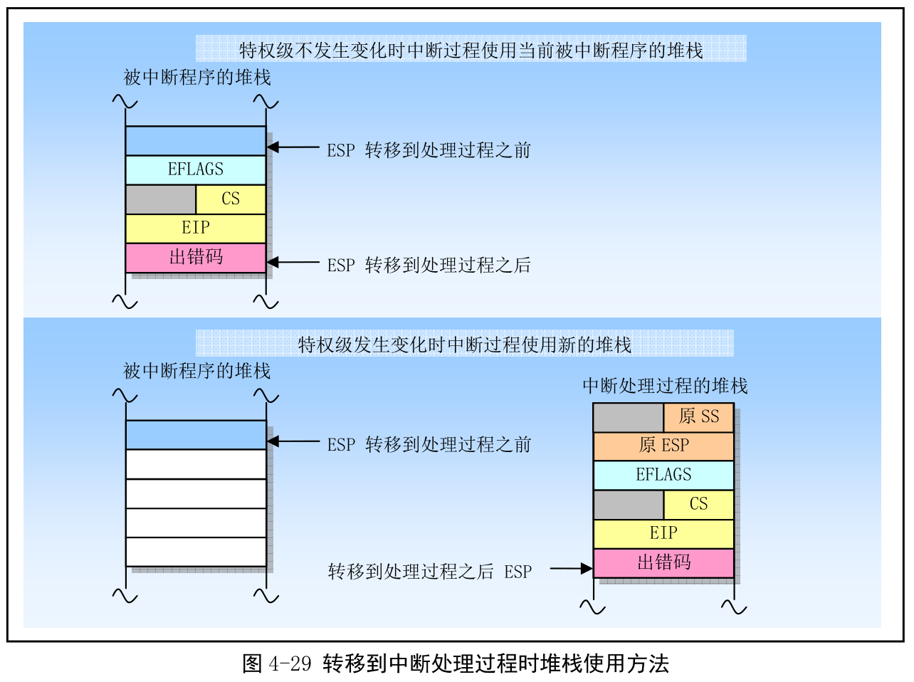
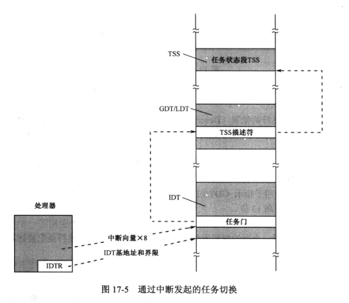

## 1. 中断和异常概述

当中断和异常发生时，典型结果是迫使处理器将控制从当前正在执行的程序或任务转移到另一个例程或任务中。该例程叫中断处理程序，或者异常处理程序。如果是一个任务，则发生任务切换。

### 中断（Interrupt）

中断包括硬件中断和软中断。

硬件中断由外围设备发出的中断信号引发。当I/O接口发出中断请求，会被像8259A和I/O APIC这样的中断控制器收集，并发送到处理器。硬件中断随机发生，与处理器的执行并不同步。当中断发生，处理器要先执行完**当前指令**，然后对中断进行处理。

软中断是由int n指令引发的中断处理，n是中断号或类型码。

### 异常（Exception）

异常就是之前介绍16位汇编时所说的内部中断。**它们是处理器内部产生的中断，表示指令执行过程中遇到错误**。所以内部中断又叫异常或异常中断。比如，除法指令div/idiv遇到被0除，会产生中断0；使用jmp任务切换，指令操作数不是一个有效TSS描述符选择子。

异常分为三种。

第一种是**程序错误异常**，指处理器在执行指令中，检测到程序中的错误；

第二种是**软件引起的异常**。这类异常由into、int3和bound指令主动发起。这些指令允许在指令流的当前点上检查实施异常处理的条件是否满足。比如，into指令在执行时，将检查EFLAGS的寄存器的OF标志，如果满足为“1”，则引发异常。

第三种是**机器检查异常**。这种异常时处理器型号相关的，也就是说，每种处理器都不太一样。处理器提供了一种对硬件芯片内部和总线处理进行检查的机制，当检测到有错误时，将引发此类异常。

根据异常情况的性质和严重性，异常又分为三种，并实施不同的处理。

- Fault（故障）是一种通常可以被纠正的异常，并且一旦被纠正程序就可以继续运行。当出现一个Fault，处理器会把机器状态恢复到产生Fault的指令之前的状态。此时异常处理程序的返回地址会指向产生Fault的指令，而不是其后面一条指令。因此在返回后产生Fault的指令将被重新执行。

- Trap（陷阱）是一个引起陷阱的指令被执行后立刻会报告的异常。Trap也能让程序或任务连贯地执行。Trap处理程序的返回地址指向**引起陷阱指令的随后一条指令**，因此在返回后会执行下一条指令。

- Abort（中止）是一种不会总是报告导致异常的指令的精确位置的异常，并且不允许导致异常的程序重新继续执行。Abort用于报告严重错误，例如硬件错误以及系统表中存在不一致性或非法值。

中断和异常发生时，处理器将挂起当前正在执行的过程或任务，然后执行中断和异常处理过程。返回时，处理器恢复程序或任务的执行。除非遇到一个Abort类型的异常。对于某些异常，处理器在转入异常处理程序之前，会在当前栈中压入一个称为错误码的数值，帮程序进一步诊断异常产生的位置和原因。

下表列出Intel处理器在保护模式下的中断和异常。


很重要！！！当中断和异常发生时，**NMI和异常的向量**是由**处理器自动给出的**；**硬件中断的向量**是由**I/O中断控制器芯片送给处理器的**；**软中断的向量**由**指令中的操作数给出的**。**尽管16位界限可以有64KB大小，但是处理器只能识别256种中断，只使用了2KB！！！**

## 2. 中断描述符表、中断门和陷阱门

实模式下，内存最低端1KB内存中，是中断向量表（IVT）。定义了256种中断的入口地址，包括16位段地址和16位段内偏移量。当中断发生，处理要么自发产生一个中断向量（NMI和异常向量），要么从外部中断控制器接受一个中断向量，要么从int n指令中得到中断向量。然后，将该向量作为索引访问中断向量表。具体的做法是，将中断向量乘以4，作为表内偏移量访问中断向量表，从中获得中断处理过程的段地址和偏移地址，并转到执行。

保护模式下，处理器对中断管理类似，不过使用**中断描述符表（Interrupt Descriptor Table，IDT）存放中断处理过程有关的描述符，包括中断门、陷阱门和任务门**。

任务门之前讲过。中断门和陷阱门格式如图。




事实上，调用门、任务门、中断门和陷阱门描述符很类似，从大的方面来说，因为都用于实施控制转移，故都包括16位的目标代码段选择子，以及32位段内偏移量。由图中可知道，中断门和陷阱门仅仅有一比特的差别。**中断门和陷阱门描述符都只允许存放在IDT内（！！！），任务门可以位于GDT、LDT和IDT中（！！！**）。

与实模式下的中断向量表（IVT）不同，保护模式下的IDT不要求必须位于内存的最低端。事实上，在处理器内部，有一个**48位**的**中断描述符表寄存器**（Interrupt Descriptor Table Register，IDTR），保存着中断描述符表在内存中的**线性基地址**和**界限**。如下图，与GDT一样，因为整个系统中只需要一个IDT就够了，所以，GDTR和IDTR不像LDTR和TR，没有也不需要选择器部分。


这就意味着，IDT可以位于内存任何地方，只要IDTR指向它，整个中断系统就可以正常工作。为了利用**高速缓存**使处理器的工作性能最大化，建议IDT基地址**8字节对齐**。处理器复位时，IDTR的基地址部分为0，界限部分为0xFFFF。**16位表界限**意味表大小可以**64KB**，但是，事实上，因为处理器只能识别**256种中断（！！！**），所以**只使用2KB**，其他空余槽位应将描述符P位清零。最后，**与GDT不同，IDT第一个描述符也是有效的（！！！**）。

如图，**保护模式下，当中断或异常发生时，处理器用中断向量乘以8的结果去访问IDT，从中获取对应的描述符。IDT在内存中是由IDTR指示的**。

注意，图中没有考虑分页，也没有考虑门描述符是任务门。中断门和陷阱门中有目标代码段描述符的**选择子**，以及**段内偏移量**。取决于选择子的TI位，**处理器访问LDT或GDT**，取出目标代码段的描述符。接着，从**目标代码段描述符中取出目标代码段所在的基地址**，再同**门描述符中的偏移量相加**，就得到中断处理程序的**32位线性地址（！！！线性地址！！！**）。如果没有开启分页，该线性地址就是物理地址；否则，送页部件转换成物理地址。


注意，当处理器用中断向量访问IDT时，要访问的位置超出了IDT的界限，则产生常规保护异常（#GP）。

## 3. 中断和异常处理程序的保护

和通过调用门实施的控制转移一样，处理器要对中断和异常处理程序进行**特权级保护**。当目标代码段描述符的特权级（可以用门描述符中的段选择子，从GDT或LDT中找到代码段描述符项的DPL）低于**当前特权级CPL**时，即，在数值上，

```
CPL<目标代码段的DPL
```

时，不允许控制转移到中断或异常处理程序，违反则引发常规保护异常（#GP）。

不过，中断和异常处理程序的特权级保护也有一些特殊之处。具体表现：

- 因为中断和异常向量没有RPL，因此在隐式调用异常和中断处理过程时不会检查RPL。

- 只有当一个异常或中断是由软中断INT n、单步中断INT3或INTO指令产生时，处理器才会检查中断门或陷阱门中的DPL。此时CPL必须小于等于门的DPL。

这个限制可以防止运行在特权级3的应用程序使用软件中断访问重要的异常处理程序，例如页错误处理过程，假设这些处理过程已被存放在更高特权级的代码段中。对于硬件产生的中断和处理器检测到的异常，处理器会忽略中断门和陷阱门中的DPL。

因为异常和中断通常不会定期发生，因此这些有关特权级的规则有效地增强了异常和中断处理过程能够运行的特权级限制。可以使用下面技术之一避免违反特权级保护：

- 异常或中断处理程序可以存放在一个一致性代码段中。这个技术可以用于只需访问堆栈上数据的处理过程（例如，除出错异常）。如果处理程序需要数据段中的数据，那么特权级3必须能访问这个数据段。这样就没保护了。

- 处理过程可以放在具有特权级0的非一致代码段中。这种处理过程总是可以执行的，而不管被中断程序或任务的当前特权级CPL。

中断和异常是随机发生，不可预测。但是有一点是确定的，**它总是发生在某个任务正在执行的时候产生的，即使整个系统内只有一个任务**。

当响应一个异常或中断时，处理器使用异常或中断的**向量**作为**IDT表中的索引**，若索引值指向中断门或陷阱门，处理器使用与CALL指令操作调用门类似方法调用异常或中断处理程序。

若索引值指向**任务门**，处理器使用与**CALL指令（调用）**操作任务门类似方法进行**任务切换（见“任务管理”）**，执行异常或中断的处理任务。

异常或中断门引用**运行在当前任务上下文中的异常或中断处理过程（当前任务上下文！！！没有任务切换，任务切换就那几种方法）**，如图。门中的段选择符指向GDT或当前LDT中的可执行代码段描述符。门描述符中的偏移字段指向异常或中断处理过程的开始处。


当处理器执行异常或中断处理过程调用时会进行以下操作（**以下操作不适用任务门，任务门是任务切换一种方式**）：

（1） 如果处理过程将在**高特权级**（如0）上执行时就会发生堆栈切换操作，切换过程如下：

- 处理器从**当前执行任务的TSS段(不是任务切换，只是控制权转移！！！这与一个远调用<段间子程序调用>类似)中**得到中断或异常处理过程使用的堆栈的段选择符和栈指针(**相应特权级的堆栈！！！**例如tss.ss()、tss.esp())。然后处理器会把**被中断程序**（或任务）的段选择符和栈指针**压入新栈**，如图；

- 接着处理器会把**EFLAGS、CS和EIP**寄存器的当前值也压入栈中；

- 如果异常会产生一个**错误号**，那么错误号也会被最后压入新栈。

（2） 如果处理过程将在被中断任务**同一特权级**上运行，那么：

- 处理器把**EFLAGS、CS和EIP寄存器**的当前值保存在当前堆栈上；

- 如果异常会产生一个**错误号**，那么该错误号也会被最后压入新栈。



中断门和陷阱门区别不大，通过**中断门**进入中断处理程序时，EFLAGS寄存器的IF位被自动清零，**以禁止嵌套的中断**，当中断返回，将从栈中恢复EFLAGS寄存器的原始状态。陷阱中断的优先级较低，当通过**陷阱门**进入中断处理程序时，EFLAGS寄存器的IF位不变，以**允许其他中断优先处理**。

为了从中断处理过程返回，处理过程必须使用IRET指令。IRET指令与RET指令类似，但IRET还会把保存的寄存器内容恢复到EFLAGS中。不过只有当CPL是0时才会恢复EFLAGS中的IOPL字段，并且只有当CPL不大于IOPL时，IF标志才会被改变。如果当调用中断处理过程时发生了堆栈切换，那么在返回时IRET指令会切换到原来的堆栈。

EFLAGS寄存器的IF位仅影响硬件中断，对NMI、异常和int n形式的软中断不起作用。

## 4. 中断任务

通过IDT中任务门来访问异常或中断处理程序会导致任务切换。使用单独任务来处理异常或中断好处：

- 被中断程序或任务的完整上下文会被自动保存（它的TSS中）

- 在处理中，接管控制的是一个新的任务，所以可以允许处理过程使用新特权级0的堆栈。在当前特权级0的堆栈已毁坏时如果发生了一个异常或中断，那么在为中断过程提供一个新特权级0的堆栈条件下，通过任务门访问中断处理过程能防止系统崩溃

- 通过使用单独LDT给中断或异常处理任务独立的地址空间，可以把它与其他任务隔离。

使用独立任务处理异常或中断的不足：在任务切换时必须对大量机器状态进行保存，使得它比中断门的响应速度慢，导致中断延时增加。

IDT中任务门引用GDT中的TSS描述符，如下图。切换到句柄任务的过程与普通任务切换相同。到被中断任务的反向链接会被保存在句柄任务TSS的前一任务链接字段中。如果在一个异常会产生一个错误码，则该出错码会被复制新任务堆栈上。



当异常或中断句柄任务用于操作系统中时，实际上有两种分派调度任务的机制：操作系统软件调度和处理器中断机制的硬件调度。使用软件调度方法时需要考虑到中断开启时采用中断处理任务。

## 5. 错误代码

当异常条件与一个特定的段相关时，处理器会把一个错误码压入**异常处理过程的堆栈**上。错误码格式如图。错误码很像一个段选择符，但最低3位不是TI和RPL字段，而是下面3个标志：


- 位0是外部事件EXT（External event）标志。置位时，表示执行程序以外的事件造成了异常，如硬件中断、NMI等。

- 位1是描述符位置IDT（Description location）标志。当置位时，表示错误码索引部分指向IDT中的一个门描述符。当该位复位时，表示索引部分指向GDT或LDT中的一个段描述符。

- 位2时GDT/LDT表选择标志TI。只有当位1的IDT=0时才有用。当该TI=1时，表示错误码的索引部分指向LDT中的一个描述符。当TI=0时，说明错误码中索引部分指向GDT表中的一个描述符。

段选择索引字段提供了错误码引用的IDT、GDT或当前LDT中段或门描述符的索引值。空错误码（低16位全0）表示错误不是由于引用某个特定段造成，或者是在操作中引用了一个空段描述符。所谓引用一个段，类似下面的指令：

```
mov ecx, 0x0008
mov ds, ecx
```

注意，**通过iret指令从中断处理程序中返回，处理器不会自动弹出错误代码。所以，对于这种情况，必须在执行指令iret之前，先从栈中弹出错误码**。

对于外部异常（处理器引脚触发），以及软中断指令int n引发的异常，处理器不会压入错误代码。

页故障（Page-fault）异常的错误码格式与上面不同，如图。只有最低三位有用，他们的名称与页表项中的最后三位相同（U/S、W/R、P）。如下：


- 位0（P），异常是由于页面不存在或违反访问特权。P=0，表示页不存在；P=1表示违反页级保护权限。

- 位1（W/R），异常由于内存读或写操作引起。W/R=0，表示由读操作引起；W/R=1，表示由写操作引起。

- 位2（U/S），发生异常时CPU执行的代码级别。U/S=0，表示CPU正在执行超级用户代码；U/S=1，表示CPU正在执行一般用户代码。

另外，处理器还会把引起页面故障异常的线性地址存放到CR2中。页出错异常处理程序可以使用这个地址来定位相关的页目录和页表项。

注意，错误不会被IRET指令自动弹出堆栈，因此中断处理程序在返回之前必须清除堆栈上的错误码。另外，岁晚处理产生的某些异常会产生错误码并会自动保存到处理过程的堆栈中，但是外部硬件中断或软件执行INT n指令产生的异常并不会把错误码压入堆栈中。