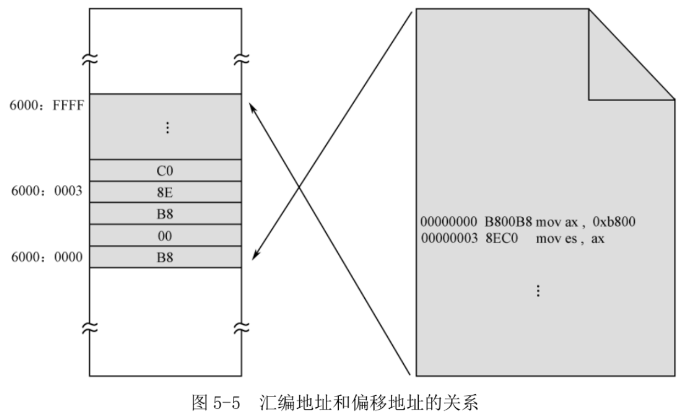
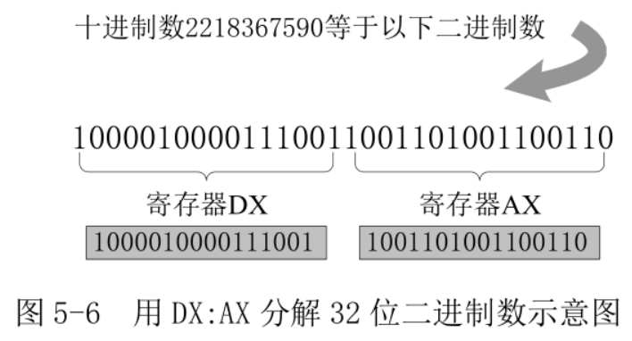
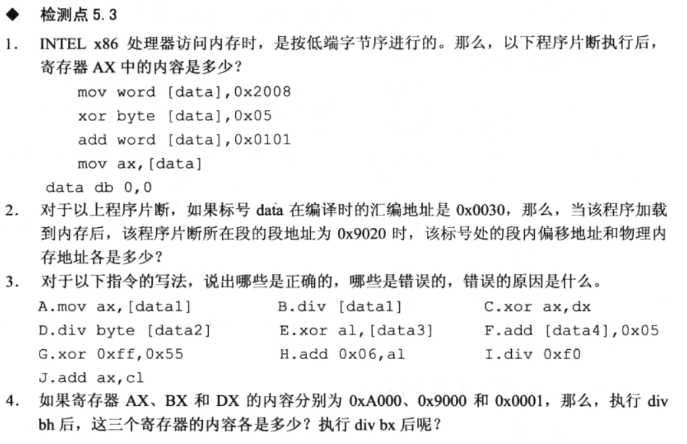

```
5.5 显示标号的汇编地址 
　　5.5.1 标号 
　　5.5.2 如何显示十进制数字 
　　5.5.3 在程序中声明并初始化数据 
　　5.5.4 分解数的各个数位 
　　5.5.5 显示分解出来的各个数位
```

## 1. 标号

段地址开始于任何16字节对齐的地方，偏移地址总是从0x0000开始递增。

为支持这种内存访问模式，在源程序的编译阶段，编译器会把源程序整体上作为一个独立的段来处理，并从0开始计算和跟踪每一条指令的地址。因为该地址是在编译期间计算的，故称为汇编地址。**汇编地址**是在源程序编译期间，编译器为每条指令确定的汇编位置（Assembly Position），也就是**每条指令相对于整个程序开头的偏移量**，以字节计。当编译后的程序装入物理内存后，它又是该指令在内存段内的偏移地址。

通过对bin进行反汇编

```
ndisasm c05_mbr.bin
```

结果：

```
00000000  B800B8            mov ax,0xb800
00000003  8EC0              mov es,ax
00000005  26C60600004C      mov byte [es:0x0],0x4c
0000000B  26C606010007      mov byte [es:0x1],0x7
00000011  26C606020061      mov byte [es:0x2],0x61
00000017  26C606030007      mov byte [es:0x3],0x7
0000001D  26C606040062      mov byte [es:0x4],0x62
00000023  26C606050007      mov byte [es:0x5],0x7
00000029  26C606060065      mov byte [es:0x6],0x65
0000002F  26C606070007      mov byte [es:0x7],0x7
00000035  26C60608006C      mov byte [es:0x8],0x6c
0000003B  26C606090007      mov byte [es:0x9],0x7
00000041  26C6060A0020      mov byte [es:0xa],0x20
00000047  26C6060B0007      mov byte [es:0xb],0x7
0000004D  26C6060C006F      mov byte [es:0xc],0x6f
00000053  26C6060D0007      mov byte [es:0xd],0x7
00000059  26C6060E0066      mov byte [es:0xe],0x66
0000005F  26C6060F0007      mov byte [es:0xf],0x7
00000065  26C606100066      mov byte [es:0x10],0x66
0000006B  26C606110007      mov byte [es:0x11],0x7
00000071  26C606120073      mov byte [es:0x12],0x73
00000077  26C606130007      mov byte [es:0x13],0x7
0000007D  26C606140065      mov byte [es:0x14],0x65
00000083  26C606150007      mov byte [es:0x15],0x7
00000089  26C606160074      mov byte [es:0x16],0x74
0000008F  26C606170007      mov byte [es:0x17],0x7
00000095  26C60618003A      mov byte [es:0x18],0x3a
0000009B  26C606190007      mov byte [es:0x19],0x7
000000A1  B82E01            mov ax,0x12e
000000A4  BB0A00            mov bx,0xa
000000A7  8CC9              mov cx,cs
000000A9  8ED9              mov ds,cx
000000AB  BA0000            mov dx,0x0
000000AE  F7F3              div bx
000000B0  88162E7D          mov [0x7d2e],dl
000000B4  31D2              xor dx,dx
000000B6  F7F3              div bx
000000B8  88162F7D          mov [0x7d2f],dl
000000BC  31D2              xor dx,dx
000000BE  F7F3              div bx
000000C0  8816307D          mov [0x7d30],dl
000000C4  31D2              xor dx,dx
000000C6  F7F3              div bx
000000C8  8816317D          mov [0x7d31],dl
000000CC  31D2              xor dx,dx
000000CE  F7F3              div bx
000000D0  8816327D          mov [0x7d32],dl
000000D4  A0327D            mov al,[0x7d32]
000000D7  0430              add al,0x30
000000D9  26A21A00          mov [es:0x1a],al
000000DD  26C6061B0004      mov byte [es:0x1b],0x4
000000E3  A0317D            mov al,[0x7d31]
000000E6  0430              add al,0x30
000000E8  26A21C00          mov [es:0x1c],al
000000EC  26C6061D0004      mov byte [es:0x1d],0x4
000000F2  A0307D            mov al,[0x7d30]
000000F5  0430              add al,0x30
000000F7  26A21E00          mov [es:0x1e],al
000000FB  26C6061F0004      mov byte [es:0x1f],0x4
00000101  A02F7D            mov al,[0x7d2f]
00000104  0430              add al,0x30
00000106  26A22000          mov [es:0x20],al
0000010A  26C606210004      mov byte [es:0x21],0x4
00000110  A02E7D            mov al,[0x7d2e]
00000113  0430              add al,0x30
00000115  26A22200          mov [es:0x22],al
00000119  26C606230004      mov byte [es:0x23],0x4
0000011F  26C606240044      mov byte [es:0x24],0x44
00000125  26C606250007      mov byte [es:0x25],0x7
0000012B  E9FDFF            jmp word 0x12b
0000012E  0000              add [bx+si],al
00000130  0000              add [bx+si],al
······
000001FA  0000              add [bx+si],al
000001FC  0000              add [bx+si],al
000001FE  55                push bp
000001FF  AA                stosb
```

第一列是指令的汇编地址，第二列是指令编译后的机器代码（**机器码所占大小就是该指令占用的内存大小！！**）。通过hexdump -C c05_mbr.bin（逐字节查看改文件内容），可以看到机器码就是该文件的二进制内容。关于hexdump可以查看Linux/Commands内容。

```
root@Gerry:/home/project/nasm/booktool/c05# hexdump -C c05_mbr.bin
00000000  b8 00 b8 8e c0 26 c6 06  00 00 4c 26 c6 06 01 00  |.....&....L&....|
00000010  07 26 c6 06 02 00 61 26  c6 06 03 00 07 26 c6 06  |.&....a&.....&..|
00000020  04 00 62 26 c6 06 05 00  07 26 c6 06 06 00 65 26  |..b&.....&....e&|
00000030  c6 06 07 00 07 26 c6 06  08 00 6c 26 c6 06 09 00  |.....&....l&....|
00000040  07 26 c6 06 0a 00 20 26  c6 06 0b 00 07 26 c6 06  |.&.... &.....&..|
00000050  0c 00 6f 26 c6 06 0d 00  07 26 c6 06 0e 00 66 26  |..o&.....&....f&|
00000060  c6 06 0f 00 07 26 c6 06  10 00 66 26 c6 06 11 00  |.....&....f&....|
00000070  07 26 c6 06 12 00 73 26  c6 06 13 00 07 26 c6 06  |.&....s&.....&..|
00000080  14 00 65 26 c6 06 15 00  07 26 c6 06 16 00 74 26  |..e&.....&....t&|
00000090  c6 06 17 00 07 26 c6 06  18 00 3a 26 c6 06 19 00  |.....&....:&....|
000000a0  07 b8 2e 01 bb 0a 00 8c  c9 8e d9 ba 00 00 f7 f3  |................|
000000b0  88 16 2e 7d 31 d2 f7 f3  88 16 2f 7d 31 d2 f7 f3  |...}1...../}1...|
000000c0  88 16 30 7d 31 d2 f7 f3  88 16 31 7d 31 d2 f7 f3  |..0}1.....1}1...|
000000d0  88 16 32 7d a0 32 7d 04  30 26 a2 1a 00 26 c6 06  |..2}.2}.0&...&..|
000000e0  1b 00 04 a0 31 7d 04 30  26 a2 1c 00 26 c6 06 1d  |....1}.0&...&...|
000000f0  00 04 a0 30 7d 04 30 26  a2 1e 00 26 c6 06 1f 00  |...0}.0&...&....|
00000100  04 a0 2f 7d 04 30 26 a2  20 00 26 c6 06 21 00 04  |../}.0&. .&..!..|
00000110  a0 2e 7d 04 30 26 a2 22  00 26 c6 06 23 00 04 26  |..}.0&.".&..#..&|
00000120  c6 06 24 00 44 26 c6 06  25 00 07 e9 fd ff 00 00  |..$.D&..%.......|
00000130  00 00 00 00 00 00 00 00  00 00 00 00 00 00 00 00  |................|
*
000001f0  00 00 00 00 00 00 00 00  00 00 00 00 00 00 55 aa  |..............U.|
00000200
```

编译阶段，**每条指令被计算机赋予了一个汇编地址**，就像被加载到内存的某个段一样。实际上，如图5-5，当编译好的程序加载到内存中，它在段内的偏移地址和它在编译阶段的汇编地址相等。



交叉箭头指示它们之间的映射关系。之所以交叉，因为源码编译时从上往下的，而内存地址的增长时从下往上的（从低地址往高地址方向增长）。

图5-5假定了程序是从内存物理地址0x60000开始加载。因为该物理地址也对应着逻辑地址0x6000:0x0000，因此我们可以说，该程序位于段 0x6000 内。（《一个操作系统的实现》里面第一个例程，必须用org是因为BIOS会将执行程序放到0x7c00开始的位置，里面数据地址<指令地址也是数据地址>都是一个绝对地址，不是段的相对地址，所以在移动到7c00后，数据的地址都是有问题的，必须加上7c00的偏移）

这段程序必须指定段，不能放在内存任意位置，只有这样，每条指令里面操作的地址都还能找到，要不然没法执行。

在NASM汇编中，每条指令前面可以有一个标号，代表和指示该指令的**汇编地址**。

```
infi: jmp near infi
```

这条指令的汇编地址是0x0000012b，所以**infi代表数值0x0000012B，即代表指令的汇编地址**。

**标号之后的冒号是可选的**。所以下面的写法也是正确的：

```
infi jmp near infi
```

标号可以单独占用一行的位置

```
infi:
    jmp near infi
```

这与上面的相比，因为**infi所在那一行没有指令，也不是数据**，它**地址和下一行的地址相同**。

## 2. 显示十进制数字

标号可以用来代表指令的汇编地址。在屏幕上显示这个地址的数值。先获取标号代表的汇编地址

```
mov ax, number
```

标号“number”位于源程序的第100行，后面没有跟着冒号“:”。注意，传送到寄存器AX的值是在源程序编译时确定的，**在编译阶段，编译器会将标号 number 转换成立即数**。这条语句其实就是

```
mov ax, 0x012E
```

这条指令编译后，得到的机器指令为B8[2E01]，或者B8 2E 01。B8是操作码，后面是字操作数0x012E，只不过采用的是低端字节序。

十六进制数 0x012E 等于十进制数302，但是，根据前面的字符显示原理，直接把寄存器AX中的内容传送到显示缓冲区，是不可能在屏幕上出现“302”的。

解决办法就是将每个数位单独拆分出来，这需要不停除以10。

考虑到寄存器AX是16位的，可以表示的数从二进制的0000000000000000到1111111111111111，也就是十进制的 0～65535，故它可以容纳最大5个数位的十进制数。只要把AX的内容不停地除以10，只需要5次，把每次的余数反向组合到一起，就是原来的数字。

即使是得到了单个的数位，也还是不能在屏幕上显示，因为它们是数字，而非 ASCII代码。把每次相除得到的余数加上 0x30（字符“0”的ASCII）就行了。

## 3. 在程序中声明并初始化数据

寄存器数量太少，所以最好办法就是在内存中专门留空间保存数位。

要达到这个目的**必须初始化一些初始数据来“占位”**，后续再用的话，可以直接使用。源码100行用于声明并初始化数据，标号number代表了这些数据的起始汇编地址。

**用 DB 指令来声明**（Declare）的，DB 的意思是声明字节（Declare Byte），所以，跟在它后面的**操作数都占一个字节的长度**（位置）。注意，如果要声明多个数据，各个操作数之间必须以逗号隔开。

DW（Declare Word）用于声明字数据，DD（Declare Double Word）用于声明双字（两个字）数据，DQ（Declare Quad Word）用于声明四字数据。

DB、DW、DD 和 DQ 不是处理器指令，只是编译器提供的汇编指令，称做**伪指令（pseudo Instruction）**。伪指令是汇编指令的一种，没有对应的机器指令，不是机器指令的助记符，仅仅在编译阶段由编译器执行，编译成功后，伪指令就消失了。所以在程序执行时，伪指令已不存在。

声明的数据可以是任何值，只要不超过伪指令所指示的大小。

**和指令不同，程序中声明的数值，在编译阶段，编译器会在它们被声明的汇编地址处原样保留。**

按照标准的做法，程序中用到的数据应当声明在一个独立的段，即数据段中。但是在这里，为方便起见，数据和指令代码是放在同一个段中的。有些数碰巧和某些指令的机器码相同，也可以顺利执行，但结果就不可预知。

**在本程序中把数据声明在所有指令之后，在这个地方，处理器的执行流程无法到达**。

## 4. 分解数的各个数位

源码41、42行，把代码段寄存器CS的内容传送到通用寄存器CX，然后再从CX传送到数据段寄存器DS。在此之后，数据段和代码段都指向同一个段。这么做因为声明的数据是和指令代码混在一起的，可以认为是位于代码段中。尽管在指令中访问这些数据可以**使用段超越前缀“CS:”**，但习惯上，通过数据段来访问它们更自然一些。

**8086 处理器提供了除法指令 div，可以做两种类型的除法**。

第一种类型是**用 16 位的二进制数除以8位的二进制数**。在这种情况下，被除数必须在寄存器AX中，必须事先传送到 AX 寄存器里。除数可以由 8 位的通用寄存器或者内存单元提供。指令执行后，商在寄存器 AL 中，余数在寄存器 AH 中。

```
div cl
div byte [0x0023]
```

前一条指令中，寄存器 CL 用来**提供 8 位的除数**。假如 AX 中的内容是 0x0005，CL中的内容是0x02，指令执行后，CL 中的内容不变，AL 中的商是 0x02，AH 中的余数是 0x01。

后一条指令中，除数位于数据段内偏移地址为 0x0023 的内存单元里。这条指令执行时，处理器将数据段寄存器 DS 的内容左移 4 位，加上偏移地址0x0023以形成物理地址。然后，处理器再次访问内存，**从此处取得一个字节**，作为除数同寄存器 AX 做一次除法。

**任何时候，只要是在指令中涉及内存地址的，都允许使用段超越前缀**。

```
div byte [cs:0x0023]
div byte [es:0x0023]
```

在一个源程序中，通常不可能知道汇编地址的具体数值，只能使用标号。所以，**指令中的地址部分更常见的形式是使用标号**。

```
dividnd dw 0x3f0
divisor db 0x3f
……
mov ax,[dividnd]
div byte [divisor]
```

上面的程序，首先，声明了标号 dividnd 并初始化了一个字 0x3f0 作为被除数；然后，又声明了标号 divisor 并初始化一个字节 0x3f 作为除数。

在后面的 mov 和 div 指令中，是用标号 dividnd 和 divisor 来代替被除数和除数的汇编地址。编译阶段，编译器用具体的数值取代括号中的标号 dividnd 和 divisor。

假设 dividnd 和 divisor所代表的汇编地址分别是0xf000和0xf002。在编译阶段，编译器在生成这两条指令的机器
码之前，会先将它们转换成以下的形式：

```
mov ax, [0xf000]
div byte [0xf002]
```

第一条指令，处理器用 0xf000 作为偏移地址，去访问数据段（段地址在段寄存器 DS中），来取得内存中的一个字 0x3F0，并传送到寄存器 AX 中。

第二条指令，处理器采用同样的方法取得内存中的一个字节 0x3F，用它来和寄存器 AX中的内容做除法。

第二种类型是**用32位的二进制数除以16位的二进制数**。因为16位的处理器无法直接提供32位的被除数，故要求被除数的高 16 位在DX 中，低 16 位在 AX 中。

如图 5-6 所示，假如被除数是十进制数2218367590，那么，它对应着一个32位的二进制数10000100001110011001101001100110。



做除法之前，先要分成两段进行“切割”，以分别装入寄存器 DX 和 AX。为了方便，我们通常用“DX:AX”来描述 32 位的被除数。

除数可以由 16 位的通用寄存器或者内存单元提供，指令执行后，**商在 AX 中，余数在DX 中**。

```
div cx
div word [0x0230]
```

源程序第 46 行，div 指令用 DX:AX 作为被除数，除以 BX 的内容，执行后得到的商在 AX 中，余数在 DX 中。因为除数是 10，余数自然比 10 小，我们可以从 DL 中取得。

第 1 次相除得到的余数是个位上的数字，将它保存到声明好的数据区中。第47行，用传送指令，把寄存器 DL 中的余数传送到数据段。

指令中没有使用段超越前缀，默认地使用段寄存器 DS 来访问内存。偏移地址是由标号 number 提供的，它是数据区的首地址，也可以说是数据区中第一个数据的地址。因此，number 和 number+0x00 是一样的，没有区别。

第 47 行中，偏移地址并非理论上的 number+0x00，而是 0x7c00+number+0x00。这个 0x7c00 是从哪里来的呢？

标号 number 所代表的**汇编地址**，其数值是在源程序**编译阶段确定**的，而且是相对于整个程序的开头，从 0 开始计算的。第 37 行，这个在编译阶段计算出来的值是 0x012E。

如图 5-7 所示，主引导扇区代码是被加载到 0x0000:0x7C00 处的，而非 0x0000:0000。对于程序
的执行来说，这不会有什么问题，因为主引导扇区的内容被加载到内存中并开始执行时，CS=0x0000，IP=0x7C00。


**加载位置的改变不会对处理器执行指令造成任何困扰，但会给数据访问带来麻烦**。当前数据段寄存器 DS 的内容是 0x0000，因此，number 的偏移地址实际上是 0x012E+0x7C00=0x7D2E。当正在执行的指令仍然用 0x012E 来访问数据，灾难就发生了。

在编写主引导扇区程序时，必须将代码如下

```
mov [0x7c00+number+0x00],dl
```

**指令中的目的操作数是在编译阶段确定的**，因此，在编译阶段，编译器同样会首先将它转换成以下的形式，再进一步生成机器码：

```
mov [0x7d2e],dl
```

这样，在编译后，编译器将这条指令编译成机器码88 16 2E 7D（相应存在内存中），其中前两个字节是操作码，后两个字节是低端字节序的0x7D2E。当执行时，处理器将DS的值（和CS一样，是0x0000）左移4位，再加上偏移地址0x7D2E，得到实际物理地址（0x07D2E）。

虽然目的操作数也是一个内存单元地址，但没有使用关键字“byte”来修饰。因为源操作数是寄存器DL，编译器可以推断这是一个字节操作，不存在歧义。

第50行，指令 xor 来将 DX 寄存器的内容清零。xor，异或（eXclusive OR）。

xor 指令的**目的操作数可以是通用寄存器和内存单元**，**源操作数可以是通用寄存器、内存单元和立即数**（不允许两个操作数同时为内存单元）。

一般地，xor 指令的两个操作数应当具有相同的数据宽度。

```
mov ax,0000_0000_0000_0010B
xor ax,1111_0000_1111_0001B ;AX←1111_0000_1111_0011B，即，0xf0f3
```

注意，这两条指令的源操作数都采用了二进制数的写法，NASM编译器允许使用下画线来分开它们。

尽管都可以用于将寄存器清零，但是编译后，mov dx,0 的机器码是 BA 00 00；而 xor dx,dx 的机器码则是 31 D2，不但较短，而且，因为 xor dx,dx 的两个操作数都是通用寄存器，所以执行速度最快。

## 5. 显示分解出来的各个数位

从DS指向的数据段依次取出这些数位，写入ES指向的附加段（显示缓冲区）。

数据显示时相反顺序显示。先从数据段中，偏移地址为 number+0x04 处取得万位上的数字，传送到 AL 寄存器。当然，因为程序是加载到 0x0000:0x7C00 处的，所以正确的偏移地址是 0x7C00+number+0x04。

add指令需要两个操作数，**目的操作数**可以是8位或者16位的**通用寄存器**，或指向8 位或者16 位实际操作数的**内存地址**；**源操作数**可以是相同数据宽度的 8 位或者 16 位**通用寄存器**、指向 8位或者 16 位实际操作数的**内存地址**，或者**立即数**，但不允许两个操作数同时为内存单元。

## 6. 习题



答：

1. Ox210E

2. 段内偏移地址还是0x0030，物理地址是0x90200+0x0030=0x90230

3. 

A正确

B不正确，除数不知道多少位

C正确

D正确

E正确

F不正确，大小不确定

G不正确，目的操作数应该是个“容器”

H不正确，目的操作数应该是个“容器”

I不正确，除数位数不确定

J不正确，目的操作数和源操作数位数不同

4.

AX是0xA000，BX是0x9000，DX是0x0001

执行div bh，