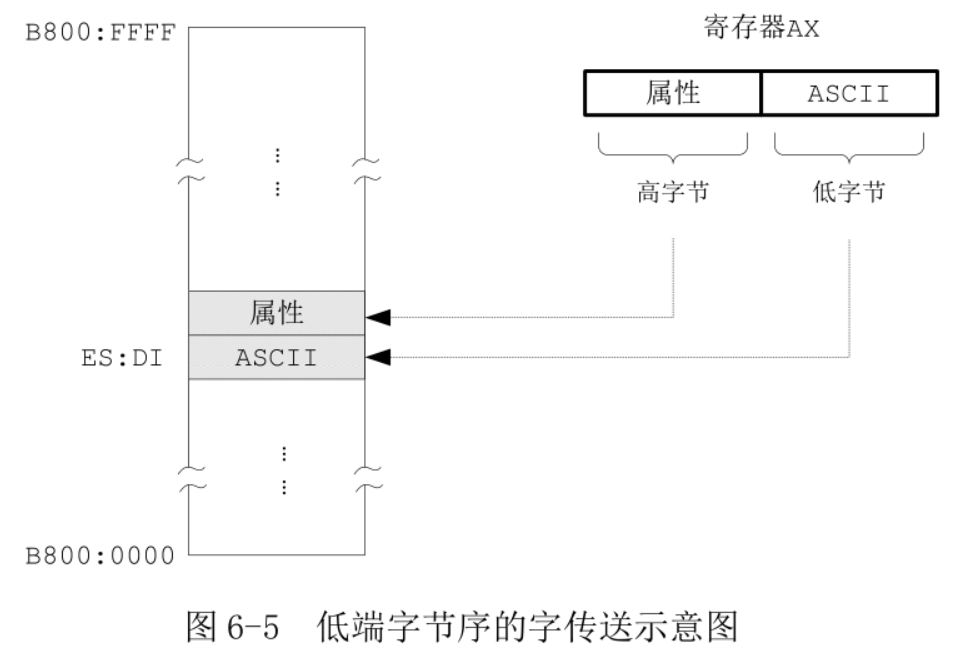

第40行，将保存有各个数位的数据区首地址传送到基址寄存器BX。

一共有 5 个数字要显示，其偏移地址分别是 BX（BX+0）、BX+1、BX+2、BX+3、BX+4。这里，BX是基地址，一般不变，这里使用了SI作为索引，SI被称为索引寄存器（Index Register），或者叫变址寄存器。另一个常用的变址寄存器是DI。

第41行，初始索引值是4，因为先显示万位上的数字。

第43行，偏移地址是 BX+SI。但是，**它们之间的运算并非是在编译阶段进行的，而是在指令实际执行的时候，由处理器完成的**。

第44行，得到对应的ASCII码。

第45行，AX中会是完整的字，AH是字符属性，AL是字。

第46行，在之前使用movsw传送字符串“Label offset：”也是使用DI。传送结束后，DI指向了字符“:”下一个位置。

注意，如图6-5，数据的传达是按照**低端字节序**的，**寄存器的低字节传送到显示缓冲区的低地址部分**（字节），寄存器的高字节传送到显示缓冲区的高地址部分（字节）。

第 47 行，将 DI 的内容加上 2，以指向显示缓冲区的下一个单元。

第48行，将SI内容减1，下一次BX+SI指向千位数字。dec是减一指令，和inc指令一样，后面跟一个操作数，可以是 8 位或者 16 位的通用寄存器或者内存单元。

第 49 行，指令 **jns show**，如果**未设置符号位**，则**转移到标号“show”所在的位置处执行**。如图6-2，Intel处理器的标志寄存器里有**符号位 SF**（Sign Flag），很多算术逻辑运算会影响到该位，比如这里的**dec指令**。如果**计算结果**的**最高位**是比特“0”，处理器把SF位置“0”，否则SF位置“1”。

SI初始值是4，第一次执行dec si后，si内容为3，二进制0000000000000011，符号位是“0”，处理器将SF位清“0”。于是，当执行jns show时，发现未设置，转移到标号“show”执行。

显示完最后一个数位后，SI内容为0，二进制0000000000000000。执行 dec si 指令后，由于产生了借位，实际的运算结果是 0xffff（SI 只能容纳 16 个比特），因其最高位是“1”，故处理器将标志位 SF 置“1”，表明当前 SI 中的结果可以理解为一个负数（－1）。于是，执行 jns show 时，条件不满足，接着执行后面第 51 行的指令。

jns是条件转移指令，执行时要参考标志寄存器的SF位。编译后的机器指令操作数也是一个相对偏移量，是用标号处汇编地址减去当前指令的汇编地址，再减去当前指令的长度得到。