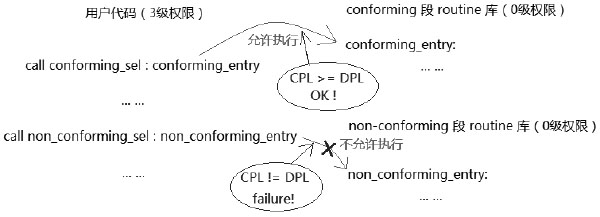
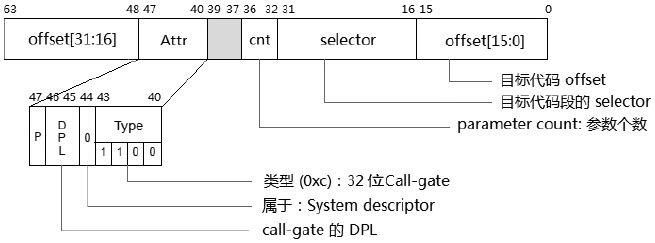

[TOC]

# 1 Segment Selector(段选择子)

Segment Selector结构是**16位(恒16位！！！**)，它是一个段的标识符，结构如下。


- RPL（Requested Privilege Level）：请求**访问者**所使用的权限级别，**从0到3级**。
- TI（Table Indicator）：描述符表索引位。当**TI=0**时，从**GDT**查找；当**TI=1**时，从**LDT**查找。
- Index（Descriptor Index）：这是Descriptor在GDT/LDT中的序号，根据TI的值在相应的描述表中查找descriptor。

注意，**段选择子不是段寄存器，不能混为一谈， 段选择子是一个数值，只有16位，段寄存器是寄存器，128位或96位, 其可见部分等于段选择子(！！！**), 段寄存器详见下面节.

当有下面的selector时，

```assembly
selector=0008H           ； RPL=0，TI=0，Index=1
```

表示将在GDT的第1项得到Descriptor，访问者使用的权限是0级。

>当Index为0，并且TI为0时，它在GDT内的第0项，是一个无效的selector，被称为Null selector（TI=1时，有效）。

当selector的值为**0000H到0003H**时，这个selector是**Null selector**，它指向**GDT的第0项**，第0项的Descriptor是unused（不被使用的）。Null selector的作用**类似于C指针中的NULL值**，用于**防止代码对unused segment register（未使用的段寄存器）进行访问**。

**13位的Index**取值范围是0～1FFFH（0～8191），表示selector可以寻址**8192个descriptor**（而0号的Null selector是无效）。

## 1.1 Segment Selector的加载

当代码被允许访问时，**selector值**会被加载到**segment selector register内**，像下面两类典型的访问，就会发生selector的加载。

```assembly
mov ax，0008H                ； selector=08H
mov ds，ax                    ； 加载 selector 到 DS寄存器
```

当descriptor的权限允许以及类型相符时，处理器会加载selector到DS寄存器的selector域里，同时对应的segment descriptor也会被加载到DS寄存器的Cache部分。（段寄存器结构稍后会探讨。）

```assembly
jmp 0008h：00001000h        ； 执行一个far jmp指令
call 0008h：00001000h       ； 执行一个far call指令
```

像上面的指令提供一个far pointer进行jmp/call操作，同样在通过处理器的检查后，处理器会加载selector到CS寄存器的selector域里，同时相应的Code segment descriptor也会被加载到CS寄存器。

注意：Null selector不允许加载到CS及SS寄存器，会产生#GP异常。允许被加载到ES、DS、FS，以及GS寄存器中，但是这些寄存器使用Null selector进行访问时会产生#GP异常。

当加载一个Null selector到上述允许的段寄存器时，处理器并不真正读取GDT的第0项segment descriptor到段寄存器中，而是以一个无效的unused descriptor来初始化段寄存器（段寄存器内除了S标志为1外，其他都为0）。

```assembly
mov ax，03H                  ； selector=03H
mov ds，ax                   ； Null-selector 加载
```

DS的结果是：DS.selector=03H，base/limit/attribute=0H（除了S标志为1外）。

## 1.2 Null Selector在64位模式下

在64位模式下，处理器对Null selector的使用并不检查。允许加载Null selector到除CS寄存器外的任何一个段寄存器（SS段寄存器有条件限制），以及使用这些Null selector进行访问。

### 1.2.1 加载Null selector到SS段寄存器

64位模式下，在**非3级权限**里，允许为**SS段寄存器加载一个Null selector**，即在0级、1级和2级权限下。假设当前运行在2级权限下，则下面的代码是正确的。

```assembly
mov ax，02H                  ； RPL=2
mov ss，ax                    ； Null-selector 加载，OK！
```

可是如果当前运行在3级权限下，则下面的代码是错误的。

```assembly
mov ax，03H                  ； RPL=3
mov ss，ax                   ； Null selector引发 #GP异常
```

Null selector的隐晦点在当使用retf指令（远调用返回）或iret指令（中断例程返回）时，如果发生权限的改变，引发stack切换的情景下变得更明显。

```assembly
push 3                   ； SS=Null selector
push USER_RSP
push USER_CS | 3      ； 切换到 3 级权限代码
push USER_ENTRY
retf                     ； #GP异常，不允许为SS加载3级权限的Null selector
```

在64位模式下，切换到3级的用户代码时，提供Null selector是错误的。明白了不能在3级权限下加载Null selector到SS寄存器后一切都变得豁然开朗了，归根到底还是因为忽视了Null selector的RPL的重要性。

## 1.3 隐式地加载Null selector

有时候处理器会隐式地为SS寄存器或其他Data Segment寄存器加载一个Null selector，这时候加载Null selector是有用的。

① 在执行RETF（远过程返回）或IRET（中断返回）指令时：当发生权限的改变（从高权限切换到低权限）时，如果ES、DS，FS，以及GS段寄存器内的DPL值低于CPL（DPL \< CPL），那么处理器将会为这些段寄存器隐式地加载Null selector。

② 在long mode下（包括64位模式和compatibility模式），使用call gate进行调用，发生权限改变（从低权限切换到高权限）时，处理器将会加载一个Null selector到SS寄存器，SS.selector.RPL会被设为新CPL值。

③ 在long mode下（包括64位模式和compatibility模式），使用INT进行中断调用（或者发生中断/异常），发生权限改变（从低权限切换到高权限）时，处理器也会加载Null selector到SS寄存器，SS.selector.RPL被设为新的CPL值。

在第一种情形里，由于从高权限切换到低权限代码，将Data segment寄存器（ES、DS、FS和GS）隐式加载为Null selector是为了防止在低权限代码里对高权限数据段进行访问。


在64位模式下无须重新加载，数据段寄存器可以使用Null selector进行访问，而在legacy和compatibility模式下在使用这些段寄存器之前应该为它们重新加载。

在第二和第三种情形下，是承接了上面所述的64位模式下加载Null selector到SS寄存器的条件。从低权限切换到高权限（也就是：非3级权限下）的64位代码下，处理器会为SS寄存器自动加载一个Null selector，目的是在这个64位的代码里调用其他更高权限的64位例程（库routine等）时，在返回时可以判断调用者是64位的高权限代码。

下面是一个示意图。


在上图中，这种嵌套的64位代码权限改变调用中，图中的0级kernel service代码返回到稍低一级的桩代码的过程里，处理器检查到压入的SS是Null selector，那么这个Null selector作为一个标志（调用者是64位的非3级权限代码），就为kernel service的设计提供了一个灵活的处理手法（根据这个标志可以选择进行/或不进行一些相应的处理）。

在这个64位代码进行stack切换的返回过程中，处理器允许Null selector被加载到SS寄存器中，不会产生#GP异常。这个条件是，目标代码的DPL不是3级（返回到非3级权限的代码）。

在legacy/compatibility模式下，以及在64位模式返回到3级代码的情形下，不允许从stack中pop出null selector。

# 2 Descriptor Table（描述符表）

**Segment Selector**用于在**Descriptor Table（描述符表**）里查找**descriptor（描述符**），在x86中有**三类描述符表**：**GDT（Global Descriptor Table**），**LDT（Local Descriptor Table**）和**IDT（Interrupt Descriptor Table**）。

## 2.1 描述符表寄存器

这些descriptor table由**descriptor table register（描述符表寄存器**）进行定位，因此，**三种描述符表**就对应着**三种描述符表寄存器**：**GDTR**，**LDTR**和**IDTR**。

## 2.2 GDTR


GDTR的limit域是**16位值**，最大的limit是FFFFH，base可以在处理器linear address空间的任何位置。


如图所示，GDTR.base提供GDT的基地址，GDTR.limit提供GDT表限。在longmode（包括64位模式和compatibility模式）下，GDTR.base是64位的GDT base值；在compatibility模式下，处理器也将读取64位的base值。

## 2.3 GDTR的加载

在selector能访问GDT之前，必须要对GDTR进行设置（加载寄存器），系统软件使用lgdt指令加载GDTR。

```assembly
lgdt [GDT_POINTER]                      ； 加载GDTR
```

或者

```assembly
mov eax，GDT_POINTER
lgdt [eax]
GDT_Pointer：       dw  3FFh                    ； GDT limit
dd  200000h                ； GDT base
```

lgdt指令在0级权限里执行，必须为它提供一个内存操作数，这个内存地址里低16位是GDT的limit值，高32位是base值（在64位代码里使用64位的值），这些值将被装入GDTR的limit和base域里。

## 2.4 GDT的limit

使用selector对GDT进行访问时，处理器会**检查selector是否超出GDT的limit**。若GDT的limit值为3FFh，那么GDT内的有效范围是0～3FFh（偏移量）。

当GDT的limit值为0C6h时，下列情形就超出了limit范围。

① 当使用0xc0作为selector访问GDT时。

```assembly
mov ax，0xc0              ； selector为C0h
mov ds，ax             ； #GP 异常（超限）
```

这个selector的Index是0x18，所访问的空间应该是C0h到C7h（8个字节的空间），然而limit的值是C6h，这超出了GDT的limit，将引发#GP异常。

② 当使用0xc8作为selector访问GDT时，超出了GDT的limit。

在GDT中segment descriptor是8个字节的，在①情形中，GDT的limit值不能容纳完整的descriptor宽度，使得selector访问的descriptor最后一个字节超出了GDT的limit。

# 3 Segment Selector Register（段寄存器）

段寄存器有时被表述为**段选择子寄存器**，包括两大部分：**visible（可视部分**）与**invisible（不可视部分**）。


如图所示，灰色部分是不可视部分，**只有Selector域是可视部分**。不可视部分隐藏在寄存器内部只有处理器可用，有时也被称为Cache部分。

>invisible部分由segment descriptor加载而来，作为一个段的cache作用。

在不改变段的情况下，对内存段进行访问，处理器从段寄存器内部的cache（不可视部分）读取段的信息，避免重复加载segment descriptor。

在**64位模式**下，段寄存器的**base地址**部分被扩展为**64位**，**limit域固定为32位**，Attribute和Selector是**16位宽**。在compatibility模式下依然使用base的低32位值。

**64位模式是128位, 32位模式是96位, 但是只有16位selector可见！！！**.

实质上，在**x64体系（Intel64和AMD64**）的机器上，寄存器的宽度本来就是64位，在实模式下低16位可用，在32位保护模式和compatibility模式下，低32位可用。

- Base域：提供**段的基址**。
- Limit域：提供**段限**，这个32位的段限是从Segment descriptor计算而来，Semgent descriptor里提供的limit域是20位宽的，加载到段寄存器后值被计算出32位。
- Attribute域：分别由**Segment descriptor**的Type、S、DPL、P、G、D/B、L，以及AVL域组合而来。
- Selector域：使用**selector加载新的段**时，selector会被加载到段寄存器的selector域。

在使用这些段寄存器之前，应该先加载，下面是一个典型的**段描述符加载到段寄存器的示意图**。


当段寄存器发生加载时，根据**Selector**得到**segment descriptor**，**Selector**将加载到**段寄存器的Selector域**，同时**segment descriptor**也将加载到**段寄存器的不可视部分（Cache**）。

segment descriptor加载到段寄存器中几乎是一对一加载，除了limit域：在**segment descriptor**的**limit域是20位**，而**段寄存器**中的**limit是32位宽**的。descriptor内20位的limit计算为32位后加载到段寄存器的limit域。

使用下列指令可以对Data segment寄存器进行**显式的加载**。

- mov指令：mov sreg，reg16。
- pop指令：pop es，pop ds，pop ss，pop fs，以及pop gs。
- lds，les，lss，lfs，以及lgs。

下列情形对**CS寄存器**或**SS寄存器**进行**隐式的加载**。

- 提供一个far pointer给jmp/call指令，进行远跳转/调用，根据提供的selector进行加载。

- 使用retf和iret指令进行返回时，根据stack中的image对CS寄存器进行加载，以及对SS寄存器（权限改变时）进行加载。

- 使用int指令进行中断调用，或者发生中断/异常时，对CS和SS寄存器（权限改变时）进行加载。
- 使用**TSS/Task\-gate**进行**任务切换**时，根据TSS段内的段寄存器image进行加载。
- 使用sysenter/sysexit，syscall/sysret指令时，处理器对CS和SS进行selector加载和一些强制性的设置。

在**64位模式**下，lds、les指令无效；pop ds、pop es，以及pop ss指令无效；**使用TSS机制进行任务切换将不再支持(！！！**)。

# 4 Segment Descriptor（段描述符）

段寄存器和段描述符（Segment Descriptor）在整个x86/x64体系里非常重要，前面的图揭示了**段寄存器与段描述符的关系**。在保护模式里，段寄存器离不开段描述符，而段描述符也不能独立于段寄存器存在。只有当段描述符被加载到了段寄存器里才能发挥应有的作用。

**TSS descriptor**是一个比较特殊的**段描述符**，当一个**TSS descriptor被引用**（被加载）时，处理器会将它**置为Busy状态**。Busy状态的TSS descriptor不能被加载，它存在于GDT中会发挥一定的作用。

段描述符要么存放在Descriptor Table（描述符表）里，要么被加载到段寄存器里。一个段描述符在被加载到段寄存器后，它所描述的段变成**active状态**。在继续探讨段寄存器之前，我们先要了解段描述符。

## 4.1 描述符（Descriptor）的种类

段描述符只是众多描述符中的一类，描述符有**两大类**：Segment Descriptor（段描述符）和Gate Descriptor（门描述符）。按系统性质来分，可以分为：System Descriptor（系统描述符）和Code/Data Descriptor（非system描述符）。

下面是笔者对Descriptor按系统性质的分类。

- **System descriptor（系统描述符**）。
    - **System Segment descriptor（系统段描述符**）：包括**LDT descriptor**和**TSS descriptor**。
    - **Gate descriptor（门描述符**）：包括**Call\-gate**，**Interrupt\-gate**，**Trap\-gate**，以及**Task\-gate descriptor**。
- **Non\-system segment descriptor（非系统描述符**）。
    - **Code segment descriptor（代码段描述符**）。
    - **Data segment descriptor（数据段描述符**）。

Descriptor的**S域**指示了**描述符的类型**，当**S=0**时，属于**系统级的描述符**，**S=1**时，属于**Code/Data类描述符**。

在**legacy模式**下，**每个描述符**是**8字节64位宽(！！！**)，在**long mode**（包括**compatibility模式**）下，**所有的gate描述符**是**16字节128位宽**，而**Code/Data段描述符**依然是**8字节宽(！！！**)。

**LDT/TSS描述符**在**64位模式**下是**16字节128位宽(！！！**)，而在**compatibility模式**下依然是**8字节64位宽(！！！**)。

## 4.2 代码段描述符

Code segment（代码段）描述符结构（**64位宽**）如下。


对于**Code段**来说，它的类型取值范围是**8～F**，对于4位的Type域来说，还可以进行一细化为


**Code/Data标志**指示段描述符属于**Code段还是Data段**，1属于Code段（指示该段可执行并且不可写）。

**C标志位**是比较重要的，C=1时为**conforming类型**，C=0时为non\-conforming类型，0x8～0xB是non\-conforming类型，0xC～0xF是conforming类型。

**32位的段base值**被分为2个部分：base的低24位放在segment descriptor的bit 39位到bit 16位上。base的高8位放在segment descriptor的bit 63到bit 56位上。（注意区分：在Intel和AMD的手册上以2个32位结构进行描述，在这里以一个64位结构进行描述。）

**20位的段limit值**也被分为2个部分：limit的低16位放在segment descriptor的bit 15到bit 0位上，高4位放在segment descriptor的bit 51到bit 48位上。20位的limit值经过计算为32位后被加载到段寄存器上。

### 4.2.1 Accessed访问标志

在type域里的A标志（accessed）指示段是否被访问过，A=1表示已经被访问过（被加载到段寄存器中），A=0表示未访问。

当段描述符被加载到段寄存器时，只有当A标志位为0时，处理器才会对在GDT/LDT中的segment descriptor中的A标志进行置位，这种行为可以让系统管理软件（典型的是内存管理软件）知道哪个段已经被访问过。

可是一旦置位，处理器从不会对A标志位进行清位。系统软件在对descriptor进行重新设置的时候，可以对A标志位进行清位。在处理器再次加载descriptor的时候对A标志位重新置位，在这种情况下，A标志往往配合P标志位使用。系统软件在对A标志和P标志位进行修改的时候应当使用LOCK指令前缀锁bus cycle。

当处理器加载descriptor到段寄存器时，处理器会对descriptor执行自动加lock的行为，处理器在访问这个descriptor期间，其他处理器不能修改这个descriptor。

这个加载descriptor期间，应当包括从对descriptor检查到最后的使用descriptor更新段寄存器内的Cache部分。

### 4.2.2 Readable可读类型

一个代码段不可能被写访问，但可以被读访问，当代码段的类型标志R设为1时，表示该代码段可以被读，那么就可以像下面这样使用CS段进行读访问。

```assembly
mov eax，cs：[ebx]              ； 通过CS寄存器读代码段空间
```

或者可以将code segment descriptor加载到数据段寄存器进行读访问。

```assembly
mov ax，CODE_SEL                 ； CODE_SEL是一个代码段描述符
mov es，ax                         ； 将代码段描述符加载到ES
mov eax，es：[ebx]
```

前提是有足够的权限加载（non-conforming类型）描述符，CPL<=DPL并且RPL<=DPL。或者是对于conforming类型的代码段描述符加载总是成功的。

### 4.2.3 conforming与non\-conforming代码段

conforming类型的代码强迫使用低权限或相等权限（CPL>=DPL）来运行，nonconforming类型的代码限制用户使用低权限来运行（进入高权限代码需要通过gate符调用）。

conforming段的另一个重要特性是：进入conforming段运行不改变当前运行的CPL值（无论是通过直接调用还是gate调用）。



如上图所示，在同一段3级权限的用户代码里，分别调用conforming段和nonconforming段的代码，采用直接调用的方式。

```assembly
call selector：offset              ； 提供far pointer直接调用
```

从3级直接调用0级权限的conforming段代码获得通过，处理器检查CPL>=DPL（低权限或相等权限），而调用0级的non\-conforming段代码将失败，处理器检查到CPL != DPL（权限不相等）。

conforming段的代码将阻止使用高权限执行，假如调用者的权限是0级，而conforming段的权限为1级，那么这个调用将失败。因此当conforming段使用0级DPL时，就可以在任何权限里执行。进入conforming段不会引起权限和stack的切换。

non\-conforming段的代码将阻止使用低权限执行，而强迫通过使用gate来执行高权限的代码。

>**需要保护**的代码和数据应该**使用non\-conforming段**，而对于**不重要、无须保护**的代码可以使用conforming段。

在某些场合下，使用conforming段会比使用non-conforming段灵活：例如要使一个库routine能在任意权限下运行，前提是这个库routine并不涉及重要的数据和使用系统资源。

基于这种要求，我们来对比一下conforming段与non-conforming段。

① 使用conforming段，并将DPL设为0级权限，在3级权限下可以直接调用（CPL>DPL），在0级权限下，依然可以使用直接调用（CPL==DPL）。

② 使用non-conforming段，并将DPL设为3级权限，在3级权限下可以直接调用（CPL==DPL），而在其他级别无法直接调用，例如在0级不能直接调用3级权限的代码（CPL！=DPL），那么在0级权限使用gate符进行调用呢？同样做不到（条件是：CPL>=DPL of Code segment）。如果将non-conforming段的DPL设为0级权限，在3级权限下可以使用gate符进行调用，在0级权限下也可以使用gate符进行调用。

相比之下，non-conforming段的执行权限需要被定义为0级，通过gate符进行调用，显得不如conforming段灵活，并且conforming段定义在3级权限，不会改变调用者的CPL值。对于不重要的库routine来说，使用conforming段会更适合些。

下面是一个典型的使用方法。

代码清单10-1（lib\conforming_lib32.asm）：

```assembly
；----------------------------------------------
； conforming_lib32_service_enter（）：conforming代码库的 stub函数
； input：
；       esi：clib32 库函数服务例程号
； 描述：
；       conforming_lib32_service_enter（）的作用是切换到 conforming段里，
；       然后调用 conforming lib32 库里的服务例程，它相当于一个 gate 的作用。
； -----------------------------------------------
__clib32_service_enter：
__conforming_lib32_service_enter：
      jmp do_conforming_lib32_service
conforming_lib32_service_pointer       dd __clib32_service dw conforming_sel
do_conforming_lib32_service：
      call DWORD far [conforming_lib32_service_pointer]   ； 使用 conforming 段进行调用
      ret
；--------------------------------------------
； conforming_lib32_service（）
； input：
；       eax：clib32 库函数服务编号
；--------------------------------------------
__clib32_service：
__conforming_lib32_service：
      mov eax，[__clib32_service_table + eax * 4]
      call eax
      retf
；----------------------------------------------------------
； get_cpl（）：得到 CPL 值
； output：
；       eax：CPL 值
；----------------------------------------------------------
__get_cpl：
      mov ax，cs
      and eax，0x03
      ret
； conforming lib32 库服务例程表
__clib32_service_table：
      dd __get_cpl                            ； 0 号
      dd __get_dpl                            ； 1 号
      dd __get_gdt_limit                     ； 2 号
      dd __get_ldt_limit                     ； 3 号
      dd __check_null_selector              ； 4 号
      dd __load_ss_reg                        ； 5 号
```

这段代码在lib\conforming\_lib32.asm库里，是专门为conforming段代码所设立的一个32位的库，\_\_get\_cpl（）函数用来获取**当前运行的CPL值**。那么，在软件里可以使用下列方式来调用。

```assembly
mov eax，0       ； clib32 库的例程编号
call __clib32_service_enter   ； 调用 clib32 库的进入函数
```

在\_\_clib32\_service\_table里，\_\_get\_cpl（）函数的编号是0，因此，给eax寄存器传递例程号由接口函数\_\_clib32\_service\_enter（）来进行调用。

它设立的目的是能**在任何权限执行**，这样就可以很方便地**获取到CPL值**。

由于conforming的特殊性——不改变CPL值，于是\_\_get\_cpl（）函数就被放在conforming里执行。如果以non\-conforming段来运行，就显得很麻烦了。

① 发生权限的改变时CPL会改变。因此还要根据情况做出相应的判断。

② 必须放在0级的DPL权限里，使得0级权限下能够执行，在3级里使用gate进行调用。

而放在conforming段里就很容易做到了，这个\_\_get\_cpl（）函数的调用路径是

\_\_conforming\_lib32\_service\_enter（）--> \_\_clib32\_service（） --> \_\_get\_cpl（）

上面是在conforming\_lib32.asm库里的执行顺序。在我们的程序里只需给出conforming段目标例程get\_cpl（）的例程号（在inc\clib.inc文件里定义了一些常量值），然后调用入口函数就可以了。入口函数\_\_conforming\_lib32\_service\_enter（）负责切换到conforming段执行。

在conforming\_lib32.asm库里的这些烦琐的调用路径是为了实现一个库的接口，当conforming\_lib32.asm库里添加更多的函数时，可以利用这个路径进入。

代码清单10-2（topic10\ex10-1\protected.asm）：

```assembly
mov esi，msg2                        ； 打印信息
call puts
mov eax，CLIB32_GET_CPL   ； 常量定义在 inc\clib.inc 头文件里
call clib32_service_enter         ； 调用 conforming 例程
mov esi，eax
call print_byte_value              ； 打印值
```

最后，在我们的程序里，分别在0级和3级用户代码里调用，结果如下。


这个结果分别打印了当前的CPL值，说明处理器从0级切换到了3级权限里。结果虽然很简单，但意义重大。

### 4.2.4 DPL属性

在segment descriptor里DPL属性定义一个段所需要的最低访问权限。如果DPL设为2级权限，那么0、1和2级权限可以访问，3级权限将被拒绝。

在处理器权限检查中，DPL是一个重点的被检查对象，使用CPL与DPL进行权限对比。许多情况下还需要使用RPL与DPL进行额外的辅助对比。

### 4.2.5 S属性

S标志位指示descriptor属于System还是Code/Data（非System），Code/Data段的S位为1值，当S=0时，descriptor属于System（例如，LDT/TSS描述符，Gate描述符）。

### 4.2.6 P属性

P标志位指示一个segment或gate是否存在内存中，P=1表示segment或gate已经放在内存中，P=0表示该segment或gate不存在内存中（所需的内存没准备好）。

当P=0时加载segment descriptor到segment寄存器，会产生#NP（Segment Not-Present）异常，#NP异常是一个fault类型的异常，表示在#NP handler里必须要修复这个错误。

在#NP handler里有责任去改正Segment Not-Present错误，当内存准备好时，在#NP handler里需要将在GDT的描述符的P置为1（返回加载者表示已经准备好了），在启用paging内存管理的系统里，接收#NP异常后，应尝试将物理内存提交到segment的virtual address上，成功后将P标志置为1值。

OS内存管理模块维护segment和page（当启用paging机制时）的present状态，当page是not-present时产生的是#PF（Page\-Fault）异常。

在某些情况下，系统软件需要主动去清P标志位，当系统软件需要对descriptor进行更新时。在更新descriptor前将P标志位清0，指示为不可用的。在更新完毕后，对P标志进行置位，指示为可用的。在这种情况下P标志往往与A标志配合使用。

### 4.2.7 D/B属性

D/B在不同的segment里有不同的意义，对于Code segment来说，它指示Default operand size（默认的操作数大小），这个标志位被称为D标志位，D=1指示Code Segment的默认操作数是32位，D=0时是16位。

### 4.2.8 long mode下的D/B属性

在long mode下，Code segment的D标志与L标志（L标志在legacy模式下是保留位）组合使用，如下所示。


如上所述：L=0时处理器处于compatibility模式，再根据D标志选择相应的default operand size（默认操作数）。当L=1时处理器处于64位模式，但是还需要D标志位配合（D需为0）。

值得注意的是，x64体系规定L=1且D=1是无效的组合。

在实模式下，由于CS.D为0，因此实模式下默认的操作数是16位的。

无论默认操作数是16位还是32位，操作数的大小是可以改变的，通过使用operand size override（操作数大小的改写）操作。

```assembly
bits 16
mov eax，1                 ； 16位默认操作数下，使用32位的寄存器
```

如上所示。在汇编语言代码层上，在16位的默认操作数下使用32位的寄存器，那么编译器会为这条指令生成一个额外的operand size override prefix字节，它是66H，从而可以使用32位宽的操作数。

当L=1且D=0时，使用该Code segment时将进入64位模式，但默认操作数还是32位的（部分指令是64位的），那么要使用64位的操作数，需要使用REX.W进行扩展。

```assembly
bits 64
mov rax，1                 ； 32位默认操作数下，使用64位的寄存器
```

同样的情形下，编译器会为这条指令生成的机器码中加入REX prefix（前缀），REX字节为48H（REX.W=1），这样操作数被扩展为64位宽。


上图揭示了D标志重要性的另一面：当D=0时，由于默认操作数是16位的，影响到call指令在调用时压入了16位的返回地址（当前的ESP指针是32位），即使在SP为16位的前提下，如果D=1，call指令将压入32位的返回地址而不受SP指针的影响。

### 4.2.9 L属性

L标志位仅用于long mode的Code segment descriptor。L=1表示进入64位模式，L=0表示进入compatibility模式。L标志需配合D标志使用，详见上面的D/B属性描述。

### 4.2.10 G属性

G标志位指示**segment limit的粒度**。当G=1时，段限的粒度为**4KB**，当G=0时段限的粒度为1 byte。G标志配合limit域使用，20位的limit值配合G标志的计算后产生32位的limit值。

- G=0时：32位的段限就是limit域的值。
- G=1时：32位的段限=limit×4K+FFFH。

假如segment descriptor的20位limit域是FFFFF，那么最终32位的段限是

```assembly
FFFFFh × 1000h + FFFh=FFFFFFFFh
```

段的limit值的计算方式是统一的，但段内有效区域实际上较为复杂，分为Expandup和Expand\-down两种类型。这在10.5.4.5节有详细的描述。

## 4.3 long mode下的Code段描述符

在long mode（包括**64位模式**和**compatibility模式**）下，Code Segment Descriptor的**L标志**是一个**切换开关**，它将指示段描述符在64位模式和compatibility模式角度下进行切换解析，如下所示。


当L=1时切换到64位模式，这时候Code segment descriptor使用64位模式的定义（对描述符采用64位模式解析），当L=0时切换到compatibility模式，这时候Code segment descriptor使用legacy定义，**compatibility模式下和legacy下定义是完全一致**的。

在64位模式下大部分域都是无效的，仅有少数几个属性标志有效，如下所示。


**灰色部分是无效域**，将被忽略，白色的属性标志——C标志，DPL标志，P标志，L标志，以及D标志是有效的。**固定部分是必须设置为1的标志（S=1，以及Code/Data=1**）。

在**64位模式**下，由于**段的base**和**段的limit**都**无效**被忽略，它**强制所有段的base为0(！！！)，limit为FFFFFFFFH(64位满！！！)，只有FS和GS寄存器可以使用非0值的段base**。

下面是一个典型的long mode下代码段描述符的定义。

```assembly
；；； 定义一个64位代码段，DPL=0，P=1，S=1，Code/Data=1，L=1，D=0
kernel_code64_desc    dq 0x0020980000000000     ； Attribute=2098H
```

除了属性域外，其他的域都为0值，可见在**64位模式下大大简化了segment descriptor的定义**。当L=1且D=0时，目标代码是64位模式的。L=1且D=1时是无效的组合。L=0时，根据D标志位判断目标代码是32位还是16位的默认操作数。

这是否就是x64体系中在64位OS里向下平滑地兼容执行legacy应用程序的原理呢？

没错！在x64体系中，可以使用全新的64位操作系统，当OS开启long mode并激活long mode，这时候处理器进入long mode。OS的kernel及其executive组件运行在64位模式，而应用程序可以是32位或64位，**运行32位的应用程序**处理器将**转入到compatibility模式**运行，运行64位应用程序则切换回64位模式。

处理器就是根据目标程序加载的Code segment descriptor中的L标志进行切换。因此可以使用一个32位程序的Code segment descriptor而无须任何修改或重新编译。在long mode下，程序代码可以在compatibility与64位模式下任意切换（前提是执行环境设置正确）。

## 4.4 代码段寄存器的加载

目标代码要得到执行必须先将其code segment descriptor加载到Code segment register（代码段寄存器）即CS寄存器里。不像数据段寄存器，CS寄存器不能使用mov或pop指令进行直接加载，必须通过控制权的转移形式隐式加载。代码段寄存器的加载非常复杂，这是保护模式下最为复杂的一个环节，不但涉及控制权的转移，也涉及权限的检查，以及stack的切换，某些情况下还涉及任务的切换。

### 4.4.1 加载CS寄存器的常规检查

在加载CS寄存器前处理器会进行一些检查，下面是对Code segment Selector和Code segment descriptor进行的常规检查（未包括对权限检查的描述）。

### 4.4.1.1 selector的检查

处理器检查selector是否为Null selector，处理器不允许加载一个Null selector到CS寄存器中。否则会产生#GP异常。

### 4.4.1.2 limit的检查

处理器检查selector是否超出GDT/LDT的limit表限，否则产生#GP异常。然而在64位模式下，处理器并不检查selector是否超limit值。

### 4.4.1.3 Code segment类型的检查

能被加载到CS寄存器的Code segment descriptor类型必须如下。

① S=1，属于非system描述符。

② Code/Data标志为1，指示属于一个Code段，表示它是Execute（可执行）的段。

③ P=1，指示段在内存中。

即使在64位模式下，在加载CS时，处理器也必须进行上面的检查。上面这些检查中并不包括对权限的检查，在稍后的各种加载CS寄存器的情形里再分别对权限检查进行进一步的探讨。

### 4.4.2 用far pointer加载CS寄存器

直接跳转形式是提供一个far pointer（selector：offset形式）使用jmp/call指令进行跳转/调用，并不通过call-gate描述符，因此CPL不会改变。

① 当jmp/call到一个non-conforming代码段时，non-conforming类型的代码段会阻止不同权限的代码进行加载。

```assembly
call 0x28：0x00001000         ； 0x28是一个non-conforming代码段选择子
jmp 0x28：0x00001000
```

在这个情形里，jmp/call指令能够成功加载CS寄存器所需要的权限如下（必须是同级调用）。

>CPL == DPL并且 RPL <= DPL

这里使用的selector是0x28，那么它使用的RPL是0。如果当前的CPL=3，而DPL为0，则会失败，产生#GP异常。

② 当jmp/call到一个conforming代码段时，conforming类型的代码会阻止高权限代码进行加载。

```assembly
call 0x30：0x00001000         ； 0x30是一个conforming代码段选择子
```

jmp/call指令能够成功加载CS寄存器所需要的权限如下（必须是同级或低权限代码调用）。

>CPL>=DPL，RPL被忽略

在64位模式下，不允许使用直接far pointer指针（立即数操作数），需要使用间接的far pointer指针，这个indirect（间接）的far pointer必须保存在内存中。

```assembly
call QWORD far [FAR_POINTER]       ； 使用间接的64位far pointer
```

在提供的内存操作数里，该内存地址依次存放64位的offset值和16位的selector值。在上面的常规检查和权限检查通过后，处理器将加载Selector和目标Code段描述符到CS寄存器里，CPL无须更新（即CS.RPL不会被更新）。

在AMD的机器里，在64位操作数下，far pointer的offset值是32位，如下所示。

```
FAR_POINTER：
dd entry64       ； 32 位 offset 值
dw cs_selector
```

### 4.4.3 使用call gate加载CS寄存器

直接调用方式是加载一个相同权限的段描述符到CS寄存器，那么需要进行权限改变时，必须使用Call-gate描述符。使用call gate可以加载更高权限的Code段描述符。



Call\-gate描述符是system descriptor的一种，它的S标志位为0，在legacy模式下（非long mode）是8字节64位宽。Call-gate描述符可以放在GDT或者LDT，但不能放在IDT。

#### 4.4.3.1 offset域

32位的目标代码offset值被分成两部分，低16位在描述符的低16位，高16位在描述符的bit 63到bit 48位，由selector得到对应的目标code segment descriptor。offset值加上这个code segment descriptor的base域就是目标代码的入口点。

#### 4.4.3.2 selector域

它是目标代码段的selector，由它获得code segment descriptor，这个code segment descriptor的DPL值是处理器用来进行权限检查的条件之一。目标代码的基址由这个code segment descriptor的base域提供。

#### 4.4.3.3 cnt域

这个值共5位，指示参数个数，作用是caller（调用者）向callee（被调用者）传递参数。调用者在自己的栈压入参数，处理器根据在cnt域里的参数个数将调用者的stack中的参数复制到被调用者的stack中，被调用者可以在自己的stack中访问参数。

#### 4.4.3.4 Call\-gate的DPL值

每个门描述符有它自己的DPL值，在使用call-gate进行调用时，gate描述符的DPL结合目标code segment descriptor的DPL进行权限检查。

#### 4.4.3.5 gate selector和gate descriptor的常规检查

处理器会检查如下内容。

① call/jmp指令使用的selector是否为Null selector，是否超出GDT/LDT的limit。

② selector所引用的descriptor是否为Call\-gate描述符。

③ gate描述符的S标志是否为0，指示它属于System描述符。

④ gate描述符的P标志是否为1，表示它在内存中。

⑤ 最后，还要对gate描述符里所引用的code segment selector及目标Code segment descriptor做10.5.4.4节下1中所描述的常规检查。

#### 4.4.3.6 使用call指令调用call-gate时的权限检查

在使用call指令加载到CS寄存器之前会进行权限的检查，处理器会对两个DPL进行检查：Call-gate的DPL和Code segment的DPL，目标Code段能加载CS寄存器的合法权限如下。

① CPL <= Call-gate的DPL，并且 RPL <= Call-gate的DPL。

② CPL >= Code segment的DPL（由低权限进入高权限，或者相等权限）。

在①里揭示了当前运行的代码必须有权限去访问Call-gate描述符（CPL和RPL须小于等于Call-gate描述符的DPL值），在②里揭示了目标代码必须由低权限或者相同权限的代码去调用。

注意：如果目标代码段是conforming类型，进入高权限代码后，CPL是不会改变的。

#### 4.4.3.7 加载selector及code segment descriptor到CS寄存器

通过检查后，目标代码段的selector及Code segment desciptor会加载到CS寄存器，并转到目标代码执行。


如图所示，我们可以使用类似下面的指令进行调用。

```assembly
call Callgate_sel：0                ； Callgate_sel是一个门符选择子
```

那么在Call-gate描述符里的selector域（也就是目标代码段的selector）将被加载到CS寄存器的Selector域里，CS寄存器内部的cache会被加载为目标code segment descriptor。

CS.Selector.RPL会更新为目标Code segment descriptor的DPL值，也就是CPL会得到更新（code segment的selector.RPL会忽略）。

当目标代码段是conforming类型时，selector和code segment descriptor会被加载到CS寄存器，但CS.selector.RPL不会被更新（CS.RPL保持原值）。

#### 4.4.3.8 权限的切换

当目标代码是高权限代码时，将会发生权限的切换，CPL会更新为目标code segment的DPL值。以上面的call指令为例，假如调用者的权限是3级，目标代码的权限是0级，CS寄存器的Selector.RPL会被更新为0级。

在long-mode下，call指令调用call-gate而引发权限切换，如果调用者在compatibility模式下，处理器将切换到64位模式里执行。

#### 4.4.3.9 当使用jmp指令调用call-gate时

Jmp指令与call指令会遭遇不同的情况，当使用jmp指令对call-gate进行跳转时，处理器必须确保在相同的权限级别下跳转。

```assembly
jmp Callgate_sel：0                ； Callgate_sel是一个门符选择子
```

如果在不同的权限级别下，有两种可能，依赖于目标代码的类型。

① 跳转失败：当目标代码段是non-conforming类型时，处理器的检查是

a）CPL <= Call-gate的DPL，并且 RPL <= Call-gate的DPL。

b）CPL == Code segment的DPL（权限必须相等）。

b）点揭示了使用jmp指令跳转到non-conforming代码段时不会发生权限的切换（权限必须相等）。

② 跳转成功：当目标代码段是conforming类型时，处理器的检查和call指令一致。Conforming代码段允许由低权限访问者跳转到高权限里，但权限不会发生切换。

>使用**jmp指令无论如何也不会发生权限切换**，CS.selector.RPL会维持原值。

#### 4.4.3.10 stack的切换

当发生权限的切换（意味着将切换到高权限里），同时处理器也会自动进行stack的切换，stack的权限和CPL权限是必须一致的。处理器将在当前TSS段里读取相应权限级别的SS与ESP值，加载到SS与ESP寄存器里。

在long-mode下执行call指令调用call-gate而引发stack切换时（无论是在64位模式还是compatibility模式）：仅读取TSS中的RSP值，并且处理器加载一个Null selector到SS寄存器里。最后处理器会转入64位模式里执行。

关于stack的切换我们将在后面的10.5.4.5节里进行详细的探讨。

#### 4.4.3.11 long\-mode下的Call\-gate

在long mode（包括64位模式和compatibility模式）下，Call-gate被扩展为16个字节共128位结构。


如上图所示，目标代码的offset值扩展为64位，在Call-gate的高8字节Bit 44到Bit 40位共5位必须设置为0值，代表一个无效的descriptor类型。在long mode下段描述符（Code和Data）仍然是8字节宽度。由于Call-gate存放在GDT或LDT中，占据了2个segment descriptor的空间（16字节）。

为了对Call-gate descriptor和Code/Data segment descriptor加以区分，防止Call-gate的高8字节作为Code/Data segment descriptor进行引用，必须将高8字节的S标志和Type域置为0。

Call-gate的Type依然是0Ch值，long mode下这个类型是64位Call-gate类型。

#### 4.4.3.12 64位Call\-gate的offset值

这个offset值必须是一个canonical形式的地址值（关于canonical地址，详见2.4.3节描述），否则会产生#GP异常。

#### 4.4.3.13 64位Call\-gate中的selector

这个selector所引用的code segment descriptor必须是64位代码段（L=1并且D=0）。因此我们可以看到开启了long mode的OS，它的核心代码运行在64位模式下（0级权限的代码为64位）。

#### 4.4.3.14 64位Call\-gate的调用

在64位模式下不允许在指令中直接提供far pointer指针形式，需要使用内存操作数。

```assembly
call QWORD far [CALLGATE_POINTER]   ； 使用间接的64位far pointer形式
```

除了要通过和legacy模式相同的权限检查外，还需要经过额外的检查。

① Call\-gate的高8位的S与Type是否为0（5个0）值，否则产生#GP异常。

② offset是否属于canonical地址形式，否则产生#GP异常。

③ 目标Code segment descriptor的L标志和D标志组合是否属于64位模式代码，否则产生#GP异常。

如同legacy模式一样，Code segment 的selector和descriptor会加载到CS寄存器的selector和cache里，64位的offset值会加载到RIP寄存器中。

#### 4.4.3.15 在compatibility模式下对64位Call-gate的调用

compatibility模式运行在32位或者16位代码，通过far pointer调用64位Call-gate进入64位模式。

```assembly
call Callgate_sel：0      ； Callgate_sel是一个64位Call-gate选择子
```

如同在legacy模式下一样，在compatibility模式下可以使用直接的far pointer形式调用call gate，这将导致处理器从compaitibility模式切换到64位模式。处理器对调用的检查与在64位模式下是完全一致的（64位Call-gate本身并没有改变）。注意在64位的操作数size下，AMD64体系的far pointer是16：32结构（48位宽），在Intel64体系的far pointer是16：64（80位宽）。

### 4.4.4 使用TSS selector调用加载CS寄存器

使用TSS selector进行调用是call/jmp指令加载CS寄存器的第三种方法。使用TSS selector和Task-gate进行任务切换的机制异常复杂，机器的耗时非常多。

#### 4.4.4.1 TSS descriptor

TSS描述符属于系统描述符（它的S标志位为0值），并且只能存放在GDT中，不能放在LDT和IDT。下面是32位TSS结构。


在legacy模式里的TSS描述符是8字节64位宽。在long-mode的compatibility子模式里TSS描述也是8字节，和legacy模式行为一致。

#### 4.4.4.2 TSS类型

在Type类型域里，1001B是32位TSS，1011B是Busy 32位TSS。而0001B是16位TSS，0011B是Busy 16位TSS。

#### 4.4.4.3 提供TSS selector进行call或jmp调用

可以提供直接的far pointer或间接的far pointer给call或jmp指令进行任务切换。

```assembly
call tss_sel：0                       ； tss_sel是一个32位TSS选择子
```

同样，处理器会经过一系列的检查，包括常规的selector和TSS descriptor险查以及权限的检查。

#### 4.4.4.4 TSS selector及TSS描述符的常规检查

处理器对所使用的TSS selector和TSS descriptor进行如下常规的检查。

① selector是否为Null selector，是的话产生#GP异常。

② selector.TI是否为1，是的话表示将使用LDT，产生#GP异常。

③ selector的引用是否超出GDT的limit，是的话产生#GP异常。

④ TSS descriptor的S标志为0，表示属于system描述符，否则产生#GP异常。

⑤ TSS descriptor的P标志为1，表示在内存中，否则产生#GP异常。

⑥ TSS descriptor是否属于available 32-bit TSS（即类型值为1001B），如果是属于Busy状态或者其他的描述符类型，则产生#GP异常。

⑦ TSS descriptor里的limit值是否大于等于67H，否则产生#GP异常。

从上面可以看到，处理器对TSS selector及TSS描述符的检查是很多的。

#### 4.4.4.5 权限检查

使用TSS selector进行调用需要如下权限（使用call指令与使用jmp指令相同）。

① TSS selector的RPL <= TSS描述符的DPL

② CPL <= TSS描述符的DPL

如上所示，调用者必须有权限去访问TSS descriptor，但是在调用时处理器并不检查TSS段内的各个权限。只有在切换阶段加载TSS段内的各个段（CS，SS及所有段）时才会对它们进行详细检查。


上图是一个简单的加载CS寄存器示意图，当所有检查都通过时，处理器进行复杂的任务切换工作。最后会在TSS段里加载所有的段寄存器，包括CS与SS寄存器。

#### 4.4.4.6 对原TSS descriptor进行处理

对于使用jmp指令和call指令，处理器会有不同的处理。

① jmp指令会清当前TR所使用的TSS descriptor 的Busy位，使当前所使用的TSS descriptor置为available状态。

② call指令会保持当前TR所使用的TSS descriptor的Busy状态，不作处理。

当前TR内的TSS descriptor是在系统初始化时加载的，加载到TR后处理器会将TSS descriptor置为busy状态。进入保护模式后必须要加载一个TSS descriptor到TR，这是一个完整的执行环境中必不可少的，否则将不能发生权限的切换。

下图是处理器在进行任务切换时的工作示意图，图中的原TSS描述符是指上面所说的当前TR所引用的TSS描述符。


#### 4.4.4.7 保存原处理器状态

如上图所示，接下来处理器将在当前TSS段（未加载TR之前为当前的TSS段）里保存切换前的处理器状态（对于新的task来说是原task状态）。

#### 4.4.4.8 在新的TSS段写入原TSS selector

如果是使用call指令进行调用的，将会在新的TSS段里的Link域（Previous task link）写入原TSS selector值。而对于jmp指令来说，处理器不会写入TSS selector。


上图是在legacy模式（非long mode）下的32位TSS segment结构，旧task的处理器状态保存在原TSS段里，而新Task的初始化状态从新的TSS段里进行加载。在任务切换到新Task时处理器的最后任务是加载新task的初始状态，使用call指令调用会将原TSS selector写入新任务的TSS段的Link域，以便由新任务里切换回原任务。

处理器会检查TSS descriptor的limit域，看看TSS段是否大于等于67H（十进制数的103），TSS段的最小段限是67H，如上图所示：从0到103之间的区域是必需的。

代码清单10-3（topic10\ex10-1\protected.asm）：

```assembly
；； 设置新 TSS 区域
      mov esi，tss_sel
      call get_tss_base
      mov DWORD [eax + 32]，tss_task_handler                 ； 设置 EIP 值为
tss_task_handler
      mov DWORD [eax + 36]，0                                  ； eflags=0
      mov DWORD [eax + 56]，KERNEL_ESP                         ； esp
      mov WORD [eax + 76]，KERNEL_CS
； cs
      mov WORD [eax + 80]，KERNEL_SS                            ； ss
      mov WORD [eax + 84]，KERNEL_SS                            ； ds
```

上面这段代码在protected.asm模块里，对新的TSS段进行一些设置，几个必需的要素包括：EIP与ESP、CS、SS、DS，以及CR3的值，其他为0值。在未开启paging情况下，CR3可以忽略，CR0和CR4都使用现有的。

#### 4.4.4.9 置Eflags.NT标志位

使用call指令进行调用时，处理器会对Eflags.NT标志位进行置位，指示新task进入Nested（嵌套）状态。而对于jmp指令则相反，jmp指令对Eflags.NT标志位进行清位。

#### 4.4.4.10 CR0.TS标志位置位

无论是call指令还是jmp指令，CR0的TS标志位都会被置位，指示进行了任务切换。TS标志位不会被处理器清位，需使用clts指令进行清位（关于CR0.TS控制位更多的信息，请参考第6章）。

#### 4.4.4.11 新task的TSS descriptor Busy被置位

在加载TR及各个段寄存器之前的最后一个工作是将新任务的TSS descriptor的Busy位进行置位，指示当前（新的任务）TSS descriptor是不可用的。

#### 4.4.4.12 加载TR

上面工作完成后，处理器将加载TSS descriptor进入TR，下面是TR的结构。


没错，TR具有与段寄存器完全相同的结构，包括：TR的Cache部分（base域、limit域，以及Attr域）和Selector部分，同样Cache部分的内容由TSS descriptor加载而来，Selector由TSS selector加载而来。所不同的是TSS descriptor只能放在GDT里。


实际上，需要加载descriptor的寄存器都具有相同的结构，包括：段寄存器，TR和LDTR。

处理器从指令操作数far pointer的Selector部分得到Selector加载到TR的selector域，同时GDT中的TSS descriptor也会加载到TR的cache部分。

#### 4.4.4.13 加载CS寄存器及其他寄存器

任务切换里最后一系列的关键工作是加载TSS段里的寄存器和其他通用寄存器组。处理器使用TSS段里的segment selector加载段寄存器，还要通过一系列最后的检查。

由于在新Task里所有的段寄存器要重新加载，新任务的执行权限要重新设置（执行高权限还是低权限），TSS段里各个段寄存器的加载权限要通过如下检查。

① CS的selector.RPL，SS的selector.RPL，以及目标Code segment descriptor，Stack segment descripotr的DPL，四者必须相等。假设目标代码为3级代码，那么
```assembly
      mov esi，tss_sel
      call get_tss_base
      mov DWORD [eax + 32]，tss_task_handler                      ； 设置 EIP 值为
tss_task_handler
      mov DWORD [eax + 36]，0                                         ； eflags=0
      mov DWORD [eax + 56]，USER_ESP                                ； esp
      mov WORD [eax + 76]，USER_CS|3                                ； CS  的
selector.RPL 必须为 3
      mov WORD [eax + 80]，USER_SS|3                                ； SS 的
selector.RPL 必须为 3
      mov WORD [eax + 84]，USER_SS                                   ； ds
```

在上面的CS和SS的selector设置里，RPL必须为3级（和DPL匹配），否则将产生#TS异常。

② CS和SS的selector必须是有效的，不是Null selector，对于ES、DS、FS，以及GS寄存器的selector在切换时可以为Null selector，可是在使用前必须使用有效的selector显式地加载段寄存器。
③ ES、DS、FS，以及GS寄存器segment descriptor的DPL不能低于CS寄存器segment descriptor的DPL值（即：权限不能高于Code segment descriptor的DPL）。
④ 在加载CS和SS段寄存器时，这些段必须是present的，也就是说，segment descriptor的P标志位必须是1值。
在这一步里，处理器使用TSS段里的CS selector进行加载CS寄存器，以及使用其他的段selector来加载剩余的段寄存器（见上面的加载TR和CS寄存器示意图）。成功加载这些寄存器和EIP值后，处理器完成切换工作，将执行新的Task。
关于Data segment descriptor及Data segment Register的加载稍后探讨。这里我们先做一个实验。
实验10-1：使用call指令进行任务切换，并使用iret指令切换回来
这个实验首先使用call指令提供TSS selector调用，进行任务切换到新任务，然后在新任务里使用iret指令切换到原来的任务（3级切换到0级，0级切换回3级）。
看看下面的代码片段（前面已经介绍过）。
代码清单10-4（topic10\ex10-1\protected.asm）：
；； 设置新 TSS 区域
      mov esi，tss_sel
      call get_tss_base
      mov DWORD [eax + 32]，tss_task_handler                 ； 设置 EIP 值为
tss_task_handler
      mov DWORD [eax + 36]，0                                    ； eflags=0
      mov DWORD [eax + 56]，KERNEL_ESP                         ； esp
      mov WORD [eax + 76]，KERNEL_CS                            ； cs
      mov WORD [eax + 80]，KERNEL_SS                            ； ss
      mov WORD [eax + 84]，KERNEL_SS                            ； ds
      mov WORD [eax + 72]，KERNEL_SS                            ； es
在这里先对新任务的TSS段内容进行设置，只设置了几个重要的数据：ESP与EIP，以及CS、SS、DS和ES寄存器。
代码清单10-5（topic10\ex10-1\protected.asm）：
；； 下面将 TSS selector 的 DPL 设为 3 级
      mov esi，tss_sel
      call read_gdt_descriptor
      or edx，0x6000                                             ； TSS desciptor DPL=3
      mov esi，tss_sel
      call write_gdt_descriptor
接下来将TSS descriptor的DPL设为3级（这点很重要），我们所要做的实验是：从3级用户代码切换到0级新任务，然后从0级新任务切换到原3级用户代码。因此，这里需要将TSS描述符的DPL设为3级（是为了可以从3级切到0级）。
代码清单10-6（topic10\ex10-1\protected.asm）：
； 进入 ring 3 代码
      push DWORD user_data32_sel | 0x3
      push esp
      push DWORD user_code32_sel | 0x3
      push DWORD user_entry
      retf
；； 3级用户代码
user_entry：
      mov ax，user_data32_sel
      mov ds，ax
      mov es，ax
； 获得 CPL 值
      mov esi，msg2
      call puts
      call
      mov esi，eax
      call print_byte_value
      call println
； 使用 TSS 进行任务切换
