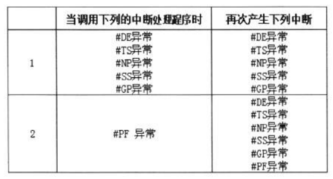

- 1 Fault类型的异常
- 2 Trap类型的异常
- 3 Abort类型的异常
    - 3.1 \#DF(Double Fault)异常

当异常发生, 处理器将进入异常处理程序, 执行完毕后处理器将回到被中断的代码流程里继续执行. 而回到代码的哪个位置执行, 以及哪些异常的产生处理器是不能恢复的, 这些都决定于异常的类型.

在**x86/x64体系中**, 有**三类异常**, 如下.

① Fault类型

② Trap类型

③ Abort类型

# 1 Fault类型的异常

当产生fault类型的异常时, 处理器允许(且必须)进入异常处理程序对这个错误进行修正后重新回到产生异常的指令继续执行. 因此, fault类型的异常将:

① 处理器保存产生异常的指令执行之前的状态, 包括: SS, ESP, EFLAGS, CS, 以及EIP值(当权限级别不变时为EFLAGS, CS及EIP), 这个EIP(返回地址)是指向产生异常的指令.

② 处理器将回到产生异常的指令继续执行

典型地像\#GP和\#PF异常是属于fault类型. OS的\#GP处理程序里必须对这个错误进行改正, 以便处理器回到产生异常的指令继续执行, 否则只会继续引发异常.

对于Fault类型的一些异常, 典型地, OS的处理是强行终止进程的运行或者说杀死产生Fault类异常的进程, 以这种方式来跳出异常处理！(从逻辑上来说是忽略异常)

# 2 Trap类型的异常

当产生**trap类型的异常**时, 处理器允许忽略异常继续往下执行. 在异常处理程序里不必修正错误, 回到发生异常指令的下一条指令继续执行. 因此, trap类型的异常将:

① 处理器保存执行完产生异常指令后的状态, 返回地址将指向下一条指令

② 处理器将回到**发生异常指令**的**下一条指令**继续执行

事实上, 属于trap类型的异常很少, 如下:

① \#BP(Breakpoint)异常

② \#OF(Overflow)异常

③ 属于trap类型的\#DB(Debug)异常: 在\#DB异常中有部分是Trap类型, 有部分是Fault类型, 详情见13章内容.

trap类型的异常并不影响到后续的指令流的执行. 因此, trap类型的异常错误并不重要, 甚至不能说是错误.

Intel特别提出了一个事例: 如果一个trap类型的异常发生在**jmp指令后**, 那么处理器从异常处理程序返回后, 将来到**jmp指令的目标地址**去执行, 而**不是jmp指令的下一条指令(！！！**).

# 3 Abort类型的异常

当abort类型的异常产生时, 意味着处理器遇到一个非常严重的错误. abort类型的异常将使处理器无法回到正常的指令流里继续执行.

有两类异常属于Abort类型

① \#DF(Double Fault)异常

② \#MC(Machine Check)异常

当abort异常发生, 在异常处理程序中唯一能做的: **如果可以**就**报告当前处理器状态**, 然后对机器进行shutdown或reset之类的处理

## 3.1 \#DF(Double Fault)异常

当一个**fault类型的异常**发生, 处理器**正在调用这个异常的处理程序**, 可是并**没有成功进入这个异常的处理程序执行**. 在这个**调用过程中**, **处理器**又检测到**另一个fault异常**的产生. 于是**处理器无法继续执行这个双重的fault异常**, 从而**产生另一个异常\#DF(Double Fault**)

并不是每个异常都可以产生\#DF异常, 以下是产生\#DF异常的条件.



第1类里将不包括\#PF(Page Fault)异常. 也就是说, 当引发\#GP异常, 处理器准备执行\#GP处理程序时, 又发生了\#PF异常, 这个\#PF异常将得到正确处理, 不会引发\#DF异常.

>对于\#DF异常. 第一次的异常处理程序并没有执行, 第二次的异常处理程序并没有执行. 最后处理器会进入到\#DF处理程序里执行.

实际上, 很容易产生一个\#DF异常, 测试的代码只有一条指令

```x86asm
; ex16-1\protected.asm
; 设置 #DF 处理程序
    mov esi, DF_HANDLER_VECTOR
    mov edi, df_handler
    call set_interrupt_handler
    
    mov eax, [0x410000]     ; 产生 #PF 异常
```

