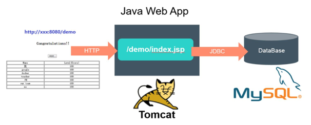

<!-- @import "[TOC]" {cmd="toc" depthFrom=1 depthTo=6 orderedList=false} -->

<!-- code_chunk_output -->

- [0 Java Web应用例子](#0-java-web应用例子)
- [1 环境准备](#1-环境准备)
- [2 启动MySQL服务](#2-启动mysql服务)

<!-- /code_chunk_output -->

# 0 Java Web应用例子

运行在Tomcat里的Web App，如图1.1所示，JSP页面通过JDBC直接访问MySQL数据库并展示数据。出于演示和简化的目的，只要程序正确连接到了数据库，就会自动完成对应的Table的创建与初始化数据的准备工作。所以，当我们通过浏览器访问此应用时，就会显示一个表格的页面，数据则来自数据库。

图1.1　Java Web应用的结构:



此应用需要启动两个容器：**Web App容器**和**MySQL容器**，并且Web App容器需要访问MySQL容器。

在**Docker时代**，假设我们在一个宿主机上启动了这两个容器，就需要把**MySQL容器的IP地址**通过**环境变量注入Web App容器**里；同时，需要将**Web App容器**的**8080端口**映射到**宿主机的8080端口**，以便在**外部访问**。

介绍在Kubernetes时代是如何达到这个目标的。

# 1 环境准备

可以再虚拟机里面

# 2 启动MySQL服务

首先, 为MySQL服务创建一个RC定义文件mysql-rc.yaml

```yaml
apiVersion: v1
kind: ReplicationController             # 副本控制器RC
metadata:
  name: mysql                           # RC的名称, 全局唯一
spec:
  replicas: 1                           # Pod副本的期待数量
  selector:
    app: mysql                          # 符合目标的Pod拥有此标签
  template:                             # 根据此模板创建Pod的副本(实例)
    metadata:
      labels:
        app: mysql                      # Pod副本拥有的标签, 对应RC的selector
    spec:
      containers:                       # Pod内容器的定义部分
      - name: mysql                     # 容器的名称
        image: mysql                    # 容器对应的Docker Image
        ports:
        - containerPort: 3306           # 容器应用监听的端口号 
        env:                            # 注入容器内的环境变量
        - name: MYSQL_ROOT_PASSWORD
          value: "123456"
```

**kind属性**用来表明**此资源对象的类型**，比如这里的值为ReplicationController，表示这是一个RC

在spec一节中是RC的相关属性定义，比如spec.selector是RC的Pod标签选择器，即监控和管理拥有这些标签的Pod实例，确保在当前集群中始终有且仅有replicas个Pod实例在运行，这里设置replicas=1，表示只能运行一个MySQL Pod实例。