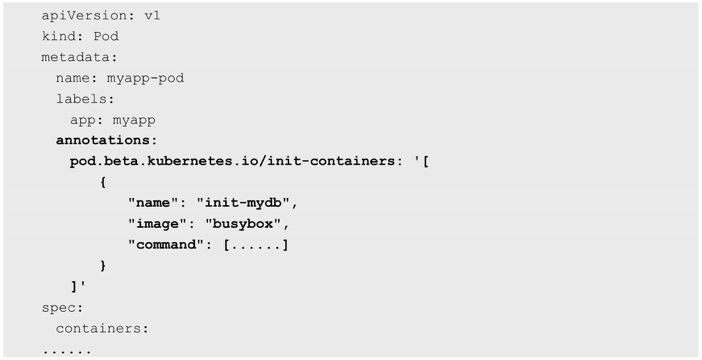
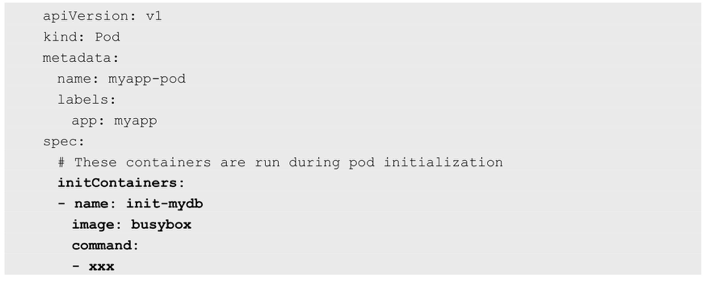
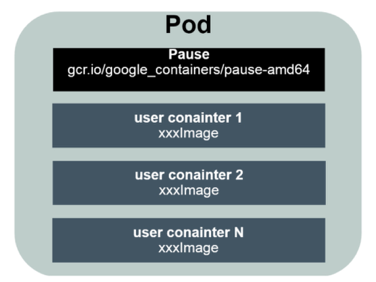
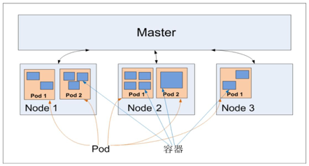

<!-- @import "[TOC]" {cmd="toc" depthFrom=1 depthTo=6 orderedList=false} -->

<!-- code_chunk_output -->

- [0 概述](#0-概述)
  - [0.1 apiVersion属性和核心](#01-apiversion属性和核心)
- [1 Master](#1-master)
- [2 Node](#2-node)
- [2 Pod](#2-pod)

<!-- /code_chunk_output -->

# 0 概述

大部分概念如**Node**、**Pod**、**Replication Controller**、**Service**等都可以被看作一种**资源对象**，几乎所有资源对象都可以通过Kubernetes提供的**kubectl工具**（或者**API编程调用**）执行增、删、改、查等操作并将其保存在**etcd**中持久化存储。

## 0.1 apiVersion属性和核心

声明一个**Kubernetes资源对象**, 注意一个**关键属性**：**apiVersion**。以下面的Pod声明为例，可以看到Pod这种资源对象归属于v1这个核心API。


Kubernetes采用了"**核心**\+**外围扩展**"的设计思路, **核心稳定**\+**持续演进升级**. 

大部分常见的核心资源对象都归属于v1这个核心API，比如Node、Pod、Service、Endpoints、Namespace、RC、PersistentVolume等。

可以采用**YAML**或**JSON格式**声明（定义或创建）一个**Kubernetes资源对象**，每个资源对象都有自己的特定语法格式（可以理解为数据库中一个特定的表）. 一些资源对象会**不断引入新的属性**. 为不影响当前功能情况下引入对新特性的支持, 两种典型方法.

⓵ 设计数据库表的时候，在每个表中都增加一个很长的备注字段，之后扩展的数据以某种格式（如XML、JSON、简单字符串拼接等）放入备注字段。

⓶ 直接修改数据库表，增加一个或多个新的列，此时程序的改动范围较大，风险更大

更加优雅的做法是:

先采用方法1实现这个新特性，经过几个版本的迭代，等新特性变得稳定成熟了以后，可以在后续版本中采用方法2升级到正式版。

为此，Kubernetes为**每个资源对象**都增加了类似数据库表里**备注字段**的通用属性**Annotations**，以实现方法1的升级。

比如Kubernetes 1.3版本引入的Pod的Init Container新特性



在1.8版本后, 其定义被放入Pod的spec.initContainers



# 1 Master

集群控制节点, 在每个Kubernetes集群里都需要有一个Master来负责**整个集群的管理和控制**, 基本上Kubernetes的所有控制命令都发给它，它负责具体的执行过程，我们后面执行的所有命令基本都是在Master上运行的。

Master通常会占据一个**独立的服务器**（高可用部署建议用**3台服务器**）

在Master上运行以下关键进程.

- Kubernetes API Server（**kube\-apiserver**）：提供了**HTTP Rest接口**的关键服务进程，是Kubernetes里所有**资源的增、删、改、查等操作**的**唯一入口**，也是**集群控制的入口进程**。

- Kubernetes Controller Manager（**kube\-controller\-manager**）：Kubernetes里所有**资源对象**的**自动化控制中心**，可以将其理解为资源对象的“大总管”.

- Kubernetes Scheduler（**kube\-scheduler**）：负责资源调度（**Pod调度**）的进程，相当于公交公司的“调度室”。

另外，在Master上通常还需要部署**etcd服务**，因为Kubernetes里的**所有资源对象的数据**都被保存在**etcd**中。

# 2 Node

除了Master, 其他机器被称为Node. 

与**Master**一样，Node可以是一台**物理主机**，也可以是一台**虚拟机**. 

Node是**工作负载点**, 每个Node都被Master分配一些工作负载（Docker容器），当**某个Node宕机**时，其上的**工作负载**会被Master**自动转移到其他节点**上.

**每个Node**上都运行着以下关键进程

- **kubelet**：负责**Pod对应的容器**的创建、启停等任务，同时**与Master密切协作**，实现**集群管理**的基本功能

- **kube\-proxy**：实现Kubernetes **Service**的**通信**与**负载均衡机制**的重要组件

- Docker Engine（**docker**）：Docker引擎，负责本机的**容器创建和管理**工作

Node可以在**运行期间动态增加到Kubernetes集群**中，前提是在**这个节点**上已经**正确安装**、**配置和启动**了上述**关键进程**，在**默认**情况下**kubelet**会**向Master注册自己**，这也是Kubernetes推荐的Node管理方式。

一旦Node被纳入集群管理范围，**kubelet进程**就会**定时**向**Master**汇报自身的情报，例如操作系统、Docker版本、机器的CPU和内存情况，以及当前有哪些Pod在运行等，这样Master就可以获知每个Node的资源使用情况，并实现高效均衡的资源调度策略。而**某个Node**在超过指定时间不上报信息时，会被Master判定为“失联”，Node的状态被标记为不可用（Not Ready），随后**Master**会触发“**工作负载大转移**”的自动流程

通过命令查看集群中有多少Node, 再通过kubectl describe node \<node\_name\>查看某个Node的详细信息:

```
# kubectl get nodes
# kubectl describe node XXX
```

# 2 Pod

如图是Pod的组成示意图, 可看到**每个Pod**都有一个特殊的称为"根容器"的**Pause容器**. Pause容器对应的镜像属于Kubernetes平台的一部分, 除了Pause容器, 每个Pod还包含了一个或多个紧密相关的用户业务容器.



为什么要有Pod

原因一: 在一组容器作为一个单元的情况下, 无法简单地对"整体"进行判断及有效行动. 以业务无关并且不易死亡的Pause容器作为Pod的根容器, 以它的状态代表整个容器组的状态.

原因二: Pod里的多个业务容器共享Pause容器的IP, 共享Pause容器挂接的Volume, 既简化了容器之间的通信问题, 又解决了文件共享问题.

Kubernetes为**每个Pod**都分配了**唯一的IP地址**，称之为Pod IP，**一个Pod**里的**多个容器共享Pod IP地址**。Kubernetes要求**底层网络**支持集群内**任意两个Pod**之间的**TCP\/IP直接通信**，这通常采用**虚拟二层网络技术**来实现，例如Flannel、Open vSwitch等，因此我们需要牢记一点：在Kubernetes里，**一个Pod里的容器**与另外主机上的Pod容器能够直接通信。

Pod其实有两种类型：普通的Pod及静态Pod（Static Pod）。

- 普通的Pod一旦被创建，就会被放入**etcd中存储**, ，随后会被Kubernetes **Master调度**到**某个具体的Node**上并进行绑定（Binding），随后该Pod被**对应的Node**上的**kubelet进程实例化**成**一组相关的Docker容器**并启动。
- 静态Pod并没被存放在Kubernetes的etcd存储里，而是被存放在**某个具体的Node**上的**一个具体文件**中，并且**只在此Node**上启动、运行。

在默认情况下，当Pod里的某个容器停止时，Kubernetes会自动检测到这个问题并且**重新启动这个Pod**（重启**Pod里的所有容器**），如果**Pod**所在的**Node宕机**，就会将这个Node上的**所有Pod重新调度**到其他节点上。

Pod、容器与Node的关系如图1.5所示。



