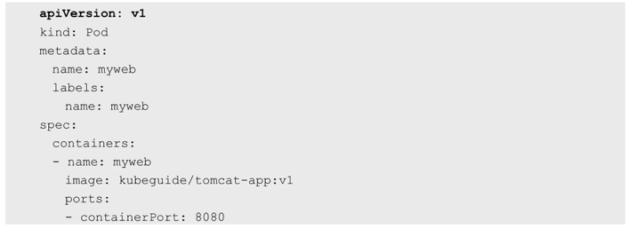

<!-- @import "[TOC]" {cmd="toc" depthFrom=1 depthTo=6 orderedList=false} -->

<!-- code_chunk_output -->

<!-- /code_chunk_output -->

大部分概念如**Node**、**Pod**、**Replication Controller**、**Service**等都可以被看作一种**资源对象**，几乎所有资源对象都可以通过Kubernetes提供的**kubectl工具**（或者**API编程调用**）执行增、删、改、查等操作并将其保存在**etcd**中持久化存储。

声明一个**Kubernetes资源对象**, 注意一个**关键属性**：**apiVersion**。以下面的Pod声明为例，可以看到Pod这种资源对象归属于v1这个核心API。

Kubernetes采用了"核心\+外围扩展"的设计思路, 核心稳定\+持续演进升级. 

大部分常见的核心资源对象都归属于v1这个核心API，比如Node、Pod、Service、Endpoints、Namespace、RC、PersistentVolume等。