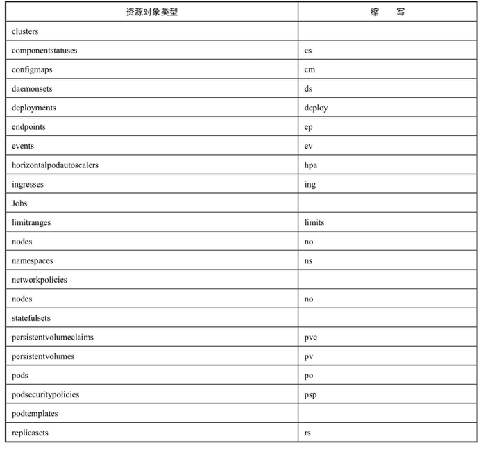
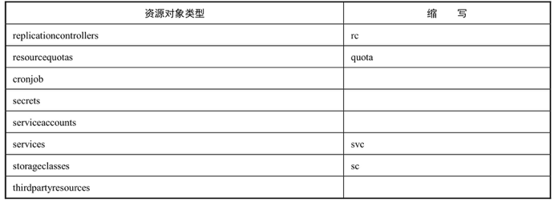
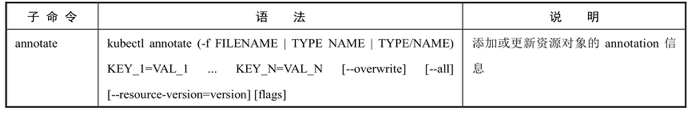
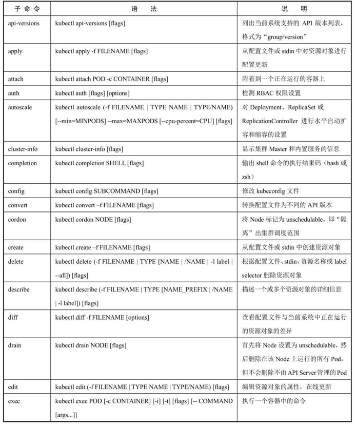
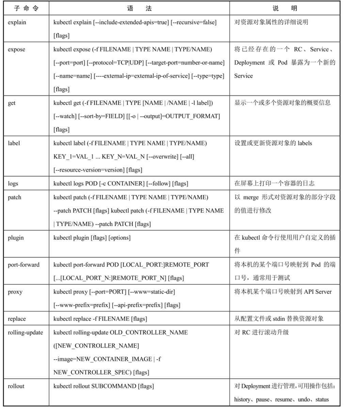
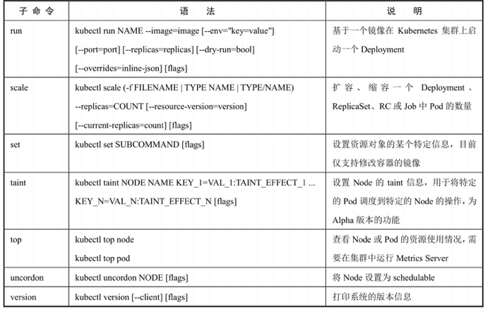
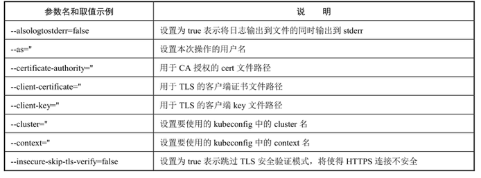
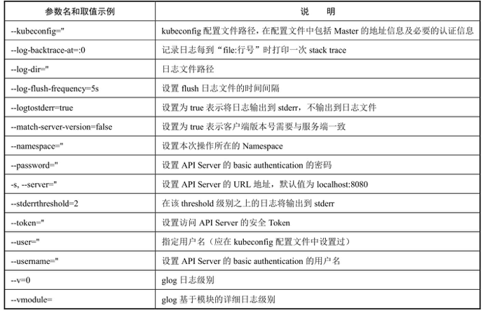
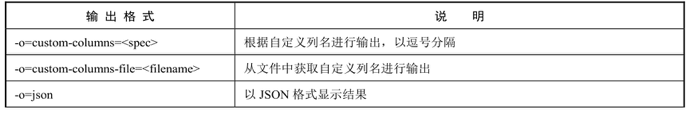
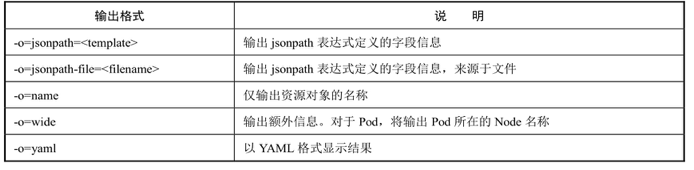

<!-- @import "[TOC]" {cmd="toc" depthFrom=1 depthTo=6 orderedList=false} -->

<!-- code_chunk_output -->

- [1 kubectl用法概述](#1-kubectl用法概述)
- [2 kubectl子命令详解](#2-kubectl子命令详解)
- [3 kubectl参数列表](#3-kubectl参数列表)
- [4 kubectl输出格式](#4-kubectl输出格式)
  - [4.1 显示pod的更多信息](#41-显示pod的更多信息)
  - [4.2 以YAML格式显示Pod详细信息](#42-以yaml格式显示pod详细信息)
  - [4.3 以自定义列名显示Pod的信息](#43-以自定义列名显示pod的信息)

<!-- /code_chunk_output -->

kubectl作为客户端CLI工具，可以让用户通过命令行对Kubernetes集群进行操作

# 1 kubectl用法概述

```
# kubectl [command] [TYPE] [NAME] [flags]
```

- command：**子命令**，用于**操作Kubernetes集群资源对象的命令**，例如**create**、**delete**、**describe**、**get**、**apply**等。

- TYPE：**资源对象的类型**，区分**大小写**，能以单数、复数或者**简写**形式表示。例如以下3种TYPE是等价的。

```
# kubectl get pod pod1
# kubectl get pods pod1
# kubectl get po pod1
```

- NAME：**资源对象的名称**，区分**大小写**。如果不指定名称，系统则将返回属于TYPE的**全部对象的列表**。

- flags：kubectl子命令的**可选参数**，例如使用“\-**s**”指定**API Server的URL地址**而不用默认值。

kubectl可操作的资源对象类型及其缩写如表:





在一个命令行中也可以同时对多个资源对象进行操作，以多个TYPE和NAME的组合表示

- 获取多个Pod信息:

```
# kubectl get pods pod1 pod2
```

- 获取多种对象的信息:

```
# kubectl get pod/pod1 rc/rc1
```

- 同时应用多个YAML文件, 以多个\-f file参数表示:

```
# kubectl get pod -f pod1.yaml -f pod2.yaml
# kubectl create -f pod1.yaml -f rc1.yaml -f service1.yaml
```

# 2 kubectl子命令详解

kubectl的子命令非常丰富，涵盖了对Kubernetes集群的主要操作，包括资源对象的创建、删除、查看、修改、配置、运行等。

kubectl子命令详解:









# 3 kubectl参数列表

kubectl命令行的公共启动参数如表:





每个子命令（如create、delete、get等）还有特定的flags参数，可以通过

```
$ kubectl [command] --help
```

命令进行查看。

# 4 kubectl输出格式

通过\-o参数指定

```
# kubectl [command] [TYPE] [NAME] -o=<output_format>
```

根据不同子命令的输出结果，可选的输出格式如表





常用的输出格式如下:

## 4.1 显示pod的更多信息

```
# kubectl get pod <pod-name> -o wide
```

## 4.2 以YAML格式显示Pod详细信息

```
# kubectl get pod <pod-name> -o yaml
```

## 4.3 以自定义列名显示Pod的信息

```
# kubectl get pod <pod-name> -o=custom-columns=NAME:.
```