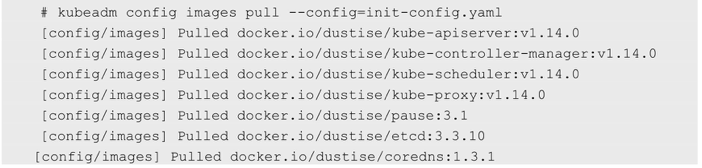

<!-- @import "[TOC]" {cmd="toc" depthFrom=1 depthTo=6 orderedList=false} -->

<!-- code_chunk_output -->

- [0 概述](#0-概述)
- [1 安装kubeadm和相关工具](#1-安装kubeadm和相关工具)
- [2 kubeadm config](#2-kubeadm-config)
- [3 下载Kubernetes的相关镜像](#3-下载kubernetes的相关镜像)
- [4 安装Master](#4-安装master)

<!-- /code_chunk_output -->

# 0 概述

最简单方法是使用`yum install kubernetes`命令安装Kubernetes集群，但仍需**修改各组件的启动参数**，才能完成对Kubernetes集群的配置，整个过程比较复杂，也容易出错。

Kubernetes从1.4版本开始引入了**命令行工具kubeadm**，致力于简化集群的安装过程，并解决Kubernetes集群的高可用问题。

# 1 安装kubeadm和相关工具

先配置yum源, 官方yum源地址为`https://packages.cloud.google.com/yum/repos/kubernetes-el7-x86_64`. 

可以使用国内的一个yum源, 比如腾讯的, 地址为`http://mirrors.tencent.com/kubernetes/yum/repos/kubernetes-el7-x86_64/`, 配置如下

阿里云的baseurl是http://mirrors.aliyun.com/kubernetes/yum/repos/kubernetes-el7-x86_64/

```
[root@localhost ~]# vim /etc/yum.repos.d/kubernetes.repo
[kubernetes]
name=Kubernetes Repo
baseurl=http://mirrors.tencent.com/kubernetes/yum/repos/kubernetes-el7-x86_64/
enabled=1
gpgcheck=0

[root@localhost ~]# yum makecache
```

安装kubeadm和相关工具:

```
[root@localhost ~]# yum install -y kubelet kubeadm kubectl --disableexcludes=kebernetes
```

启动docker服务和kubelet服务, 并设为开机自动启动:

```
# systemctl enable docker && systemctl start docker
# systemctl enable kubelet && systemctl start kubelet
```

注: 这时候的kubelet服务不是active状态, 是正常的

# 2 kubeadm config

kubeadm提供了配置文件功能用于复杂定制。同时，kubeadm将配置文件以ConfigMap的形式保存到集群之中，便于后续的查询和升级工作。kubeadm config子命令提供了对这一组功能的支持：

- kubeadm config upload from\-file：由配置文件上传到集群中生成ConfigMap。
- kubeadm config upload from\-flags：由配置参数生成ConfigMap。
- kubeadm config view：查看当前集群中的配置值。
- kubeadm config print init\-defaults：输出kubeadm init默认参数文件的内容。
- kubeadm config print join\-defaults：输出kubeadm join默认参数文件的内容。
- kubeadm config migrate：在新旧版本之间进行配置转换。
- kubeadm config images list：列出所需的镜像列表。
- kubeadm config images pull：拉取镜像到本地。

执行`kubeadm config print init\-defaults`, 可获取默认的初始化参数文件:

```
# kubeadm config print init-defaults > init.default.yaml
```

可修改为合适的配置. 例如, 镜像仓库的地址, 以及Pod的地址范围, 可使用如下配置:

```
apiVersion: kubeadm.k8s.io/v1beta1
kind: ClusterConfiguration
imageRepository: docker.io/dustise
kubernetesVersion: v1.14.0
networking:
  podSubnet: "192.168.0.0/16"
```

```
apiVersion: kubeadm.k8s.io/v1beta2
kind: InitConfiguration
localAPIEndpoint:
  advertiseAddress: 172.16.100.139
  bindPort: 6443
nodeRegistration:
  taints:
  - effect: PreferNoSchedule
    key: node-role.kubernetes.io/master
---
apiVersion: kubeadm.k8s.io/v1beta2
kind: ClusterConfiguration
kubernetesVersion: v1.15.0
networking:
  podSubnet: 192.168.0.0/16
```

将上面内容保存为init\-config.yaml备用

# 3 下载Kubernetes的相关镜像

为了从国内的镜像托管站点获得镜像加速支持，建议修改Docker的配置文件，增加Registry Mirror参数，将镜像配置写入配置参数中，例如echo '{"registry-mirrors":\["https://registry.docker-cn.com"]}' > /etc/docker/daemon.json，然后重启Docker服务。

使用config images pull子命令下载所需镜像，例如：

```
# kubeadm config images pull  --config=init-config.yaml
```



# 4 安装Master

执行kubeadm init命令即可一键安装Kubernetes的Master。

```
[root@master01 ~]# kubeadm init --config=kubeadm.yaml --ignore-preflight-errors=all
......
Your Kubernetes control-plane has initialized successfully!

To start using your cluster, you need to run the following as a regular user:

  mkdir -p $HOME/.kube
  sudo cp -i /etc/kubernetes/admin.conf $HOME/.kube/config
  sudo chown $(id -u):$(id -g) $HOME/.kube/config

You should now deploy a pod network to the cluster.
Run "kubectl apply -f [podnetwork].yaml" with one of the options listed at:
  https://kubernetes.io/docs/concepts/cluster-administration/addons/

Then you can join any number of worker nodes by running the following on each as root:

kubeadm join 172.16.100.139:6443 --token cfnvuv.lae6eb8jkqkg09ko \
    --discovery-token-ca-cert-hash sha256:f64e6a9257be7fd89539a0181febd40670273bfaaf9853942f16a15861036d82
```

按照提示, 复制配置文件到用户的home目录下:

```
mkdir -p $HOME/.kube
sudo cp -i /etc/kubernetes/admin.conf $HOME/.kube/config
sudo chown $(id -u):$(id -g) $HOME/.kube/config
```

这样就在Master上安装了Kubernetes，但在集群内还是没有可用的工作Node，并缺乏对容器网络的配置。

这里需要注意kubeadm init命令执行完成后的最后几行提示信息，其中包含加入节点的指令（kubeadm join）和所需的Token。

验证ConfigMap

```

```

