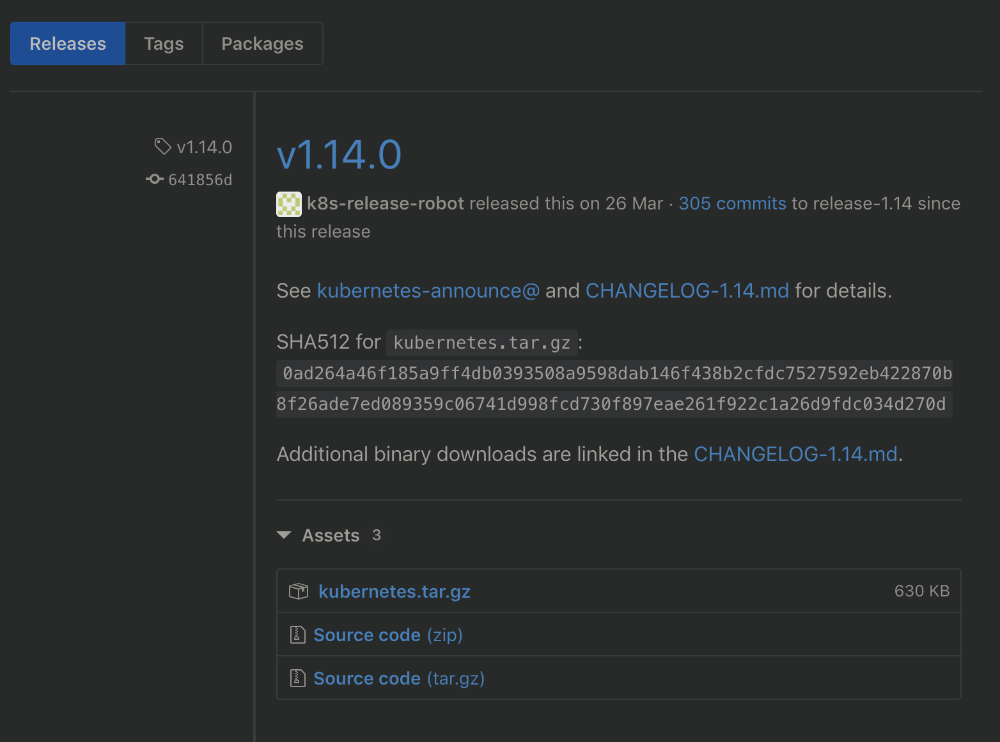

<!-- @import "[TOC]" {cmd="toc" depthFrom=1 depthTo=6 orderedList=false} -->

<!-- code_chunk_output -->

<!-- /code_chunk_output -->

从Kubernetes发布官网 https://github.com/kubernetes/kubernetes/releases 找到对应的版本号，单击CHANGELOG，找到已编译好的二进制文件的下载页面，如图2.1和图2.2所示。本书基于Kubernetes 1.14版本进行说明。

在压缩包kubernetes.tar.gz内包含了Kubernetes的服务程序文件、文档和示例；在压缩包kubernetes\-src.tar.gz内则包含了全部源代码。也可以直接下载Server Binaries中的kubernetes\-server\-linux\-amd64.tar.gz文件，其中包含了Kubernetes需要运行的全部服务程序文件。主要的服务程序文件列表如表2.2所示。

