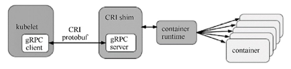

<!-- @import "[TOC]" {cmd="toc" depthFrom=1 depthTo=6 orderedList=false} -->

<!-- code_chunk_output -->

- [0 背景](#0-背景)
- [1 CRI概述](#1-cri概述)
- [2 CRI的主要组件](#2-cri的主要组件)

<!-- /code_chunk_output -->

# 0 背景

归根结底，Kubernetes Node（kubelet）的**主要功能**就是**启动和停止容器的组件**，我们称之为**容器运行时（Container Runtime**），其中最知名的就是Docker了。

为了更具扩展性，Kubernetes从1.5版本开始就加入了容器运行时插件API，即**Container Runtime Interface**，简称CRI。

# 1 CRI概述

每个容器运行时都有特点，因此不少用户希望Kubernetes能够支持更多的容器运行时。

Kubernetes从1.5版本开始引入了**CRI接口规范**，通过**插件接口模式**，Kubernetes**无须重新编译**就可以使用**更多的容器运行时**。

CRI包含**Protocol Buffers**、**gRPC API**、**运行库支持**及开发中的标准规范和工具。

Docker的CRI实现在Kubernetes 1.6中被更新为Beta版本，并在**kubelet启动**时**默认启动**。

可替代的容器运行时支持是Kubernetes中的新概念。在Kubernetes 1.3发布时，rktnetes项目同时发布，让**rkt容器引擎**成为除Docker外的又一选择。

然而，不管是**Docker**还是**rkt**，都用到了**kubelet的内部接口**，同kubelet源码纠缠不清。这种程度的集成需要对kubelet的内部机制有非常深入的了解，还会给社区带来管理压力，这就给新生代容器运行时造成了难于跨越的集成壁垒。

**CRI接口规范**试图用定义清晰的抽象层清除这一壁垒，让开发者能够专注于容器运行时本身。

# 2 CRI的主要组件

**kubelet**使用**gRPC框架**通过**UNIX Socket**与**容器运行时（或CRI代理**）进行**通信**。在这个过程中**kubelet**是**客户端**，CRI代理（shim）是服务端，如图2.3所示。

图2.3 CRI的主要组件:

**Protocol Buffers API**包含**两个gRPC服务**：**ImageService**和**RuntimeService**。

**ImageService**提供了**从仓库拉取镜像**、**查看和移除镜像**的功能。

**RuntimeService**负责**Pod和容器的生命周期管理**，以及**与容器的交互**（exec/attach/port\-forward）。

rkt和Docker这样的**容器运行时**可以使用**一个Socket同时提供两个服务**，在kubelet中可以用--container-runtime-endpoint和--image-service-endpoint参数设置这个Socket。
