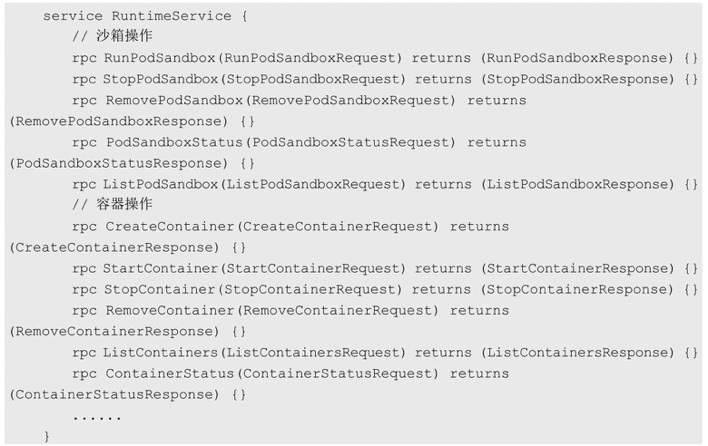

<!-- @import "[TOC]" {cmd="toc" depthFrom=1 depthTo=6 orderedList=false} -->

<!-- code_chunk_output -->

- [0 背景](#0-背景)
- [1 CRI概述](#1-cri概述)
- [2 CRI的主要组件](#2-cri的主要组件)
- [3 Pod和容器的生命周期管理](#3-pod和容器的生命周期管理)
- [4 面向容器级别的设计思路](#4-面向容器级别的设计思路)

<!-- /code_chunk_output -->

# 0 背景

归根结底，Kubernetes **Node（kubelet**）的**主要功能**就是**启动和停止容器的组件**，我们称之为**容器运行时（Container Runtime**），其中最知名的就是**Docker**了。

为了更具扩展性，Kubernetes从1.5版本开始就加入了容器运行时插件API，即**Container Runtime Interface**，简称CRI。

# 1 CRI概述

每个容器运行时都有特点，因此不少用户希望Kubernetes能够支持更多的容器运行时。

Kubernetes从1.5版本开始引入了**CRI接口规范**，通过**插件接口模式**，Kubernetes**无须重新编译**就可以使用**更多的容器运行时**。

**CRI**包含**Protocol Buffers！！！**、**gRPC API！！！**、**运行库支持！！！** 及开发中的标准规范和工具。

Docker的CRI实现在Kubernetes 1.6中被更新为Beta版本，并在**kubelet启动**时**默认启动**。

可替代的容器运行时支持是Kubernetes中的新概念。在Kubernetes 1.3发布时，rktnetes项目同时发布，让**rkt容器引擎**成为除Docker外的又一选择。

然而，不管是**Docker**还是**rkt**，都用到了**kubelet的内部接口**，同kubelet源码纠缠不清。这种程度的集成需要对kubelet的内部机制有非常深入的了解，还会给社区带来管理压力，这就给新生代容器运行时造成了难于跨越的集成壁垒。

**CRI接口规范**试图用定义清晰的抽象层清除这一壁垒，让开发者能够专注于容器运行时本身。

# 2 CRI的主要组件

**kubelet**使用**gRPC框架！！！** 通过**UNIX Socket**与**容器运行时（或CRI代理**）进行**通信**。在这个过程中**kubelet**是**客户端**，**CRI代理（shim**）是**服务端**，如图2.3所示。

图2.3 CRI的主要组件:

**Protocol Buffers API！！！** 包含**两个gRPC服务**：**ImageService**和**RuntimeService**。

**ImageService**提供了**从仓库拉取镜像**、**查看和移除镜像**的功能。

**RuntimeService**负责**Pod和容器的生命周期管理**，以及**与容器的交互**（exec/attach/port\-forward）。

rkt和Docker这样的**容器运行时**可以使用**一个Socket同时提供两个服务**，在kubelet中可以用\-\-container\-runtime\-endpoint和\-\-image\-service\-endpoint参数设置这个Socket。

# 3 Pod和容器的生命周期管理

Pod由**一组应用容器**组成，其中包含**共有的环境和资源约束**。在**CRI**里，这个环境被称为**PodSandbox**。

Kubernetes有意为**容器运行时**留下一些**发挥空间**，它们可以根据自己的内部实现来解释PodSandbox。对于**Hypervisor类**的运行时，**PodSandbox**会具体化为一个**虚拟机**。其他例如**Docker**，会是一个**Linux命名空间**。

在**v1alpha1 API**中，**kubelet**会创建**Pod级别的cgroup**传递给**容器运行时**，并以此**运行所有进程**来**满足PodSandbox对Pod的资源保障**。

在**启动Pod之前**，kubelet调用**RuntimeService.RunPodSandbox**来创建环境。这一过程包括**为Pod设置网络资源**（分配IP等操作）。**PodSandbox**被激活之后，就可以独立地创建、启动、停止和删除不同的容器了。kubelet会在停止和删除PodSandbox之前首先停止和删除其中的容器。

kubelet的职责在于**通过RPC**管理**容器的生命周期**，实现容器生命周期的钩子，存活和健康监测，以及执行Pod的重启策略等。

RuntimeService服务包括对Sandbox和Container操作的方法，下面的伪代码展示了主要的RPC方法：

# 4 面向容器级别的设计思路

众所周知，Kubernetes的最小调度单元是Pod，它曾经可能采用的**一个CRI设计**就是**复用Pod对象**，使得**容器运行时**可以**自行实现控制逻辑和状态转换**，这样一来，就能**极大地简化API**，让CRI能够更广泛地适用于多种容器运行时。但是经过深入讨论之后，Kubernetes放弃了这一想法。

首先，kubelet有**很多Pod级别**的功能和机制（例如crash\-loop backoff机制），如果交给容器运行时去实现，则会造成很重的负担；其次且更重要的是，Pod标准还在快速演进中。很多新功能（如初始化容器）都是由kubelet完成管理的，无须交给容器运行时实现。

CRI选择了在容器级别进行实现，使得容器运行时能够共享这些通用特性，以获得更快的开发速度。这并不意味着设计哲学的改变—kubelet要负责、保证容器应用的实际状态和声明状态的一致性。

