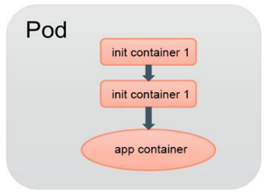

<!-- @import "[TOC]" {cmd="toc" depthFrom=1 depthTo=6 orderedList=false} -->

<!-- code_chunk_output -->

<!-- /code_chunk_output -->

在很多应用场景中，**应用**在**启动之前**都需要进行**如下初始化**操作。

◎　等待**其他关联组件正确运行**（例如数据库或某个后台服务）。

◎　基于**环境变量**或**配置模板**生成**配置文件**。

◎　从**远程数据库**获取**本地所需配置**，或者**将自身注册**到某个中央数据库中。

◎　下载**相关依赖包**，或者对系统进行一些**预配置操作**。

Kubernetes 1.3引入了一个**Alpha版本**的新特性**init container**（初始化容器，在Kubernetes 1.5时被更新为**Beta版本**），用于在**启动应用！！！容器**（app container）**之前**启动**一个或多个初始化容器**，完成应用容器所需的预置条件，如图3.7所示。init container与应用容器在本质上是一样的，但它们是仅运行一次就结束的任务，并且必须在成功执行完成后，系统才能继续执行下一个容器。根据Pod的重启策略（RestartPolicy），当init container执行失败，而且设置了RestartPolicy=Never时，Pod将会启动失败；而设置RestartPolicy=Always时，Pod将会被系统自动重启。

图3.7 init container

