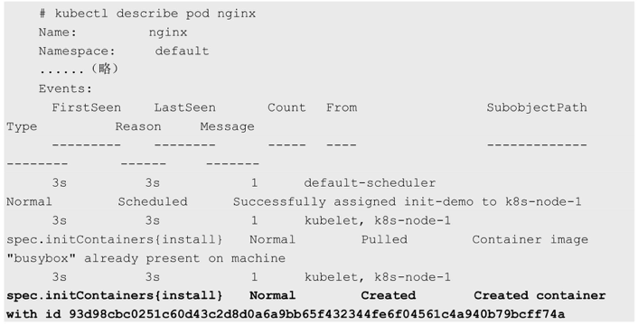
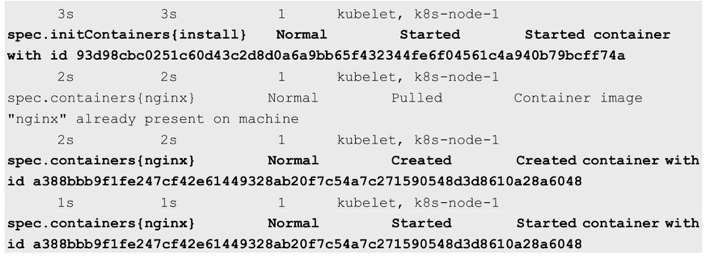

<!-- @import "[TOC]" {cmd="toc" depthFrom=1 depthTo=6 orderedList=false} -->

<!-- code_chunk_output -->


<!-- /code_chunk_output -->

在很多应用场景中，**应用**在**启动之前**都需要进行**如下初始化**操作。

◎　等待**其他关联组件正确运行**（例如数据库或某个后台服务）。

◎　基于**环境变量**或**配置模板**生成**配置文件**。

◎　从**远程数据库**获取**本地所需配置**，或者**将自身注册**到某个中央数据库中。

◎　下载**相关依赖包**，或者对系统进行一些**预配置操作**。

Kubernetes 1.3引入了一个**Alpha版本**的新特性**init container**（初始化容器，在Kubernetes 1.5时被更新为**Beta版本**），用于在**启动应用！！！容器**（app container）**之前**启动**一个或多个初始化！！！容器**，完成应用容器所需的预置条件，如图3.7所示。

图3.7 init container


**init container**与**应用容器**在**本质上是一样**的，但它们是**仅运行一次！！！就结束的任务**，并且必须在**成功执行完成后！！！**，系统才能继续执行**下一个容器**。

根据**Pod的重启策略（RestartPolicy**），当**init container**执行**失败**，而且设置了RestartPolicy=Never时，**Pod将会启动失败！！！**；而设置RestartPolicy=Always时，Pod将会被系统自动重启。

下面以Nginx应用为例，在启动Nginx之前，通过**初始化容器busybox**为Nginx创建一个index.html主页文件。这里**为init container**和**Nginx**设置了一个**共享的Volume**，以供**Nginx访问init container设置的index.html**文件：

```yaml
# nginx-init-containers.yaml
apiVersion: v1
kind: Pod
metadata:
  name: nginx
  annotations:
spec:
  # These containers are run during pod initialization
  initContainers:               # initcontainers
  - name: install               # 
    image: busybox
    command:
    - wget
    - "-O"
    - "/work-dir/index.html"
    - http://kubernetes.io
    volumeMounts:
    - name: workdir             # volume mount
      mountPath: "/work-dir"
  containers:
  - name: nginx
    image: nginx
    ports:
    - containerPort: 80
    volumeMounts:
    - name: workdir             # nginx使用这个volume
      mountPath: /usr/share/nginx/html
  dnsPolicy: Default
  volumes:                      # volume
  - name: workdir               # 
    emptyDir: {} 
```

创建这个Pod:

```
# kubectl create -f nginx-init-containers.yaml
pod "nginx" created
```

在运行init container的过程中查看Pod的状态，可见init过程还未完成：

```
# kubectl get pods
NAME    READY   STATUS      RESTARTS    AGE
nginx   0/1     Init:0/1     0           1m
```

在init container成功执行完成后，系统继续启动Nginx容器，再次查看Pod的状态：

```
# kubectl get pods
NAME    READY   STATUS      RESTARTS    AGE
nginx   1/1     Running     0           7s
```

查看Pod的事件，可以看到系统首先创建并运行init container容器（名为install），成功后继续创建和运行Nginx容器：

```
# kubectl describe pod nginx
```



