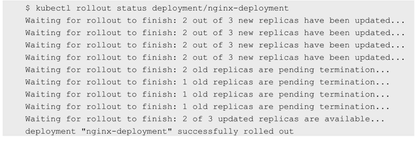
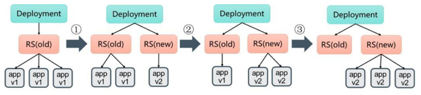
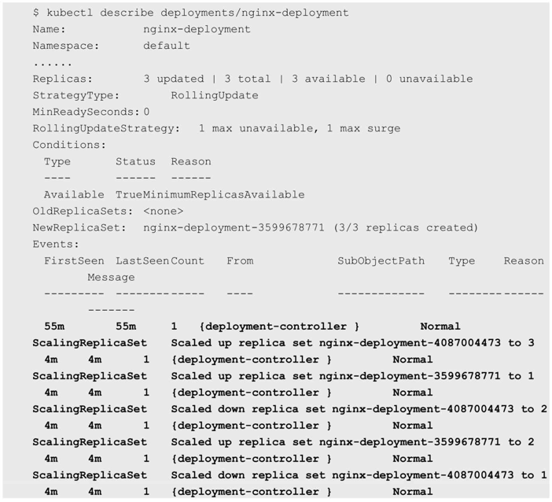
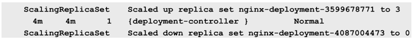

<!-- @import "[TOC]" {cmd="toc" depthFrom=1 depthTo=6 orderedList=false} -->

<!-- code_chunk_output -->

- [1 Deployment的升级](#1-deployment的升级)

<!-- /code_chunk_output -->

当集群中的**某个服务需要升级**时，我们需要**停止**目前**与该服务相关**的**所有Pod**，然后**下载新版本镜像**并**创建新的Pod**。如果集群**规模比较大**，则这个工作变成了一个挑战，而且先全部停止然后逐步升级的方式会导致**较长时间的服务不可用**。

Kubernetes提供了**滚动升级**功能来解决上述问题。

如果**Pod**是通过**Deployment创建**的，则用户可以在**运行时**修改Deployment的**Pod定义**（**spec.template**）或**镜像名称**，并应用到Deployment对象上，系统即可完成Deployment的自动更新操作。如果在更新过程中发生了错误，则还可以通过回滚操作恢复Pod的版本。

# 1 Deployment的升级

以Deployment nginx为例：

```yaml
# nginx-deployment.yaml
---
apiVersion: apps/v1beta1
kind: Deployment
metadata:
  name: nginx-deployment
spec:
  replicas: 3
  template:
    metadata:
      labels:
        app: nginx
    spec:
      containers:
      - name: nginx
        image: nginx:1.7.9
        ports:
        - containerPort: 80
```

已运行的Pod副本数量有3个：

```
# kubectl get pods
NAME                                READY   STATUS  RESTARTS    AGE
nginx-deployment-4087004473-9jqqs   1/1     Running 0           1m
nginx-deployment-4087004473-cq0cf   1/1     Running 0           1m
nginx-deployment-4087004473-vxn56   1/1     Running 0           1m
```

现在**Pod镜像**需要被更新为**Nginx:1.9.1**，我们可以通过**kubectl set image**命令为Deployment设置新的镜像名称：

```
# kubectl set image deployment/nginx-development nginx=nginx:1.9.1
deployment "nginx-deployment" image updated
```

**另一种**更新的方法是使用**kubectl edit**命令**修改Deployment的配置**，将spec.template.spec.containers\[0].image从Nginx:1.7.9更改为Nginx:1.9.1：

```
# kubectl edit deployment/nginx-deployment
deployment "nginx-deployment" edited
```

一旦**镜像名**（或**Pod定义**）发生了**修改**，则将**触发系统**完成**Deployment所有运行Pod的滚动升级操作**。

可以使用kubectl rollout status命令查看Deployment的更新过程：



查看当前运行的Pod, 名称已经更新:

```
# kubectl get pods
NAME                                READY   STATUS  RESTARTS    AGE
nginx-deployment-3599678771-01h26   1/1     Running 0           1m
nginx-deployment-3599678771-57thr   1/1     Running 0           1m
nginx-deployment-3599678771-s8p21   1/1     Running 0           1m
```

查看Pod使用的镜像，已经更新为Nginx:1.9.1了：

```
# kubectl describe pod/nginx-deployment-3599678771-s8p21
Name:       nginx-deployment-3599678771-s8p21
......
    Image:          nginx:1.9.1
......
```

那么，Deployment是如何完成Pod更新的呢？

我们可以使用**kubectl describe deployments/nginx\-deployment**命令仔细观察Deployment的**更新过程**。

初始创建Deployment时，系统创建了一个ReplicaSet（nginx-deployment-4087004473），并按用户的需求创建了3个Pod副本。当更新Deployment时，系统创建了一个新的ReplicaSet（nginx-deployment-3599678771），并将其副本数量扩展到1，然后将旧的ReplicaSet缩减为2。之后，系统继续按照相同的更新策略对新旧两个ReplicaSet进行逐个调整。最后，新的ReplicaSet运行了3个新版本Pod副本，旧的ReplicaSet副本数量则缩减为0。如图3.8所示。

图3.8　Pod的滚动升级:



下面列出Deployment nginx-deployment的详细事件信息：





运行kubectl get rs命令，查看两个ReplicaSet的最终状态：

```
# kubectl get rs
NAME                        DESIRED     CURRENT     AGE
tomcat-deploy-1640611518    1           1           1m
```