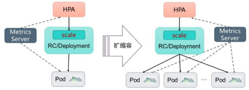

<!-- @import "[TOC]" {cmd="toc" depthFrom=1 depthTo=6 orderedList=false} -->

<!-- code_chunk_output -->

- [0 Deployment/RC的Scale机制: 对Pod的扩缩容](#0-deploymentrc的scale机制-对pod的扩缩容)
- [1 手动扩缩容机制](#1-手动扩缩容机制)
- [2 自动扩缩容机制](#2-自动扩缩容机制)
  - [2.1 HPA的工作原理](#21-hpa的工作原理)
  - [2.2 指标的类型](#22-指标的类型)
  - [2.3 扩缩容算法详解](#23-扩缩容算法详解)

<!-- /code_chunk_output -->

# 0 Deployment/RC的Scale机制: 对Pod的扩缩容

实际生产系统, 会遇到**某个服务需要扩容**的场景，也可能会遇到由于**资源紧张**或者**工作负载降低**而需要**减少服务实例数量**的场景。

此时可以利用**Deployment/RC**的**Scale机制**来完成这些工作。

Kubernetes**对Pod的扩缩容**操作提供了**手动**和**自动**两种模式.

**手动模式**通过执行**kubectl scale命令**或通过**RESTful API**对一个**Deployment/RC**进行**Pod副本数量**的设置，即可**一键完成**。

**自动模式**则需要用户根据**某个性能指标**或者**自定义业务指标**，并指定**Pod副本数量的范围**，系统将自动在**这个范围内**根据**性能指标的变化**进行调整。

# 1 手动扩缩容机制

以Deployment nginx为例：

```yaml
---
apiVersion: apps/v1beta1
kind: Deployment
metadata:
  name: nginx-deployment
spec:
  replicas: 3
  template:
    metadata:
      labels:
        app: nginx
    spec:
      containers:
      - name: nginx
        image: nginx:1.7.9
        ports:
        - containerPort: 80
```

已运行的Pod副本数量为3个：

```
# kubectl get pods
NAME                                READY   STATUS  RESTARTS    AGE
nginx-deployment-3973253433-scz37   1/1     Running 0           5s
nginx-deployment-3973253433-x8fsq   1/1     Running 0           5s
nginx-deployment-3973253433-x9z8z   1/1     Running 0           5s
```

通过kubectl scale命令可以将Pod副本数量从初始的3个更新为5个：

```
# kubectl scale deployment nginx-deployment --replicas 5
deployment "nginx-deployment" scaled

# kubectl get pods
NAME                                READY   STATUS  RESTARTS    AGE
nginx-deployment-3973253433-scz37   1/1     Running 0           5s
nginx-deployment-3973253433-x8fsq   1/1     Running 0           5s
nginx-deployment-3973253433-x9z8z   1/1     Running 0           5s
nginx-deployment-3973253433-7jls2   1/1     Running 0           5s
nginx-deployment-3973253433-3gt27   1/1     Running 0           5s
```

将--replicas设置为比当前Pod副本数量更小的数字，系统将会“杀掉”一些运行中的Pod，以实现应用集群缩容：

```
# kubectl scale deployment nginx-deployment --replicas=1
deployment "nginx-deployment" scaled

# kubectl get pods
NAME                                READY   STATUS  RESTARTS    AGE
nginx-deployment-3973253433-x9z8z   1/1     Running 0           6m
```

# 2 自动扩缩容机制

Kubernetes从1.1版本开始，新增了名为**Horizontal Pod Autoscaler（HPA**）的控制器，用于实现**基于CPU使用率**进行**自动Pod扩缩容**的功能。

**HPA控制器**基于**Master**的**kube\-controller\-manager**服务**启动参数**\-\-**horizontal\-pod\-autoscaler\-sync\-period**定义的**探测周期**（默认值为**15s**），周期性地**监测目标Pod的资源性能指标**，并与HPA资源对象中的扩缩容条件进行对比，在满足条件时对Pod副本数量进行调整。

## 2.1 HPA的工作原理

Kubernetes中的**某个Metrics Server**（**Heapster**或**自定义Metrics Server**）持续采集**所有Pod副本的指标数据**。

**HPA控制器**通过**Metrics Server**的**API**（Heapster的API或聚合API）获取这些数据，基于**用户定义的扩缩容规则**进行计算，得到**目标Pod副本数量**。当目标Pod副本数量与当前副本数量不同时，**HPA控制器**就向**Pod的副本控制器**（**Deployment**、**RC**或**ReplicaSet**）发起**scale操作**，调整Pod的副本数量，完成扩缩容操作。

图3.9描述了HPA体系中的关键组件和工作流程。

图3.9　HPA的工作原理:



接下来首先对**HPA**能够管理的**指标类型**、**扩缩容算法**、**HPA对象的配置**进行详细说明，然后通过一个完整的示例对如何搭建和使用基于自定义指标的HPA体系进行说明。

## 2.2 指标的类型

Master的**kube\-controller\-manager**服务持续监测**目标Pod**的某种性能指标，以计算是否需要调整副本数量。

目前Kubernetes支持的指标类型如下。

- **Pod资源使用率**：Pod级别的性能指标，通常是一个比率值，例如**CPU使用率**。
- **Pod自定义指标**：Pod级别的性能指标，通常是一个数值，例如接收的请求数量。
- **Object自定义指标或外部自定义指标**：通常是一个数值，需要**容器应用以某种方式提供**，例如通过HTTP URL“/metrics”提供，或者使用外部服务提供的指标采集URL。

Kubernetes从1.11版本开始，**弃用！！！** 基于**Heapster组件**完成**Pod的CPU使用率**采集的机制，全面转向**基于Metrics Server**完成**数据采集**。

Metrics Server将采集到的**Pod性能指标数据**通过**聚合API（Aggregated API**）如metrics.k8s.io、custom.metrics.k8s.io和external.metrics.k8s.io提供给**HPA控制器**进行查询。

关于**聚合API**和**API聚合器**（**API Aggregator**）的概念详见9.4节的说明。

## 2.3 扩缩容算法详解

**Autoscaler控制器**从**聚合API**获取到**Pod性能指标数据**之后，基于下面的算法计算出目标Pod副本数量，与当前运行的Pod副本数量进行对比，决定是否需要进行扩缩容操作：

```

```