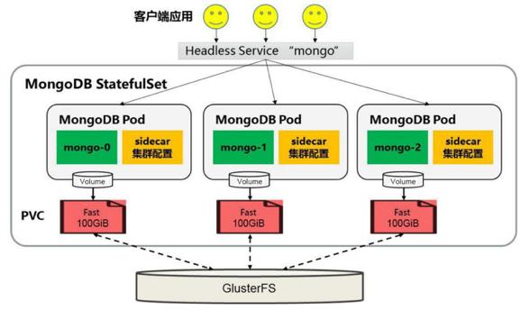

<!-- @import "[TOC]" {cmd="toc" depthFrom=1 depthTo=6 orderedList=false} -->

<!-- code_chunk_output -->

- [0 部署架构](#0-部署架构)
- [1 前提条件](#1-前提条件)
- [2 创建StatefulSet](#2-创建statefulset)

<!-- /code_chunk_output -->

# 0 部署架构

本节以MongoDB为例，使用StatefulSet完成**MongoDB集群**的创建，为**每个MongoDB实例**在**共享存储**中（这里采用**GlusterFS**）都申请一片**存储空间**，以实现一个无单点故障、高可用、可动态扩展的MongoDB集群。

部署架构如图3.11所示。

图3.11 StatefulSet部署MongoDB集群的架构:



# 1 前提条件

在**创建StatefulSet之前**，需要确保在Kubernetes集群中管理员**已经创建好共享存储**，并**能够与StorageClass对接**，以实现**动态存储供应**的模式。

本节的示例将使用GlusterFS作为共享存储（GlusterFS的部署方法参见8.6节的说明）。

# 2 创建StatefulSet

为了完成MongoDB集群的搭建，需要创建如下三个资源对象。

- **一个StorageClass**，用于**StatefulSet自动为各个应用Pod申请PVC**。
- 一个**Headless Service**，用于**维护MongoDB集群的状态**。
- 一个**StatefulSet**。

首先，创建一个**StorageClass对象**。

storageclass\-fast.yaml文件的内容如下：

```yaml
---
apiVersion: storage.k8s.io/v1
kind: StorageClass
metadata:
  name: fast
provisioner: kubernetes.io/glusterfs
parameters:
  resturl: "http://<heketi-rest-url>"
```

执行kubectl create命令创建该StorageClass：

```
# kubectl create -f storageclass-fast.yaml
storageClass "fast" created
```

接下来，创建对应的**Headless Service**。

**mongo\-sidecar**作为**MongoDB集群**的**管理者**，将**使用此Headless Service**来维护**各个MongoDB实例**之间的集群关系，以及集群规模变化时的自动更新。

mongo\-headless\-service.yaml文件的内容如下：

```yaml
---
apiVersion: v1
kind: Service
metadata:
  name: mongo
  labels:
    name: mongo
spec:
  ports:
  - port: 27017
    targetPort: 27017
  clusterIP: None
  selector:
    role: mongo
```

使用kubectl create命令创建该StorageClass：

