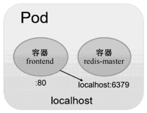

<!-- @import "[TOC]" {cmd="toc" depthFrom=1 depthTo=6 orderedList=false} -->

<!-- code_chunk_output -->


<!-- /code_chunk_output -->

在对Pod的用法进行说明之前，有必要先对Docker容器中应用的运行要求进行说明。

在使用Docker时，可以使用**docker run命令**创建并**启动一个容器**。而在Kubernetes系统中对**长时间运行容器**的要求是：其**主程序需要一直在前台执行**。

如果我们创建的Docker镜像的启动命令是**后台执行程序**，例如Linux脚本：

```
nohup ./start.sh &
```

则在**kubelet创建**包含**这个容器的Pod**之后运行完该命令，即认为**Pod执行结束**，将立刻销毁该Pod。如果为该Pod定义了ReplicationController，则系统会监控到该Pod已经终止，之后根据RC定义中Pod的replicas副本数量生成一个新的Pod。一旦创建新的Pod，就在执行完启动命令后陷入无限循环的过程中。这就是Kubernetes需要我们自己创建的Docker镜像并**以一个前台命令作为启动命令**的原因。

对于无法改造为前台执行的应用，也可以使用**开源工具Supervisor**辅助进行前台运行的功能。Supervisor提供了一种可以同时启动多个后台应用，并保**持Supervisor自身在前台执行**的机制，可以满足Kubernetes对容器的启动要求。关于Supervisor的安装和使用，请参考官网 http://supervisord.org 的文档说明。

接下来对Pod对容器的封装和应用进行说明。

Pod可以由**1个或多个容器**组合而成。在上一节Guestbook的例子中，名为frontend的Pod只由一个容器组成：

```yaml
apiVersion: v1
kind: Pod
metadata:
  name: frontend
  labels:
    name: frontend
spec:
  containers:
    - name: frontend
      image: kubeguide/guestbook-php-frontend
      env:
        - name: GET_HOSTS_FROM
          value: env
      ports:
        - containerPort: 80
```

这个frontend Pod在成功启动之后，将启动1个Docker容器。

另一种场景是，当frontend和redis**两个容器应用**为**紧耦合**的关系，并组合成一个整体对外提供服务时，应将这两个容器打包为一个Pod，如图3.1所示。

图3.1 包含两个容器的Pod



配置文件frontend-localredis-pod.yaml的内容如下：

```yaml
apiVersion: v1
kind: Pod
metadata:
  name: redis-php
  labels:
    name: redis-php
spec:
  containers:
    - name: frontend
      image: kubeguide/guestbook-php-frontend
      env:
        - name: GET_HOSTS_FROM
          value: env
      ports:
        - containerPort: 80
```