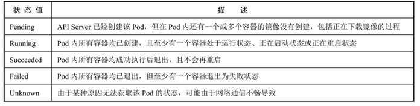
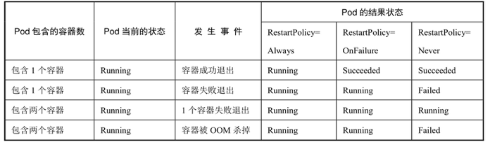

<!-- @import "[TOC]" {cmd="toc" depthFrom=1 depthTo=6 orderedList=false} -->

<!-- code_chunk_output -->

<!-- /code_chunk_output -->

Pod在整个生命周期中被系统定义为各种状态，熟悉Pod的各种状态对于理解如何设置Pod的调度策略、重启策略是很有必要的。

Pod的状态如表3.2所示。

Pod的状态:

Pod的重启策略（RestartPolicy）应用于Pod内的所有容器，并且仅在Pod所处的Node上由kubelet进行判断和重启操作。当某个容器异常退出或者健康检查（详见下节）失败时，kubelet将根据RestartPolicy的设置来进行相应的操作。

Pod的重启策略包括Always、OnFailure和Never，默认值为Always。

- Always：当容器失效时，由kubelet自动重启该容器。

- OnFailure：当容器终止运行且退出码不为0时，由kubelet自动重启该容器。

- Never：不论容器运行状态如何，kubelet都不会重启该容器。

kubelet重启失效容器的时间间隔以sync\-frequency乘以2n来计算，例如1、2、4、8倍等，最长延时5min，并且在成功重启后的10min后重置该时间。

Pod的重启策略与控制方式息息相关，当前可用于管理Pod的控制器包括ReplicationController、Job、DaemonSet及直接通过kubelet管理（静态Pod）。每种控制器对Pod的重启策略要求如下。

- RC和DaemonSet：必须设置为Always，需要保证该容器持续运行。
- Job：OnFailure或Never，确保容器执行完成后不再重启。
- kubelet：在Pod失效时自动重启它，不论将RestartPolicy设置为什么值，也不会对Pod进行健康检查。

结合Pod的状态和重启策略，表3.3列出一些常见的状态转换场景。

